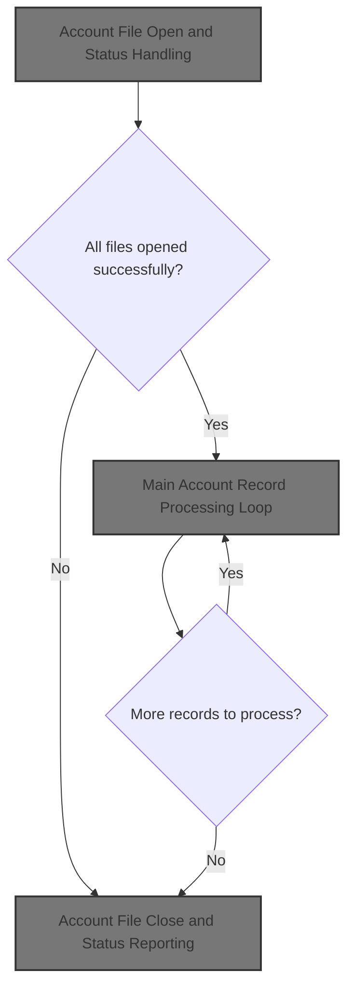
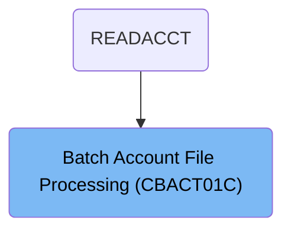

# Overview

This document describes the flow for processing credit card account records. Account data is read from an input file, transformed according to business rules, and written to multiple output files in different formats for downstream systems.

## Dependencies

### Programs

- CBACT01C (<SwmPath>[app/cbl/CBACT01C.cbl](app/cbl/CBACT01C.cbl)</SwmPath>)
- COBDATFT
- CEE3ABD

### Copybooks

- CVACT01Y (<SwmPath>[app/cpy/CVACT01Y.cpy](app/cpy/CVACT01Y.cpy)</SwmPath>)
- CODATECN (<SwmPath>[app/cpy/CODATECN.cpy](app/cpy/CODATECN.cpy)</SwmPath>)

# Where is this program used?

This program is used once, as represented in the following diagram:

&nbsp;

*This is an auto-generated document by Swimm 🌊 and has not yet been verified by a human*

<SwmMeta version="3.0.0" repo-id="Z2l0aHViJTNBJTNBU3dpbW1pby1NRi1DcmVkaXRjYXJkLURlbW8xJTNBJTNBR2lyaS1Td2ltbQ==" repo-name="Swimmio-MF-Creditcard-Demo1">Powered by [Swimm](https://app.swimm.io/)</SwmMeta>
