# Overview

This document explains the flow of processing account records for credit card management. Account data is read, transformed, and written to output files, with validation and business rules applied throughout.

## Dependencies

### Programs

- <SwmToken path="app/cbl/CBACT01C.cbl" pos="141:14:14" line-data="           DISPLAY &#39;START OF EXECUTION OF PROGRAM CBACT01C&#39;.">`CBACT01C`</SwmToken> (<SwmPath>[app/cbl/CBACT01C.cbl](app/cbl/CBACT01C.cbl)</SwmPath>)
- COBDATFT
- <SwmToken path="app/cbl/CBACT01C.cbl" pos="410:4:4" line-data="           CALL &#39;CEE3ABD&#39; USING ABCODE, TIMING.">`CEE3ABD`</SwmToken>

### Copybooks

- <SwmToken path="app/cbl/CBACT01C.cbl" pos="89:3:3" line-data="       COPY CVACT01Y.">`CVACT01Y`</SwmToken> (<SwmPath>[app/cpy/CVACT01Y.cpy](app/cpy/CVACT01Y.cpy)</SwmPath>)
- CODATECN (<SwmPath>[app/cpy/CODATECN.cpy](app/cpy/CODATECN.cpy)</SwmPath>)

# Where is this program used?

This program is used once, as represented in the following diagram:

```mermaid
graph TD
  zvbtu("READACCT") --> cqd9r("Batch Account File Processing (CBACT01C)"):::currentEntity
click zvbtu openCode "app/jcl/READACCT.jcl:1"
  
  
click cqd9r openCode "app/cbl/CBACT01C.cbl:1"
    classDef currentEntity color:#000000,fill:#7CB9F4

%% Swimm:
%% graph TD
%%   zvbtu("READACCT") --> cqd9r("Batch Account File Processing (<SwmToken path="app/cbl/CBACT01C.cbl" pos="141:14:14" line-data="           DISPLAY &#39;START OF EXECUTION OF PROGRAM CBACT01C&#39;.">`CBACT01C`</SwmToken>)"):::currentEntity
%% click zvbtu openCode "<SwmPath>[app/jcl/READACCT.jcl](app/jcl/READACCT.jcl)</SwmPath>:1"
%%   
%%   
%% click cqd9r openCode "<SwmPath>[app/cbl/CBACT01C.cbl](app/cbl/CBACT01C.cbl)</SwmPath>:1"
%%     classDef currentEntity color:#000000,fill:#7CB9F4
```

## Input and Output Tables/Files used in the Program

| Table / File Name                                                                                                                             | Type | Description                                          | Usage Mode | Key Fields / Layout Highlights |
| --------------------------------------------------------------------------------------------------------------------------------------------- | ---- | ---------------------------------------------------- | ---------- | ------------------------------ |
| <SwmToken path="app/cbl/CBACT01C.cbl" pos="166:3:5" line-data="           READ ACCTFILE-FILE INTO ACCOUNT-RECORD.">`ACCTFILE-FILE`</SwmToken> | File | Indexed file of credit card account master records   | Input      | File resource                  |
| <SwmToken path="app/cbl/CBACT01C.cbl" pos="169:3:7" line-data="               INITIALIZE ARR-ARRAY-REC">`ARR-ARRAY-REC`</SwmToken>            | File | Record with account ID and multiple period balances  | Output     | File resource                  |
| <SwmToken path="app/cbl/CBACT01C.cbl" pos="354:5:7" line-data="           OPEN OUTPUT ARRY-FILE">`ARRY-FILE`</SwmToken>                       | File | Sequential file for account balance arrays           | Output     | File resource                  |
| <SwmToken path="app/cbl/CBACT01C.cbl" pos="243:3:7" line-data="           WRITE OUT-ACCT-REC.">`OUT-ACCT-REC`</SwmToken>                      | File | Record of account summary details for output         | Output     | File resource                  |
| <SwmToken path="app/cbl/CBACT01C.cbl" pos="336:5:7" line-data="           OPEN OUTPUT OUT-FILE">`OUT-FILE`</SwmToken>                         | File | Sequential file for processed account summaries      | Output     | File resource                  |
| <SwmToken path="app/cbl/CBACT01C.cbl" pos="289:9:11" line-data="           MOVE VBRC-REC1 TO VBR-REC(1:WS-RECD-LEN).">`VBR-REC`</SwmToken>    | File | Variable-length record for account status or balance | Output     | File resource                  |
| <SwmToken path="app/cbl/CBACT01C.cbl" pos="372:5:7" line-data="           OPEN OUTPUT VBRC-FILE">`VBRC-FILE`</SwmToken>                       | File | Variable-length file for account status and balances | Output     | File resource                  |

&nbsp;

## Detailed View of the Program's Functionality

# Startup and File Initialization

At the start of execution, the program displays a message indicating it has begun. It then attempts to open four files in a specific order: the account file (for reading), the output file (for writing processed records), the array output file (for writing array-structured data), and the variable block record (VBR) output file (for writing variable-length records). Each file open operation is immediately followed by a check to ensure the file was opened successfully. If any file fails to open, the program displays an error message, shows a formatted file status code, and terminates execution to prevent further processing with unavailable resources.

# Account File Open and Status Handling

When opening the account file, the program sets a default error code, attempts to open the file for input, and checks the resulting file status. If the file opens successfully, it marks the operation as successful; otherwise, it marks it as a failure. After this, the program checks if the operation was successful. If not, it displays an error message, copies the file status to a general IO status area, calls a routine to display a formatted IO status, and then terminates the program. This ensures that any issues with accessing the account data are caught immediately and reported clearly.

# Output File Open and Status Handling

The output file is opened for writing. The program sets a default error code, attempts to open the file, and checks the file status. If the file opens successfully, it marks the operation as successful; otherwise, it marks it as a failure. After opening, it checks if the operation was successful. If not, it displays an error message with the file status, copies the status to the IO status area, displays the formatted status, and terminates the program. This consistent error handling ensures that output operations only proceed if the file is ready.

# Array Output File Open and Status Handling

The array output file is opened for writing in a similar manner. The program sets a default error code, attempts to open the file, and checks the status. If successful, it marks the operation as successful; otherwise, as a failure. After opening, it checks if the operation was successful. If not, it displays an error message, copies the file status to the IO status area, displays the formatted status, and terminates the program. This ensures that array-based output is only attempted if the file is available.

# VBR Output File Open and Status Handling

The VBR output file is opened for writing. The program sets a default error code, attempts to open the file, and checks the status. If successful, it marks the operation as successful; otherwise, as a failure. After opening, it checks if the operation was successful. If not, it displays an error message, copies the file status to the IO status area, displays the formatted status, and terminates the program. This ensures that variable-length record output is only attempted if the file is available.

# Main Account Processing Loop

After all files are successfully opened, the program enters its main processing loop. This loop continues until an end-of-file condition is detected on the account file. For each iteration, if the end-of-file flag is not set, the program attempts to read the next account record and process it. If a record is successfully read, it is displayed for logging or debugging purposes. If the end-of-file is reached or an error occurs, the loop exits or the program handles the error accordingly.

# Account Record Read and Transformation

When reading the next account record, the program checks the file status. If the read is successful, it resets the result code, initializes the array output record, displays the account record, and performs a series of operations to transform and write the data to the various output files. If the read indicates end-of-file, it sets the end-of-file flag. If another error occurs, it sets an error code. After handling the read, it checks if the operation was successful. If not, it checks for end-of-file or displays an error message, shows the IO status, and terminates the program.

# Account Output Record Population and Date Formatting

The program copies all relevant account fields (such as ID, status, balances, limits, and dates) from the input record to the output record. For the reissue date, it prepares a request to an external assembler program that formats dates. The formatted date is then placed in the output record. The program also copies the current cycle credit. If the current cycle debit is zero, it sets it to a specific value (<SwmToken path="app/cbl/CBACT01C.cbl" pos="237:3:5" line-data="               MOVE 2525.00         TO   OUT-ACCT-CURR-CYC-DEBIT">`2525.00`</SwmToken>) to avoid zero values in the output, following a business rule. The group ID is also copied to the output record.

# Account Record Write and Array Preparation

After transforming the account data, the program writes the output record to the output file. It checks the file status after writing; if the write fails, it displays an error, shows the IO status, and terminates the program. The program then prepares the array output record by filling it with account data and some hardcoded values to simulate different transaction scenarios. This array record is written to the array output file, with similar error checking and handling.

# VBR Record Preparation and Writing

The program prepares two VBR records: one with a subset of account fields (such as ID and status), and another with additional fields (such as balances and limits). Each VBR record is written to the VBR output file with a specific length. After each write, the program checks the file status and, if an error occurs, displays an error, shows the IO status, and terminates the program.

# Account File Close and Status Handling

After all records have been processed, the program closes the account file. It sets a result code, attempts to close the file, and checks the status. If the close is successful, it resets the result code; otherwise, it sets an error code. After closing, it checks if the operation was successful. If not, it displays an error message, shows the IO status, and terminates the program. This ensures that resources are released properly and any issues during closure are reported.

# Finalization

Finally, the program displays a message indicating the end of execution and returns control to the operating system. Throughout the process, all file operations are guarded with consistent error checking and reporting, ensuring that any issues are caught early and reported in a standardized way. This structure makes the program robust and maintainable, especially in a mainframe batch processing environment.

# Rule Definition

| Paragraph Name                                                                                                                                                                                                                                                                                       | Rule ID | Category          | Description                                                                                                                                                                                                                                                           | Conditions                                                                                                                                                                         | Remarks                                                                                                                                                                                                                                                                                                                                                                                                                                                                        |
| ---------------------------------------------------------------------------------------------------------------------------------------------------------------------------------------------------------------------------------------------------------------------------------------------------- | ------- | ----------------- | --------------------------------------------------------------------------------------------------------------------------------------------------------------------------------------------------------------------------------------------------------------------- | ---------------------------------------------------------------------------------------------------------------------------------------------------------------------------------- | ------------------------------------------------------------------------------------------------------------------------------------------------------------------------------------------------------------------------------------------------------------------------------------------------------------------------------------------------------------------------------------------------------------------------------------------------------------------------------ |
| <SwmToken path="app/cbl/CBACT01C.cbl" pos="149:3:9" line-data="                   PERFORM 1000-ACCTFILE-GET-NEXT">`1000-ACCTFILE-GET-NEXT`</SwmToken>                                                                                                                                                | RL-001  | Conditional Logic | The program reads each record from the account file sequentially and parses the 289-byte account data structure according to the defined offsets and lengths.                                                                                                         | <SwmToken path="app/cbl/CBACT01C.cbl" pos="167:3:5" line-data="           IF  ACCTFILE-STATUS = &#39;00&#39;">`ACCTFILE-STATUS`</SwmToken> must be '00' after each read operation. | <SwmToken path="app/cbl/CBACT01C.cbl" pos="167:3:5" line-data="           IF  ACCTFILE-STATUS = &#39;00&#39;">`ACCTFILE-STATUS`</SwmToken>: '00' (success), '10' (end-of-file), '12' (error). Each record consists of an 11-digit numeric account ID and a 289-byte alphanumeric data structure. Parsing is based on fixed offsets and lengths as per the <SwmToken path="app/cbl/CBACT01C.cbl" pos="89:3:3" line-data="       COPY CVACT01Y.">`CVACT01Y`</SwmToken> copybook. |
| <SwmToken path="app/cbl/CBACT01C.cbl" pos="171:3:9" line-data="               PERFORM 1300-POPUL-ACCT-RECORD">`1300-POPUL-ACCT-RECORD`</SwmToken>, <SwmToken path="app/cbl/CBACT01C.cbl" pos="172:3:9" line-data="               PERFORM 1350-WRITE-ACCT-RECORD">`1350-WRITE-ACCT-RECORD`</SwmToken> | RL-002  | Data Assignment   | Each parsed account record is transformed into an output record for <SwmToken path="app/cbl/CBACT01C.cbl" pos="336:5:7" line-data="           OPEN OUTPUT OUT-FILE">`OUT-FILE`</SwmToken>, with fields copied, formatted, or substituted according to business rules. | Account record must be successfully parsed; output file must be open and ready.                                                                                                    | <SwmToken path="app/cbl/CBACT01C.cbl" pos="336:5:7" line-data="           OPEN OUTPUT OUT-FILE">`OUT-FILE`</SwmToken> record format:                                                                                                                                                                                                                                                                                                                                           |

- <SwmToken path="app/cbl/CBACT01C.cbl" pos="216:9:13" line-data="           MOVE   ACCT-ID                 TO   OUT-ACCT-ID.">`OUT-ACCT-ID`</SwmToken>: numeric, 11 digits
- <SwmToken path="app/cbl/CBACT01C.cbl" pos="217:11:17" line-data="           MOVE   ACCT-ACTIVE-STATUS      TO   OUT-ACCT-ACTIVE-STATUS.">`OUT-ACCT-ACTIVE-STATUS`</SwmToken>: char, 1 byte
- <SwmToken path="app/cbl/CBACT01C.cbl" pos="218:11:17" line-data="           MOVE   ACCT-CURR-BAL           TO   OUT-ACCT-CURR-BAL.">`OUT-ACCT-CURR-BAL`</SwmToken>: number, 12 digits (<SwmToken path="app/cbl/CBACT01C.cbl" pos="60:13:13" line-data="          05  OUT-ACCT-CURR-BAL          PIC S9(10)V99.">`S9`</SwmToken>(10)<SwmToken path="app/cbl/CBACT01C.cbl" pos="60:17:17" line-data="          05  OUT-ACCT-CURR-BAL          PIC S9(10)V99.">`V99`</SwmToken>)
- <SwmToken path="app/cbl/CBACT01C.cbl" pos="219:11:17" line-data="           MOVE   ACCT-CREDIT-LIMIT       TO   OUT-ACCT-CREDIT-LIMIT.">`OUT-ACCT-CREDIT-LIMIT`</SwmToken>: number, 12 digits (<SwmToken path="app/cbl/CBACT01C.cbl" pos="60:13:13" line-data="          05  OUT-ACCT-CURR-BAL          PIC S9(10)V99.">`S9`</SwmToken>(10)<SwmToken path="app/cbl/CBACT01C.cbl" pos="60:17:17" line-data="          05  OUT-ACCT-CURR-BAL          PIC S9(10)V99.">`V99`</SwmToken>)
- <SwmToken path="app/cbl/CBACT01C.cbl" pos="220:13:21" line-data="           MOVE   ACCT-CASH-CREDIT-LIMIT  TO OUT-ACCT-CASH-CREDIT-LIMIT.">`OUT-ACCT-CASH-CREDIT-LIMIT`</SwmToken>: number, 12 digits (<SwmToken path="app/cbl/CBACT01C.cbl" pos="60:13:13" line-data="          05  OUT-ACCT-CURR-BAL          PIC S9(10)V99.">`S9`</SwmToken>(10)<SwmToken path="app/cbl/CBACT01C.cbl" pos="60:17:17" line-data="          05  OUT-ACCT-CURR-BAL          PIC S9(10)V99.">`V99`</SwmToken>)
- <SwmToken path="app/cbl/CBACT01C.cbl" pos="221:11:17" line-data="           MOVE   ACCT-OPEN-DATE          TO   OUT-ACCT-OPEN-DATE.">`OUT-ACCT-OPEN-DATE`</SwmToken>: string, 10 bytes (YYYY-MM-DD)
- <SwmToken path="app/cbl/CBACT01C.cbl" pos="222:11:17" line-data="           MOVE   ACCT-EXPIRAION-DATE     TO   OUT-ACCT-EXPIRAION-DATE.">`OUT-ACCT-EXPIRAION-DATE`</SwmToken>: string, 10 bytes (YYYY-MM-DD)
- <SwmToken path="app/cbl/CBACT01C.cbl" pos="233:11:17" line-data="           MOVE   CODATECN-0UT-DATE       TO   OUT-ACCT-REISSUE-DATE.">`OUT-ACCT-REISSUE-DATE`</SwmToken>: string, 10 bytes, formatted by COBDATFT
- <SwmToken path="app/cbl/CBACT01C.cbl" pos="235:13:21" line-data="           MOVE   ACCT-CURR-CYC-CREDIT    TO   OUT-ACCT-CURR-CYC-CREDIT.">`OUT-ACCT-CURR-CYC-CREDIT`</SwmToken>: number, 12 digits (<SwmToken path="app/cbl/CBACT01C.cbl" pos="60:13:13" line-data="          05  OUT-ACCT-CURR-BAL          PIC S9(10)V99.">`S9`</SwmToken>(10)<SwmToken path="app/cbl/CBACT01C.cbl" pos="60:17:17" line-data="          05  OUT-ACCT-CURR-BAL          PIC S9(10)V99.">`V99`</SwmToken>)
- <SwmToken path="app/cbl/CBACT01C.cbl" pos="237:9:17" line-data="               MOVE 2525.00         TO   OUT-ACCT-CURR-CYC-DEBIT">`OUT-ACCT-CURR-CYC-DEBIT`</SwmToken>: number, 12 digits (<SwmToken path="app/cbl/CBACT01C.cbl" pos="60:13:13" line-data="          05  OUT-ACCT-CURR-BAL          PIC S9(10)V99.">`S9`</SwmToken>(10)<SwmToken path="app/cbl/CBACT01C.cbl" pos="60:17:17" line-data="          05  OUT-ACCT-CURR-BAL          PIC S9(10)V99.">`V99`</SwmToken>), set to <SwmToken path="app/cbl/CBACT01C.cbl" pos="237:3:5" line-data="               MOVE 2525.00         TO   OUT-ACCT-CURR-CYC-DEBIT">`2525.00`</SwmToken> if input is zero
- <SwmToken path="app/cbl/CBACT01C.cbl" pos="239:11:17" line-data="           MOVE   ACCT-GROUP-ID           TO   OUT-ACCT-GROUP-ID.">`OUT-ACCT-GROUP-ID`</SwmToken>: string, 10 bytes | | <SwmToken path="app/cbl/CBACT01C.cbl" pos="173:3:9" line-data="               PERFORM 1400-POPUL-ARRAY-RECORD">`1400-POPUL-ARRAY-RECORD`</SwmToken>, <SwmToken path="app/cbl/CBACT01C.cbl" pos="174:3:9" line-data="               PERFORM 1450-WRITE-ARRY-RECORD">`1450-WRITE-ARRY-RECORD`</SwmToken> | RL-003 | Data Assignment | For each account, an array output record is generated containing the account ID, five sets of current balance and current cycle debit values, and a filler field. | Account record must be successfully parsed; array file must be open and ready. | <SwmToken path="app/cbl/CBACT01C.cbl" pos="354:5:7" line-data="           OPEN OUTPUT ARRY-FILE">`ARRY-FILE`</SwmToken> record format:
- <SwmToken path="app/cbl/CBACT01C.cbl" pos="254:9:13" line-data="           MOVE   ACCT-ID         TO   ARR-ACCT-ID.">`ARR-ACCT-ID`</SwmToken>: numeric, 11 digits
- ARR-ACCT-CURR-BAL-1 to 5: number, 12 digits each (<SwmToken path="app/cbl/CBACT01C.cbl" pos="60:13:13" line-data="          05  OUT-ACCT-CURR-BAL          PIC S9(10)V99.">`S9`</SwmToken>(10)<SwmToken path="app/cbl/CBACT01C.cbl" pos="60:17:17" line-data="          05  OUT-ACCT-CURR-BAL          PIC S9(10)V99.">`V99`</SwmToken>), some simulated values
- ARR-ACCT-CURR-CYC-DEBIT-1 to 5: number, 12 digits each (<SwmToken path="app/cbl/CBACT01C.cbl" pos="60:13:13" line-data="          05  OUT-ACCT-CURR-BAL          PIC S9(10)V99.">`S9`</SwmToken>(10)<SwmToken path="app/cbl/CBACT01C.cbl" pos="60:17:17" line-data="          05  OUT-ACCT-CURR-BAL          PIC S9(10)V99.">`V99`</SwmToken>), some simulated values
- <SwmToken path="app/cbl/CBACT01C.cbl" pos="78:3:5" line-data="          05  ARR-FILLER                 PIC X(04).">`ARR-FILLER`</SwmToken>: string, 4 spaces | | <SwmToken path="app/cbl/CBACT01C.cbl" pos="176:3:9" line-data="               PERFORM 1500-POPUL-VBRC-RECORD">`1500-POPUL-VBRC-RECORD`</SwmToken>, <SwmToken path="app/cbl/CBACT01C.cbl" pos="177:3:9" line-data="               PERFORM 1550-WRITE-VB1-RECORD">`1550-WRITE-VB1-RECORD`</SwmToken>, <SwmToken path="app/cbl/CBACT01C.cbl" pos="178:3:9" line-data="               PERFORM 1575-WRITE-VB2-RECORD">`1575-WRITE-VB2-RECORD`</SwmToken> | RL-004 | Data Assignment | For each account, two variable block records are generated: one with account ID and active status, and another with account ID, current balance, credit limit, and the first 4 bytes of the formatted reissue date, both padded to 80 bytes. | Account record must be successfully parsed; VBR file must be open and ready. | <SwmToken path="app/cbl/CBACT01C.cbl" pos="372:5:7" line-data="           OPEN OUTPUT VBRC-FILE">`VBRC-FILE`</SwmToken> record format:
- <SwmToken path="app/cbl/CBACT01C.cbl" pos="175:3:5" line-data="               INITIALIZE VBRC-REC1">`VBRC-REC1`</SwmToken>: 12 bytes (account ID + active status), padded to 80 bytes
- <SwmToken path="app/cbl/CBACT01C.cbl" pos="304:3:5" line-data="           MOVE VBRC-REC2 TO VBR-REC(1:WS-RECD-LEN).">`VBRC-REC2`</SwmToken>: 39 bytes (account ID, current balance, credit limit, first 4 bytes of reissue date), padded to 80 bytes
- RECORDING MODE V, record size varies from 10 to 80 bytes | | <SwmToken path="app/cbl/CBACT01C.cbl" pos="142:3:7" line-data="           PERFORM 0000-ACCTFILE-OPEN.">`0000-ACCTFILE-OPEN`</SwmToken>, <SwmToken path="app/cbl/CBACT01C.cbl" pos="143:3:7" line-data="           PERFORM 2000-OUTFILE-OPEN.">`2000-OUTFILE-OPEN`</SwmToken>, <SwmToken path="app/cbl/CBACT01C.cbl" pos="144:3:7" line-data="           PERFORM 3000-ARRFILE-OPEN.">`3000-ARRFILE-OPEN`</SwmToken>, <SwmToken path="app/cbl/CBACT01C.cbl" pos="145:3:7" line-data="           PERFORM 4000-VBRFILE-OPEN.">`4000-VBRFILE-OPEN`</SwmToken>, <SwmToken path="app/cbl/CBACT01C.cbl" pos="156:3:7" line-data="           PERFORM 9000-ACCTFILE-CLOSE.">`9000-ACCTFILE-CLOSE`</SwmToken>, <SwmToken path="app/cbl/CBACT01C.cbl" pos="194:3:9" line-data="                   PERFORM 9910-DISPLAY-IO-STATUS">`9910-DISPLAY-IO-STATUS`</SwmToken>, <SwmToken path="app/cbl/CBACT01C.cbl" pos="195:3:7" line-data="                   PERFORM 9999-ABEND-PROGRAM">`9999-ABEND-PROGRAM`</SwmToken> | RL-005 | Conditional Logic | The program must check file status codes after each open, write, and close operation, and must not proceed with output file operations if the account file cannot be opened successfully. Errors are handled by displaying status and abending the program if necessary. | File status codes must be checked after each operation; <SwmToken path="app/cbl/CBACT01C.cbl" pos="168:7:9" line-data="               MOVE 0 TO APPL-RESULT">`APPL-RESULT`</SwmToken> values determine flow. | File status codes: '00' (success), '10' (end-of-file), '12' (error). <SwmToken path="app/cbl/CBACT01C.cbl" pos="168:7:9" line-data="               MOVE 0 TO APPL-RESULT">`APPL-RESULT`</SwmToken>: 0 (success), 8 (default error before open/close), 12 (file open/write/close error), 16 (end-of-file). |

# User Stories

## User Story 1: End-to-End Account Record Processing, Output Generation, and File Handling

---

### Story Description:

As a system, I want to read each account record from the account file sequentially, parse the account data structure, transform the parsed data into multiple output formats (standard output, array, and variable block records), write these records to their respective files, and check file status codes after each operation so that all required account information is accurately extracted, processed, made available for downstream use, and all file operations are handled safely according to business rules.

---

### Business Rule Mapping:

| Rule ID | Paragraph Name                                                                                                                                                                                                                                                                                                                                                                                                                                                                                                                                                                                                                                                                                                                                                                                                                                                                                                                                                                                           | Rule Description                                                                                                                                                                                                                                                         |
| ------- | -------------------------------------------------------------------------------------------------------------------------------------------------------------------------------------------------------------------------------------------------------------------------------------------------------------------------------------------------------------------------------------------------------------------------------------------------------------------------------------------------------------------------------------------------------------------------------------------------------------------------------------------------------------------------------------------------------------------------------------------------------------------------------------------------------------------------------------------------------------------------------------------------------------------------------------------------------------------------------------------------------- | ------------------------------------------------------------------------------------------------------------------------------------------------------------------------------------------------------------------------------------------------------------------------ |
| RL-005  | <SwmToken path="app/cbl/CBACT01C.cbl" pos="142:3:7" line-data="           PERFORM 0000-ACCTFILE-OPEN.">`0000-ACCTFILE-OPEN`</SwmToken>, <SwmToken path="app/cbl/CBACT01C.cbl" pos="143:3:7" line-data="           PERFORM 2000-OUTFILE-OPEN.">`2000-OUTFILE-OPEN`</SwmToken>, <SwmToken path="app/cbl/CBACT01C.cbl" pos="144:3:7" line-data="           PERFORM 3000-ARRFILE-OPEN.">`3000-ARRFILE-OPEN`</SwmToken>, <SwmToken path="app/cbl/CBACT01C.cbl" pos="145:3:7" line-data="           PERFORM 4000-VBRFILE-OPEN.">`4000-VBRFILE-OPEN`</SwmToken>, <SwmToken path="app/cbl/CBACT01C.cbl" pos="156:3:7" line-data="           PERFORM 9000-ACCTFILE-CLOSE.">`9000-ACCTFILE-CLOSE`</SwmToken>, <SwmToken path="app/cbl/CBACT01C.cbl" pos="194:3:9" line-data="                   PERFORM 9910-DISPLAY-IO-STATUS">`9910-DISPLAY-IO-STATUS`</SwmToken>, <SwmToken path="app/cbl/CBACT01C.cbl" pos="195:3:7" line-data="                   PERFORM 9999-ABEND-PROGRAM">`9999-ABEND-PROGRAM`</SwmToken> | The program must check file status codes after each open, write, and close operation, and must not proceed with output file operations if the account file cannot be opened successfully. Errors are handled by displaying status and abending the program if necessary. |
| RL-001  | <SwmToken path="app/cbl/CBACT01C.cbl" pos="149:3:9" line-data="                   PERFORM 1000-ACCTFILE-GET-NEXT">`1000-ACCTFILE-GET-NEXT`</SwmToken>                                                                                                                                                                                                                                                                                                                                                                                                                                                                                                                                                                                                                                                                                                                                                                                                                                                    | The program reads each record from the account file sequentially and parses the 289-byte account data structure according to the defined offsets and lengths.                                                                                                            |
| RL-002  | <SwmToken path="app/cbl/CBACT01C.cbl" pos="171:3:9" line-data="               PERFORM 1300-POPUL-ACCT-RECORD">`1300-POPUL-ACCT-RECORD`</SwmToken>, <SwmToken path="app/cbl/CBACT01C.cbl" pos="172:3:9" line-data="               PERFORM 1350-WRITE-ACCT-RECORD">`1350-WRITE-ACCT-RECORD`</SwmToken>                                                                                                                                                                                                                                                                                                                                                                                                                                                                                                                                                                                                                                                                                                     | Each parsed account record is transformed into an output record for <SwmToken path="app/cbl/CBACT01C.cbl" pos="336:5:7" line-data="           OPEN OUTPUT OUT-FILE">`OUT-FILE`</SwmToken>, with fields copied, formatted, or substituted according to business rules.    |
| RL-003  | <SwmToken path="app/cbl/CBACT01C.cbl" pos="173:3:9" line-data="               PERFORM 1400-POPUL-ARRAY-RECORD">`1400-POPUL-ARRAY-RECORD`</SwmToken>, <SwmToken path="app/cbl/CBACT01C.cbl" pos="174:3:9" line-data="               PERFORM 1450-WRITE-ARRY-RECORD">`1450-WRITE-ARRY-RECORD`</SwmToken>                                                                                                                                                                                                                                                                                                                                                                                                                                                                                                                                                                                                                                                                                                   | For each account, an array output record is generated containing the account ID, five sets of current balance and current cycle debit values, and a filler field.                                                                                                        |
| RL-004  | <SwmToken path="app/cbl/CBACT01C.cbl" pos="176:3:9" line-data="               PERFORM 1500-POPUL-VBRC-RECORD">`1500-POPUL-VBRC-RECORD`</SwmToken>, <SwmToken path="app/cbl/CBACT01C.cbl" pos="177:3:9" line-data="               PERFORM 1550-WRITE-VB1-RECORD">`1550-WRITE-VB1-RECORD`</SwmToken>, <SwmToken path="app/cbl/CBACT01C.cbl" pos="178:3:9" line-data="               PERFORM 1575-WRITE-VB2-RECORD">`1575-WRITE-VB2-RECORD`</SwmToken>                                                                                                                                                                                                                                                                                                                                                                                                                                                                                                                                                      | For each account, two variable block records are generated: one with account ID and active status, and another with account ID, current balance, credit limit, and the first 4 bytes of the formatted reissue date, both padded to 80 bytes.                             |

---

### Relevant Functionality:

- <SwmToken path="app/cbl/CBACT01C.cbl" pos="142:3:7" line-data="           PERFORM 0000-ACCTFILE-OPEN.">`0000-ACCTFILE-OPEN`</SwmToken>
  1. **RL-005:**
     - Attempt to open each file
     - If file status is not '00', set error result and display error
     - Do not proceed with output file operations if account file open fails
     - After processing, close all files and check status
     - On error, display status and abend program
- <SwmToken path="app/cbl/CBACT01C.cbl" pos="149:3:9" line-data="                   PERFORM 1000-ACCTFILE-GET-NEXT">`1000-ACCTFILE-GET-NEXT`</SwmToken>
  1. **RL-001:**
     - Read next record from account file
     - If file status is '00':
       - Parse the 289-byte account data into individual fields by offset and length
     - If file status is '10':
       - Set end-of-file indicator
     - If file status is other:
       - Set error result and handle error
- <SwmToken path="app/cbl/CBACT01C.cbl" pos="171:3:9" line-data="               PERFORM 1300-POPUL-ACCT-RECORD">`1300-POPUL-ACCT-RECORD`</SwmToken>
  1. **RL-002:**
     - Copy account ID, active status, current balance, credit limits, open/expiration dates, group ID to output record
     - Format reissue date using assembler routine and assign to output
     - If current cycle debit is zero, set output debit to <SwmToken path="app/cbl/CBACT01C.cbl" pos="237:3:5" line-data="               MOVE 2525.00         TO   OUT-ACCT-CURR-CYC-DEBIT">`2525.00`</SwmToken>; else copy value
     - Write output record to <SwmToken path="app/cbl/CBACT01C.cbl" pos="336:5:7" line-data="           OPEN OUTPUT OUT-FILE">`OUT-FILE`</SwmToken>
     - If file status is not '00' or '10', handle error
- <SwmToken path="app/cbl/CBACT01C.cbl" pos="173:3:9" line-data="               PERFORM 1400-POPUL-ARRAY-RECORD">`1400-POPUL-ARRAY-RECORD`</SwmToken>
  1. **RL-003:**
     - Copy account ID to array record
     - Populate first set of balance and debit with actual values
     - Populate remaining sets with simulated values (e.g., <SwmToken path="app/cbl/CBACT01C.cbl" pos="256:3:5" line-data="           MOVE   1005.00         TO   ARR-ACCT-CURR-CYC-DEBIT(1).">`1005.00`</SwmToken>, <SwmToken path="app/cbl/CBACT01C.cbl" pos="258:3:5" line-data="           MOVE   1525.00         TO   ARR-ACCT-CURR-CYC-DEBIT(2).">`1525.00`</SwmToken>, <SwmToken path="app/cbl/CBACT01C.cbl" pos="259:3:6" line-data="           MOVE   -1025.00        TO   ARR-ACCT-CURR-BAL(3).">`-1025.00`</SwmToken>, <SwmToken path="app/cbl/CBACT01C.cbl" pos="260:3:6" line-data="           MOVE   -2500.00        TO   ARR-ACCT-CURR-CYC-DEBIT(3).">`-2500.00`</SwmToken>)
     - Set filler to 4 spaces
     - Write array record to <SwmToken path="app/cbl/CBACT01C.cbl" pos="354:5:7" line-data="           OPEN OUTPUT ARRY-FILE">`ARRY-FILE`</SwmToken>
     - If file status is not '00' or '10', handle error
- <SwmToken path="app/cbl/CBACT01C.cbl" pos="176:3:9" line-data="               PERFORM 1500-POPUL-VBRC-RECORD">`1500-POPUL-VBRC-RECORD`</SwmToken>
  1. **RL-004:**
     - Copy account ID and active status to first VBR record
     - Copy account ID, current balance, credit limit, first 4 bytes of reissue date to second VBR record
     - Pad each record to 80 bytes as needed
     - Write both records to <SwmToken path="app/cbl/CBACT01C.cbl" pos="372:5:7" line-data="           OPEN OUTPUT VBRC-FILE">`VBRC-FILE`</SwmToken>
     - If file status is not '00' or '10', handle error

# Workflow

# Startup and File Initialization

```mermaid
%%{init: {"flowchart": {"defaultRenderer": "elk"}} }%%
flowchart TD
    node1["Display 'Start of execution'"] --> node2["Account File Open and Status Handling"]
    click node1 openCode "app/cbl/CBACT01C.cbl:141:141"
    
    node2 --> node3["Output File Open and Status Handling"]
    
    node3 --> node4["Array Output File Open and Status Handling"]
    
    node4 --> node5["VBR Output File Open and Status Handling"]
    
    node5 --> node6["Process account records"]
    click node6 openCode "app/cbl/CBACT01C.cbl:147:154"
    subgraph loop1["For each account record"]
        node6 --> node7{"Is END-OF-FILE = 'N'?"}
        click node7 openCode "app/cbl/CBACT01C.cbl:148:150"
        node7 -->|"Yes"| node8["Account Record Read and Transformation"]
        
        node8 --> node6
        node7 -->|"No"| node9["Close account file and end program"]
        click node9 openCode "app/cbl/CBACT01C.cbl:156:160"
    end
classDef HeadingStyle fill:#777777,stroke:#333,stroke-width:2px;
click node2 goToHeading "Account File Open and Status Handling"
node2:::HeadingStyle
click node3 goToHeading "Output File Open and Status Handling"
node3:::HeadingStyle
click node4 goToHeading "Array Output File Open and Status Handling"
node4:::HeadingStyle
click node5 goToHeading "VBR Output File Open and Status Handling"
node5:::HeadingStyle
click node8 goToHeading "Account Record Read and Transformation"
node8:::HeadingStyle

%% Swimm:
%% %%{init: {"flowchart": {"defaultRenderer": "elk"}} }%%
%% flowchart TD
%%     node1["Display 'Start of execution'"] --> node2["Account File Open and Status Handling"]
%%     click node1 openCode "<SwmPath>[app/cbl/CBACT01C.cbl](app/cbl/CBACT01C.cbl)</SwmPath>:141:141"
%%     
%%     node2 --> node3["Output File Open and Status Handling"]
%%     
%%     node3 --> node4["Array Output File Open and Status Handling"]
%%     
%%     node4 --> node5["VBR Output File Open and Status Handling"]
%%     
%%     node5 --> node6["Process account records"]
%%     click node6 openCode "<SwmPath>[app/cbl/CBACT01C.cbl](app/cbl/CBACT01C.cbl)</SwmPath>:147:154"
%%     subgraph loop1["For each account record"]
%%         node6 --> node7{"Is <SwmToken path="app/cbl/CBACT01C.cbl" pos="147:5:9" line-data="           PERFORM UNTIL END-OF-FILE = &#39;Y&#39;">`END-OF-FILE`</SwmToken> = 'N'?"}
%%         click node7 openCode "<SwmPath>[app/cbl/CBACT01C.cbl](app/cbl/CBACT01C.cbl)</SwmPath>:148:150"
%%         node7 -->|"Yes"| node8["Account Record Read and Transformation"]
%%         
%%         node8 --> node6
%%         node7 -->|"No"| node9["Close account file and end program"]
%%         click node9 openCode "<SwmPath>[app/cbl/CBACT01C.cbl](app/cbl/CBACT01C.cbl)</SwmPath>:156:160"
%%     end
%% classDef HeadingStyle fill:#777777,stroke:#333,stroke-width:2px;
%% click node2 goToHeading "Account File Open and Status Handling"
%% node2:::HeadingStyle
%% click node3 goToHeading "Output File Open and Status Handling"
%% node3:::HeadingStyle
%% click node4 goToHeading "Array Output File Open and Status Handling"
%% node4:::HeadingStyle
%% click node5 goToHeading "VBR Output File Open and Status Handling"
%% node5:::HeadingStyle
%% click node8 goToHeading "Account Record Read and Transformation"
%% node8:::HeadingStyle
```

This section ensures that all necessary files are available and ready for processing before any account data is handled. It validates the readiness of the system and prevents data loss or corruption by halting execution if any file cannot be opened.

| Category        | Rule Name                        | Description                                                                                                                                                                                                           |
| --------------- | -------------------------------- | --------------------------------------------------------------------------------------------------------------------------------------------------------------------------------------------------------------------- |
| Data validation | Account File Open Validation     | The account file must be successfully opened before any output files are opened or any account data is processed. If the account file cannot be opened, the program must terminate and display an error message.      |
| Data validation | Output File Open Validation      | Each output file (main output, array output, VBR output) must be successfully opened before account records are processed. If any output file fails to open, the program must terminate and display an error message. |
| Business logic  | Startup Message Display          | The program must display a clear startup message to indicate the beginning of execution for audit and operational awareness.                                                                                          |
| Business logic  | File Initialization Precondition | Account record processing must only begin after all required files are successfully opened and initialized.                                                                                                           |

<SwmSnippet path="/app/cbl/CBACT01C.cbl" line="140">

---

We start execution, display a message, and open the account file first to make sure we can actually process any data before touching output files.

```cobol
       PROCEDURE DIVISION.
           DISPLAY 'START OF EXECUTION OF PROGRAM CBACT01C'.
           PERFORM 0000-ACCTFILE-OPEN.
           PERFORM 2000-OUTFILE-OPEN.
           PERFORM 3000-ARRFILE-OPEN.
           PERFORM 4000-VBRFILE-OPEN.
```

---

</SwmSnippet>

## Account File Open and Status Handling

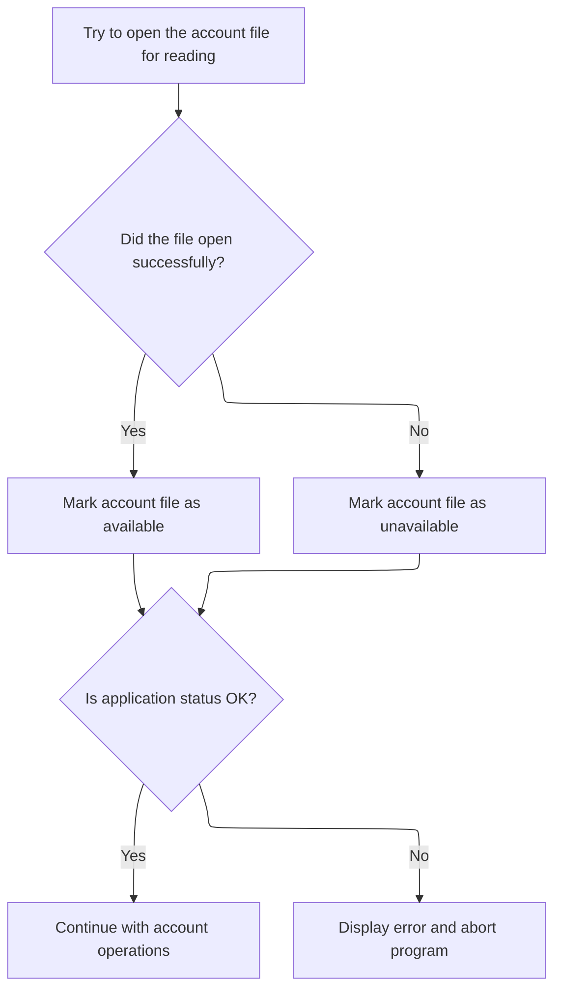

This section governs how the application attempts to open the account file, determines its availability, and manages error reporting and program flow based on the outcome.

| Category       | Rule Name                         | Description                                                                                                                                      |
| -------------- | --------------------------------- | ------------------------------------------------------------------------------------------------------------------------------------------------ |
| Business logic | Account file availability         | If the account file opens successfully, mark the account file as available for subsequent operations.                                            |
| Business logic | Account file unavailability       | If the account file fails to open, mark the account file as unavailable and prevent further account operations.                                  |
| Technical step | Default error code initialization | Set a default error code before attempting to open the account file to ensure downstream logic can reliably detect the outcome of the operation. |

<SwmSnippet path="/app/cbl/CBACT01C.cbl" line="317">

---

In <SwmToken path="app/cbl/CBACT01C.cbl" pos="317:1:5" line-data="       0000-ACCTFILE-OPEN.">`0000-ACCTFILE-OPEN`</SwmToken> we prep for opening the account file by setting a default error code, then actually open the file. We check the status and update <SwmToken path="app/cbl/CBACT01C.cbl" pos="318:7:9" line-data="           MOVE 8 TO APPL-RESULT.">`APPL-RESULT`</SwmToken> based on success or failure, so downstream logic knows if the file is usable.

```cobol
       0000-ACCTFILE-OPEN.
           MOVE 8 TO APPL-RESULT.
           OPEN INPUT ACCTFILE-FILE
           IF  ACCTFILE-STATUS = '00'
               MOVE 0 TO APPL-RESULT
           ELSE
               MOVE 12 TO APPL-RESULT
           END-IF
```

---

</SwmSnippet>

<SwmSnippet path="/app/cbl/CBACT01C.cbl" line="325">

---

After trying to open the account file, we check if <SwmToken path="app/cbl/CBACT01C.cbl" pos="325:3:5" line-data="           IF  APPL-AOK">`APPL-AOK`</SwmToken> is set. If not, we show an error message, copy the file status to <SwmToken path="app/cbl/CBACT01C.cbl" pos="329:9:11" line-data="               MOVE ACCTFILE-STATUS TO IO-STATUS">`IO-STATUS`</SwmToken>, call <SwmToken path="app/cbl/CBACT01C.cbl" pos="330:3:9" line-data="               PERFORM 9910-DISPLAY-IO-STATUS">`9910-DISPLAY-IO-STATUS`</SwmToken> to print a formatted status, and then abend the program. This makes error tracing straightforward.

```cobol
           IF  APPL-AOK
               CONTINUE
           ELSE
               DISPLAY 'ERROR OPENING ACCTFILE'
               MOVE ACCTFILE-STATUS TO IO-STATUS
               PERFORM 9910-DISPLAY-IO-STATUS
               PERFORM 9999-ABEND-PROGRAM
           END-IF
           EXIT.
```

---

</SwmSnippet>

<SwmSnippet path="/app/cbl/CBACT01C.cbl" line="413">

---

<SwmToken path="app/cbl/CBACT01C.cbl" pos="413:1:7" line-data="       9910-DISPLAY-IO-STATUS.">`9910-DISPLAY-IO-STATUS`</SwmToken> checks if the IO status is numeric or if the first byte is '9'. If so, it rearranges the bytes and displays a formatted status code. Otherwise, it pads with zeros and displays the last two bytes. This makes error codes readable and consistent for debugging.

```cobol
       9910-DISPLAY-IO-STATUS.
           IF  IO-STATUS NOT NUMERIC
           OR  IO-STAT1 = '9'
               MOVE IO-STAT1 TO IO-STATUS-04(1:1)
               MOVE 0        TO TWO-BYTES-BINARY
               MOVE IO-STAT2 TO TWO-BYTES-RIGHT
               MOVE TWO-BYTES-BINARY TO IO-STATUS-0403
               DISPLAY 'FILE STATUS IS: NNNN' IO-STATUS-04
           ELSE
               MOVE '0000' TO IO-STATUS-04
               MOVE IO-STATUS TO IO-STATUS-04(3:2)
               DISPLAY 'FILE STATUS IS: NNNN' IO-STATUS-04
           END-IF
           EXIT.
```

---

</SwmSnippet>

## Output File Open and Status Handling

```mermaid
%%{init: {"flowchart": {"defaultRenderer": "elk"}} }%%
flowchart TD
    node1["Attempt to open output file for writing"]
    click node1 openCode "app/cbl/CBACT01C.cbl:335:336"
    node1 --> node2{"Is OUTFILE-STATUS '00'?"}
    click node2 openCode "app/cbl/CBACT01C.cbl:337:341"
    node2 -->|"Yes"| node3["Set result to Success (APPL-RESULT = 0)"]
    click node3 openCode "app/cbl/CBACT01C.cbl:338:338"
    node2 -->|"No"| node4["Set result to Failure (APPL-RESULT = 12)"]
    click node4 openCode "app/cbl/CBACT01C.cbl:340:340"
    node3 --> node5{"Is APPL-RESULT = 0 (APPL-AOK)?"}
    click node5 openCode "app/cbl/CBACT01C.cbl:342:349"
    node4 --> node5
    node5 -->|"Yes"| node6["Continue business processing"]
    click node6 openCode "app/cbl/CBACT01C.cbl:343:343"
    node5 -->|"No"| node7["Display error, show status, abort program"]
    click node7 openCode "app/cbl/CBACT01C.cbl:345:348"
classDef HeadingStyle fill:#777777,stroke:#333,stroke-width:2px;

%% Swimm:
%% %%{init: {"flowchart": {"defaultRenderer": "elk"}} }%%
%% flowchart TD
%%     node1["Attempt to open output file for writing"]
%%     click node1 openCode "<SwmPath>[app/cbl/CBACT01C.cbl](app/cbl/CBACT01C.cbl)</SwmPath>:335:336"
%%     node1 --> node2{"Is <SwmToken path="app/cbl/CBACT01C.cbl" pos="245:3:5" line-data="           IF OUTFILE-STATUS NOT = &#39;00&#39; AND OUTFILE-STATUS NOT = &#39;10&#39;">`OUTFILE-STATUS`</SwmToken> '00'?"}
%%     click node2 openCode "<SwmPath>[app/cbl/CBACT01C.cbl](app/cbl/CBACT01C.cbl)</SwmPath>:337:341"
%%     node2 -->|"Yes"| node3["Set result to Success (<SwmToken path="app/cbl/CBACT01C.cbl" pos="168:7:9" line-data="               MOVE 0 TO APPL-RESULT">`APPL-RESULT`</SwmToken> = 0)"]
%%     click node3 openCode "<SwmPath>[app/cbl/CBACT01C.cbl](app/cbl/CBACT01C.cbl)</SwmPath>:338:338"
%%     node2 -->|"No"| node4["Set result to Failure (<SwmToken path="app/cbl/CBACT01C.cbl" pos="168:7:9" line-data="               MOVE 0 TO APPL-RESULT">`APPL-RESULT`</SwmToken> = 12)"]
%%     click node4 openCode "<SwmPath>[app/cbl/CBACT01C.cbl](app/cbl/CBACT01C.cbl)</SwmPath>:340:340"
%%     node3 --> node5{"Is <SwmToken path="app/cbl/CBACT01C.cbl" pos="168:7:9" line-data="               MOVE 0 TO APPL-RESULT">`APPL-RESULT`</SwmToken> = 0 (<SwmToken path="app/cbl/CBACT01C.cbl" pos="186:3:5" line-data="           IF  APPL-AOK">`APPL-AOK`</SwmToken>)?"}
%%     click node5 openCode "<SwmPath>[app/cbl/CBACT01C.cbl](app/cbl/CBACT01C.cbl)</SwmPath>:342:349"
%%     node4 --> node5
%%     node5 -->|"Yes"| node6["Continue business processing"]
%%     click node6 openCode "<SwmPath>[app/cbl/CBACT01C.cbl](app/cbl/CBACT01C.cbl)</SwmPath>:343:343"
%%     node5 -->|"No"| node7["Display error, show status, abort program"]
%%     click node7 openCode "<SwmPath>[app/cbl/CBACT01C.cbl](app/cbl/CBACT01C.cbl)</SwmPath>:345:348"
%% classDef HeadingStyle fill:#777777,stroke:#333,stroke-width:2px;
```

This section governs how the application handles attempts to open the output file, including status checking, error reporting, and program flow control based on the outcome.

| Category       | Rule Name            | Description                                                                                                                                                                                                                                                                                                   |
| -------------- | -------------------- | ------------------------------------------------------------------------------------------------------------------------------------------------------------------------------------------------------------------------------------------------------------------------------------------------------------- |
| Business logic | Successful file open | If the output file is successfully opened (<SwmToken path="app/cbl/CBACT01C.cbl" pos="245:3:5" line-data="           IF OUTFILE-STATUS NOT = &#39;00&#39; AND OUTFILE-STATUS NOT = &#39;10&#39;">`OUTFILE-STATUS`</SwmToken> = '00'), the operation is considered successful and the result code is set to 0. |
| Business logic | File open failure    | If the output file cannot be opened (<SwmToken path="app/cbl/CBACT01C.cbl" pos="245:3:5" line-data="           IF OUTFILE-STATUS NOT = &#39;00&#39; AND OUTFILE-STATUS NOT = &#39;10&#39;">`OUTFILE-STATUS`</SwmToken> not '00'), the operation is considered failed and the result code is set to 12.        |
| Business logic | Continue on success  | If the result code indicates success (<SwmToken path="app/cbl/CBACT01C.cbl" pos="168:7:9" line-data="               MOVE 0 TO APPL-RESULT">`APPL-RESULT`</SwmToken> = 0), continue with business processing.                                                                                                  |

<SwmSnippet path="/app/cbl/CBACT01C.cbl" line="334">

---

In <SwmToken path="app/cbl/CBACT01C.cbl" pos="334:1:5" line-data="       2000-OUTFILE-OPEN.">`2000-OUTFILE-OPEN`</SwmToken> we prep for opening the output file by setting a default error code, then actually open the file. We check the status and update <SwmToken path="app/cbl/CBACT01C.cbl" pos="335:7:9" line-data="           MOVE 8 TO APPL-RESULT.">`APPL-RESULT`</SwmToken> based on success or failure, so downstream logic knows if the file is usable.

```cobol
       2000-OUTFILE-OPEN.
           MOVE 8 TO APPL-RESULT.
           OPEN OUTPUT OUT-FILE
           IF   OUTFILE-STATUS = '00'
               MOVE 0 TO APPL-RESULT
           ELSE
               MOVE 12 TO APPL-RESULT
           END-IF
```

---

</SwmSnippet>

<SwmSnippet path="/app/cbl/CBACT01C.cbl" line="342">

---

After trying to open the output file, we check if <SwmToken path="app/cbl/CBACT01C.cbl" pos="342:3:5" line-data="           IF  APPL-AOK">`APPL-AOK`</SwmToken> is set. If not, we show an error message, copy the file status to <SwmToken path="app/cbl/CBACT01C.cbl" pos="346:9:11" line-data="               MOVE  OUTFILE-STATUS TO IO-STATUS">`IO-STATUS`</SwmToken>, call <SwmToken path="app/cbl/CBACT01C.cbl" pos="347:3:9" line-data="               PERFORM 9910-DISPLAY-IO-STATUS">`9910-DISPLAY-IO-STATUS`</SwmToken> to print a formatted status, and then abend the program. This makes error tracing straightforward.

```cobol
           IF  APPL-AOK
               CONTINUE
           ELSE
               DISPLAY 'ERROR OPENING OUTFILE'  OUTFILE-STATUS
               MOVE  OUTFILE-STATUS TO IO-STATUS
               PERFORM 9910-DISPLAY-IO-STATUS
               PERFORM 9999-ABEND-PROGRAM
           END-IF
           EXIT.
```

---

</SwmSnippet>

## Array Output File Open and Status Handling

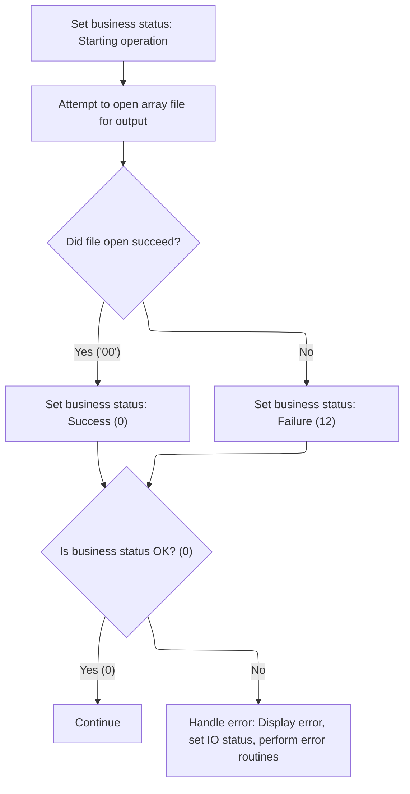

This section governs the business rules for handling the opening of the array output file, including status setting, error handling, and communication of file usability to downstream logic.

| Category       | Rule Name                   | Description                                                                          |
| -------------- | --------------------------- | ------------------------------------------------------------------------------------ |
| Business logic | Success status on file open | If the array output file opens successfully, set the business status to success (0). |
| Business logic | Failure status on file open | If the array output file fails to open, set the business status to failure (12).     |
| Business logic | Continue on success         | If the business status is OK (0), continue with downstream processing.               |

<SwmSnippet path="/app/cbl/CBACT01C.cbl" line="352">

---

In <SwmToken path="app/cbl/CBACT01C.cbl" pos="352:1:5" line-data="       3000-ARRFILE-OPEN.">`3000-ARRFILE-OPEN`</SwmToken> we prep for opening the array output file by setting a default error code, then actually open the file. We check the status and update <SwmToken path="app/cbl/CBACT01C.cbl" pos="353:7:9" line-data="           MOVE 8 TO APPL-RESULT.">`APPL-RESULT`</SwmToken> based on success or failure, so downstream logic knows if the file is usable.

```cobol
       3000-ARRFILE-OPEN.
           MOVE 8 TO APPL-RESULT.
           OPEN OUTPUT ARRY-FILE
           IF   ARRYFILE-STATUS = '00'
               MOVE 0 TO APPL-RESULT
           ELSE
               MOVE 12 TO APPL-RESULT
           END-IF
```

---

</SwmSnippet>

<SwmSnippet path="/app/cbl/CBACT01C.cbl" line="360">

---

After trying to open the array output file, we check if <SwmToken path="app/cbl/CBACT01C.cbl" pos="360:3:5" line-data="           IF  APPL-AOK">`APPL-AOK`</SwmToken> is set. If not, we show an error message, copy the file status to <SwmToken path="app/cbl/CBACT01C.cbl" pos="364:9:11" line-data="               MOVE  ARRYFILE-STATUS TO IO-STATUS">`IO-STATUS`</SwmToken>, call <SwmToken path="app/cbl/CBACT01C.cbl" pos="365:3:9" line-data="               PERFORM 9910-DISPLAY-IO-STATUS">`9910-DISPLAY-IO-STATUS`</SwmToken> to print a formatted status, and then abend the program. This makes error tracing straightforward.

```cobol
           IF  APPL-AOK
               CONTINUE
           ELSE
               DISPLAY 'ERROR OPENING ARRAYFILE'  ARRYFILE-STATUS
               MOVE  ARRYFILE-STATUS TO IO-STATUS
               PERFORM 9910-DISPLAY-IO-STATUS
               PERFORM 9999-ABEND-PROGRAM
           END-IF
           EXIT.
```

---

</SwmSnippet>

## File Preparation Before Main Loop

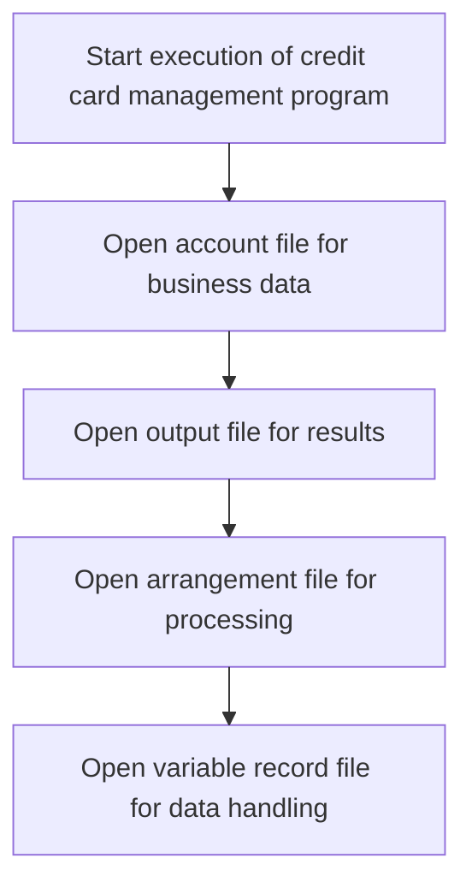

<SwmSnippet path="/app/cbl/CBACT01C.cbl" line="140">

---

After opening the array file, we open the VBR file to make sure all output files are ready before looping through account records.

```cobol
       PROCEDURE DIVISION.
           DISPLAY 'START OF EXECUTION OF PROGRAM CBACT01C'.
           PERFORM 0000-ACCTFILE-OPEN.
           PERFORM 2000-OUTFILE-OPEN.
           PERFORM 3000-ARRFILE-OPEN.
           PERFORM 4000-VBRFILE-OPEN.
```

---

</SwmSnippet>

## VBR Output File Open and Status Handling

```mermaid
%%{init: {"flowchart": {"defaultRenderer": "elk"}} }%%
flowchart TD
    node1["Start: Attempt to open transaction file"]
    click node1 openCode "app/cbl/CBACT01C.cbl:370:372"
    node1 --> node2{"VBRCFILE-STATUS = '00'?"}
    click node2 openCode "app/cbl/CBACT01C.cbl:373:377"
    node2 -->|"Yes"| node3{"APPL-RESULT = 0 (APPL-AOK)?"}
    click node3 openCode "app/cbl/CBACT01C.cbl:378:385"
    node2 -->|"No"| node4["Abort operation and display file open error"]
    click node4 openCode "app/cbl/CBACT01C.cbl:381:384"
    node3 -->|"Yes"| node5["File ready for transactions"]
    click node5 openCode "app/cbl/CBACT01C.cbl:386:386"
    node3 -->|"No"| node4
classDef HeadingStyle fill:#777777,stroke:#333,stroke-width:2px;

%% Swimm:
%% %%{init: {"flowchart": {"defaultRenderer": "elk"}} }%%
%% flowchart TD
%%     node1["Start: Attempt to open transaction file"]
%%     click node1 openCode "<SwmPath>[app/cbl/CBACT01C.cbl](app/cbl/CBACT01C.cbl)</SwmPath>:370:372"
%%     node1 --> node2{"<SwmToken path="app/cbl/CBACT01C.cbl" pos="292:3:5" line-data="           IF VBRCFILE-STATUS NOT = &#39;00&#39;">`VBRCFILE-STATUS`</SwmToken> = '00'?"}
%%     click node2 openCode "<SwmPath>[app/cbl/CBACT01C.cbl](app/cbl/CBACT01C.cbl)</SwmPath>:373:377"
%%     node2 -->|"Yes"| node3{"<SwmToken path="app/cbl/CBACT01C.cbl" pos="168:7:9" line-data="               MOVE 0 TO APPL-RESULT">`APPL-RESULT`</SwmToken> = 0 (<SwmToken path="app/cbl/CBACT01C.cbl" pos="186:3:5" line-data="           IF  APPL-AOK">`APPL-AOK`</SwmToken>)?"}
%%     click node3 openCode "<SwmPath>[app/cbl/CBACT01C.cbl](app/cbl/CBACT01C.cbl)</SwmPath>:378:385"
%%     node2 -->|"No"| node4["Abort operation and display file open error"]
%%     click node4 openCode "<SwmPath>[app/cbl/CBACT01C.cbl](app/cbl/CBACT01C.cbl)</SwmPath>:381:384"
%%     node3 -->|"Yes"| node5["File ready for transactions"]
%%     click node5 openCode "<SwmPath>[app/cbl/CBACT01C.cbl](app/cbl/CBACT01C.cbl)</SwmPath>:386:386"
%%     node3 -->|"No"| node4
%% classDef HeadingStyle fill:#777777,stroke:#333,stroke-width:2px;
```

This section ensures that the VBR output file is available and ready for transaction processing. It validates the file open status and handles errors by providing clear feedback and terminating the process if necessary.

| Category        | Rule Name                        | Description                                                                                                                                                                                                                                                                                                                                                                                  |
| --------------- | -------------------------------- | -------------------------------------------------------------------------------------------------------------------------------------------------------------------------------------------------------------------------------------------------------------------------------------------------------------------------------------------------------------------------------------------- |
| Data validation | Transaction readiness validation | Transaction processing is only allowed if <SwmToken path="app/cbl/CBACT01C.cbl" pos="168:7:9" line-data="               MOVE 0 TO APPL-RESULT">`APPL-RESULT`</SwmToken> is set to 0 (<SwmToken path="app/cbl/CBACT01C.cbl" pos="186:3:5" line-data="           IF  APPL-AOK">`APPL-AOK`</SwmToken>), indicating the file is ready for use.                                                   |
| Business logic  | Successful file open             | If the VBR output file is opened successfully (<SwmToken path="app/cbl/CBACT01C.cbl" pos="292:3:5" line-data="           IF VBRCFILE-STATUS NOT = &#39;00&#39;">`VBRCFILE-STATUS`</SwmToken> = '00'), the application result is set to indicate success (<SwmToken path="app/cbl/CBACT01C.cbl" pos="168:7:9" line-data="               MOVE 0 TO APPL-RESULT">`APPL-RESULT`</SwmToken> = 0). |

<SwmSnippet path="/app/cbl/CBACT01C.cbl" line="370">

---

In <SwmToken path="app/cbl/CBACT01C.cbl" pos="370:1:5" line-data="       4000-VBRFILE-OPEN.">`4000-VBRFILE-OPEN`</SwmToken> we prep for opening the VBR output file by setting a default error code, then actually open the file. We check the status and update <SwmToken path="app/cbl/CBACT01C.cbl" pos="371:7:9" line-data="           MOVE 8 TO APPL-RESULT.">`APPL-RESULT`</SwmToken> based on success or failure, so downstream logic knows if the file is usable.

```cobol
       4000-VBRFILE-OPEN.
           MOVE 8 TO APPL-RESULT.
           OPEN OUTPUT VBRC-FILE
           IF   VBRCFILE-STATUS = '00'
               MOVE 0 TO APPL-RESULT
           ELSE
               MOVE 12 TO APPL-RESULT
           END-IF
```

---

</SwmSnippet>

<SwmSnippet path="/app/cbl/CBACT01C.cbl" line="378">

---

After trying to open the VBR output file, we check if <SwmToken path="app/cbl/CBACT01C.cbl" pos="378:3:5" line-data="           IF  APPL-AOK">`APPL-AOK`</SwmToken> is set. If not, we show an error message, copy the file status to <SwmToken path="app/cbl/CBACT01C.cbl" pos="382:9:11" line-data="               MOVE  VBRCFILE-STATUS TO IO-STATUS">`IO-STATUS`</SwmToken>, call <SwmToken path="app/cbl/CBACT01C.cbl" pos="383:3:9" line-data="               PERFORM 9910-DISPLAY-IO-STATUS">`9910-DISPLAY-IO-STATUS`</SwmToken> to print a formatted status, and then abend the program. This makes error tracing straightforward.

```cobol
           IF  APPL-AOK
               CONTINUE
           ELSE
               DISPLAY 'ERROR OPENING VBRC FILE'  VBRCFILE-STATUS
               MOVE  VBRCFILE-STATUS TO IO-STATUS
               PERFORM 9910-DISPLAY-IO-STATUS
               PERFORM 9999-ABEND-PROGRAM
           END-IF
           EXIT.
```

---

</SwmSnippet>

## Main Account Processing Loop

```mermaid
%%{init: {"flowchart": {"defaultRenderer": "elk"}} }%%
flowchart TD
    subgraph loop1["For each account record until END-OF-FILE = 'Y'"]
      node2{"Is END-OF-FILE = 'N'?"}
      click node2 openCode "app/cbl/CBACT01C.cbl:147:148"
      node2 -->|"Yes"| node3["Fetch next account record"]
      click node3 openCode "app/cbl/CBACT01C.cbl:149:149"
      node3 --> node4{"Is END-OF-FILE = 'N' after fetch?"}
      click node4 openCode "app/cbl/CBACT01C.cbl:150:150"
      node4 -->|"Yes"| node5["Display account record"]
      click node5 openCode "app/cbl/CBACT01C.cbl:151:151"
      node5 --> node2
      node4 -->|"No"| node2
      node2 -->|"No"| node6["Finish"]
      click node6 openCode "app/cbl/CBACT01C.cbl:154:154"
    end
classDef HeadingStyle fill:#777777,stroke:#333,stroke-width:2px;

%% Swimm:
%% %%{init: {"flowchart": {"defaultRenderer": "elk"}} }%%
%% flowchart TD
%%     subgraph loop1["For each account record until <SwmToken path="app/cbl/CBACT01C.cbl" pos="147:5:9" line-data="           PERFORM UNTIL END-OF-FILE = &#39;Y&#39;">`END-OF-FILE`</SwmToken> = 'Y'"]
%%       node2{"Is <SwmToken path="app/cbl/CBACT01C.cbl" pos="147:5:9" line-data="           PERFORM UNTIL END-OF-FILE = &#39;Y&#39;">`END-OF-FILE`</SwmToken> = 'N'?"}
%%       click node2 openCode "<SwmPath>[app/cbl/CBACT01C.cbl](app/cbl/CBACT01C.cbl)</SwmPath>:147:148"
%%       node2 -->|"Yes"| node3["Fetch next account record"]
%%       click node3 openCode "<SwmPath>[app/cbl/CBACT01C.cbl](app/cbl/CBACT01C.cbl)</SwmPath>:149:149"
%%       node3 --> node4{"Is <SwmToken path="app/cbl/CBACT01C.cbl" pos="147:5:9" line-data="           PERFORM UNTIL END-OF-FILE = &#39;Y&#39;">`END-OF-FILE`</SwmToken> = 'N' after fetch?"}
%%       click node4 openCode "<SwmPath>[app/cbl/CBACT01C.cbl](app/cbl/CBACT01C.cbl)</SwmPath>:150:150"
%%       node4 -->|"Yes"| node5["Display account record"]
%%       click node5 openCode "<SwmPath>[app/cbl/CBACT01C.cbl](app/cbl/CBACT01C.cbl)</SwmPath>:151:151"
%%       node5 --> node2
%%       node4 -->|"No"| node2
%%       node2 -->|"No"| node6["Finish"]
%%       click node6 openCode "<SwmPath>[app/cbl/CBACT01C.cbl](app/cbl/CBACT01C.cbl)</SwmPath>:154:154"
%%     end
%% classDef HeadingStyle fill:#777777,stroke:#333,stroke-width:2px;
```

<SwmSnippet path="/app/cbl/CBACT01C.cbl" line="147">

---

Back in PROCEDURE-DIVISION, after opening all files, we enter the main loop. For each account record, we call <SwmToken path="app/cbl/CBACT01C.cbl" pos="149:3:9" line-data="                   PERFORM 1000-ACCTFILE-GET-NEXT">`1000-ACCTFILE-GET-NEXT`</SwmToken> to read and process the next record until <SwmToken path="app/cbl/CBACT01C.cbl" pos="147:5:9" line-data="           PERFORM UNTIL END-OF-FILE = &#39;Y&#39;">`END-OF-FILE`</SwmToken> flips to 'Y'.

```cobol
           PERFORM UNTIL END-OF-FILE = 'Y'
               IF  END-OF-FILE = 'N'
                   PERFORM 1000-ACCTFILE-GET-NEXT
                   IF  END-OF-FILE = 'N'
                       DISPLAY ACCOUNT-RECORD
                   END-IF
               END-IF
           END-PERFORM.
```

---

</SwmSnippet>

## Account Record Read and Transformation

This section governs the process of reading account records, validating the read status, transforming the data for output, and handling any errors or end-of-file conditions encountered during the process.

| Category       | Rule Name                              | Description                                                                                                                                                                               |
| -------------- | -------------------------------------- | ----------------------------------------------------------------------------------------------------------------------------------------------------------------------------------------- |
| Business logic | Successful Account Read Transformation | If the account record is read successfully (status code '00'), the account data must be transformed and formatted for output, including ensuring the reissue date is correctly formatted. |
| Business logic | Account Data Transformation            | Each successfully read account record must have its data transformed into the required output structure, including formatting the reissue date using a standard date formatting service.  |

<SwmSnippet path="/app/cbl/CBACT01C.cbl" line="165">

---

In <SwmToken path="app/cbl/CBACT01C.cbl" pos="165:1:7" line-data="       1000-ACCTFILE-GET-NEXT.">`1000-ACCTFILE-GET-NEXT`</SwmToken> we read the next account record, check the status, and if successful, display the record, prep the array, and call <SwmToken path="app/cbl/CBACT01C.cbl" pos="171:3:9" line-data="               PERFORM 1300-POPUL-ACCT-RECORD">`1300-POPUL-ACCT-RECORD`</SwmToken> to format and transform the data for output. This sets up everything needed for writing to output files.

```cobol
       1000-ACCTFILE-GET-NEXT.
           READ ACCTFILE-FILE INTO ACCOUNT-RECORD.
           IF  ACCTFILE-STATUS = '00'
               MOVE 0 TO APPL-RESULT
               INITIALIZE ARR-ARRAY-REC
               PERFORM 1100-DISPLAY-ACCT-RECORD
               PERFORM 1300-POPUL-ACCT-RECORD
               PERFORM 1350-WRITE-ACCT-RECORD
               PERFORM 1400-POPUL-ARRAY-RECORD
               PERFORM 1450-WRITE-ARRY-RECORD
               INITIALIZE VBRC-REC1
               PERFORM 1500-POPUL-VBRC-RECORD
               PERFORM 1550-WRITE-VB1-RECORD
               PERFORM 1575-WRITE-VB2-RECORD
           ELSE
               IF  ACCTFILE-STATUS = '10'
                   MOVE 16 TO APPL-RESULT
               ELSE
                   MOVE 12 TO APPL-RESULT
               END-IF
```

---

</SwmSnippet>

### Account Output Record Population and Date Formatting

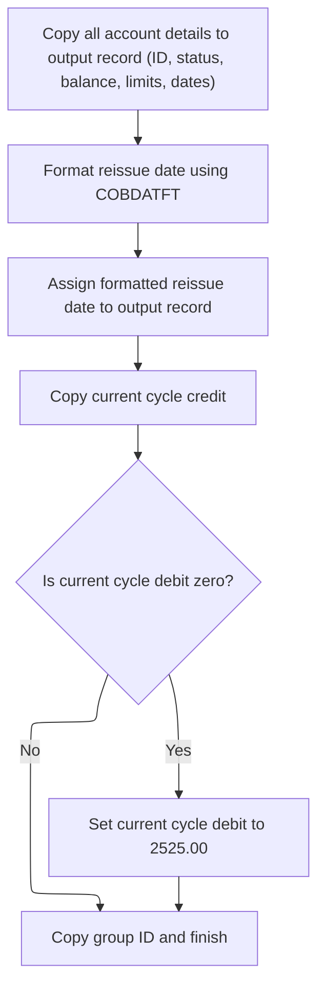

This section ensures that all necessary account information is transferred to the output record, with special handling for date formatting and business rules to avoid zero debit values.

| Category        | Rule Name                  | Description                                                                                                                                                                                                                                                                                        |
| --------------- | -------------------------- | -------------------------------------------------------------------------------------------------------------------------------------------------------------------------------------------------------------------------------------------------------------------------------------------------- |
| Data validation | Zero debit prevention      | The output record must not contain any zero values for the current cycle debit field; if the input is zero, it must be replaced with <SwmToken path="app/cbl/CBACT01C.cbl" pos="237:3:5" line-data="               MOVE 2525.00         TO   OUT-ACCT-CURR-CYC-DEBIT">`2525.00`</SwmToken>.        |
| Data validation | Formatted date requirement | All output records must have the reissue date field populated with a valid formatted date; if the date formatting fails, the record must be flagged for error handling.                                                                                                                            |
| Business logic  | Account detail transfer    | All account details (ID, status, balance, credit limits, open date, expiration date, reissue date, current cycle credit, group ID) must be copied from the input account record to the output record without modification, except where other business rules apply.                                |
| Business logic  | Reissue date formatting    | The reissue date in the output record must be formatted according to the YYYYMMDD standard, using the date formatting service, regardless of the input format.                                                                                                                                     |
| Business logic  | Non-zero debit enforcement | If the current cycle debit value in the input account record is zero, the output record must set the current cycle debit to <SwmToken path="app/cbl/CBACT01C.cbl" pos="237:3:5" line-data="               MOVE 2525.00         TO   OUT-ACCT-CURR-CYC-DEBIT">`2525.00`</SwmToken> instead of zero. |

<SwmSnippet path="/app/cbl/CBACT01C.cbl" line="215">

---

In <SwmToken path="app/cbl/CBACT01C.cbl" pos="215:1:7" line-data="       1300-POPUL-ACCT-RECORD.">`1300-POPUL-ACCT-RECORD`</SwmToken> we move account fields into the output structure, set up the date formatting request, and call the assembler program 'COBDATFT' to format the reissue date. The formatted date is then moved into the output record, making sure it's in the right format for downstream use.

```cobol
       1300-POPUL-ACCT-RECORD.
           MOVE   ACCT-ID                 TO   OUT-ACCT-ID.
           MOVE   ACCT-ACTIVE-STATUS      TO   OUT-ACCT-ACTIVE-STATUS.
           MOVE   ACCT-CURR-BAL           TO   OUT-ACCT-CURR-BAL.
           MOVE   ACCT-CREDIT-LIMIT       TO   OUT-ACCT-CREDIT-LIMIT.
           MOVE   ACCT-CASH-CREDIT-LIMIT  TO OUT-ACCT-CASH-CREDIT-LIMIT.
           MOVE   ACCT-OPEN-DATE          TO   OUT-ACCT-OPEN-DATE.
           MOVE   ACCT-EXPIRAION-DATE     TO   OUT-ACCT-EXPIRAION-DATE.
           MOVE   ACCT-REISSUE-DATE       TO   CODATECN-INP-DATE
                                               WS-REISSUE-DATE.
           MOVE   '2'                     TO   CODATECN-TYPE.
           MOVE   '2'                     TO   CODATECN-OUTTYPE.

      *---------------------------------------------------------------*
      *CALL ASSEMBLER PROGRAM FOR DATE FORMATTING                     *
      *---------------------------------------------------------------*
           CALL 'COBDATFT'       USING CODATECN-REC.

           MOVE   CODATECN-0UT-DATE       TO   OUT-ACCT-REISSUE-DATE.

           MOVE   ACCT-CURR-CYC-CREDIT    TO   OUT-ACCT-CURR-CYC-CREDIT.
```

---

</SwmSnippet>

<SwmSnippet path="/app/cbl/CBACT01C.cbl" line="236">

---

After formatting the date, we check if the input debit is zero and, if so, set the output debit to <SwmToken path="app/cbl/CBACT01C.cbl" pos="237:3:5" line-data="               MOVE 2525.00         TO   OUT-ACCT-CURR-CYC-DEBIT">`2525.00`</SwmToken>. This avoids zero values in the output, following a business rule. The rest of the fields are copied straight over.

```cobol
           IF  ACCT-CURR-CYC-DEBIT EQUAL TO ZERO
               MOVE 2525.00         TO   OUT-ACCT-CURR-CYC-DEBIT
           END-IF.
           MOVE   ACCT-GROUP-ID           TO   OUT-ACCT-GROUP-ID.
           EXIT.
```

---

</SwmSnippet>

### Account Record Write and Array Preparation

```mermaid
%%{init: {"flowchart": {"defaultRenderer": "elk"}} }%%
flowchart TD
    node1["Retrieve next account record"]
    click node1 openCode "app/cbl/CBACT01C.cbl:185:186"
    node1 --> node2{"Was record read successfully?"}
    click node2 openCode "app/cbl/CBACT01C.cbl:186:187"
    node2 -->|"Yes (APPL-AOK)"| node3["Update files and arrays"]
    click node3 openCode "app/cbl/CBACT01C.cbl:242:315"
    node2 -->|"No"| node4{"Is end of file reached?"}
    click node4 openCode "app/cbl/CBACT01C.cbl:189:190"
    node4 -->|"Yes (APPL-EOF)"| node5["Mark end-of-file (END-OF-FILE = 'Y')"]
    click node5 openCode "app/cbl/CBACT01C.cbl:190:191"
    node4 -->|"No"| node6["Display error and abort process"]
    click node6 openCode "app/cbl/CBACT01C.cbl:192:196"
classDef HeadingStyle fill:#777777,stroke:#333,stroke-width:2px;

%% Swimm:
%% %%{init: {"flowchart": {"defaultRenderer": "elk"}} }%%
%% flowchart TD
%%     node1["Retrieve next account record"]
%%     click node1 openCode "<SwmPath>[app/cbl/CBACT01C.cbl](app/cbl/CBACT01C.cbl)</SwmPath>:185:186"
%%     node1 --> node2{"Was record read successfully?"}
%%     click node2 openCode "<SwmPath>[app/cbl/CBACT01C.cbl](app/cbl/CBACT01C.cbl)</SwmPath>:186:187"
%%     node2 -->|"Yes (<SwmToken path="app/cbl/CBACT01C.cbl" pos="186:3:5" line-data="           IF  APPL-AOK">`APPL-AOK`</SwmToken>)"| node3["Update files and arrays"]
%%     click node3 openCode "<SwmPath>[app/cbl/CBACT01C.cbl](app/cbl/CBACT01C.cbl)</SwmPath>:242:315"
%%     node2 -->|"No"| node4{"Is end of file reached?"}
%%     click node4 openCode "<SwmPath>[app/cbl/CBACT01C.cbl](app/cbl/CBACT01C.cbl)</SwmPath>:189:190"
%%     node4 -->|"Yes (<SwmToken path="app/cbl/CBACT01C.cbl" pos="189:3:5" line-data="               IF  APPL-EOF">`APPL-EOF`</SwmToken>)"| node5["Mark end-of-file (<SwmToken path="app/cbl/CBACT01C.cbl" pos="147:5:9" line-data="           PERFORM UNTIL END-OF-FILE = &#39;Y&#39;">`END-OF-FILE`</SwmToken> = 'Y')"]
%%     click node5 openCode "<SwmPath>[app/cbl/CBACT01C.cbl](app/cbl/CBACT01C.cbl)</SwmPath>:190:191"
%%     node4 -->|"No"| node6["Display error and abort process"]
%%     click node6 openCode "<SwmPath>[app/cbl/CBACT01C.cbl](app/cbl/CBACT01C.cbl)</SwmPath>:192:196"
%% classDef HeadingStyle fill:#777777,stroke:#333,stroke-width:2px;
```

<SwmSnippet path="/app/cbl/CBACT01C.cbl" line="242">

---

We fill the array with account data and hardcoded values to simulate different transaction scenarios.

```cobol
       1350-WRITE-ACCT-RECORD.
           WRITE OUT-ACCT-REC.

           IF OUTFILE-STATUS NOT = '00' AND OUTFILE-STATUS NOT = '10'
              DISPLAY 'ACCOUNT FILE WRITE STATUS IS:'  OUTFILE-STATUS
              MOVE OUTFILE-STATUS  TO IO-STATUS
              PERFORM 9910-DISPLAY-IO-STATUS
              PERFORM 9999-ABEND-PROGRAM
           END-IF.
           EXIT.
```

---

</SwmSnippet>

<SwmSnippet path="/app/cbl/CBACT01C.cbl" line="253">

---

<SwmToken path="app/cbl/CBACT01C.cbl" pos="174:3:9" line-data="               PERFORM 1450-WRITE-ARRY-RECORD">`1450-WRITE-ARRY-RECORD`</SwmToken> writes the array record and checks the status. If the write fails (not '00' or '10'), we display the error, show the IO status, and abend. This keeps error handling consistent.

```cobol
       1400-POPUL-ARRAY-RECORD.
           MOVE   ACCT-ID         TO   ARR-ACCT-ID.
           MOVE   ACCT-CURR-BAL   TO   ARR-ACCT-CURR-BAL(1).
           MOVE   1005.00         TO   ARR-ACCT-CURR-CYC-DEBIT(1).
           MOVE   ACCT-CURR-BAL   TO   ARR-ACCT-CURR-BAL(2).
           MOVE   1525.00         TO   ARR-ACCT-CURR-CYC-DEBIT(2).
           MOVE   -1025.00        TO   ARR-ACCT-CURR-BAL(3).
           MOVE   -2500.00        TO   ARR-ACCT-CURR-CYC-DEBIT(3).
           EXIT.
```

---

</SwmSnippet>

<SwmSnippet path="/app/cbl/CBACT01C.cbl" line="263">

---

<SwmToken path="app/cbl/CBACT01C.cbl" pos="177:3:9" line-data="               PERFORM 1550-WRITE-VB1-RECORD">`1550-WRITE-VB1-RECORD`</SwmToken> copies 12 bytes from <SwmToken path="app/cbl/CBACT01C.cbl" pos="175:3:5" line-data="               INITIALIZE VBRC-REC1">`VBRC-REC1`</SwmToken> to <SwmToken path="app/cbl/CBACT01C.cbl" pos="289:9:11" line-data="           MOVE VBRC-REC1 TO VBR-REC(1:WS-RECD-LEN).">`VBR-REC`</SwmToken>, writes it out, and checks the status. If the write fails (not '00' or '10'), we display the error, show the IO status, and abend. This keeps error handling consistent and the output format correct.

```cobol
       1450-WRITE-ARRY-RECORD.
           WRITE ARR-ARRAY-REC.

           IF ARRYFILE-STATUS NOT = '00'
                        AND ARRYFILE-STATUS NOT = '10'
              DISPLAY 'ACCOUNT FILE WRITE STATUS IS:'
                                        ARRYFILE-STATUS
              MOVE ARRYFILE-STATUS TO IO-STATUS
              PERFORM 9910-DISPLAY-IO-STATUS
              PERFORM 9999-ABEND-PROGRAM
           END-IF.
           EXIT.
```

---

</SwmSnippet>

<SwmSnippet path="/app/cbl/CBACT01C.cbl" line="287">

---

<SwmToken path="app/cbl/CBACT01C.cbl" pos="178:3:9" line-data="               PERFORM 1575-WRITE-VB2-RECORD">`1575-WRITE-VB2-RECORD`</SwmToken> copies 39 bytes from <SwmToken path="app/cbl/CBACT01C.cbl" pos="304:3:5" line-data="           MOVE VBRC-REC2 TO VBR-REC(1:WS-RECD-LEN).">`VBRC-REC2`</SwmToken> to <SwmToken path="app/cbl/CBACT01C.cbl" pos="289:9:11" line-data="           MOVE VBRC-REC1 TO VBR-REC(1:WS-RECD-LEN).">`VBR-REC`</SwmToken>, writes it out, and checks the status. If the write fails (not '00' or '10'), we display the error, show the IO status, and abend. This keeps error handling consistent and the output format correct.

```cobol
       1550-WRITE-VB1-RECORD.
           MOVE 12 TO WS-RECD-LEN.
           MOVE VBRC-REC1 TO VBR-REC(1:WS-RECD-LEN).
           WRITE VBR-REC.

           IF VBRCFILE-STATUS NOT = '00'
                        AND VBRCFILE-STATUS NOT = '10'
              DISPLAY 'ACCOUNT FILE WRITE STATUS IS:'
                                        VBRCFILE-STATUS
              MOVE VBRCFILE-STATUS TO IO-STATUS
              PERFORM 9910-DISPLAY-IO-STATUS
              PERFORM 9999-ABEND-PROGRAM
           END-IF.
           EXIT.
```

---

</SwmSnippet>

<SwmSnippet path="/app/cbl/CBACT01C.cbl" line="302">

---

After finishing all writes in <SwmToken path="app/cbl/CBACT01C.cbl" pos="149:3:9" line-data="                   PERFORM 1000-ACCTFILE-GET-NEXT">`1000-ACCTFILE-GET-NEXT`</SwmToken>, we check <SwmToken path="app/cbl/CBACT01C.cbl" pos="186:3:5" line-data="           IF  APPL-AOK">`APPL-AOK`</SwmToken>. If not set, we check for end-of-file or display an error and IO status before abending. This keeps error handling and EOF detection clear.

```cobol
       1575-WRITE-VB2-RECORD.
           MOVE 39 TO WS-RECD-LEN.
           MOVE VBRC-REC2 TO VBR-REC(1:WS-RECD-LEN).
           WRITE VBR-REC.

           IF VBRCFILE-STATUS NOT = '00'
                        AND VBRCFILE-STATUS NOT = '10'
              DISPLAY 'ACCOUNT FILE WRITE STATUS IS:'
                                        VBRCFILE-STATUS
              MOVE VBRCFILE-STATUS TO IO-STATUS
              PERFORM 9910-DISPLAY-IO-STATUS
              PERFORM 9999-ABEND-PROGRAM
           END-IF.
           EXIT.
```

---

</SwmSnippet>

<SwmSnippet path="/app/cbl/CBACT01C.cbl" line="185">

---

After all processing, we close the account file to finish up and release resources.

```cobol
           END-IF
           IF  APPL-AOK
               CONTINUE
           ELSE
               IF  APPL-EOF
                   MOVE 'Y' TO END-OF-FILE
               ELSE
                   DISPLAY 'ERROR READING ACCOUNT FILE'
                   MOVE ACCTFILE-STATUS TO IO-STATUS
                   PERFORM 9910-DISPLAY-IO-STATUS
                   PERFORM 9999-ABEND-PROGRAM
               END-IF
           END-IF
           EXIT.
```

---

</SwmSnippet>

## Account File Close and Status Handling

<SwmSnippet path="/app/cbl/CBACT01C.cbl" line="156">

---

In <SwmToken path="app/cbl/CBACT01C.cbl" pos="156:3:7" line-data="           PERFORM 9000-ACCTFILE-CLOSE.">`9000-ACCTFILE-CLOSE`</SwmToken> we set <SwmToken path="app/cbl/CBACT01C.cbl" pos="168:7:9" line-data="               MOVE 0 TO APPL-RESULT">`APPL-RESULT`</SwmToken> to 8, close the account file, and adjust <SwmToken path="app/cbl/CBACT01C.cbl" pos="168:7:9" line-data="               MOVE 0 TO APPL-RESULT">`APPL-RESULT`</SwmToken> based on the close status. If the close fails, we bump <SwmToken path="app/cbl/CBACT01C.cbl" pos="168:7:9" line-data="               MOVE 0 TO APPL-RESULT">`APPL-RESULT`</SwmToken> to 12 for error handling downstream.

```cobol
           PERFORM 9000-ACCTFILE-CLOSE.

           DISPLAY 'END OF EXECUTION OF PROGRAM CBACT01C'.

           GOBACK.
```

---

</SwmSnippet>

# Final Account File Closure

```mermaid
%%{init: {"flowchart": {"defaultRenderer": "elk"}} }%%
flowchart TD
  node1["Attempt to close account file"]
  click node1 openCode "app/cbl/CBACT01C.cbl:390:390"
  node1 --> node2{"File closed successfully? (ACCTFILE-STATUS = '00')"}
  click node2 openCode "app/cbl/CBACT01C.cbl:391:391"
  node2 -->|"Yes"| node3{"Is operation result OK? (APPL-RESULT = 0)"}
  node2 -->|"No"| node3
  click node3 openCode "app/cbl/CBACT01C.cbl:396:396"
  node3 -->|"Yes"| node4["Operation complete"]
  click node4 openCode "app/cbl/CBACT01C.cbl:404:404"
  node3 -->|"No"| node5["Display error message"]
  click node5 openCode "app/cbl/CBACT01C.cbl:399:399"
  node5 --> node6["Show IO status"]
  click node6 openCode "app/cbl/CBACT01C.cbl:400:401"
  node6 --> node7["Terminate program"]
  click node7 openCode "app/cbl/CBACT01C.cbl:402:402"

classDef HeadingStyle fill:#777777,stroke:#333,stroke-width:2px;

%% Swimm:
%% %%{init: {"flowchart": {"defaultRenderer": "elk"}} }%%
%% flowchart TD
%%   node1["Attempt to close account file"]
%%   click node1 openCode "<SwmPath>[app/cbl/CBACT01C.cbl](app/cbl/CBACT01C.cbl)</SwmPath>:390:390"
%%   node1 --> node2{"File closed successfully? (<SwmToken path="app/cbl/CBACT01C.cbl" pos="167:3:5" line-data="           IF  ACCTFILE-STATUS = &#39;00&#39;">`ACCTFILE-STATUS`</SwmToken> = '00')"}
%%   click node2 openCode "<SwmPath>[app/cbl/CBACT01C.cbl](app/cbl/CBACT01C.cbl)</SwmPath>:391:391"
%%   node2 -->|"Yes"| node3{"Is operation result OK? (<SwmToken path="app/cbl/CBACT01C.cbl" pos="168:7:9" line-data="               MOVE 0 TO APPL-RESULT">`APPL-RESULT`</SwmToken> = 0)"}
%%   node2 -->|"No"| node3
%%   click node3 openCode "<SwmPath>[app/cbl/CBACT01C.cbl](app/cbl/CBACT01C.cbl)</SwmPath>:396:396"
%%   node3 -->|"Yes"| node4["Operation complete"]
%%   click node4 openCode "<SwmPath>[app/cbl/CBACT01C.cbl](app/cbl/CBACT01C.cbl)</SwmPath>:404:404"
%%   node3 -->|"No"| node5["Display error message"]
%%   click node5 openCode "<SwmPath>[app/cbl/CBACT01C.cbl](app/cbl/CBACT01C.cbl)</SwmPath>:399:399"
%%   node5 --> node6["Show IO status"]
%%   click node6 openCode "<SwmPath>[app/cbl/CBACT01C.cbl](app/cbl/CBACT01C.cbl)</SwmPath>:400:401"
%%   node6 --> node7["Terminate program"]
%%   click node7 openCode "<SwmPath>[app/cbl/CBACT01C.cbl](app/cbl/CBACT01C.cbl)</SwmPath>:402:402"
%% 
%% classDef HeadingStyle fill:#777777,stroke:#333,stroke-width:2px;
```

This section governs the business logic and error handling for closing the account file, ensuring that the operation is completed successfully or that errors are clearly communicated and handled.

| Category        | Rule Name                   | Description                                                                                                                                                                                                                                                                                                                                                                                 |
| --------------- | --------------------------- | ------------------------------------------------------------------------------------------------------------------------------------------------------------------------------------------------------------------------------------------------------------------------------------------------------------------------------------------------------------------------------------------- |
| Data validation | Operation result validation | The operation result must be checked after attempting to close the account file. If <SwmToken path="app/cbl/CBACT01C.cbl" pos="168:7:9" line-data="               MOVE 0 TO APPL-RESULT">`APPL-RESULT`</SwmToken> is not zero (<SwmToken path="app/cbl/CBACT01C.cbl" pos="186:3:5" line-data="           IF  APPL-AOK">`APPL-AOK`</SwmToken> is not set), error handling must be triggered. |
| Business logic  | Mandatory file closure      | The account file must be closed at the end of processing. If the file closure is successful, the operation is considered complete.                                                                                                                                                                                                                                                          |

<SwmSnippet path="/app/cbl/CBACT01C.cbl" line="388">

---

In <SwmToken path="app/cbl/CBACT01C.cbl" pos="388:1:5" line-data="       9000-ACCTFILE-CLOSE.">`9000-ACCTFILE-CLOSE`</SwmToken> we set <SwmToken path="app/cbl/CBACT01C.cbl" pos="389:11:13" line-data="           ADD 8 TO ZERO GIVING APPL-RESULT.">`APPL-RESULT`</SwmToken> to 8, close the account file, and adjust <SwmToken path="app/cbl/CBACT01C.cbl" pos="389:11:13" line-data="           ADD 8 TO ZERO GIVING APPL-RESULT.">`APPL-RESULT`</SwmToken> based on the close status. If the close fails, we bump <SwmToken path="app/cbl/CBACT01C.cbl" pos="389:11:13" line-data="           ADD 8 TO ZERO GIVING APPL-RESULT.">`APPL-RESULT`</SwmToken> to 12 for error handling downstream.

```cobol
       9000-ACCTFILE-CLOSE.
           ADD 8 TO ZERO GIVING APPL-RESULT.
           CLOSE ACCTFILE-FILE
           IF  ACCTFILE-STATUS = '00'
               SUBTRACT APPL-RESULT FROM APPL-RESULT
           ELSE
               ADD 12 TO ZERO GIVING APPL-RESULT
           END-IF
```

---

</SwmSnippet>

<SwmSnippet path="/app/cbl/CBACT01C.cbl" line="396">

---

After closing the account file, we check <SwmToken path="app/cbl/CBACT01C.cbl" pos="396:3:5" line-data="           IF  APPL-AOK">`APPL-AOK`</SwmToken>. If not set, we display an error, show the IO status, and abend. This keeps error handling consistent and makes it clear when the close fails.

```cobol
           IF  APPL-AOK
               CONTINUE
           ELSE
               DISPLAY 'ERROR CLOSING ACCOUNT FILE'
               MOVE ACCTFILE-STATUS TO IO-STATUS
               PERFORM 9910-DISPLAY-IO-STATUS
               PERFORM 9999-ABEND-PROGRAM
           END-IF
           EXIT.
```

---

</SwmSnippet>

&nbsp;

*This is an auto-generated document by Swimm 🌊 and has not yet been verified by a human*

<SwmMeta version="3.0.0" repo-id="Z2l0aHViJTNBJTNBU3dpbW1pby1NRi1DcmVkaXRjYXJkLURlbW8xJTNBJTNBR2lyaS1Td2ltbQ==" repo-name="Swimmio-MF-Creditcard-Demo1"><sup>Powered by [Swimm](https://app.swimm.io/)</sup></SwmMeta>
