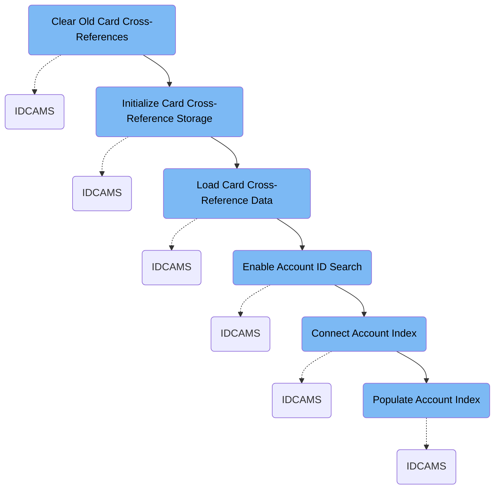

The XREFFILE job prepares and loads the card cross-reference storage, enabling efficient lookups between credit cards and accounts. It clears old data, defines new storage, loads updated records, and builds the necessary indexes for fast searching.

Here is a high level diagram of the file:



## Clear Old Card Cross-References

Step in this section: `STEP05`.

Removes any existing card-to-account cross-reference data to ensure a clean and accurate starting point for batch processing and card linkage.

1. The section executes commands to delete the VSAM cluster containing card-to-account cross-reference records, ensuring all previous records are removed.
2. The alternate index associated with the cross-reference data is also deleted, eliminating any outdated indexing structures used for fast access.
3. As a result, both the cross-reference cluster and its index are cleaned out in preparation for defining new structures and loading fresh data.

### Input

**AWS.M2.CARDDEMO.CARDXREF.VSAM.KSDS (Card cross-reference VSAM cluster)**

Contains existing card-to-account cross-reference records that may be outdated.

**AWS.M2.CARDDEMO.CARDXREF.VSAM.AIX (Card cross-reference alternate index dataset)**

Contains index records for card cross-reference, used for fast lookup and data organization.

### Output

**AWS.M2.CARDDEMO.CARDXREF.VSAM.KSDS (Card cross-reference VSAM cluster)**

VSAM cluster is deleted, removing all old card-to-account cross-reference records.

**AWS.M2.CARDDEMO.CARDXREF.VSAM.AIX (Card cross-reference alternate index dataset)**

Alternate index is deleted, removing any index records associated with old cross-references.

## Initialize Card Cross-Reference Storage

Step in this section: `STEP10`.

It prepares dedicated storage to ensure the system can organize and look up card-to-account associations efficiently for all subsequent processing steps.

As there are no data inputs at this stage, this step allocates and defines an empty VSAM key-sequenced cluster and its components.

- The process uses attributes such as cluster name, volume, key length, record size, and share options to create the physical data and index components.
- The outputs are the allocated and ready-to-use cluster, data, and index files, which will store all future card-to-account relationships but do not contain any records yet.

### Output

**AWS.M2.CARDDEMO.CARDXREF.VSAM.KSDS (Card cross-reference VSAM cluster)**

A newly defined key-sequenced dataset, ready to receive and organize card-to-account cross-reference records.

Sample:

```
Defined, allocated, and empty key-sequenced file structure for future card cross-reference data (no records yet).
```

**AWS.M2.CARDDEMO.CARDXREF.VSAM.KSDS.DATA (Card cross-reference VSAM data component)**

The data component ready for storing card-to-account association records.

Sample:

```
Allocated VSAM data component for card cross-reference storage.
```

**AWS.M2.CARDDEMO.CARDXREF.VSAM.KSDS.INDEX (Card cross-reference VSAM index component)**

The index component that will enable fast retrieval of card cross-reference records.

Sample:

```
Allocated VSAM index component for card cross-reference storage.
```

## Load Card Cross-Reference Data

Step in this section: `STEP15`.

It transfers all card cross-reference information from a source file into the newly allocated application dataset, making the data available for downstream credit card account linking and lookup.

1. The section reads card-to-account reference records from the input flat file that contains all the necessary links between customer accounts and their associated cards.
2. Each record from the flat file is copied directly into the VSAM key-sequenced dataset using a dedicated utility, preserving the structure and content of the reference information.
3. The VSAM cluster is populated with the card cross-reference data, making it available for use in subsequent card management and account lookup operations within the application.

### Input

<SwmPath>[app/…/EBCDIC/AWS.M2.CARDDEMO.CARDXREF.PS](app/data/EBCDIC/AWS.M2.CARDDEMO.CARDXREF.PS)</SwmPath>\*\* (Customer account card cross-reference file)\*\*

Contains card-to-account reference records that link customer accounts with credit cards for use in the application.

### Output

**AWS.M2.CARDDEMO.CARDXREF.VSAM.KSDS (Card cross-reference VSAM cluster)**

Stores the card-to-account reference records in an indexed dataset for efficient retrieval by the application.

## Enable Account ID Search

Step in this section: `STEP20`.

This section defines an alternate index for the card cross-reference dataset, allowing efficient searches and lookups of card-to-account links by account ID.

1. The existing card-to-account reference VSAM dataset contains records that link customer accounts and cards.
2. The step defines a new alternate index focused on the account ID field of these records, creating dedicated VSAM data and index components.
3. The resulting alternate index enables efficient queries and lookups of all card records associated with a given account ID.

### Input

**AWS.M2.CARDDEMO.CARDXREF.VSAM.KSDS (Card cross-reference VSAM cluster)**

Stores the card-to-account reference records that link customer accounts with credit cards.

### Output

**AWS.M2.CARDDEMO.CARDXREF.VSAM.AIX (Card cross-reference alternate index dataset)**

VSAM alternate index that allows searching card-to-account references by account ID.

## Connect Account Index

Step in this section: `STEP25`.

It creates the formal connection needed for the application to search card cross-reference records by account ID, enabling streamlined queries via an alternate index path.

- The step creates a VSAM path object that formally links the account-based alternate index to the main card cross-reference dataset.
- This path enables application and batch processes to perform card reference queries by account ID via the alternate index structure, without directly managing the alternate index dataset itself.
- No explicit input is required, as the pre-existing alternate index and base cluster definitions are referenced to create the new path.
- The result is a system-recognized path that can be used in subsequent operations for streamlined account-based searching of card relationships.

### Output

**AWS.M2.CARDDEMO.CARDXREF.VSAM.AIX.PATH**

A VSAM path object that enables access to card cross-reference data by account ID through the alternate index, supporting efficient lookups within the application credit card management workflow.

## Populate Account Index

Step in this section: `STEP30`.

This section uses the card cross-reference records to construct and populate the account ID alternate index, making the search index operational and enabling fast lookups of card-to-account relationships.

- The process reads all records from the card cross-reference VSAM cluster, which contains card-to-account associations.
- It systematically builds and populates the alternate index dataset with entries structured for searching by account ID.
- The final result is an alternate index fully loaded and ready, enabling fast account-based queries of card cross-reference data.

### Input

**AWS.M2.CARDDEMO.CARDXREF.VSAM.KSDS (Card cross-reference VSAM cluster)**

Stores the card-to-account reference records linking customer accounts with their credit cards.

### Output

**AWS.M2.CARDDEMO.CARDXREF.VSAM.AIX (Card cross-reference alternate index)**

Operational search index structured by account ID, containing all card-to-account index entries.

&nbsp;

*This is an auto-generated document by Swimm 🌊 and has not yet been verified by a human*

<SwmMeta version="3.0.0" repo-id="Z2l0aHViJTNBJTNBU3dpbW1pby1NRi1DcmVkaXRjYXJkLURlbW8xJTNBJTNBR2lyaS1Td2ltbQ==" repo-name="Swimmio-MF-Creditcard-Demo1"><sup>Powered by [Swimm](https://app.swimm.io/)</sup></SwmMeta>
