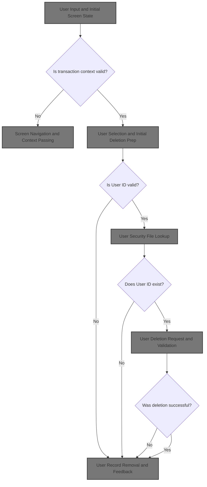
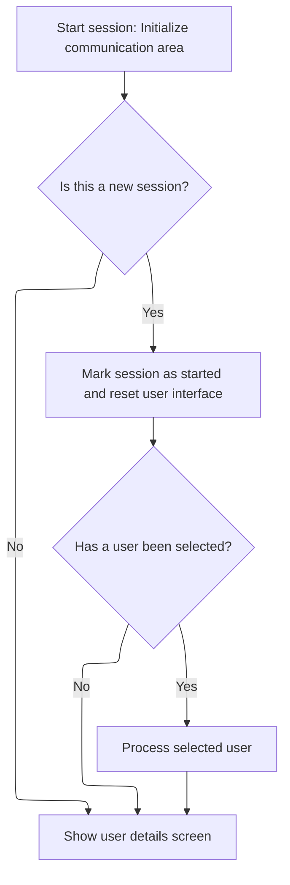
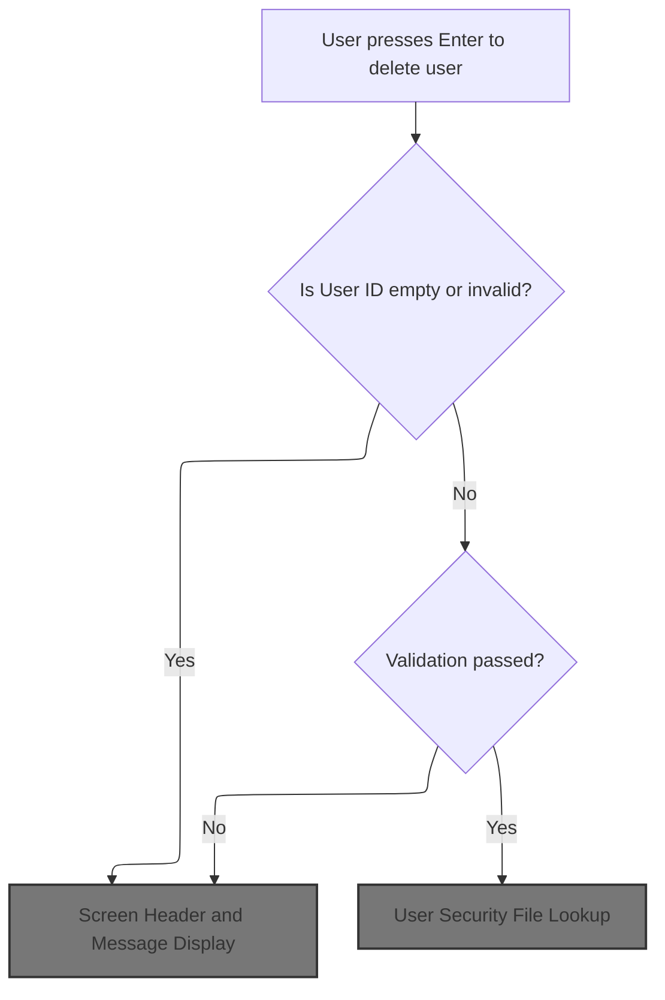
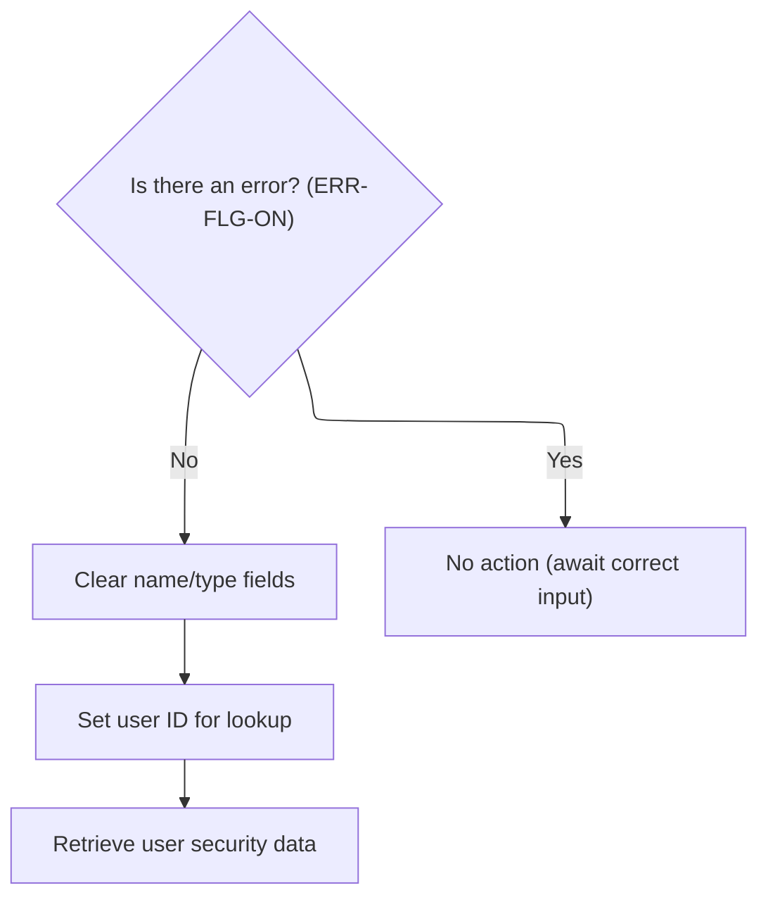
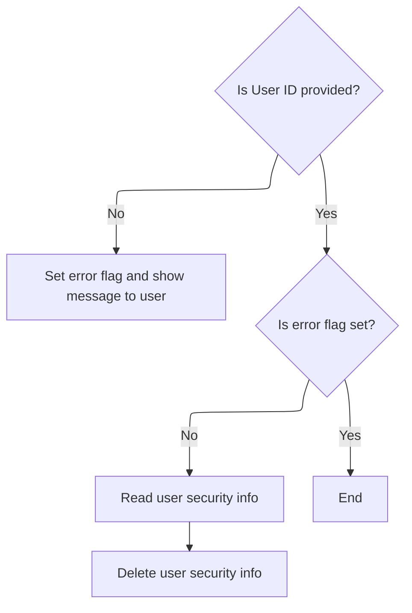
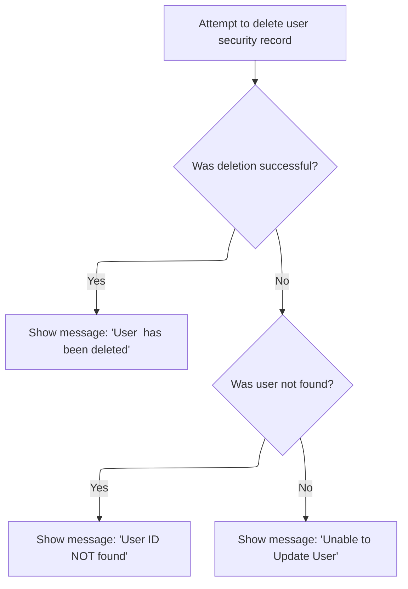
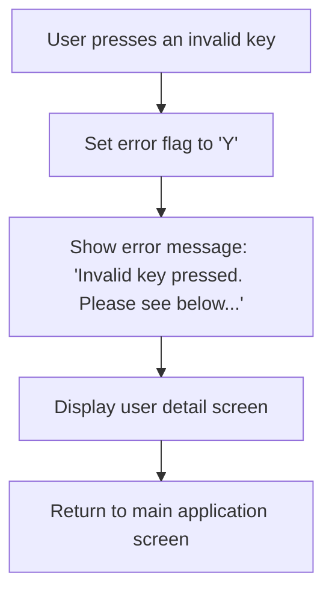

# Overview

This document describes the flow for deleting a user record in <SwmToken path="app/cbl/COUSR03C.cbl" pos="3:7:7" line-data="      * Application : CardDemo">`CardDemo`</SwmToken>. Operators use the Delete User screen to provide a User ID, which is validated and checked for existence. The system confirms deletion and provides feedback, ensuring user records are managed accurately.



## Dependencies

### Program

- <SwmToken path="app/cbl/COUSR03C.cbl" pos="2:7:7" line-data="      * Program     : COUSR03C.CBL">`COUSR03C`</SwmToken> (<SwmPath>[app/cbl/COUSR03C.cbl](app/cbl/COUSR03C.cbl)</SwmPath>)

### Copybooks

- <SwmToken path="app/cbl/COUSR03C.cbl" pos="49:3:3" line-data="       COPY COCOM01Y.">`COCOM01Y`</SwmToken> (<SwmPath>[app/cpy/COCOM01Y.cpy](app/cpy/COCOM01Y.cpy)</SwmPath>)
- <SwmToken path="app/cbl/COUSR03C.cbl" pos="221:4:4" line-data="                     MAPSET(&#39;COUSR03&#39;)">`COUSR03`</SwmToken> (<SwmPath>[app/cpy-bms/COUSR03.CPY](app/cpy-bms/COUSR03.CPY)</SwmPath>)
- <SwmToken path="app/cbl/COUSR03C.cbl" pos="62:3:3" line-data="       COPY COTTL01Y.">`COTTL01Y`</SwmToken> (<SwmPath>[app/cpy/COTTL01Y.cpy](app/cpy/COTTL01Y.cpy)</SwmPath>)
- <SwmToken path="app/cbl/COUSR03C.cbl" pos="63:3:3" line-data="       COPY CSDAT01Y.">`CSDAT01Y`</SwmToken> (<SwmPath>[app/cpy/CSDAT01Y.cpy](app/cpy/CSDAT01Y.cpy)</SwmPath>)
- <SwmToken path="app/cbl/COUSR03C.cbl" pos="64:3:3" line-data="       COPY CSMSG01Y.">`CSMSG01Y`</SwmToken> (<SwmPath>[app/cpy/CSMSG01Y.cpy](app/cpy/CSMSG01Y.cpy)</SwmPath>)
- <SwmToken path="app/cbl/COUSR03C.cbl" pos="65:3:3" line-data="       COPY CSUSR01Y.">`CSUSR01Y`</SwmToken> (<SwmPath>[app/cpy/CSUSR01Y.cpy](app/cpy/CSUSR01Y.cpy)</SwmPath>)
- DFHAID
- DFHBMSCA

## Detailed View of the Program's Functionality

# Program Initialization and Entry Point

When the program starts, it first resets all error and modification flags to ensure a clean state. It clears any message fields so that no residual messages from previous operations are displayed. The program then checks if there is a communication area provided by CICS (which indicates whether this is a new transaction or a continuation of a previous one).

- If there is no communication area, the program sets up to return control to the sign-on screen by specifying the appropriate program name and performing a screen return operation.
- If there is a communication area, it copies the data from the communication area into its own working storage for further processing.

# First-Time Screen Entry and User Selection

If this is the first time the user is entering the screen (not a re-entry), the program marks the session as started and resets the user interface fields to their initial values. It checks if a user has been selected for deletion:

- If a user is selected, it copies the selected user ID into the input field and begins the process to validate and prepare for deletion.
- If no user is selected, it simply displays the user deletion screen for further input.

# Handling User Input and Key Presses

Once the screen is displayed and the user provides input, the program waits for a key press and evaluates which key was pressed:

- **Enter Key:** Initiates the process to validate the user ID and, if valid, prepares the user record for deletion.
- **PF3 Key:** Navigates back to either the admin screen or the originating program, depending on the context.
- **PF4 Key:** Clears all fields and redisplays the deletion screen, giving the user a fresh start.
- <SwmToken path="app/cbl/COUSR03C.cbl" pos="283:6:6" line-data="                   MOVE &#39;Press PF5 key to delete this user ...&#39; TO">`PF5`</SwmToken> **Key:** Initiates the actual deletion of the user record.
- **PF12 Key:** Returns to the admin screen.
- **Other Keys:** Sets an error flag and displays an invalid key message, prompting the user to try again.

# User ID Validation and Deletion Preparation

When the user presses Enter, the program validates the user ID:

- If the user ID is empty or invalid, it sets an error flag, loads an appropriate error message, and redisplays the deletion screen.
- If the user ID is valid, it clears the name and type fields, sets up the user ID for lookup, and attempts to read the user’s security record from the file.

If the user record is found, the program copies the user’s details into the input fields and displays a message prompting the user to press <SwmToken path="app/cbl/COUSR03C.cbl" pos="283:6:6" line-data="                   MOVE &#39;Press PF5 key to delete this user ...&#39; TO">`PF5`</SwmToken> to confirm deletion. If the user record is not found or another error occurs, it sets an error flag, displays an appropriate error message, and redisplays the screen.

# User Deletion Request and Validation

When the user presses <SwmToken path="app/cbl/COUSR03C.cbl" pos="283:6:6" line-data="                   MOVE &#39;Press PF5 key to delete this user ...&#39; TO">`PF5`</SwmToken> to delete the user, the program checks if the user ID is provided:

- If the user ID is missing, it sets an error flag, loads an error message, and redisplays the screen.
- If the user ID is present and no error flag is set, it reads the user record again for confirmation and then attempts to delete the user record from the security file.

# User Record Removal and Feedback

The program attempts to delete the user record from the security file:

- If the deletion is successful, it resets all fields, builds a success message including the user ID, and displays the confirmation screen.
- If the user record is not found, it sets an error flag, loads a not found message, and redisplays the screen.
- If another error occurs during deletion, it logs the error codes, sets a generic error message, and redisplays the screen.

# Screen Display and User Feedback

Throughout the process, whenever the screen needs to be displayed (either for input, confirmation, or error), the program prepares the screen header with current date, time, and relevant titles. It copies any message to the output area and uses CICS commands to send the screen to the user’s terminal.

If the user presses an invalid key, the program immediately sets an error flag, loads an invalid key message, and redisplays the screen to prompt the user for correct input.

# Program Exit and Control Return

After handling all user input and screen transitions, the program returns control to CICS, passing along the current transaction ID and communication area. This ensures that all updated context and user data are available for the next screen or program, maintaining continuity in the user’s session.

# Rule Definition

| Paragraph Name                                                                                                                                                                                                                                                                                                                                                                                                                                                                                                                                                         | Rule ID | Category          | Description                                                                                                                                                                                                                                                                                                             | Conditions                                                                                                                                                                                                                       | Remarks                                                                                                                                                                                                                                                                                                                                                                                     |
| ---------------------------------------------------------------------------------------------------------------------------------------------------------------------------------------------------------------------------------------------------------------------------------------------------------------------------------------------------------------------------------------------------------------------------------------------------------------------------------------------------------------------------------------------------------------------- | ------- | ----------------- | ----------------------------------------------------------------------------------------------------------------------------------------------------------------------------------------------------------------------------------------------------------------------------------------------------------------------- | -------------------------------------------------------------------------------------------------------------------------------------------------------------------------------------------------------------------------------- | ------------------------------------------------------------------------------------------------------------------------------------------------------------------------------------------------------------------------------------------------------------------------------------------------------------------------------------------------------------------------------------------- |
| <SwmToken path="app/cbl/COUSR03C.cbl" pos="82:1:3" line-data="       MAIN-PARA.">`MAIN-PARA`</SwmToken>, <SwmToken path="app/cbl/COUSR03C.cbl" pos="120:3:7" line-data="                           PERFORM CLEAR-CURRENT-SCREEN">`CLEAR-CURRENT-SCREEN`</SwmToken>, <SwmToken path="app/cbl/COUSR03C.cbl" pos="315:3:7" line-data="                   PERFORM INITIALIZE-ALL-FIELDS">`INITIALIZE-ALL-FIELDS`</SwmToken>, <SwmToken path="app/cbl/COUSR03C.cbl" pos="105:3:7" line-data="                   PERFORM SEND-USRDEL-SCREEN">`SEND-USRDEL-SCREEN`</SwmToken> | RL-001  | Data Assignment   | When the deletion screen is first displayed, all input and message fields must be cleared and the screen must be ready for user input.                                                                                                                                                                                  | Triggered on initial display or when PF4 is pressed.                                                                                                                                                                             | Fields cleared: User ID, First Name, Last Name, User Type, Message. Message field is set to spaces. Output format: all fields are alphanumeric strings, message field is up to 80 characters.                                                                                                                                                                                               |
| <SwmToken path="app/cbl/COUSR03C.cbl" pos="103:3:7" line-data="                       PERFORM PROCESS-ENTER-KEY">`PROCESS-ENTER-KEY`</SwmToken>, <SwmToken path="app/cbl/COUSR03C.cbl" pos="122:3:7" line-data="                           PERFORM DELETE-USER-INFO">`DELETE-USER-INFO`</SwmToken>                                                                                                                                                                                                                                                                     | RL-002  | Conditional Logic | When Enter or <SwmToken path="app/cbl/COUSR03C.cbl" pos="283:6:6" line-data="                   MOVE &#39;Press PF5 key to delete this user ...&#39; TO">`PF5`</SwmToken> is pressed, the program validates the User ID field. If empty, an error message is displayed and no further action is taken.                  | Enter or <SwmToken path="app/cbl/COUSR03C.cbl" pos="283:6:6" line-data="                   MOVE &#39;Press PF5 key to delete this user ...&#39; TO">`PF5`</SwmToken> key pressed; User ID field is empty (spaces or low-values). | Error message: 'User ID can NOT be empty...'. Status field set to 'R' (error). Message field is a string up to 80 characters.                                                                                                                                                                                                                                                               |
| <SwmToken path="app/cbl/COUSR03C.cbl" pos="161:3:9" line-data="               PERFORM READ-USER-SEC-FILE">`READ-USER-SEC-FILE`</SwmToken>                                                                                                                                                                                                                                                                                                                                                                                                                              | RL-003  | Conditional Logic | When a valid User ID is entered, the program attempts to read the user record from the USRSEC file. The result determines the next action and message displayed.                                                                                                                                                        | User ID is not empty; Enter or <SwmToken path="app/cbl/COUSR03C.cbl" pos="283:6:6" line-data="                   MOVE &#39;Press PF5 key to delete this user ...&#39; TO">`PF5`</SwmToken> pressed.                              | Messages: 'Press <SwmToken path="app/cbl/COUSR03C.cbl" pos="283:6:6" line-data="                   MOVE &#39;Press PF5 key to delete this user ...&#39; TO">`PF5`</SwmToken> key to delete this user ...' (neutral), 'User ID NOT found...' (error), 'Unable to lookup User...' (error). Status field set to 'R' for error, 'N' for neutral. Message field is a string up to 80 characters. |
| <SwmToken path="app/cbl/COUSR03C.cbl" pos="191:3:9" line-data="               PERFORM DELETE-USER-SEC-FILE">`DELETE-USER-SEC-FILE`</SwmToken>                                                                                                                                                                                                                                                                                                                                                                                                                          | RL-004  | Computation       | If <SwmToken path="app/cbl/COUSR03C.cbl" pos="283:6:6" line-data="                   MOVE &#39;Press PF5 key to delete this user ...&#39; TO">`PF5`</SwmToken> is pressed and the User ID exists, the program attempts to delete the user record. Success or failure is communicated via messages.                      | <SwmToken path="app/cbl/COUSR03C.cbl" pos="283:6:6" line-data="                   MOVE &#39;Press PF5 key to delete this user ...&#39; TO">`PF5`</SwmToken> pressed; User ID is valid and exists in USRSEC file.                 | Success message: 'User <user ID> has been deleted ...' (confirmation, status 'G'). Error messages: 'User ID NOT found...', 'Unable to Update User...' (status 'R'). Message field is a string up to 80 characters.                                                                                                                                                                          |
| <SwmToken path="app/cbl/COUSR03C.cbl" pos="82:1:3" line-data="       MAIN-PARA.">`MAIN-PARA`</SwmToken>                                                                                                                                                                                                                                                                                                                                                                                                                                                                | RL-005  | Conditional Logic | The program responds to specific keys: Enter, PF3, PF4, <SwmToken path="app/cbl/COUSR03C.cbl" pos="283:6:6" line-data="                   MOVE &#39;Press PF5 key to delete this user ...&#39; TO">`PF5`</SwmToken>, PF12, and others, performing actions such as validation, deletion, field clearing, and navigation. | Any key pressed on the deletion screen.                                                                                                                                                                                          | PF3/PF12: navigate to previous/admin screen. PF4: reset fields. Other keys: error message 'Invalid key pressed. Please see below...'.                                                                                                                                                                                                                                                       |
| <SwmToken path="app/cbl/COUSR03C.cbl" pos="105:3:7" line-data="                   PERFORM SEND-USRDEL-SCREEN">`SEND-USRDEL-SCREEN`</SwmToken>, <SwmToken path="app/cbl/COUSR03C.cbl" pos="161:3:9" line-data="               PERFORM READ-USER-SEC-FILE">`READ-USER-SEC-FILE`</SwmToken>, <SwmToken path="app/cbl/COUSR03C.cbl" pos="191:3:9" line-data="               PERFORM DELETE-USER-SEC-FILE">`DELETE-USER-SEC-FILE`</SwmToken>                                                                                                                                | RL-006  | Data Assignment   | All error and confirmation messages are displayed in the message field, with the color/status field set appropriately.                                                                                                                                                                                                  | Any message to be displayed to the user.                                                                                                                                                                                         | Status field values: 'R' for error, 'G' for confirmation, 'N' for neutral. Message field: string, up to 80 characters.                                                                                                                                                                                                                                                                      |
| <SwmToken path="app/cbl/COUSR03C.cbl" pos="82:1:3" line-data="       MAIN-PARA.">`MAIN-PARA`</SwmToken>, <SwmToken path="app/cbl/COUSR03C.cbl" pos="105:3:7" line-data="                   PERFORM SEND-USRDEL-SCREEN">`SEND-USRDEL-SCREEN`</SwmToken>                                                                                                                                                                                                                                                                                                                 | RL-007  | Conditional Logic | After any error, the program keeps the screen active, allowing the user to retry input or navigation.                                                                                                                                                                                                                   | Error flag is set after an operation.                                                                                                                                                                                            | Screen remains active for further input. No automatic navigation away from the deletion screen after error.                                                                                                                                                                                                                                                                                 |
| <SwmToken path="app/cbl/COUSR03C.cbl" pos="82:1:3" line-data="       MAIN-PARA.">`MAIN-PARA`</SwmToken>                                                                                                                                                                                                                                                                                                                                                                                                                                                                | RL-008  | Computation       | After completing any action, the program returns control to the CICS environment with the current transaction ID and communication area.                                                                                                                                                                                | After any user action is processed.                                                                                                                                                                                              | Transaction ID: <SwmToken path="app/cbl/COUSR03C.cbl" pos="99:5:5" line-data="                   IF CDEMO-CU03-USR-SELECTED NOT =">`CU03`</SwmToken>. Communication area contains current context. No output format required.                                                                                                                                                               |

# User Stories

## User Story 1: Display and Reset Deletion Screen

---

### Story Description:

As a user, I want the deletion screen to be cleared and ready for input when I first access it or press the reset key so that I can start a new deletion operation without leftover data.

---

### Business Rule Mapping:

| Rule ID | Paragraph Name                                                                                                                                                                                                                                                                                                                                                                                                                                                                                                                                                         | Rule Description                                                                                                                                                                                                                                                                                                        |
| ------- | ---------------------------------------------------------------------------------------------------------------------------------------------------------------------------------------------------------------------------------------------------------------------------------------------------------------------------------------------------------------------------------------------------------------------------------------------------------------------------------------------------------------------------------------------------------------------- | ----------------------------------------------------------------------------------------------------------------------------------------------------------------------------------------------------------------------------------------------------------------------------------------------------------------------- |
| RL-001  | <SwmToken path="app/cbl/COUSR03C.cbl" pos="82:1:3" line-data="       MAIN-PARA.">`MAIN-PARA`</SwmToken>, <SwmToken path="app/cbl/COUSR03C.cbl" pos="120:3:7" line-data="                           PERFORM CLEAR-CURRENT-SCREEN">`CLEAR-CURRENT-SCREEN`</SwmToken>, <SwmToken path="app/cbl/COUSR03C.cbl" pos="315:3:7" line-data="                   PERFORM INITIALIZE-ALL-FIELDS">`INITIALIZE-ALL-FIELDS`</SwmToken>, <SwmToken path="app/cbl/COUSR03C.cbl" pos="105:3:7" line-data="                   PERFORM SEND-USRDEL-SCREEN">`SEND-USRDEL-SCREEN`</SwmToken> | When the deletion screen is first displayed, all input and message fields must be cleared and the screen must be ready for user input.                                                                                                                                                                                  |
| RL-005  | <SwmToken path="app/cbl/COUSR03C.cbl" pos="82:1:3" line-data="       MAIN-PARA.">`MAIN-PARA`</SwmToken>                                                                                                                                                                                                                                                                                                                                                                                                                                                                | The program responds to specific keys: Enter, PF3, PF4, <SwmToken path="app/cbl/COUSR03C.cbl" pos="283:6:6" line-data="                   MOVE &#39;Press PF5 key to delete this user ...&#39; TO">`PF5`</SwmToken>, PF12, and others, performing actions such as validation, deletion, field clearing, and navigation. |
| RL-006  | <SwmToken path="app/cbl/COUSR03C.cbl" pos="105:3:7" line-data="                   PERFORM SEND-USRDEL-SCREEN">`SEND-USRDEL-SCREEN`</SwmToken>, <SwmToken path="app/cbl/COUSR03C.cbl" pos="161:3:9" line-data="               PERFORM READ-USER-SEC-FILE">`READ-USER-SEC-FILE`</SwmToken>, <SwmToken path="app/cbl/COUSR03C.cbl" pos="191:3:9" line-data="               PERFORM DELETE-USER-SEC-FILE">`DELETE-USER-SEC-FILE`</SwmToken>                                                                                                                                | All error and confirmation messages are displayed in the message field, with the color/status field set appropriately.                                                                                                                                                                                                  |

---

### Relevant Functionality:

- <SwmToken path="app/cbl/COUSR03C.cbl" pos="82:1:3" line-data="       MAIN-PARA.">`MAIN-PARA`</SwmToken>
  1. **RL-001:**
     - On initial display or PF4 key:
       - Set error flag off
       - Set user modified flag to 'N'
       - Move spaces to message field and all input fields
       - Send the deletion screen to the user
  2. **RL-005:**
     - On key press:
       - If Enter: validate User ID and read user record
       - If PF3 or PF12: navigate to previous/admin screen
       - If PF4: clear all fields and reset screen
       - If <SwmToken path="app/cbl/COUSR03C.cbl" pos="283:6:6" line-data="                   MOVE &#39;Press PF5 key to delete this user ...&#39; TO">`PF5`</SwmToken>: validate and delete user record
       - If other: set error flag and display invalid key message
- <SwmToken path="app/cbl/COUSR03C.cbl" pos="105:3:7" line-data="                   PERFORM SEND-USRDEL-SCREEN">`SEND-USRDEL-SCREEN`</SwmToken>
  1. **RL-006:**
     - When displaying a message:
       - Set message field to appropriate text
       - Set status/color field based on message type
       - Send screen to user

## User Story 2: Validate User ID and Handle Errors

---

### Story Description:

As a user, I want the system to validate my User ID input and display appropriate error messages if it is empty or invalid so that I am informed of mistakes and can correct them before proceeding.

---

### Business Rule Mapping:

| Rule ID | Paragraph Name                                                                                                                                                                                                                                                                                                                                                                                                                          | Rule Description                                                                                                                                                                                                                                                                                       |
| ------- | --------------------------------------------------------------------------------------------------------------------------------------------------------------------------------------------------------------------------------------------------------------------------------------------------------------------------------------------------------------------------------------------------------------------------------------- | ------------------------------------------------------------------------------------------------------------------------------------------------------------------------------------------------------------------------------------------------------------------------------------------------------ |
| RL-007  | <SwmToken path="app/cbl/COUSR03C.cbl" pos="82:1:3" line-data="       MAIN-PARA.">`MAIN-PARA`</SwmToken>, <SwmToken path="app/cbl/COUSR03C.cbl" pos="105:3:7" line-data="                   PERFORM SEND-USRDEL-SCREEN">`SEND-USRDEL-SCREEN`</SwmToken>                                                                                                                                                                                  | After any error, the program keeps the screen active, allowing the user to retry input or navigation.                                                                                                                                                                                                  |
| RL-002  | <SwmToken path="app/cbl/COUSR03C.cbl" pos="103:3:7" line-data="                       PERFORM PROCESS-ENTER-KEY">`PROCESS-ENTER-KEY`</SwmToken>, <SwmToken path="app/cbl/COUSR03C.cbl" pos="122:3:7" line-data="                           PERFORM DELETE-USER-INFO">`DELETE-USER-INFO`</SwmToken>                                                                                                                                      | When Enter or <SwmToken path="app/cbl/COUSR03C.cbl" pos="283:6:6" line-data="                   MOVE &#39;Press PF5 key to delete this user ...&#39; TO">`PF5`</SwmToken> is pressed, the program validates the User ID field. If empty, an error message is displayed and no further action is taken. |
| RL-006  | <SwmToken path="app/cbl/COUSR03C.cbl" pos="105:3:7" line-data="                   PERFORM SEND-USRDEL-SCREEN">`SEND-USRDEL-SCREEN`</SwmToken>, <SwmToken path="app/cbl/COUSR03C.cbl" pos="161:3:9" line-data="               PERFORM READ-USER-SEC-FILE">`READ-USER-SEC-FILE`</SwmToken>, <SwmToken path="app/cbl/COUSR03C.cbl" pos="191:3:9" line-data="               PERFORM DELETE-USER-SEC-FILE">`DELETE-USER-SEC-FILE`</SwmToken> | All error and confirmation messages are displayed in the message field, with the color/status field set appropriately.                                                                                                                                                                                 |
| RL-003  | <SwmToken path="app/cbl/COUSR03C.cbl" pos="161:3:9" line-data="               PERFORM READ-USER-SEC-FILE">`READ-USER-SEC-FILE`</SwmToken>                                                                                                                                                                                                                                                                                               | When a valid User ID is entered, the program attempts to read the user record from the USRSEC file. The result determines the next action and message displayed.                                                                                                                                       |

---

### Relevant Functionality:

- <SwmToken path="app/cbl/COUSR03C.cbl" pos="82:1:3" line-data="       MAIN-PARA.">`MAIN-PARA`</SwmToken>
  1. **RL-007:**
     - After displaying error message:
       - Keep deletion screen active
       - Allow user to retry input or press navigation keys
- <SwmToken path="app/cbl/COUSR03C.cbl" pos="103:3:7" line-data="                       PERFORM PROCESS-ENTER-KEY">`PROCESS-ENTER-KEY`</SwmToken>
  1. **RL-002:**
     - If Enter or <SwmToken path="app/cbl/COUSR03C.cbl" pos="283:6:6" line-data="                   MOVE &#39;Press PF5 key to delete this user ...&#39; TO">`PF5`</SwmToken> pressed:
       - If User ID is empty:
         - Set error flag on
         - Display error message in message field
         - Do not proceed with read or delete operations
- <SwmToken path="app/cbl/COUSR03C.cbl" pos="105:3:7" line-data="                   PERFORM SEND-USRDEL-SCREEN">`SEND-USRDEL-SCREEN`</SwmToken>
  1. **RL-006:**
     - When displaying a message:
       - Set message field to appropriate text
       - Set status/color field based on message type
       - Send screen to user
- <SwmToken path="app/cbl/COUSR03C.cbl" pos="161:3:9" line-data="               PERFORM READ-USER-SEC-FILE">`READ-USER-SEC-FILE`</SwmToken>
  1. **RL-003:**
     - Attempt to read user record from USRSEC file:
       - If found:
         - Display user details
         - Show confirmation message
       - If not found:
         - Set error flag
         - Display 'User ID NOT found...' message
       - If other error:
         - Set error flag
         - Display 'Unable to lookup User...' message

## User Story 3: Delete User Record and Confirm

---

### Story Description:

As a user, I want to delete a user record and receive confirmation or error messages so that I know whether the deletion was successful or if further action is needed.

---

### Business Rule Mapping:

| Rule ID | Paragraph Name                                                                                                                                                                                                                                                                                                                                                                                                                          | Rule Description                                                                                                                                                                                                                                                                                   |
| ------- | --------------------------------------------------------------------------------------------------------------------------------------------------------------------------------------------------------------------------------------------------------------------------------------------------------------------------------------------------------------------------------------------------------------------------------------- | -------------------------------------------------------------------------------------------------------------------------------------------------------------------------------------------------------------------------------------------------------------------------------------------------- |
| RL-007  | <SwmToken path="app/cbl/COUSR03C.cbl" pos="82:1:3" line-data="       MAIN-PARA.">`MAIN-PARA`</SwmToken>, <SwmToken path="app/cbl/COUSR03C.cbl" pos="105:3:7" line-data="                   PERFORM SEND-USRDEL-SCREEN">`SEND-USRDEL-SCREEN`</SwmToken>                                                                                                                                                                                  | After any error, the program keeps the screen active, allowing the user to retry input or navigation.                                                                                                                                                                                              |
| RL-006  | <SwmToken path="app/cbl/COUSR03C.cbl" pos="105:3:7" line-data="                   PERFORM SEND-USRDEL-SCREEN">`SEND-USRDEL-SCREEN`</SwmToken>, <SwmToken path="app/cbl/COUSR03C.cbl" pos="161:3:9" line-data="               PERFORM READ-USER-SEC-FILE">`READ-USER-SEC-FILE`</SwmToken>, <SwmToken path="app/cbl/COUSR03C.cbl" pos="191:3:9" line-data="               PERFORM DELETE-USER-SEC-FILE">`DELETE-USER-SEC-FILE`</SwmToken> | All error and confirmation messages are displayed in the message field, with the color/status field set appropriately.                                                                                                                                                                             |
| RL-004  | <SwmToken path="app/cbl/COUSR03C.cbl" pos="191:3:9" line-data="               PERFORM DELETE-USER-SEC-FILE">`DELETE-USER-SEC-FILE`</SwmToken>                                                                                                                                                                                                                                                                                           | If <SwmToken path="app/cbl/COUSR03C.cbl" pos="283:6:6" line-data="                   MOVE &#39;Press PF5 key to delete this user ...&#39; TO">`PF5`</SwmToken> is pressed and the User ID exists, the program attempts to delete the user record. Success or failure is communicated via messages. |

---

### Relevant Functionality:

- <SwmToken path="app/cbl/COUSR03C.cbl" pos="82:1:3" line-data="       MAIN-PARA.">`MAIN-PARA`</SwmToken>
  1. **RL-007:**
     - After displaying error message:
       - Keep deletion screen active
       - Allow user to retry input or press navigation keys
- <SwmToken path="app/cbl/COUSR03C.cbl" pos="105:3:7" line-data="                   PERFORM SEND-USRDEL-SCREEN">`SEND-USRDEL-SCREEN`</SwmToken>
  1. **RL-006:**
     - When displaying a message:
       - Set message field to appropriate text
       - Set status/color field based on message type
       - Send screen to user
- <SwmToken path="app/cbl/COUSR03C.cbl" pos="191:3:9" line-data="               PERFORM DELETE-USER-SEC-FILE">`DELETE-USER-SEC-FILE`</SwmToken>
  1. **RL-004:**
     - On <SwmToken path="app/cbl/COUSR03C.cbl" pos="283:6:6" line-data="                   MOVE &#39;Press PF5 key to delete this user ...&#39; TO">`PF5`</SwmToken> key with valid User ID:
       - Attempt to delete user record from USRSEC file
       - If successful:
         - Reset all input fields
         - Display confirmation message with deleted User ID
         - Keep screen active
       - If not found:
         - Set error flag
         - Display 'User ID NOT found...' message
       - If other error:
         - Set error flag
         - Display 'Unable to Update User...' message

## User Story 4: Navigate Between Screens

---

### Story Description:

As a user, I want to navigate to previous or admin screens using function keys so that I can move between different parts of the application as needed.

---

### Business Rule Mapping:

| Rule ID | Paragraph Name                                                                                          | Rule Description                                                                                                                                                                                                                                                                                                        |
| ------- | ------------------------------------------------------------------------------------------------------- | ----------------------------------------------------------------------------------------------------------------------------------------------------------------------------------------------------------------------------------------------------------------------------------------------------------------------- |
| RL-005  | <SwmToken path="app/cbl/COUSR03C.cbl" pos="82:1:3" line-data="       MAIN-PARA.">`MAIN-PARA`</SwmToken> | The program responds to specific keys: Enter, PF3, PF4, <SwmToken path="app/cbl/COUSR03C.cbl" pos="283:6:6" line-data="                   MOVE &#39;Press PF5 key to delete this user ...&#39; TO">`PF5`</SwmToken>, PF12, and others, performing actions such as validation, deletion, field clearing, and navigation. |
| RL-008  | <SwmToken path="app/cbl/COUSR03C.cbl" pos="82:1:3" line-data="       MAIN-PARA.">`MAIN-PARA`</SwmToken> | After completing any action, the program returns control to the CICS environment with the current transaction ID and communication area.                                                                                                                                                                                |

---

### Relevant Functionality:

- <SwmToken path="app/cbl/COUSR03C.cbl" pos="82:1:3" line-data="       MAIN-PARA.">`MAIN-PARA`</SwmToken>
  1. **RL-005:**
     - On key press:
       - If Enter: validate User ID and read user record
       - If PF3 or PF12: navigate to previous/admin screen
       - If PF4: clear all fields and reset screen
       - If <SwmToken path="app/cbl/COUSR03C.cbl" pos="283:6:6" line-data="                   MOVE &#39;Press PF5 key to delete this user ...&#39; TO">`PF5`</SwmToken>: validate and delete user record
       - If other: set error flag and display invalid key message
  2. **RL-008:**
     - After processing action:
       - Execute CICS RETURN with transaction ID and communication area

# Workflow

# User Input and Initial Screen State

```mermaid
%%{init: {"flowchart": {"defaultRenderer": "elk"}} }%%
flowchart TD
    node1["Start: Prepare user deletion screen"]
    click node1 openCode "app/cbl/COUSR03C.cbl:82:88"
    node1 --> node2{"Is this a new transaction? (EIBCALEN = 0)"}
    click node2 openCode "app/cbl/COUSR03C.cbl:90:92"
    node2 -->|"Yes"| node3["Screen Navigation and Context Passing"]
    
    node2 -->|"No"| node4{"Has user already re-entered?"}
    click node4 openCode "app/cbl/COUSR03C.cbl:95:96"
    node4 -->|"No"| node5{"Is a user selected for deletion?"}
    click node5 openCode "app/cbl/COUSR03C.cbl:99:103"
    node5 -->|"Yes"| node6["User ID Validation and Deletion Confirmation"]
    
    node5 -->|"No"| node7["Show user deletion screen"]
    click node7 openCode "app/cbl/COUSR03C.cbl:105:105"
    node4 -->|"Yes"| node8{"Which key did the user press? (EIBAID)"}
    click node8 openCode "app/cbl/COUSR03C.cbl:108:126"
    node8 -->|"Enter"| node6
    node8 -->|"PF3 or PF12"| node3
    node8 -->|"PF4"| node9["Resetting Fields and Showing Deletion Screen"]
    
    node8 -->|PF5| node10["User Deletion Request and Validation"]
    
    node8 -->|"Other"| node11["Show invalid key message and deletion screen"]
    click node11 openCode "app/cbl/COUSR03C.cbl:127:129"
    node3 --> node12["End: Return control to CICS"]
    click node12 openCode "app/cbl/COUSR03C.cbl:134:137"
    node6 --> node12
    node7 --> node12
    node9 --> node12
    node10 --> node12
    node11 --> node12
classDef HeadingStyle fill:#777777,stroke:#333,stroke-width:2px;
click node3 goToHeading "Screen Navigation and Context Passing"
node3:::HeadingStyle
click node6 goToHeading "User ID Validation and Deletion Confirmation"
node6:::HeadingStyle
click node9 goToHeading "Resetting Fields and Showing Deletion Screen"
node9:::HeadingStyle
click node10 goToHeading "User Deletion Request and Validation"
node10:::HeadingStyle

%% Swimm:
%% %%{init: {"flowchart": {"defaultRenderer": "elk"}} }%%
%% flowchart TD
%%     node1["Start: Prepare user deletion screen"]
%%     click node1 openCode "<SwmPath>[app/cbl/COUSR03C.cbl](app/cbl/COUSR03C.cbl)</SwmPath>:82:88"
%%     node1 --> node2{"Is this a new transaction? (EIBCALEN = 0)"}
%%     click node2 openCode "<SwmPath>[app/cbl/COUSR03C.cbl](app/cbl/COUSR03C.cbl)</SwmPath>:90:92"
%%     node2 -->|"Yes"| node3["Screen Navigation and Context Passing"]
%%     
%%     node2 -->|"No"| node4{"Has user already re-entered?"}
%%     click node4 openCode "<SwmPath>[app/cbl/COUSR03C.cbl](app/cbl/COUSR03C.cbl)</SwmPath>:95:96"
%%     node4 -->|"No"| node5{"Is a user selected for deletion?"}
%%     click node5 openCode "<SwmPath>[app/cbl/COUSR03C.cbl](app/cbl/COUSR03C.cbl)</SwmPath>:99:103"
%%     node5 -->|"Yes"| node6["User ID Validation and Deletion Confirmation"]
%%     
%%     node5 -->|"No"| node7["Show user deletion screen"]
%%     click node7 openCode "<SwmPath>[app/cbl/COUSR03C.cbl](app/cbl/COUSR03C.cbl)</SwmPath>:105:105"
%%     node4 -->|"Yes"| node8{"Which key did the user press? (EIBAID)"}
%%     click node8 openCode "<SwmPath>[app/cbl/COUSR03C.cbl](app/cbl/COUSR03C.cbl)</SwmPath>:108:126"
%%     node8 -->|"Enter"| node6
%%     node8 -->|"PF3 or PF12"| node3
%%     node8 -->|"PF4"| node9["Resetting Fields and Showing Deletion Screen"]
%%     
%%     node8 -->|<SwmToken path="app/cbl/COUSR03C.cbl" pos="283:6:6" line-data="                   MOVE &#39;Press PF5 key to delete this user ...&#39; TO">`PF5`</SwmToken>| node10["User Deletion Request and Validation"]
%%     
%%     node8 -->|"Other"| node11["Show invalid key message and deletion screen"]
%%     click node11 openCode "<SwmPath>[app/cbl/COUSR03C.cbl](app/cbl/COUSR03C.cbl)</SwmPath>:127:129"
%%     node3 --> node12["End: Return control to CICS"]
%%     click node12 openCode "<SwmPath>[app/cbl/COUSR03C.cbl](app/cbl/COUSR03C.cbl)</SwmPath>:134:137"
%%     node6 --> node12
%%     node7 --> node12
%%     node9 --> node12
%%     node10 --> node12
%%     node11 --> node12
%% classDef HeadingStyle fill:#777777,stroke:#333,stroke-width:2px;
%% click node3 goToHeading "Screen Navigation and Context Passing"
%% node3:::HeadingStyle
%% click node6 goToHeading "User ID Validation and Deletion Confirmation"
%% node6:::HeadingStyle
%% click node9 goToHeading "Resetting Fields and Showing Deletion Screen"
%% node9:::HeadingStyle
%% click node10 goToHeading "User Deletion Request and Validation"
%% node10:::HeadingStyle
```



This section ensures that when a user accesses the deletion screen, the application presents the correct state, validates user actions, and guides the user through the deletion process or returns them to the appropriate screen.

| Category        | Rule Name                     | Description                                                                                                                                  |
| --------------- | ----------------------------- | -------------------------------------------------------------------------------------------------------------------------------------------- |
| Data validation | Require Transaction Context   | If there is no transaction context (EIBCALEN = 0), the user must be returned to the sign-on screen and not allowed to proceed with deletion. |
| Data validation | User ID Required for Deletion | If the user requests deletion but does not provide a user ID, the application must display an error message and prevent the deletion action. |
| Business logic  | Deletion Confirmation         | If the user provides a valid user ID and requests deletion, the application must confirm the deletion before proceeding.                     |
| Business logic  | Navigation on PF Keys         | When the user presses PF3 or PF12, the application must navigate back to the previous screen, preserving the navigation context.             |
| Business logic  | Screen Reset on PF4           | When the user presses PF4, all input and message fields must be reset, and the deletion screen must be shown again in a clean state.         |

<SwmSnippet path="/app/cbl/COUSR03C.cbl" line="82">

---

In <SwmToken path="app/cbl/COUSR03C.cbl" pos="82:1:3" line-data="       MAIN-PARA.">`MAIN-PARA`</SwmToken> we start by resetting error and modification flags, and clearing out any message fields. This sets up a clean state before handling user input or screen transitions. If there's no communication area (EIBCALEN = 0), we set up to call the previous screen program (<SwmToken path="app/cbl/COUSR03C.cbl" pos="91:4:4" line-data="               MOVE &#39;COSGN00C&#39; TO CDEMO-TO-PROGRAM">`COSGN00C`</SwmToken>). Otherwise, we prep the communication area for further user-driven logic.

```cobol
       MAIN-PARA.

           SET ERR-FLG-OFF     TO TRUE
           SET USR-MODIFIED-NO TO TRUE

           MOVE SPACES TO WS-MESSAGE
                          ERRMSGO OF COUSR3AO
```

---

</SwmSnippet>

<SwmSnippet path="/app/cbl/COUSR03C.cbl" line="90">

---

Here we check if there's no communication area. If so, we set the next program to <SwmToken path="app/cbl/COUSR03C.cbl" pos="91:4:4" line-data="               MOVE &#39;COSGN00C&#39; TO CDEMO-TO-PROGRAM">`COSGN00C`</SwmToken> (the sign-on screen) and call <SwmToken path="app/cbl/COUSR03C.cbl" pos="92:3:9" line-data="               PERFORM RETURN-TO-PREV-SCREEN">`RETURN-TO-PREV-SCREEN`</SwmToken> to send the user back. This is <SwmToken path="app/cbl/COUSR03C.cbl" pos="3:7:7" line-data="      * Application : CardDemo">`CardDemo`</SwmToken>'s way of handling navigation when there's no context.

```cobol
           IF EIBCALEN = 0
               MOVE 'COSGN00C' TO CDEMO-TO-PROGRAM
               PERFORM RETURN-TO-PREV-SCREEN
```

---

</SwmSnippet>

## Screen Navigation and Context Passing

This section ensures that users are always directed to a valid screen when navigating back, and that the necessary context is passed to the next program for a seamless user experience.

| Category       | Rule Name                           | Description                                                                                                                                                                                                                                                                                               |
| -------------- | ----------------------------------- | --------------------------------------------------------------------------------------------------------------------------------------------------------------------------------------------------------------------------------------------------------------------------------------------------------- |
| Business logic | Default navigation destination      | If the target program for navigation is not specified, the system must default to the sign-on screen (<SwmToken path="app/cbl/COUSR03C.cbl" pos="91:4:4" line-data="               MOVE &#39;COSGN00C&#39; TO CDEMO-TO-PROGRAM">`COSGN00C`</SwmToken>) to ensure the user always has a valid destination. |
| Business logic | Context preservation on navigation  | Whenever control is transferred to another program, the current transaction ID and program name must be passed to the next program to preserve user context.                                                                                                                                              |
| Business logic | Reset program context on navigation | The program context indicator must be reset to zero before transferring control to another program, ensuring the next program starts with a clean context state.                                                                                                                                          |

<SwmSnippet path="/app/cbl/COUSR03C.cbl" line="197">

---

In <SwmToken path="app/cbl/COUSR03C.cbl" pos="197:1:7" line-data="       RETURN-TO-PREV-SCREEN.">`RETURN-TO-PREV-SCREEN`</SwmToken>, if the target program isn't set, we default to <SwmToken path="app/cbl/COUSR03C.cbl" pos="200:4:4" line-data="               MOVE &#39;COSGN00C&#39; TO CDEMO-TO-PROGRAM">`COSGN00C`</SwmToken> so the user always has somewhere to go (the sign-on screen). This keeps navigation predictable.

```cobol
       RETURN-TO-PREV-SCREEN.

           IF CDEMO-TO-PROGRAM = LOW-VALUES OR SPACES
               MOVE 'COSGN00C' TO CDEMO-TO-PROGRAM
           END-IF
```

---

</SwmSnippet>

<SwmSnippet path="/app/cbl/COUSR03C.cbl" line="202">

---

Before calling XCTL to transfer control, we copy the current transaction and program names into the communication area. This passes context to the next program, so it knows what screen to show and what state to expect.

```cobol
           MOVE WS-TRANID    TO CDEMO-FROM-TRANID
           MOVE WS-PGMNAME   TO CDEMO-FROM-PROGRAM
           MOVE ZEROS        TO CDEMO-PGM-CONTEXT
           EXEC CICS
               XCTL PROGRAM(CDEMO-TO-PROGRAM)
               COMMAREA(CARDDEMO-COMMAREA)
           END-EXEC.
```

---

</SwmSnippet>

## User Selection and Initial Deletion Prep



<SwmSnippet path="/app/cbl/COUSR03C.cbl" line="93">

---

Back in <SwmToken path="app/cbl/COUSR03C.cbl" pos="82:1:3" line-data="       MAIN-PARA.">`MAIN-PARA`</SwmToken> after returning from <SwmToken path="app/cbl/COUSR03C.cbl" pos="92:3:9" line-data="               PERFORM RETURN-TO-PREV-SCREEN">`RETURN-TO-PREV-SCREEN`</SwmToken>, we prep the communication area, check if we're re-entering, and if the user selected something, we copy it to the input and call <SwmToken path="app/cbl/COUSR03C.cbl" pos="103:3:7" line-data="                       PERFORM PROCESS-ENTER-KEY">`PROCESS-ENTER-KEY`</SwmToken> to start deletion logic.

```cobol
           ELSE
               MOVE DFHCOMMAREA(1:EIBCALEN) TO CARDDEMO-COMMAREA
               IF NOT CDEMO-PGM-REENTER
                   SET CDEMO-PGM-REENTER    TO TRUE
                   MOVE LOW-VALUES          TO COUSR3AO
                   MOVE -1       TO USRIDINL OF COUSR3AI
                   IF CDEMO-CU03-USR-SELECTED NOT =
                                              SPACES AND LOW-VALUES
                       MOVE CDEMO-CU03-USR-SELECTED TO
                            USRIDINI OF COUSR3AI
                       PERFORM PROCESS-ENTER-KEY
                   END-IF
                   PERFORM SEND-USRDEL-SCREEN
```

---

</SwmSnippet>

## User ID Validation and Deletion Confirmation



This section governs the validation of the User ID input and the confirmation process for user deletion. It ensures that only valid User IDs can proceed to deletion, and provides clear feedback to the user in case of errors.

| Category        | Rule Name                     | Description                                                                                                                                                                                                          |
| --------------- | ----------------------------- | -------------------------------------------------------------------------------------------------------------------------------------------------------------------------------------------------------------------- |
| Data validation | User ID Required              | If the User ID field is empty or contains only spaces or low-values, the system must display an error message stating 'User ID can NOT be empty...' and prevent further processing until a valid User ID is entered. |
| Business logic  | User Existence Check          | If the User ID passes the initial validation, the system must attempt to locate the user in the user security file before proceeding with deletion confirmation.                                                     |
| Business logic  | Deletion Confirmation Display | Upon successful validation and user existence confirmation, the system must display a deletion confirmation screen to the user, including relevant header information and any messages.                              |

<SwmSnippet path="/app/cbl/COUSR03C.cbl" line="142">

---

In <SwmToken path="app/cbl/COUSR03C.cbl" pos="142:1:5" line-data="       PROCESS-ENTER-KEY.">`PROCESS-ENTER-KEY`</SwmToken>, we validate the user ID. If it's empty, we set an error and call <SwmToken path="app/cbl/COUSR03C.cbl" pos="150:3:7" line-data="                   PERFORM SEND-USRDEL-SCREEN">`SEND-USRDEL-SCREEN`</SwmToken> to show the error to the user. If it's valid, we keep going.

```cobol
       PROCESS-ENTER-KEY.

           EVALUATE TRUE
               WHEN USRIDINI OF COUSR3AI = SPACES OR LOW-VALUES
                   MOVE 'Y'     TO WS-ERR-FLG
                   MOVE 'User ID can NOT be empty...' TO
                                   WS-MESSAGE
                   MOVE -1       TO USRIDINL OF COUSR3AI
                   PERFORM SEND-USRDEL-SCREEN
               WHEN OTHER
                   MOVE -1       TO USRIDINL OF COUSR3AI
                   CONTINUE
           END-EVALUATE
```

---

</SwmSnippet>

### Screen Header and Message Display

This section governs how the screen header and message area are populated and displayed to the user, ensuring that all relevant information and feedback are visible during user interactions.

| Category        | Rule Name                           | Description                                                                                                                                         |
| --------------- | ----------------------------------- | --------------------------------------------------------------------------------------------------------------------------------------------------- |
| Data validation | Blank message default               | If there is no message to display, the message area must remain blank to avoid confusing the user with outdated or irrelevant information.          |
| Data validation | Error message clarity               | Error messages must be clearly distinguished from informational messages to ensure users can easily identify and respond to issues.                 |
| Business logic  | Header context display              | The screen header must always display the current program name and transaction ID to provide context for the user.                                  |
| Business logic  | Immediate message feedback          | Any message, including errors or status updates, must be copied to the message area and displayed to the user immediately upon screen refresh.      |
| Business logic  | Screen refresh and cursor placement | The screen must be refreshed and the cursor positioned for user input after displaying the header and message, ensuring a seamless user experience. |

<SwmSnippet path="/app/cbl/COUSR03C.cbl" line="213">

---

In <SwmToken path="app/cbl/COUSR03C.cbl" pos="213:1:5" line-data="       SEND-USRDEL-SCREEN.">`SEND-USRDEL-SCREEN`</SwmToken>, we call <SwmToken path="app/cbl/COUSR03C.cbl" pos="215:3:7" line-data="           PERFORM POPULATE-HEADER-INFO">`POPULATE-HEADER-INFO`</SwmToken> to set up the screen header with all the right info before displaying anything to the user.

```cobol
       SEND-USRDEL-SCREEN.

           PERFORM POPULATE-HEADER-INFO
```

---

</SwmSnippet>

<SwmSnippet path="/app/cbl/COUSR03C.cbl" line="217">

---

We copy the message to the output area and send the screen using CICS SEND MAP, so the user sees the latest info or error right on their terminal.

```cobol
           MOVE WS-MESSAGE TO ERRMSGO OF COUSR3AO

           EXEC CICS SEND
                     MAP('COUSR3A')
                     MAPSET('COUSR03')
                     FROM(COUSR3AO)
                     ERASE
                     CURSOR
           END-EXEC.
```

---

</SwmSnippet>

### User Record Lookup and Error Handling



<SwmSnippet path="/app/cbl/COUSR03C.cbl" line="156">

---

After reading the user record in <SwmToken path="app/cbl/COUSR03C.cbl" pos="103:3:7" line-data="                       PERFORM PROCESS-ENTER-KEY">`PROCESS-ENTER-KEY`</SwmToken>, if no error, we copy the user's details into the input fields and show the deletion confirmation screen.

```cobol
           IF NOT ERR-FLG-ON
               MOVE SPACES      TO FNAMEI   OF COUSR3AI
                                   LNAMEI   OF COUSR3AI
                                   USRTYPEI OF COUSR3AI
               MOVE USRIDINI  OF COUSR3AI TO SEC-USR-ID
               PERFORM READ-USER-SEC-FILE
           END-IF.
```

---

</SwmSnippet>

### User Security File Lookup

```mermaid
%%{init: {"flowchart": {"defaultRenderer": "elk"}} }%%
flowchart TD
    node1["Attempt to read user security info"] --> node2{"Was user found?"}
    click node1 openCode "app/cbl/COUSR03C.cbl:267:278"
    node2 -->|"Yes"| node3["Show message: 'Press PF5 key to delete this user ...' and update screen"]
    click node3 openCode "app/cbl/COUSR03C.cbl:280:286"
    node2 -->|"No"| node4["Set error flag, show message: 'User ID NOT found...', update screen"]
    click node4 openCode "app/cbl/COUSR03C.cbl:287:292"
    node2 -->|"Other error"| node5["Set error flag, show message: 'Unable to lookup User...', update screen"]
    click node5 openCode "app/cbl/COUSR03C.cbl:293:300"
classDef HeadingStyle fill:#777777,stroke:#333,stroke-width:2px;

%% Swimm:
%% %%{init: {"flowchart": {"defaultRenderer": "elk"}} }%%
%% flowchart TD
%%     node1["Attempt to read user security info"] --> node2{"Was user found?"}
%%     click node1 openCode "<SwmPath>[app/cbl/COUSR03C.cbl](app/cbl/COUSR03C.cbl)</SwmPath>:267:278"
%%     node2 -->|"Yes"| node3["Show message: 'Press <SwmToken path="app/cbl/COUSR03C.cbl" pos="283:6:6" line-data="                   MOVE &#39;Press PF5 key to delete this user ...&#39; TO">`PF5`</SwmToken> key to delete this user ...' and update screen"]
%%     click node3 openCode "<SwmPath>[app/cbl/COUSR03C.cbl](app/cbl/COUSR03C.cbl)</SwmPath>:280:286"
%%     node2 -->|"No"| node4["Set error flag, show message: 'User ID NOT found...', update screen"]
%%     click node4 openCode "<SwmPath>[app/cbl/COUSR03C.cbl](app/cbl/COUSR03C.cbl)</SwmPath>:287:292"
%%     node2 -->|"Other error"| node5["Set error flag, show message: 'Unable to lookup User...', update screen"]
%%     click node5 openCode "<SwmPath>[app/cbl/COUSR03C.cbl](app/cbl/COUSR03C.cbl)</SwmPath>:293:300"
%% classDef HeadingStyle fill:#777777,stroke:#333,stroke-width:2px;
```



The main product role of this section is to validate the existence of a user in the security file before allowing deletion, and to provide clear feedback to the user based on the lookup result.

| Category        | Rule Name               | Description                                                                                                                                                                                                                                                                                                               |
| --------------- | ----------------------- | ------------------------------------------------------------------------------------------------------------------------------------------------------------------------------------------------------------------------------------------------------------------------------------------------------------------------- |
| Data validation | User Not Found Error    | If the user ID does not exist in the security file, set an error flag, display a 'User ID NOT found...' message, and update the screen to indicate the error.                                                                                                                                                             |
| Business logic  | User Found Confirmation | If the user ID exists in the security file, display a message prompting the user to press <SwmToken path="app/cbl/COUSR03C.cbl" pos="283:6:6" line-data="                   MOVE &#39;Press PF5 key to delete this user ...&#39; TO">`PF5`</SwmToken> to delete the user and update the screen to the confirmation state. |

<SwmSnippet path="/app/cbl/COUSR03C.cbl" line="267">

---

In <SwmToken path="app/cbl/COUSR03C.cbl" pos="267:1:7" line-data="       READ-USER-SEC-FILE.">`READ-USER-SEC-FILE`</SwmToken>, we use the user ID to read from the USRSEC security file and pull up the user's record for deletion.

```cobol
       READ-USER-SEC-FILE.

           EXEC CICS READ
                DATASET   (WS-USRSEC-FILE)
                INTO      (SEC-USER-DATA)
                LENGTH    (LENGTH OF SEC-USER-DATA)
                RIDFLD    (SEC-USR-ID)
                KEYLENGTH (LENGTH OF SEC-USR-ID)
                UPDATE
                RESP      (WS-RESP-CD)
                RESP2     (WS-REAS-CD)
           END-EXEC.
```

---

</SwmSnippet>

<SwmSnippet path="/app/cbl/COUSR03C.cbl" line="280">

---

If the user is found in <SwmToken path="app/cbl/COUSR03C.cbl" pos="161:3:9" line-data="               PERFORM READ-USER-SEC-FILE">`READ-USER-SEC-FILE`</SwmToken>, we set a message telling the user to press <SwmToken path="app/cbl/COUSR03C.cbl" pos="283:6:6" line-data="                   MOVE &#39;Press PF5 key to delete this user ...&#39; TO">`PF5`</SwmToken> to delete, and show the confirmation screen.

```cobol
           EVALUATE WS-RESP-CD
               WHEN DFHRESP(NORMAL)
                   CONTINUE
                   MOVE 'Press PF5 key to delete this user ...' TO
                                   WS-MESSAGE
                   MOVE DFHNEUTR       TO ERRMSGC  OF COUSR3AO
                   PERFORM SEND-USRDEL-SCREEN
```

---

</SwmSnippet>

<SwmSnippet path="/app/cbl/COUSR03C.cbl" line="287">

---

If the user isn't found in <SwmToken path="app/cbl/COUSR03C.cbl" pos="161:3:9" line-data="               PERFORM READ-USER-SEC-FILE">`READ-USER-SEC-FILE`</SwmToken>, we set an error, show a not found message, and display the error screen.

```cobol
               WHEN DFHRESP(NOTFND)
                   MOVE 'Y'     TO WS-ERR-FLG
                   MOVE 'User ID NOT found...' TO
                                   WS-MESSAGE
                   MOVE -1       TO USRIDINL OF COUSR3AI
                   PERFORM SEND-USRDEL-SCREEN
```

---

</SwmSnippet>

<SwmSnippet path="/app/cbl/COUSR03C.cbl" line="293">

---

For any other error in <SwmToken path="app/cbl/COUSR03C.cbl" pos="161:3:9" line-data="               PERFORM READ-USER-SEC-FILE">`READ-USER-SEC-FILE`</SwmToken>, we log the response codes, set a generic error message, and show the error screen to the user.

```cobol
               WHEN OTHER
                   DISPLAY 'RESP:' WS-RESP-CD 'REAS:' WS-REAS-CD
                   MOVE 'Y'     TO WS-ERR-FLG
                   MOVE 'Unable to lookup User...' TO
                                   WS-MESSAGE
                   MOVE -1       TO FNAMEL OF COUSR3AI
                   PERFORM SEND-USRDEL-SCREEN
           END-EVALUATE.
```

---

</SwmSnippet>

### Display User Info for Deletion

<SwmSnippet path="/app/cbl/COUSR03C.cbl" line="164">

---

After reading the user record in <SwmToken path="app/cbl/COUSR03C.cbl" pos="103:3:7" line-data="                       PERFORM PROCESS-ENTER-KEY">`PROCESS-ENTER-KEY`</SwmToken>, if no error, we copy the user's details into the input fields and show the deletion confirmation screen.

```cobol
           IF NOT ERR-FLG-ON
               MOVE SEC-USR-FNAME      TO FNAMEI    OF COUSR3AI
               MOVE SEC-USR-LNAME      TO LNAMEI    OF COUSR3AI
               MOVE SEC-USR-TYPE       TO USRTYPEI  OF COUSR3AI
               PERFORM SEND-USRDEL-SCREEN
           END-IF.
```

---

</SwmSnippet>

## Screen Display and User Input Reception

```mermaid
%%{init: {"flowchart": {"defaultRenderer": "elk"}} }%%
flowchart TD
    node1["User navigates to Delete User screen"]
    click node1 openCode "app/cbl/COUSR03C.cbl:93:106"
    node1 --> node2{"First entry to screen?"}
    click node2 openCode "app/cbl/COUSR03C.cbl:95:96"
    node2 -->|"Yes"| node3{"User selected for deletion?"}
    click node3 openCode "app/cbl/COUSR03C.cbl:99:104"
    node3 -->|"Yes"| node4["Process Enter key (delete user)"]
    click node4 openCode "app/cbl/COUSR03C.cbl:103:103"
    node3 -->|"No"| node5["Show Delete User screen"]
    click node5 openCode "app/cbl/COUSR03C.cbl:105:105"
    node4 -->|"Show updated screen"| node5
    node2 -->|"No"| node6{"Which key was pressed?"}
    click node6 openCode "app/cbl/COUSR03C.cbl:108:125"
    node6 -->|"Enter"| node4
    node6 -->|"PF3"| node7{"Return to previous or admin screen"}
    click node7 openCode "app/cbl/COUSR03C.cbl:112:118"
    node7 -->|"No originating program"| node8["Go to admin screen"]
    click node8 openCode "app/cbl/COUSR03C.cbl:113:114"
    node7 -->|"Has originating program"| node9["Return to originating program"]
    click node9 openCode "app/cbl/COUSR03C.cbl:115:116"
    node6 -->|"PF4"| node10["Clear current screen"]
    click node10 openCode "app/cbl/COUSR03C.cbl:120:120"
    node6 -->|PF5| node11["Delete user information"]
    click node11 openCode "app/cbl/COUSR03C.cbl:122:122"
    node6 -->|"PF12"| node12["Return to admin screen"]
    click node12 openCode "app/cbl/COUSR03C.cbl:124:125"
classDef HeadingStyle fill:#777777,stroke:#333,stroke-width:2px;

%% Swimm:
%% %%{init: {"flowchart": {"defaultRenderer": "elk"}} }%%
%% flowchart TD
%%     node1["User navigates to Delete User screen"]
%%     click node1 openCode "<SwmPath>[app/cbl/COUSR03C.cbl](app/cbl/COUSR03C.cbl)</SwmPath>:93:106"
%%     node1 --> node2{"First entry to screen?"}
%%     click node2 openCode "<SwmPath>[app/cbl/COUSR03C.cbl](app/cbl/COUSR03C.cbl)</SwmPath>:95:96"
%%     node2 -->|"Yes"| node3{"User selected for deletion?"}
%%     click node3 openCode "<SwmPath>[app/cbl/COUSR03C.cbl](app/cbl/COUSR03C.cbl)</SwmPath>:99:104"
%%     node3 -->|"Yes"| node4["Process Enter key (delete user)"]
%%     click node4 openCode "<SwmPath>[app/cbl/COUSR03C.cbl](app/cbl/COUSR03C.cbl)</SwmPath>:103:103"
%%     node3 -->|"No"| node5["Show Delete User screen"]
%%     click node5 openCode "<SwmPath>[app/cbl/COUSR03C.cbl](app/cbl/COUSR03C.cbl)</SwmPath>:105:105"
%%     node4 -->|"Show updated screen"| node5
%%     node2 -->|"No"| node6{"Which key was pressed?"}
%%     click node6 openCode "<SwmPath>[app/cbl/COUSR03C.cbl](app/cbl/COUSR03C.cbl)</SwmPath>:108:125"
%%     node6 -->|"Enter"| node4
%%     node6 -->|"PF3"| node7{"Return to previous or admin screen"}
%%     click node7 openCode "<SwmPath>[app/cbl/COUSR03C.cbl](app/cbl/COUSR03C.cbl)</SwmPath>:112:118"
%%     node7 -->|"No originating program"| node8["Go to admin screen"]
%%     click node8 openCode "<SwmPath>[app/cbl/COUSR03C.cbl](app/cbl/COUSR03C.cbl)</SwmPath>:113:114"
%%     node7 -->|"Has originating program"| node9["Return to originating program"]
%%     click node9 openCode "<SwmPath>[app/cbl/COUSR03C.cbl](app/cbl/COUSR03C.cbl)</SwmPath>:115:116"
%%     node6 -->|"PF4"| node10["Clear current screen"]
%%     click node10 openCode "<SwmPath>[app/cbl/COUSR03C.cbl](app/cbl/COUSR03C.cbl)</SwmPath>:120:120"
%%     node6 -->|<SwmToken path="app/cbl/COUSR03C.cbl" pos="283:6:6" line-data="                   MOVE &#39;Press PF5 key to delete this user ...&#39; TO">`PF5`</SwmToken>| node11["Delete user information"]
%%     click node11 openCode "<SwmPath>[app/cbl/COUSR03C.cbl](app/cbl/COUSR03C.cbl)</SwmPath>:122:122"
%%     node6 -->|"PF12"| node12["Return to admin screen"]
%%     click node12 openCode "<SwmPath>[app/cbl/COUSR03C.cbl](app/cbl/COUSR03C.cbl)</SwmPath>:124:125"
%% classDef HeadingStyle fill:#777777,stroke:#333,stroke-width:2px;
```



<SwmSnippet path="/app/cbl/COUSR03C.cbl" line="93">

---

After handling user selection in <SwmToken path="app/cbl/COUSR03C.cbl" pos="82:1:3" line-data="       MAIN-PARA.">`MAIN-PARA`</SwmToken>, we show the updated deletion screen so the user can see the result and decide what to do next.

```cobol
           ELSE
               MOVE DFHCOMMAREA(1:EIBCALEN) TO CARDDEMO-COMMAREA
               IF NOT CDEMO-PGM-REENTER
                   SET CDEMO-PGM-REENTER    TO TRUE
                   MOVE LOW-VALUES          TO COUSR3AO
                   MOVE -1       TO USRIDINL OF COUSR3AI
                   IF CDEMO-CU03-USR-SELECTED NOT =
                                              SPACES AND LOW-VALUES
                       MOVE CDEMO-CU03-USR-SELECTED TO
                            USRIDINI OF COUSR3AI
                       PERFORM PROCESS-ENTER-KEY
                   END-IF
                   PERFORM SEND-USRDEL-SCREEN
```

---

</SwmSnippet>

<SwmSnippet path="/app/cbl/COUSR03C.cbl" line="106">

---

After showing the screen, we wait for user input.

```cobol
               ELSE
                   PERFORM RECEIVE-USRDEL-SCREEN
```

---

</SwmSnippet>

<SwmSnippet path="/app/cbl/COUSR03C.cbl" line="108">

---

Here we check which key the user pressed (EIBAID) and call <SwmToken path="app/cbl/COUSR03C.cbl" pos="110:3:7" line-data="                           PERFORM PROCESS-ENTER-KEY">`PROCESS-ENTER-KEY`</SwmToken> if it's Enter, so we can handle the user's action.

```cobol
                   EVALUATE EIBAID
                       WHEN DFHENTER
                           PERFORM PROCESS-ENTER-KEY
```

---

</SwmSnippet>

<SwmSnippet path="/app/cbl/COUSR03C.cbl" line="111">

---

If PF3 is pressed, we set up to go to either the admin program or the previous one, then call <SwmToken path="app/cbl/COUSR03C.cbl" pos="118:3:9" line-data="                           PERFORM RETURN-TO-PREV-SCREEN">`RETURN-TO-PREV-SCREEN`</SwmToken> to handle navigation.

```cobol
                       WHEN DFHPF3
                           IF CDEMO-FROM-PROGRAM = SPACES OR LOW-VALUES
                               MOVE 'COADM01C' TO CDEMO-TO-PROGRAM
                           ELSE
                               MOVE CDEMO-FROM-PROGRAM TO
                               CDEMO-TO-PROGRAM
                           END-IF
                           PERFORM RETURN-TO-PREV-SCREEN
```

---

</SwmSnippet>

<SwmSnippet path="/app/cbl/COUSR03C.cbl" line="119">

---

If PF4 is pressed, we call <SwmToken path="app/cbl/COUSR03C.cbl" pos="120:3:7" line-data="                           PERFORM CLEAR-CURRENT-SCREEN">`CLEAR-CURRENT-SCREEN`</SwmToken> to reset everything and show a clean deletion screen.

```cobol
                       WHEN DFHPF4
                           PERFORM CLEAR-CURRENT-SCREEN
                       WHEN DFHPF5
                           PERFORM DELETE-USER-INFO
                       WHEN DFHPF12
                           MOVE 'COADM01C' TO CDEMO-TO-PROGRAM
                           PERFORM RETURN-TO-PREV-SCREEN
```

---

</SwmSnippet>

## Resetting Fields and Showing Deletion Screen

This section ensures that when a user requests to clear the current screen, all input and message fields are reset to their default values and the deletion screen is displayed, providing a clean slate for further actions.

| Category        | Rule Name             | Description                                                                                                                                                       |
| --------------- | --------------------- | ----------------------------------------------------------------------------------------------------------------------------------------------------------------- |
| Data validation | User Identifier Reset | The user identifier field must be set to -1 to indicate that no user is currently selected after a reset.                                                         |
| Business logic  | Field Reset on Clear  | Whenever the user requests to clear the current screen, all user input fields and message fields must be reset to their default values (blank or initial values). |
| Business logic  | Show Deletion Screen  | After all fields are reset, the deletion screen must be displayed to the user, indicating that the system is ready for a new operation.                           |

<SwmSnippet path="/app/cbl/COUSR03C.cbl" line="341">

---

In <SwmToken path="app/cbl/COUSR03C.cbl" pos="341:1:5" line-data="       CLEAR-CURRENT-SCREEN.">`CLEAR-CURRENT-SCREEN`</SwmToken>, we reset all input and message fields by calling <SwmToken path="app/cbl/COUSR03C.cbl" pos="343:3:7" line-data="           PERFORM INITIALIZE-ALL-FIELDS.">`INITIALIZE-ALL-FIELDS`</SwmToken>, then show the deletion screen so the user gets a fresh start.

```cobol
       CLEAR-CURRENT-SCREEN.

           PERFORM INITIALIZE-ALL-FIELDS.
           PERFORM SEND-USRDEL-SCREEN.
```

---

</SwmSnippet>

<SwmSnippet path="/app/cbl/COUSR03C.cbl" line="349">

---

<SwmToken path="app/cbl/COUSR03C.cbl" pos="349:1:5" line-data="       INITIALIZE-ALL-FIELDS.">`INITIALIZE-ALL-FIELDS`</SwmToken> sets USRIDINL to -1 and clears all user input and message fields, so the next screen starts with blank values.

```cobol
       INITIALIZE-ALL-FIELDS.

           MOVE -1              TO USRIDINL OF COUSR3AI
           MOVE SPACES          TO USRIDINI OF COUSR3AI
                                   FNAMEI   OF COUSR3AI
                                   LNAMEI   OF COUSR3AI
                                   USRTYPEI OF COUSR3AI
                                   WS-MESSAGE.
```

---

</SwmSnippet>

<SwmSnippet path="/app/cbl/COUSR03C.cbl" line="341">

---

After initializing all fields in <SwmToken path="app/cbl/COUSR03C.cbl" pos="341:1:5" line-data="       CLEAR-CURRENT-SCREEN.">`CLEAR-CURRENT-SCREEN`</SwmToken>, we show the deletion screen so the user gets a clean slate.

```cobol
       CLEAR-CURRENT-SCREEN.

           PERFORM INITIALIZE-ALL-FIELDS.
           PERFORM SEND-USRDEL-SCREEN.
```

---

</SwmSnippet>

## User Deletion Request and Validation



This section governs the business logic and validation for user deletion requests, ensuring only valid user IDs are processed and appropriate feedback is given for errors.

| Category        | Rule Name          | Description                                                                                                                                                                                     |
| --------------- | ------------------ | ----------------------------------------------------------------------------------------------------------------------------------------------------------------------------------------------- |
| Data validation | User ID Required   | A user deletion request must include a non-empty user ID. If the user ID is empty or contains only spaces or low-values, the request is rejected and an error message is displayed to the user. |
| Business logic  | Validated Deletion | Only when the user ID passes validation and no error flag is set, the user's security information is read and deleted from the system.                                                          |

<SwmSnippet path="/app/cbl/COUSR03C.cbl" line="174">

---

In <SwmToken path="app/cbl/COUSR03C.cbl" pos="174:1:5" line-data="       DELETE-USER-INFO.">`DELETE-USER-INFO`</SwmToken>, we check if the user ID is valid. If not, we set an error and show the deletion screen with the error message.

```cobol
       DELETE-USER-INFO.

           EVALUATE TRUE
               WHEN USRIDINI OF COUSR3AI = SPACES OR LOW-VALUES
                   MOVE 'Y'     TO WS-ERR-FLG
                   MOVE 'User ID can NOT be empty...' TO
                                   WS-MESSAGE
                   MOVE -1       TO USRIDINL OF COUSR3AI
                   PERFORM SEND-USRDEL-SCREEN
               WHEN OTHER
                   MOVE -1       TO USRIDINL OF COUSR3AI
                   CONTINUE
           END-EVALUATE
```

---

</SwmSnippet>

<SwmSnippet path="/app/cbl/COUSR03C.cbl" line="188">

---

After showing the error screen in <SwmToken path="app/cbl/COUSR03C.cbl" pos="122:3:7" line-data="                           PERFORM DELETE-USER-INFO">`DELETE-USER-INFO`</SwmToken>, if no error, we read the user record and then delete it from the security file.

```cobol
           IF NOT ERR-FLG-ON
               MOVE USRIDINI  OF COUSR3AI TO SEC-USR-ID
               PERFORM READ-USER-SEC-FILE
               PERFORM DELETE-USER-SEC-FILE
           END-IF.
```

---

</SwmSnippet>

## User Record Removal and Feedback



This section governs the business logic and user feedback for removing user security records from the <SwmToken path="app/cbl/COUSR03C.cbl" pos="3:7:7" line-data="      * Application : CardDemo">`CardDemo`</SwmToken> mainframe application. It ensures that users receive clear and accurate messages about the outcome of their deletion request.

| Category       | Rule Name                        | Description                                                                                                                                                                    |
| -------------- | -------------------------------- | ------------------------------------------------------------------------------------------------------------------------------------------------------------------------------ |
| Business logic | Successful Deletion Confirmation | If a user security record is successfully deleted, the system must display a confirmation message including the user ID to inform the operator that the user has been deleted. |
| Business logic | User Not Found Notification      | If the user ID provided does not exist in the system, the system must display a message stating 'User ID NOT found' to inform the operator that no matching record was found.  |

<SwmSnippet path="/app/cbl/COUSR03C.cbl" line="305">

---

In <SwmToken path="app/cbl/COUSR03C.cbl" pos="305:1:7" line-data="       DELETE-USER-SEC-FILE.">`DELETE-USER-SEC-FILE`</SwmToken>, we call CICS DELETE on the USRSEC file using the user ID, and check the response codes to see if it worked.

```cobol
       DELETE-USER-SEC-FILE.

           EXEC CICS DELETE
                DATASET   (WS-USRSEC-FILE)
                RESP      (WS-RESP-CD)
                RESP2     (WS-REAS-CD)
           END-EXEC.
```

---

</SwmSnippet>

<SwmSnippet path="/app/cbl/COUSR03C.cbl" line="313">

---

If the delete is successful, we reset all fields, build a success message with the user ID, and show the confirmation screen.

```cobol
           EVALUATE WS-RESP-CD
               WHEN DFHRESP(NORMAL)
                   PERFORM INITIALIZE-ALL-FIELDS
                   MOVE SPACES             TO WS-MESSAGE
                   MOVE DFHGREEN           TO ERRMSGC  OF COUSR3AO
                   STRING 'User '     DELIMITED BY SIZE
                          SEC-USR-ID  DELIMITED BY SPACE
                          ' has been deleted ...' DELIMITED BY SIZE
                     INTO WS-MESSAGE
                   PERFORM SEND-USRDEL-SCREEN
```

---

</SwmSnippet>

<SwmSnippet path="/app/cbl/COUSR03C.cbl" line="313">

---

After building the success message in <SwmToken path="app/cbl/COUSR03C.cbl" pos="191:3:9" line-data="               PERFORM DELETE-USER-SEC-FILE">`DELETE-USER-SEC-FILE`</SwmToken>, we show the confirmation screen so the user knows the deletion worked.

```cobol
           EVALUATE WS-RESP-CD
               WHEN DFHRESP(NORMAL)
                   PERFORM INITIALIZE-ALL-FIELDS
                   MOVE SPACES             TO WS-MESSAGE
                   MOVE DFHGREEN           TO ERRMSGC  OF COUSR3AO
                   STRING 'User '     DELIMITED BY SIZE
                          SEC-USR-ID  DELIMITED BY SPACE
                          ' has been deleted ...' DELIMITED BY SIZE
                     INTO WS-MESSAGE
                   PERFORM SEND-USRDEL-SCREEN
```

---

</SwmSnippet>

<SwmSnippet path="/app/cbl/COUSR03C.cbl" line="323">

---

If the user wasn't found in <SwmToken path="app/cbl/COUSR03C.cbl" pos="191:3:9" line-data="               PERFORM DELETE-USER-SEC-FILE">`DELETE-USER-SEC-FILE`</SwmToken>, we set an error, show a not found message, and display the error screen.

```cobol
               WHEN DFHRESP(NOTFND)
                   MOVE 'Y'     TO WS-ERR-FLG
                   MOVE 'User ID NOT found...' TO
                                   WS-MESSAGE
                   MOVE -1       TO USRIDINL OF COUSR3AI
                   PERFORM SEND-USRDEL-SCREEN
```

---

</SwmSnippet>

<SwmSnippet path="/app/cbl/COUSR03C.cbl" line="329">

---

If the DELETE fails for any reason except 'not found', we log the error codes, set a generic error message, and show the user the error screen. This keeps the user informed and helps with debugging.

```cobol
               WHEN OTHER
                   DISPLAY 'RESP:' WS-RESP-CD 'REAS:' WS-REAS-CD
                   MOVE 'Y'     TO WS-ERR-FLG
                   MOVE 'Unable to Update User...' TO
                                   WS-MESSAGE
                   MOVE -1       TO FNAMEL OF COUSR3AI
                   PERFORM SEND-USRDEL-SCREEN
           END-EVALUATE.
```

---

</SwmSnippet>

## Handling Invalid Key Presses and User Feedback



<SwmSnippet path="/app/cbl/COUSR03C.cbl" line="126">

---

After returning from <SwmToken path="app/cbl/COUSR03C.cbl" pos="122:3:7" line-data="                           PERFORM DELETE-USER-INFO">`DELETE-USER-INFO`</SwmToken> in <SwmToken path="app/cbl/COUSR03C.cbl" pos="82:1:3" line-data="       MAIN-PARA.">`MAIN-PARA`</SwmToken>, if the user presses a key that isn't handled by the app, we set the error flag, load the invalid key message, and show the error screen. This gives immediate feedback and lets the user retry.

```cobol
                       WHEN OTHER
                           MOVE 'Y'                       TO WS-ERR-FLG
                           MOVE CCDA-MSG-INVALID-KEY      TO WS-MESSAGE
                           PERFORM SEND-USRDEL-SCREEN
                   END-EVALUATE
```

---

</SwmSnippet>

<SwmSnippet path="/app/cbl/COUSR03C.cbl" line="134">

---

Finally, <SwmToken path="app/cbl/COUSR03C.cbl" pos="82:1:3" line-data="       MAIN-PARA.">`MAIN-PARA`</SwmToken> returns control to CICS with the current transaction ID and communication area. This hands off all the updated context and user data, so the next screen or program knows what to do next. It's the last step in the user input and screen management flow.

```cobol
           EXEC CICS RETURN
                     TRANSID (WS-TRANID)
                     COMMAREA (CARDDEMO-COMMAREA)
           END-EXEC.
```

---

</SwmSnippet>

&nbsp;

*This is an auto-generated document by Swimm 🌊 and has not yet been verified by a human*

<SwmMeta version="3.0.0" repo-id="Z2l0aHViJTNBJTNBU3dpbW1pby1NRi1DcmVkaXRjYXJkLURlbW8xJTNBJTNBR2lyaS1Td2ltbQ==" repo-name="Swimmio-MF-Creditcard-Demo1"><sup>Powered by [Swimm](https://app.swimm.io/)</sup></SwmMeta>
