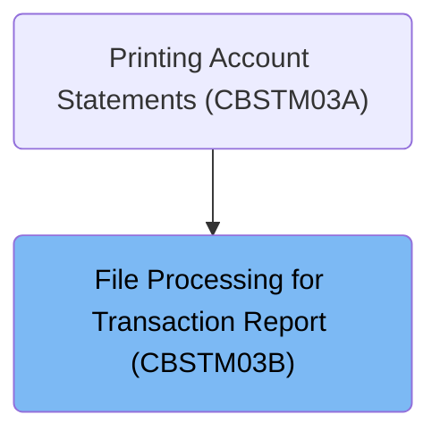

# Overview

This document explains the flow of dispatching and handling file operations for transaction reporting. The system processes requests for transaction, cross-reference, customer, and account files, performing the requested operation and updating the status accordingly.

## Dependencies

### Program

- CBSTM03B (<SwmPath>[app/cbl/CBSTM03B.CBL](app/cbl/CBSTM03B.CBL)</SwmPath>)

# Where is this program used?

This program is used once, as represented in the following diagram:

&nbsp;

*This is an auto-generated document by Swimm 🌊 and has not yet been verified by a human*

<SwmMeta version="3.0.0" repo-id="Z2l0aHViJTNBJTNBU3dpbW1pby1NRi1DcmVkaXRjYXJkLURlbW8xJTNBJTNBR2lyaS1Td2ltbQ==" repo-name="Swimmio-MF-Creditcard-Demo1">Powered by [Swimm](https://app.swimm.io/)</SwmMeta>
