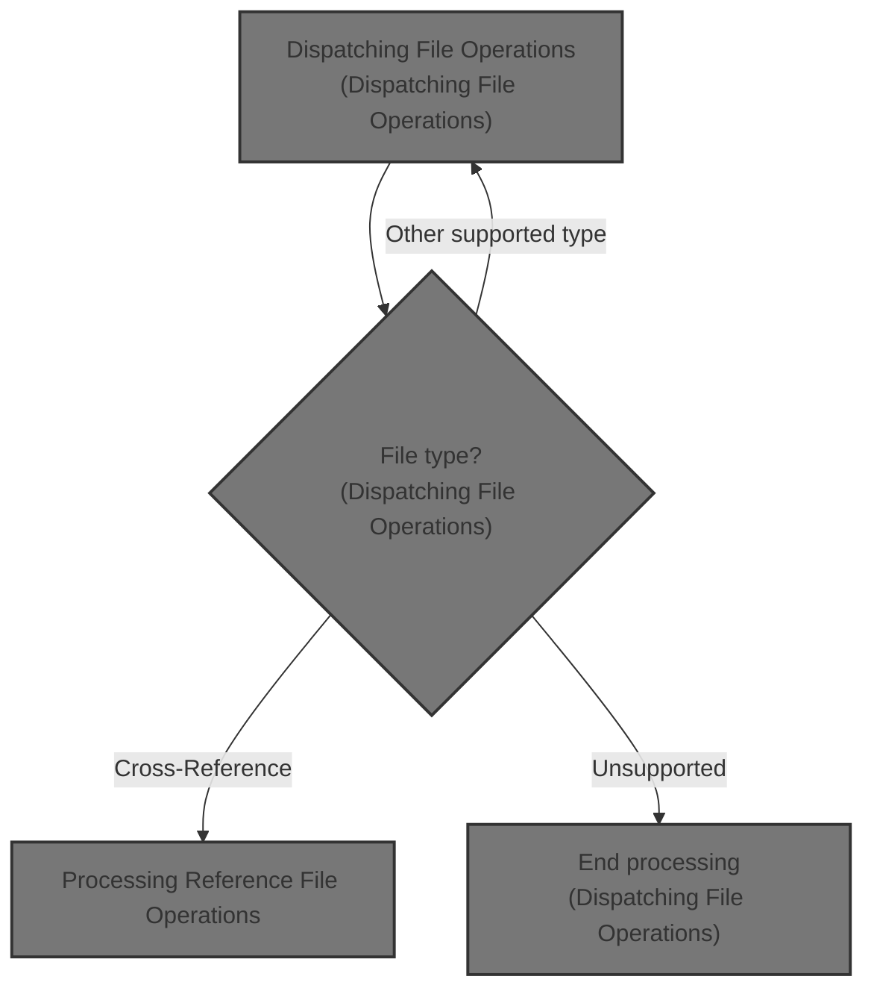
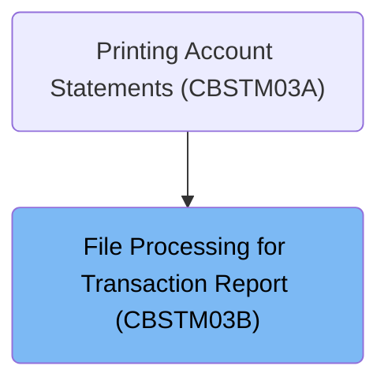
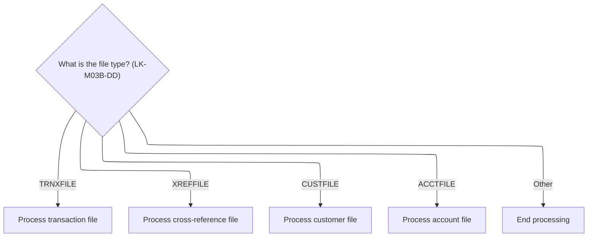
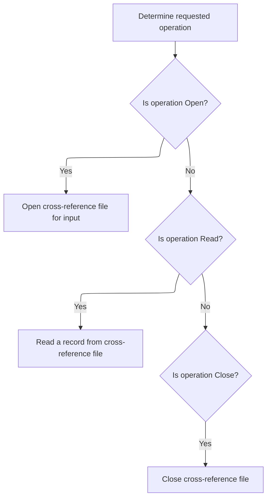

# Overview

This document describes the flow for processing file operations related to transaction reporting. The program determines the file type and routes the request to the appropriate handler, ensuring that only the requested operation is performed and the result is tracked for each request.



## Dependencies

### Program

- <SwmToken path="app/cbl/CBSTM03B.CBL" pos="2:6:6" line-data="       PROGRAM-ID.    CBSTM03B.">`CBSTM03B`</SwmToken> (<SwmPath>[app/cbl/CBSTM03B.CBL](app/cbl/CBSTM03B.CBL)</SwmPath>)

# Where is this program used?

This program is used once, as represented in the following diagram:



## Input and Output Tables/Files used in the Program

| Table / File Name                                                                                                                    | Type | Description                                                   | Usage Mode | Key Fields / Layout Highlights |
| ------------------------------------------------------------------------------------------------------------------------------------ | ---- | ------------------------------------------------------------- | ---------- | ------------------------------ |
| <SwmToken path="app/cbl/CBSTM03B.CBL" pos="49:3:5" line-data="           SELECT ACCT-FILE ASSIGN TO ACCTFILE">`ACCT-FILE`</SwmToken> | IMS  | Account details linked to account IDs for credit cards        | Input      | Hierarchical segment structure |
| <SwmToken path="app/cbl/CBSTM03B.CBL" pos="43:3:5" line-data="           SELECT CUST-FILE ASSIGN TO CUSTFILE">`CUST-FILE`</SwmToken> | IMS  | Customer profile details keyed by customer ID                 | Input      | Hierarchical segment structure |
| <SwmToken path="app/cbl/CBSTM03B.CBL" pos="31:3:5" line-data="           SELECT TRNX-FILE ASSIGN TO TRNXFILE">`TRNX-FILE`</SwmToken> | IMS  | Credit card transaction records with card and transaction IDs | Input      | Hierarchical segment structure |
| <SwmToken path="app/cbl/CBSTM03B.CBL" pos="160:5:7" line-data="               OPEN INPUT XREF-FILE">`XREF-FILE`</SwmToken>           | IMS  | Card number cross-reference mappings for lookups              | Input      | Hierarchical segment structure |

&nbsp;

## Detailed View of the Program's Functionality

# Dispatching File Operations

The program begins by determining which file operation to perform based on a value provided by the caller. This value indicates the type of file to be processed. The possible file types are transaction, cross-reference, customer, and account files. If the value matches one of these types, the program dispatches control to a specific handler routine for that file type. If the value does not match any known type, the program ends processing and returns to the caller.

- If the file type is transaction, the program executes the transaction file handler.
- If the file type is cross-reference, the program executes the cross-reference file handler.
- If the file type is customer, the program executes the customer file handler.
- If the file type is account, the program executes the account file handler.
- For any other file type, the program terminates and returns control.

This dispatching mechanism ensures that only the relevant file handler is executed for the requested operation.

# Processing Reference File Operations

When the cross-reference file handler is invoked, the program determines which specific operation to perform: open, read, or close. This is controlled by a flag provided by the caller.

- If the open flag is set, the program opens the cross-reference file for input and then exits the handler.
- If the read flag is set, the program reads a record from the cross-reference file and stores it in a designated area, then exits the handler.
- If the close flag is set, the program closes the cross-reference file and then exits the handler.

Each operation is isolated and only performed if its corresponding flag is set. After performing the requested operation, the program updates a status field to indicate the result of the operation, allowing the caller to check if it was successful or if an error occurred.

# Status Reporting and Exit

After each file operation (open, read, close), the program moves the status of the file operation into a designated return code field. This allows the caller to determine the outcome of the operation. The program then exits the handler routine, returning control to the caller or to the main dispatching logic.

This structure ensures predictable and controlled file handling, with clear separation between different file types and operations, and explicit status reporting for each action.

# Data Definitions

| Table / Record Name                                                                                                                  | Type | Short Description                                             | Usage Mode |
| ------------------------------------------------------------------------------------------------------------------------------------ | ---- | ------------------------------------------------------------- | ---------- |
| <SwmToken path="app/cbl/CBSTM03B.CBL" pos="49:3:5" line-data="           SELECT ACCT-FILE ASSIGN TO ACCTFILE">`ACCT-FILE`</SwmToken> | IMS  | Account details linked to account IDs for credit cards        | Input      |
| <SwmToken path="app/cbl/CBSTM03B.CBL" pos="43:3:5" line-data="           SELECT CUST-FILE ASSIGN TO CUSTFILE">`CUST-FILE`</SwmToken> | IMS  | Customer profile details keyed by customer ID                 | Input      |
| <SwmToken path="app/cbl/CBSTM03B.CBL" pos="31:3:5" line-data="           SELECT TRNX-FILE ASSIGN TO TRNXFILE">`TRNX-FILE`</SwmToken> | IMS  | Credit card transaction records with card and transaction IDs | Input      |
| <SwmToken path="app/cbl/CBSTM03B.CBL" pos="160:5:7" line-data="               OPEN INPUT XREF-FILE">`XREF-FILE`</SwmToken>           | IMS  | Card number cross-reference mappings for lookups              | Input      |

&nbsp;

# Rule Definition

| Paragraph Name                                                                                                                                                                                                                                                                                                                                                                                                                                                                                                                                                                                                                         | Rule ID | Category          | Description                                                                                                                                                                                                                                                                                                                                                                                                        | Conditions                                                                                                                                                                                                                                                                                                                                                                                          | Remarks                                                                                                                                                                                                                                                              |
| -------------------------------------------------------------------------------------------------------------------------------------------------------------------------------------------------------------------------------------------------------------------------------------------------------------------------------------------------------------------------------------------------------------------------------------------------------------------------------------------------------------------------------------------------------------------------------------------------------------------------------------- | ------- | ----------------- | ------------------------------------------------------------------------------------------------------------------------------------------------------------------------------------------------------------------------------------------------------------------------------------------------------------------------------------------------------------------------------------------------------------------ | --------------------------------------------------------------------------------------------------------------------------------------------------------------------------------------------------------------------------------------------------------------------------------------------------------------------------------------------------------------------------------------------------- | -------------------------------------------------------------------------------------------------------------------------------------------------------------------------------------------------------------------------------------------------------------------- |
| <SwmToken path="app/cbl/CBSTM03B.CBL" pos="116:1:3" line-data="       0000-START.">`0000-START`</SwmToken>                                                                                                                                                                                                                                                                                                                                                                                                                                                                                                                             | RL-001  | Conditional Logic | The program must determine which file operation procedure to execute based on the file type (<SwmToken path="app/cbl/CBSTM03B.CBL" pos="118:3:7" line-data="           EVALUATE LK-M03B-DD">`LK-M03B-DD`</SwmToken>) and operation flag (<SwmToken path="app/cbl/CBSTM03B.CBL" pos="102:3:7" line-data="           05  LK-M03B-OPER        PIC X(01).">`LK-M03B-OPER`</SwmToken>) provided in the input structure. | <SwmToken path="app/cbl/CBSTM03B.CBL" pos="118:3:7" line-data="           EVALUATE LK-M03B-DD">`LK-M03B-DD`</SwmToken> must be one of 'TRNXFILE', 'XREFFILE', 'CUSTFILE', or 'ACCTFILE'. <SwmToken path="app/cbl/CBSTM03B.CBL" pos="102:3:7" line-data="           05  LK-M03B-OPER        PIC X(01).">`LK-M03B-OPER`</SwmToken> must be one of the supported operation codes ('O', 'C', 'R', 'K'). | Supported file types: 'TRNXFILE', 'XREFFILE', 'CUSTFILE', 'ACCTFILE'. Supported operations: 'O' (Open), 'C' (Close), 'R' (Read), 'K' (Read by Key).                                                                                                                  |
| <SwmToken path="app/cbl/CBSTM03B.CBL" pos="120:3:7" line-data="               PERFORM 1000-TRNXFILE-PROC THRU 1999-EXIT">`1000-TRNXFILE-PROC`</SwmToken>, <SwmToken path="app/cbl/CBSTM03B.CBL" pos="122:3:7" line-data="               PERFORM 2000-XREFFILE-PROC THRU 2999-EXIT">`2000-XREFFILE-PROC`</SwmToken>, <SwmToken path="app/cbl/CBSTM03B.CBL" pos="124:3:7" line-data="               PERFORM 3000-CUSTFILE-PROC THRU 3999-EXIT">`3000-CUSTFILE-PROC`</SwmToken>, <SwmToken path="app/cbl/CBSTM03B.CBL" pos="126:3:7" line-data="               PERFORM 4000-ACCTFILE-PROC THRU 4999-EXIT">`4000-ACCTFILE-PROC`</SwmToken> | RL-002  | Conditional Logic | When the operation flag is 'O', the program must open the specified file for input and set the return code to indicate the result.                                                                                                                                                                                                                                                                                 | <SwmToken path="app/cbl/CBSTM03B.CBL" pos="102:3:7" line-data="           05  LK-M03B-OPER        PIC X(01).">`LK-M03B-OPER`</SwmToken> = 'O'. <SwmToken path="app/cbl/CBSTM03B.CBL" pos="118:3:7" line-data="           EVALUATE LK-M03B-DD">`LK-M03B-DD`</SwmToken> specifies the file to open.                                                                                                   | Status codes: '00' (success), '35' (file not found), others as appropriate. The return code field is a 2-character string.                                                                                                                                           |
| <SwmToken path="app/cbl/CBSTM03B.CBL" pos="120:3:7" line-data="               PERFORM 1000-TRNXFILE-PROC THRU 1999-EXIT">`1000-TRNXFILE-PROC`</SwmToken>, <SwmToken path="app/cbl/CBSTM03B.CBL" pos="122:3:7" line-data="               PERFORM 2000-XREFFILE-PROC THRU 2999-EXIT">`2000-XREFFILE-PROC`</SwmToken>                                                                                                                                                                                                                                                                                                                     | RL-003  | Conditional Logic | When the operation flag is 'R', the program must read the next record from the specified file and update the record buffer and return code accordingly.                                                                                                                                                                                                                                                            | <SwmToken path="app/cbl/CBSTM03B.CBL" pos="102:3:7" line-data="           05  LK-M03B-OPER        PIC X(01).">`LK-M03B-OPER`</SwmToken> = 'R'. <SwmToken path="app/cbl/CBSTM03B.CBL" pos="118:3:7" line-data="           EVALUATE LK-M03B-DD">`LK-M03B-DD`</SwmToken> is 'TRNXFILE' or 'XREFFILE'.                                                                                                  | Record lengths: TRNXFILE = 350 bytes, XREFFILE = 50 bytes. On success, the first N bytes of the record buffer are populated; the rest may be padded with spaces or left unchanged. Status codes: '00' (success), '10' (end-of-file), others as appropriate.          |
| <SwmToken path="app/cbl/CBSTM03B.CBL" pos="124:3:7" line-data="               PERFORM 3000-CUSTFILE-PROC THRU 3999-EXIT">`3000-CUSTFILE-PROC`</SwmToken>, <SwmToken path="app/cbl/CBSTM03B.CBL" pos="126:3:7" line-data="               PERFORM 4000-ACCTFILE-PROC THRU 4999-EXIT">`4000-ACCTFILE-PROC`</SwmToken>                                                                                                                                                                                                                                                                                                                     | RL-004  | Conditional Logic | When the operation flag is 'K', the program must perform a keyed read on CUSTFILE or ACCTFILE using the provided key and key length, updating the record buffer and return code.                                                                                                                                                                                                                                   | <SwmToken path="app/cbl/CBSTM03B.CBL" pos="102:3:7" line-data="           05  LK-M03B-OPER        PIC X(01).">`LK-M03B-OPER`</SwmToken> = 'K'. <SwmToken path="app/cbl/CBSTM03B.CBL" pos="118:3:7" line-data="           EVALUATE LK-M03B-DD">`LK-M03B-DD`</SwmToken> is 'CUSTFILE' or 'ACCTFILE'.                                                                                                  | Key lengths: CUSTFILE = 9 bytes, ACCTFILE = 11 bytes. Record lengths: CUSTFILE = 500 bytes, ACCTFILE = 300 bytes. Status codes: '00' (success), '23' (record not found), others as appropriate. The key buffer is used from position 1 for the specified key length. |
| <SwmToken path="app/cbl/CBSTM03B.CBL" pos="120:3:7" line-data="               PERFORM 1000-TRNXFILE-PROC THRU 1999-EXIT">`1000-TRNXFILE-PROC`</SwmToken>, <SwmToken path="app/cbl/CBSTM03B.CBL" pos="122:3:7" line-data="               PERFORM 2000-XREFFILE-PROC THRU 2999-EXIT">`2000-XREFFILE-PROC`</SwmToken>, <SwmToken path="app/cbl/CBSTM03B.CBL" pos="124:3:7" line-data="               PERFORM 3000-CUSTFILE-PROC THRU 3999-EXIT">`3000-CUSTFILE-PROC`</SwmToken>, <SwmToken path="app/cbl/CBSTM03B.CBL" pos="126:3:7" line-data="               PERFORM 4000-ACCTFILE-PROC THRU 4999-EXIT">`4000-ACCTFILE-PROC`</SwmToken> | RL-005  | Conditional Logic | When the operation flag is 'C', the program must close the specified file and set the return code to indicate the result.                                                                                                                                                                                                                                                                                          | <SwmToken path="app/cbl/CBSTM03B.CBL" pos="102:3:7" line-data="           05  LK-M03B-OPER        PIC X(01).">`LK-M03B-OPER`</SwmToken> = 'C'. <SwmToken path="app/cbl/CBSTM03B.CBL" pos="118:3:7" line-data="           EVALUATE LK-M03B-DD">`LK-M03B-DD`</SwmToken> specifies the file to close.                                                                                                  | Status codes: '00' (success), '97' (file not open), others as appropriate. The return code field is a 2-character string.                                                                                                                                            |
| <SwmToken path="app/cbl/CBSTM03B.CBL" pos="137:5:7" line-data="               GO TO 1900-EXIT">`1900-EXIT`</SwmToken>, <SwmToken path="app/cbl/CBSTM03B.CBL" pos="161:5:7" line-data="               GO TO 2900-EXIT">`2900-EXIT`</SwmToken>, <SwmToken path="app/cbl/CBSTM03B.CBL" pos="185:5:7" line-data="               GO TO 3900-EXIT">`3900-EXIT`</SwmToken>, <SwmToken path="app/cbl/CBSTM03B.CBL" pos="210:5:7" line-data="               GO TO 4900-EXIT">`4900-EXIT`</SwmToken>                                                                                                                                             | RL-006  | Data Assignment   | After each file operation, the program must set the return code field in the structure to the file status code resulting from the operation.                                                                                                                                                                                                                                                                       | Any file operation is performed.                                                                                                                                                                                                                                                                                                                                                                    | Status codes: '00', '10', '23', '35', '97', '92', etc. The return code field is a 2-character string.                                                                                                                                                                |
| <SwmToken path="app/cbl/CBSTM03B.CBL" pos="120:3:7" line-data="               PERFORM 1000-TRNXFILE-PROC THRU 1999-EXIT">`1000-TRNXFILE-PROC`</SwmToken>, <SwmToken path="app/cbl/CBSTM03B.CBL" pos="122:3:7" line-data="               PERFORM 2000-XREFFILE-PROC THRU 2999-EXIT">`2000-XREFFILE-PROC`</SwmToken>, <SwmToken path="app/cbl/CBSTM03B.CBL" pos="124:3:7" line-data="               PERFORM 3000-CUSTFILE-PROC THRU 3999-EXIT">`3000-CUSTFILE-PROC`</SwmToken>, <SwmToken path="app/cbl/CBSTM03B.CBL" pos="126:3:7" line-data="               PERFORM 4000-ACCTFILE-PROC THRU 4999-EXIT">`4000-ACCTFILE-PROC`</SwmToken> | RL-007  | Data Assignment   | On successful read operations, the program must place the record data in the first N bytes of the record buffer, where N is the record length for the file type. On error or end-of-file, the buffer must be left unchanged.                                                                                                                                                                                       | A read operation ('R' or 'K') is performed. The file status code indicates success ('00').                                                                                                                                                                                                                                                                                                          | Record lengths: TRNXFILE = 350 bytes, XREFFILE = 50 bytes, CUSTFILE = 500 bytes, ACCTFILE = 300 bytes. The record buffer is 1000 bytes; only the first N bytes are meaningful on success. On error or end-of-file, the buffer is not modified.                       |
| <SwmToken path="app/cbl/CBSTM03B.CBL" pos="124:3:7" line-data="               PERFORM 3000-CUSTFILE-PROC THRU 3999-EXIT">`3000-CUSTFILE-PROC`</SwmToken>, <SwmToken path="app/cbl/CBSTM03B.CBL" pos="126:3:7" line-data="               PERFORM 4000-ACCTFILE-PROC THRU 4999-EXIT">`4000-ACCTFILE-PROC`</SwmToken>                                                                                                                                                                                                                                                                                                                     | RL-008  | Data Assignment   | For keyed read operations, the program must use the first <SwmToken path="app/cbl/CBSTM03B.CBL" pos="111:3:9" line-data="           05  LK-M03B-KEY-LN      PIC S9(4).">`LK-M03B-KEY-LN`</SwmToken> bytes of the key buffer to match the file's key field exactly.                                                                                                                                                 | A keyed read ('K') is performed on CUSTFILE or ACCTFILE.                                                                                                                                                                                                                                                                                                                                            | Key lengths: CUSTFILE = 9 bytes, ACCTFILE = 11 bytes. The key buffer is 25 bytes; only the first N bytes are used, where N is the key length.                                                                                                                        |
| Throughout PROCEDURE DIVISION                                                                                                                                                                                                                                                                                                                                                                                                                                                                                                                                                                                                          | RL-009  | Data Assignment   | The output structure must be the same as the input structure, with only the return code and record buffer fields updated as appropriate by the operation.                                                                                                                                                                                                                                                          | Any operation is performed.                                                                                                                                                                                                                                                                                                                                                                         | The structure includes: file type (8 bytes), operation flag (1 byte), return code (2 bytes), key (25 bytes), key length (4 bytes, signed), record buffer (1000 bytes). Only the return code and record buffer are updated by the program.                            |

# User Stories

## User Story 1: Dispatch file operations and maintain structure integrity

---

### Story Description:

As a system, I want to accept a unified input structure for file operations and dispatch the correct procedure based on file type and operation flag so that users can interact with mainframe files through a consistent interface and receive results in the same structure.

---

### Business Rule Mapping:

| Rule ID | Paragraph Name                                                                                             | Rule Description                                                                                                                                                                                                                                                                                                                                                                                                   |
| ------- | ---------------------------------------------------------------------------------------------------------- | ------------------------------------------------------------------------------------------------------------------------------------------------------------------------------------------------------------------------------------------------------------------------------------------------------------------------------------------------------------------------------------------------------------------ |
| RL-001  | <SwmToken path="app/cbl/CBSTM03B.CBL" pos="116:1:3" line-data="       0000-START.">`0000-START`</SwmToken> | The program must determine which file operation procedure to execute based on the file type (<SwmToken path="app/cbl/CBSTM03B.CBL" pos="118:3:7" line-data="           EVALUATE LK-M03B-DD">`LK-M03B-DD`</SwmToken>) and operation flag (<SwmToken path="app/cbl/CBSTM03B.CBL" pos="102:3:7" line-data="           05  LK-M03B-OPER        PIC X(01).">`LK-M03B-OPER`</SwmToken>) provided in the input structure. |
| RL-009  | Throughout PROCEDURE DIVISION                                                                              | The output structure must be the same as the input structure, with only the return code and record buffer fields updated as appropriate by the operation.                                                                                                                                                                                                                                                          |

---

### Relevant Functionality:

- <SwmToken path="app/cbl/CBSTM03B.CBL" pos="116:1:3" line-data="       0000-START.">`0000-START`</SwmToken>
  1. **RL-001:**
     - Evaluate the file type field in the input structure.
       - If 'TRNXFILE', perform TRNXFILE procedure.
       - If 'XREFFILE', perform XREFFILE procedure.
       - If 'CUSTFILE', perform CUSTFILE procedure.
       - If 'ACCTFILE', perform ACCTFILE procedure.
       - Otherwise, exit without action.
- **Throughout PROCEDURE DIVISION**
  1. **RL-009:**
     - After operation, return the same structure with updated return code and, if applicable, updated record buffer.

## User Story 2: Open mainframe files

---

### Story Description:

As a system, I want to open the specified mainframe file for input and return a status code indicating the result so that users know whether the file is available for further operations.

---

### Business Rule Mapping:

| Rule ID | Paragraph Name                                                                                                                                                                                                                                                                                                                                                                                                                                                                                                                                                                                                                         | Rule Description                                                                                                                             |
| ------- | -------------------------------------------------------------------------------------------------------------------------------------------------------------------------------------------------------------------------------------------------------------------------------------------------------------------------------------------------------------------------------------------------------------------------------------------------------------------------------------------------------------------------------------------------------------------------------------------------------------------------------------- | -------------------------------------------------------------------------------------------------------------------------------------------- |
| RL-002  | <SwmToken path="app/cbl/CBSTM03B.CBL" pos="120:3:7" line-data="               PERFORM 1000-TRNXFILE-PROC THRU 1999-EXIT">`1000-TRNXFILE-PROC`</SwmToken>, <SwmToken path="app/cbl/CBSTM03B.CBL" pos="122:3:7" line-data="               PERFORM 2000-XREFFILE-PROC THRU 2999-EXIT">`2000-XREFFILE-PROC`</SwmToken>, <SwmToken path="app/cbl/CBSTM03B.CBL" pos="124:3:7" line-data="               PERFORM 3000-CUSTFILE-PROC THRU 3999-EXIT">`3000-CUSTFILE-PROC`</SwmToken>, <SwmToken path="app/cbl/CBSTM03B.CBL" pos="126:3:7" line-data="               PERFORM 4000-ACCTFILE-PROC THRU 4999-EXIT">`4000-ACCTFILE-PROC`</SwmToken> | When the operation flag is 'O', the program must open the specified file for input and set the return code to indicate the result.           |
| RL-006  | <SwmToken path="app/cbl/CBSTM03B.CBL" pos="137:5:7" line-data="               GO TO 1900-EXIT">`1900-EXIT`</SwmToken>, <SwmToken path="app/cbl/CBSTM03B.CBL" pos="161:5:7" line-data="               GO TO 2900-EXIT">`2900-EXIT`</SwmToken>, <SwmToken path="app/cbl/CBSTM03B.CBL" pos="185:5:7" line-data="               GO TO 3900-EXIT">`3900-EXIT`</SwmToken>, <SwmToken path="app/cbl/CBSTM03B.CBL" pos="210:5:7" line-data="               GO TO 4900-EXIT">`4900-EXIT`</SwmToken>                                                                                                                                             | After each file operation, the program must set the return code field in the structure to the file status code resulting from the operation. |

---

### Relevant Functionality:

- <SwmToken path="app/cbl/CBSTM03B.CBL" pos="120:3:7" line-data="               PERFORM 1000-TRNXFILE-PROC THRU 1999-EXIT">`1000-TRNXFILE-PROC`</SwmToken>
  1. **RL-002:**
     - If operation is 'O':
       - Open the specified file for input.
       - Move the file status code to the return code field in the structure.
- <SwmToken path="app/cbl/CBSTM03B.CBL" pos="137:5:7" line-data="               GO TO 1900-EXIT">`1900-EXIT`</SwmToken>
  1. **RL-006:**
     - After each operation, move the file status code to the return code field in the structure.

## User Story 3: Read records sequentially from TRNXFILE and XREFFILE

---

### Story Description:

As a system, I want to read the next record from TRNXFILE or XREFFILE and update the record buffer and status code so that users can retrieve sequential data from these files and know the outcome of each read.

---

### Business Rule Mapping:

| Rule ID | Paragraph Name                                                                                                                                                                                                                                                                                                                                                                                                                                                                                                                                                                                                                         | Rule Description                                                                                                                                                                                                             |
| ------- | -------------------------------------------------------------------------------------------------------------------------------------------------------------------------------------------------------------------------------------------------------------------------------------------------------------------------------------------------------------------------------------------------------------------------------------------------------------------------------------------------------------------------------------------------------------------------------------------------------------------------------------- | ---------------------------------------------------------------------------------------------------------------------------------------------------------------------------------------------------------------------------- |
| RL-003  | <SwmToken path="app/cbl/CBSTM03B.CBL" pos="120:3:7" line-data="               PERFORM 1000-TRNXFILE-PROC THRU 1999-EXIT">`1000-TRNXFILE-PROC`</SwmToken>, <SwmToken path="app/cbl/CBSTM03B.CBL" pos="122:3:7" line-data="               PERFORM 2000-XREFFILE-PROC THRU 2999-EXIT">`2000-XREFFILE-PROC`</SwmToken>                                                                                                                                                                                                                                                                                                                     | When the operation flag is 'R', the program must read the next record from the specified file and update the record buffer and return code accordingly.                                                                      |
| RL-007  | <SwmToken path="app/cbl/CBSTM03B.CBL" pos="120:3:7" line-data="               PERFORM 1000-TRNXFILE-PROC THRU 1999-EXIT">`1000-TRNXFILE-PROC`</SwmToken>, <SwmToken path="app/cbl/CBSTM03B.CBL" pos="122:3:7" line-data="               PERFORM 2000-XREFFILE-PROC THRU 2999-EXIT">`2000-XREFFILE-PROC`</SwmToken>, <SwmToken path="app/cbl/CBSTM03B.CBL" pos="124:3:7" line-data="               PERFORM 3000-CUSTFILE-PROC THRU 3999-EXIT">`3000-CUSTFILE-PROC`</SwmToken>, <SwmToken path="app/cbl/CBSTM03B.CBL" pos="126:3:7" line-data="               PERFORM 4000-ACCTFILE-PROC THRU 4999-EXIT">`4000-ACCTFILE-PROC`</SwmToken> | On successful read operations, the program must place the record data in the first N bytes of the record buffer, where N is the record length for the file type. On error or end-of-file, the buffer must be left unchanged. |
| RL-006  | <SwmToken path="app/cbl/CBSTM03B.CBL" pos="137:5:7" line-data="               GO TO 1900-EXIT">`1900-EXIT`</SwmToken>, <SwmToken path="app/cbl/CBSTM03B.CBL" pos="161:5:7" line-data="               GO TO 2900-EXIT">`2900-EXIT`</SwmToken>, <SwmToken path="app/cbl/CBSTM03B.CBL" pos="185:5:7" line-data="               GO TO 3900-EXIT">`3900-EXIT`</SwmToken>, <SwmToken path="app/cbl/CBSTM03B.CBL" pos="210:5:7" line-data="               GO TO 4900-EXIT">`4900-EXIT`</SwmToken>                                                                                                                                             | After each file operation, the program must set the return code field in the structure to the file status code resulting from the operation.                                                                                 |

---

### Relevant Functionality:

- <SwmToken path="app/cbl/CBSTM03B.CBL" pos="120:3:7" line-data="               PERFORM 1000-TRNXFILE-PROC THRU 1999-EXIT">`1000-TRNXFILE-PROC`</SwmToken>
  1. **RL-003:**
     - If operation is 'R' and file type is TRNXFILE or XREFFILE:
       - Read the next record into the record buffer.
       - Move the file status code to the return code field.
       - On success, only the first N bytes of the buffer are meaningful.
  2. **RL-007:**
     - On successful read:
       - Move the record data to the first N bytes of the record buffer.
       - The rest of the buffer may be padded with spaces or left unchanged.
     - On error or end-of-file:
       - Leave the buffer unchanged.
- <SwmToken path="app/cbl/CBSTM03B.CBL" pos="137:5:7" line-data="               GO TO 1900-EXIT">`1900-EXIT`</SwmToken>
  1. **RL-006:**
     - After each operation, move the file status code to the return code field in the structure.

## User Story 4: Read records by key from CUSTFILE and ACCTFILE

---

### Story Description:

As a system, I want to perform keyed reads on CUSTFILE and ACCTFILE using the provided key and key length, updating the record buffer and status code so that users can retrieve specific records efficiently and know if the record was found.

---

### Business Rule Mapping:

| Rule ID | Paragraph Name                                                                                                                                                                                                                                                                                                                                                                                                                                                                                                                                                                                                                         | Rule Description                                                                                                                                                                                                                                                   |
| ------- | -------------------------------------------------------------------------------------------------------------------------------------------------------------------------------------------------------------------------------------------------------------------------------------------------------------------------------------------------------------------------------------------------------------------------------------------------------------------------------------------------------------------------------------------------------------------------------------------------------------------------------------- | ------------------------------------------------------------------------------------------------------------------------------------------------------------------------------------------------------------------------------------------------------------------ |
| RL-004  | <SwmToken path="app/cbl/CBSTM03B.CBL" pos="124:3:7" line-data="               PERFORM 3000-CUSTFILE-PROC THRU 3999-EXIT">`3000-CUSTFILE-PROC`</SwmToken>, <SwmToken path="app/cbl/CBSTM03B.CBL" pos="126:3:7" line-data="               PERFORM 4000-ACCTFILE-PROC THRU 4999-EXIT">`4000-ACCTFILE-PROC`</SwmToken>                                                                                                                                                                                                                                                                                                                     | When the operation flag is 'K', the program must perform a keyed read on CUSTFILE or ACCTFILE using the provided key and key length, updating the record buffer and return code.                                                                                   |
| RL-008  | <SwmToken path="app/cbl/CBSTM03B.CBL" pos="124:3:7" line-data="               PERFORM 3000-CUSTFILE-PROC THRU 3999-EXIT">`3000-CUSTFILE-PROC`</SwmToken>, <SwmToken path="app/cbl/CBSTM03B.CBL" pos="126:3:7" line-data="               PERFORM 4000-ACCTFILE-PROC THRU 4999-EXIT">`4000-ACCTFILE-PROC`</SwmToken>                                                                                                                                                                                                                                                                                                                     | For keyed read operations, the program must use the first <SwmToken path="app/cbl/CBSTM03B.CBL" pos="111:3:9" line-data="           05  LK-M03B-KEY-LN      PIC S9(4).">`LK-M03B-KEY-LN`</SwmToken> bytes of the key buffer to match the file's key field exactly. |
| RL-006  | <SwmToken path="app/cbl/CBSTM03B.CBL" pos="137:5:7" line-data="               GO TO 1900-EXIT">`1900-EXIT`</SwmToken>, <SwmToken path="app/cbl/CBSTM03B.CBL" pos="161:5:7" line-data="               GO TO 2900-EXIT">`2900-EXIT`</SwmToken>, <SwmToken path="app/cbl/CBSTM03B.CBL" pos="185:5:7" line-data="               GO TO 3900-EXIT">`3900-EXIT`</SwmToken>, <SwmToken path="app/cbl/CBSTM03B.CBL" pos="210:5:7" line-data="               GO TO 4900-EXIT">`4900-EXIT`</SwmToken>                                                                                                                                             | After each file operation, the program must set the return code field in the structure to the file status code resulting from the operation.                                                                                                                       |
| RL-007  | <SwmToken path="app/cbl/CBSTM03B.CBL" pos="120:3:7" line-data="               PERFORM 1000-TRNXFILE-PROC THRU 1999-EXIT">`1000-TRNXFILE-PROC`</SwmToken>, <SwmToken path="app/cbl/CBSTM03B.CBL" pos="122:3:7" line-data="               PERFORM 2000-XREFFILE-PROC THRU 2999-EXIT">`2000-XREFFILE-PROC`</SwmToken>, <SwmToken path="app/cbl/CBSTM03B.CBL" pos="124:3:7" line-data="               PERFORM 3000-CUSTFILE-PROC THRU 3999-EXIT">`3000-CUSTFILE-PROC`</SwmToken>, <SwmToken path="app/cbl/CBSTM03B.CBL" pos="126:3:7" line-data="               PERFORM 4000-ACCTFILE-PROC THRU 4999-EXIT">`4000-ACCTFILE-PROC`</SwmToken> | On successful read operations, the program must place the record data in the first N bytes of the record buffer, where N is the record length for the file type. On error or end-of-file, the buffer must be left unchanged.                                       |

---

### Relevant Functionality:

- <SwmToken path="app/cbl/CBSTM03B.CBL" pos="124:3:7" line-data="               PERFORM 3000-CUSTFILE-PROC THRU 3999-EXIT">`3000-CUSTFILE-PROC`</SwmToken>
  1. **RL-004:**
     - If operation is 'K' and file type is CUSTFILE or ACCTFILE:
       - Move the first N bytes of the key buffer (where N is the key length) to the file's key field.
       - Read the record into the record buffer.
       - Move the file status code to the return code field.
       - On success, only the first N bytes of the buffer are meaningful.
  2. **RL-008:**
     - For keyed read:
       - Move the first N bytes of the key buffer (where N is the key length) to the file's key field before reading.
- <SwmToken path="app/cbl/CBSTM03B.CBL" pos="137:5:7" line-data="               GO TO 1900-EXIT">`1900-EXIT`</SwmToken>
  1. **RL-006:**
     - After each operation, move the file status code to the return code field in the structure.
- <SwmToken path="app/cbl/CBSTM03B.CBL" pos="120:3:7" line-data="               PERFORM 1000-TRNXFILE-PROC THRU 1999-EXIT">`1000-TRNXFILE-PROC`</SwmToken>
  1. **RL-007:**
     - On successful read:
       - Move the record data to the first N bytes of the record buffer.
       - The rest of the buffer may be padded with spaces or left unchanged.
     - On error or end-of-file:
       - Leave the buffer unchanged.

## User Story 5: Close mainframe files

---

### Story Description:

As a system, I want to close the specified mainframe file and return a status code indicating the result so that users can properly manage file resources and know if the file was closed successfully.

---

### Business Rule Mapping:

| Rule ID | Paragraph Name                                                                                                                                                                                                                                                                                                                                                                                                                                                                                                                                                                                                                         | Rule Description                                                                                                                             |
| ------- | -------------------------------------------------------------------------------------------------------------------------------------------------------------------------------------------------------------------------------------------------------------------------------------------------------------------------------------------------------------------------------------------------------------------------------------------------------------------------------------------------------------------------------------------------------------------------------------------------------------------------------------- | -------------------------------------------------------------------------------------------------------------------------------------------- |
| RL-005  | <SwmToken path="app/cbl/CBSTM03B.CBL" pos="120:3:7" line-data="               PERFORM 1000-TRNXFILE-PROC THRU 1999-EXIT">`1000-TRNXFILE-PROC`</SwmToken>, <SwmToken path="app/cbl/CBSTM03B.CBL" pos="122:3:7" line-data="               PERFORM 2000-XREFFILE-PROC THRU 2999-EXIT">`2000-XREFFILE-PROC`</SwmToken>, <SwmToken path="app/cbl/CBSTM03B.CBL" pos="124:3:7" line-data="               PERFORM 3000-CUSTFILE-PROC THRU 3999-EXIT">`3000-CUSTFILE-PROC`</SwmToken>, <SwmToken path="app/cbl/CBSTM03B.CBL" pos="126:3:7" line-data="               PERFORM 4000-ACCTFILE-PROC THRU 4999-EXIT">`4000-ACCTFILE-PROC`</SwmToken> | When the operation flag is 'C', the program must close the specified file and set the return code to indicate the result.                    |
| RL-006  | <SwmToken path="app/cbl/CBSTM03B.CBL" pos="137:5:7" line-data="               GO TO 1900-EXIT">`1900-EXIT`</SwmToken>, <SwmToken path="app/cbl/CBSTM03B.CBL" pos="161:5:7" line-data="               GO TO 2900-EXIT">`2900-EXIT`</SwmToken>, <SwmToken path="app/cbl/CBSTM03B.CBL" pos="185:5:7" line-data="               GO TO 3900-EXIT">`3900-EXIT`</SwmToken>, <SwmToken path="app/cbl/CBSTM03B.CBL" pos="210:5:7" line-data="               GO TO 4900-EXIT">`4900-EXIT`</SwmToken>                                                                                                                                             | After each file operation, the program must set the return code field in the structure to the file status code resulting from the operation. |

---

### Relevant Functionality:

- <SwmToken path="app/cbl/CBSTM03B.CBL" pos="120:3:7" line-data="               PERFORM 1000-TRNXFILE-PROC THRU 1999-EXIT">`1000-TRNXFILE-PROC`</SwmToken>
  1. **RL-005:**
     - If operation is 'C':
       - Close the specified file.
       - Move the file status code to the return code field.
- <SwmToken path="app/cbl/CBSTM03B.CBL" pos="137:5:7" line-data="               GO TO 1900-EXIT">`1900-EXIT`</SwmToken>
  1. **RL-006:**
     - After each operation, move the file status code to the return code field in the structure.

# Workflow

# Dispatching File Operations



This section governs the routing of file operations based on the type of file provided. It ensures that each file type is processed by its designated handler, maintaining the integrity and correctness of file operations within the credit card management application.

| Category        | Rule Name                         | Description                                                                                                                                                                    |
| --------------- | --------------------------------- | ------------------------------------------------------------------------------------------------------------------------------------------------------------------------------ |
| Data validation | Unsupported file type termination | If the file type is not one of the supported types ('TRNXFILE', 'XREFFILE', 'CUSTFILE', 'ACCTFILE'), the system must terminate processing and not attempt to process the file. |
| Business logic  | Transaction file dispatch         | If the file type is 'TRNXFILE', the system must process the transaction file using the transaction file handler.                                                               |
| Business logic  | Cross-reference file dispatch     | If the file type is 'XREFFILE', the system must process the cross-reference file using the cross-reference file handler.                                                       |
| Business logic  | Customer file dispatch            | If the file type is 'CUSTFILE', the system must process the customer file using the customer file handler.                                                                     |
| Business logic  | Account file dispatch             | If the file type is 'ACCTFILE', the system must process the account file using the account file handler.                                                                       |

<SwmSnippet path="/app/cbl/CBSTM03B.CBL" line="116">

---

<SwmToken path="app/cbl/CBSTM03B.CBL" pos="116:1:3" line-data="       0000-START.">`0000-START`</SwmToken> checks which file needs work and dispatches to the right handler. If it's the XREF file, it calls <SwmToken path="app/cbl/CBSTM03B.CBL" pos="122:3:7" line-data="               PERFORM 2000-XREFFILE-PROC THRU 2999-EXIT">`2000-XREFFILE-PROC`</SwmToken> to do the job.

```cobol
       0000-START.

           EVALUATE LK-M03B-DD
             WHEN 'TRNXFILE'
               PERFORM 1000-TRNXFILE-PROC THRU 1999-EXIT
             WHEN 'XREFFILE'
               PERFORM 2000-XREFFILE-PROC THRU 2999-EXIT
             WHEN 'CUSTFILE'
               PERFORM 3000-CUSTFILE-PROC THRU 3999-EXIT
             WHEN 'ACCTFILE'
               PERFORM 4000-ACCTFILE-PROC THRU 4999-EXIT
             WHEN OTHER
               GO TO 9999-GOBACK.
```

---

</SwmSnippet>

# Processing Reference File Operations



This section governs how the application manages access to the cross-reference file, ensuring that only the requested operation is performed and that the file status is updated accordingly for the calling process.

| Category        | Rule Name                    | Description                                                                                                                                                                                                                                           |
| --------------- | ---------------------------- | ----------------------------------------------------------------------------------------------------------------------------------------------------------------------------------------------------------------------------------------------------- |
| Data validation | Single operation per request | Only one file operation (Open, Read, or Close) may be performed per request, as determined by the <SwmToken path="app/cbl/CBSTM03B.CBL" pos="102:3:7" line-data="           05  LK-M03B-OPER        PIC X(01).">`LK-M03B-OPER`</SwmToken> flag value. |
| Data validation | Update operation status      | After each file operation, the status field must be updated to indicate the outcome of the operation for the calling process.                                                                                                                         |
| Business logic  | Open file for input          | If the requested operation is 'Open', the cross-reference file must be opened for input and the status updated to reflect the result.                                                                                                                 |
| Business logic  | Read record from file        | If the requested operation is 'Read', a record must be read from the cross-reference file and the status updated to reflect the result.                                                                                                               |
| Business logic  | Close file                   | If the requested operation is 'Close', the cross-reference file must be closed and the status updated to reflect the result.                                                                                                                          |

<SwmSnippet path="/app/cbl/CBSTM03B.CBL" line="157">

---

In <SwmToken path="app/cbl/CBSTM03B.CBL" pos="157:1:5" line-data="       2000-XREFFILE-PROC.">`2000-XREFFILE-PROC`</SwmToken>, the flow checks if <SwmToken path="app/cbl/CBSTM03B.CBL" pos="159:3:5" line-data="           IF M03B-OPEN">`M03B-OPEN`</SwmToken> is set and opens the XREF file for input if so, then jumps to <SwmToken path="app/cbl/CBSTM03B.CBL" pos="161:5:7" line-data="               GO TO 2900-EXIT">`2900-EXIT`</SwmToken>. This uses a flag-based control to make sure only the requested operation runs, keeping file handling predictable.

```cobol
       2000-XREFFILE-PROC.

           IF M03B-OPEN
               OPEN INPUT XREF-FILE
               GO TO 2900-EXIT
           END-IF.
```

---

</SwmSnippet>

<SwmSnippet path="/app/cbl/CBSTM03B.CBL" line="164">

---

Next in <SwmToken path="app/cbl/CBSTM03B.CBL" pos="122:3:7" line-data="               PERFORM 2000-XREFFILE-PROC THRU 2999-EXIT">`2000-XREFFILE-PROC`</SwmToken>, if the read flag is set, it reads a record from the XREF file into <SwmToken path="app/cbl/CBSTM03B.CBL" pos="165:9:13" line-data="               READ XREF-FILE INTO LK-M03B-FLDT">`LK-M03B-FLDT`</SwmToken> and then exits. This follows the same flag-driven logic as the open operation, keeping each file action isolated.

```cobol
           IF M03B-READ
               READ XREF-FILE INTO LK-M03B-FLDT
               END-READ
               GO TO 2900-EXIT
           END-IF.
```

---

</SwmSnippet>

<SwmSnippet path="/app/cbl/CBSTM03B.CBL" line="170">

---

Finally in <SwmToken path="app/cbl/CBSTM03B.CBL" pos="122:3:7" line-data="               PERFORM 2000-XREFFILE-PROC THRU 2999-EXIT">`2000-XREFFILE-PROC`</SwmToken>, if the close flag is set, it closes the XREF file and exits. Every operation here ends by jumping to <SwmToken path="app/cbl/CBSTM03B.CBL" pos="172:5:7" line-data="               GO TO 2900-EXIT">`2900-EXIT`</SwmToken>, which updates the status field so the caller knows what happened.

```cobol
           IF M03B-CLOSE
               CLOSE XREF-FILE
               GO TO 2900-EXIT
           END-IF.
```

---

</SwmSnippet>

&nbsp;

*This is an auto-generated document by Swimm 🌊 and has not yet been verified by a human*

<SwmMeta version="3.0.0" repo-id="Z2l0aHViJTNBJTNBU3dpbW1pby1NRi1DcmVkaXRjYXJkLURlbW8xJTNBJTNBR2lyaS1Td2ltbQ==" repo-name="Swimmio-MF-Creditcard-Demo1"><sup>Powered by [Swimm](https://app.swimm.io/)</sup></SwmMeta>
