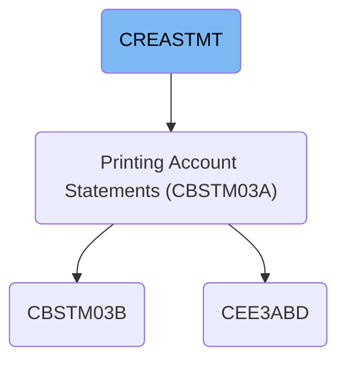
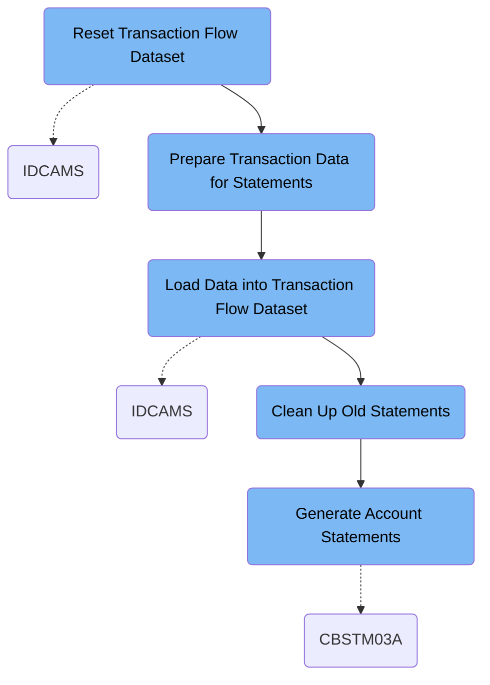

This document explains the CREASTMT job which generates credit card account statements. It processes transaction data by resetting datasets, sorting and loading transactions, cleaning old reports, and producing new statements in text and HTML formats. The job ensures statements accurately reflect recent transactions and account details.

# Dependencies

Here is a high level diagram of the file:

## Reset Transaction Flow Dataset

Step in this section: `DELDEF01`.

Prepares a clean transactional data source by deleting any old transaction flow files and defining a new dataset, which ensures the batch job can accurately process and generate current account statements.

1. The process deletes any previous transaction flow sequential and VSAM datasets that may contain residual data from earlier runs, ensuring removal of outdated records.
2. A new VSAM KSDS cluster is then defined, along with its data and index components, to create an empty, clean structure for upcoming transactional data.
3. As a result, at the end of this section, the transaction flow data is reset, and the system is ready to load current transactions for accurate downstream batch processing and statement generation.

### Input

**AWS.M2.CARDDEMO.TRXFL.SEQ**

Previous sequential transaction flow dataset that may contain outdated or incomplete records.

**AWS.M2.CARDDEMO.TRXFL.VSAM.KSDS**

Previous VSAM transaction flow dataset cluster that holds keyed transaction records from previous cycles.

### Output

**AWS.M2.CARDDEMO.TRXFL.VSAM.KSDS**

Newly defined VSAM KSDS cluster for transaction flow data, now empty and ready for new records for the current processing cycle.

**AWS.M2.CARDDEMO.TRXFL.DATA**

New data component for the transaction flow VSAM dataset ready to store transactional information.

**AWS.M2.CARDDEMO.TRXFL.INDEX**

New index component for the transaction flow VSAM dataset to enable keyed access to transaction records.

## Prepare Transaction Data for Statements

Step in this section: `STEP010`.

This section takes raw transaction data and sorts it by card number and transaction ID, creating a new dataset prepared for credit card statement production.

The section reads unsorted credit card transaction records from the input dataset. It then sorts these transactions first by card number and then by transaction ID, ensuring transactions for each card are grouped and ordered by their identifiers. The sorted and reorganized data is written out as a new sequential dataset, making it ready for downstream batch statement generation.

### Input

**AWS.M2.CARDDEMO.TRANSACT.VSAM.KSDS**

Input transaction data file containing unsorted transaction records.

### Output

**AWS.M2.CARDDEMO.TRXFL.SEQ**

Output sequential dataset of transactions sorted and reorganized by card number and transaction ID, ready for use in statement production.

## Load Data into Transaction Flow Dataset

Step in this section: `STEP020`.

This section copies prepared and sorted transaction data into the main transaction flow dataset so these records can be used for batch credit card statement production.

## Clean Up Old Statements

Step in this section: `STEP030`.

This section ensures that outdated statement report files are deleted so only the results of the current statement production are available for users and downstream processes.

## Generate Account Statements

Step in this section: `STEP040`.

This section uses up-to-date transaction, account, and customer data to produce new credit card statements for each account, available in text and HTML formats for reporting and analysis.

- For each card/account, the process:
  1. Reads all relevant transaction records from the transaction flow file, matching them to accounts via the cross-reference file.
  2. Pulls account and customer data from their respective datasets for statement details and personalization.
  3. Combines transaction, account, and customer information into a statement object.
  4. Formats each statement in text and HTML; writes the text data to the text statement dataset and the HTML data to the HTML statement dataset.

### Input

**AWS.M2.CARDDEMO.TRXFL.VSAM.KSDS (VSAM Transaction Flow File)**

Contains sorted transaction records by card number, serving as the source for statement generation.

**AWS.M2.CARDDEMO.CARDXREF.VSAM.KSDS (Card Cross-Reference File)**

Links card numbers to account numbers and facilitates correct data matching for statements.

**AWS.M2.CARDDEMO.ACCTDATA.VSAM.KSDS (Account Data File)**

Includes credit card account details used to populate account statement headers and summary.

**AWS.M2.CARDDEMO.CUSTDATA.VSAM.KSDS (Customer Data File)**

Provides customer information needed for personalization and identification on statements.

### Output

[**AWS.M2.CARDDEMO.STATEMNT.PS**](http://AWS.M2.CARDDEMO.STATEMNT.PS)\*\* (Text Statement Report Dataset)\*\*

Holds newly generated account statements in a structured text format for batch reporting and archival.

**AWS.M2.CARDDEMO.STATEMNT.HTML (HTML Statement Report Dataset)**

Contains the same statements as STMTFILE, formatted as HTML documents for online delivery and integration.

&nbsp;

*This is an auto-generated document by Swimm 🌊 and has not yet been verified by a human*

<SwmMeta version="3.0.0" repo-id="Z2l0aHViJTNBJTNBU3dpbW1pby1NRi1DcmVkaXRjYXJkLURlbW8xJTNBJTNBR2lyaS1Td2ltbQ==" repo-name="Swimmio-MF-Creditcard-Demo1">Powered by [Swimm](https://app.swimm.io/)</SwmMeta>
