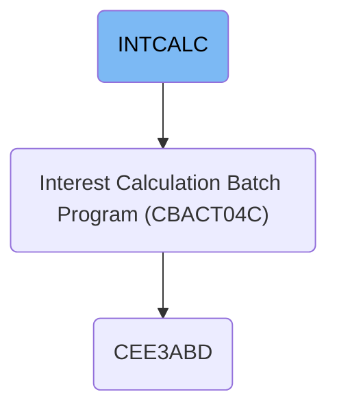

This document explains the INTCALC batch job that calculates interest and fees for credit card accounts. It processes transaction balances and account data, applies business rules, and generates transaction records to post charges for billing cycles. For example, it reads cardholder balances, computes charges, and outputs transaction entries for account updates.

# Dependencies

## Interest and Fee Calculation

Step in this section: `STEP15`.

This section computes interest and fees for each credit card account, using transaction and account data, and produces new transaction entries reflecting these charges.

1. Read each transaction balance for cardholders from the transaction balance dataset.
2. For each balance, retrieve the associated account details from the account master file, along with related cross-reference information and discount/group eligibility.
3. Apply business rules (rate, discount, minimums/maximums) derived from the discount group data to compute the interest and any applicable fees for the cycle.
4. Update the in-memory representation of the account's balance reflecting these calculated charges.
5. Generate new transaction records to represent interest and fee postings and write them to the transaction output file for later batch updates to account records.

### Input

**TCATBALF - AWS.M2.CARDDEMO.TCATBALF.VSAM.KSDS**

Transaction category balances for all cardholders, used as source for interest/fee computation.

**XREFFILE - AWS.M2.CARDDEMO.CARDXREF.VSAM.KSDS**

Cross-reference data to retrieve card/account links or attributes.

**XREFFIL1 - AWS.M2.CARDDEMO.CARDXREF.VSAM.AIX.PATH**

Alternate index for cross-reference lookups.

**ACCTFILE - AWS.M2.CARDDEMO.ACCTDATA.VSAM.KSDS**

Credit card account master data including parameters used for interest calculation.

**DISCGRP - AWS.M2.CARDDEMO.DISCGRP.VSAM.KSDS**

Discount and group data that may influence interest or fees applied to given accounts.

### Output

**TRANSACT - AWS.M2.CARDDEMO.SYSTRAN(+1)**

Newly generated transaction records posting interest and fees to each account.

&nbsp;

*This is an auto-generated document by Swimm 🌊 and has not yet been verified by a human*

<SwmMeta version="3.0.0" repo-id="Z2l0aHViJTNBJTNBU3dpbW1pby1NRi1DcmVkaXRjYXJkLURlbW8xJTNBJTNBR2lyaS1Td2ltbQ==" repo-name="Swimmio-MF-Creditcard-Demo1">Powered by [Swimm](https://app.swimm.io/)</SwmMeta>
