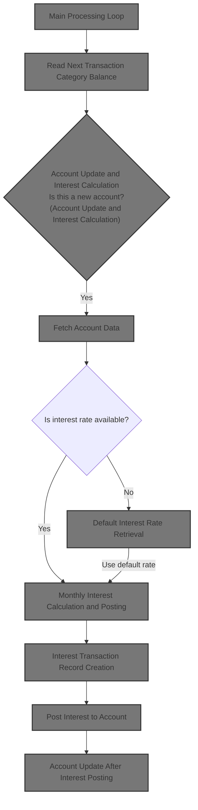
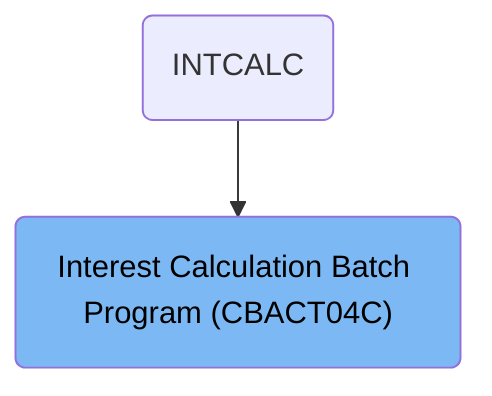

# Overview

This document describes the flow for calculating and posting monthly interest to credit card accounts. The process reads transaction balances, determines account changes, fetches account and rate data, calculates interest, updates balances, and records transactions for each account.

## Dependencies

### Programs

- CBACT04C (<SwmPath>[app/cbl/CBACT04C.cbl](app/cbl/CBACT04C.cbl)</SwmPath>)
- CEE3ABD

### Copybooks

- CVTRA01Y (<SwmPath>[app/cpy/CVTRA01Y.cpy](app/cpy/CVTRA01Y.cpy)</SwmPath>)
- CVACT03Y (<SwmPath>[app/cpy/CVACT03Y.cpy](app/cpy/CVACT03Y.cpy)</SwmPath>)
- CVTRA02Y (<SwmPath>[app/cpy/CVTRA02Y.cpy](app/cpy/CVTRA02Y.cpy)</SwmPath>)
- CVACT01Y (<SwmPath>[app/cpy/CVACT01Y.cpy](app/cpy/CVACT01Y.cpy)</SwmPath>)
- CVTRA05Y (<SwmPath>[app/cpy/CVTRA05Y.cpy](app/cpy/CVTRA05Y.cpy)</SwmPath>)

# Where is this program used?

This program is used once, as represented in the following diagram:

&nbsp;

*This is an auto-generated document by Swimm 🌊 and has not yet been verified by a human*

<SwmMeta version="3.0.0" repo-id="Z2l0aHViJTNBJTNBU3dpbW1pby1NRi1DcmVkaXRjYXJkLURlbW8xJTNBJTNBR2lyaS1Td2ltbQ==" repo-name="Swimmio-MF-Creditcard-Demo1">Powered by [Swimm](https://app.swimm.io/)</SwmMeta>
