# Overview

This document describes the flow for calculating and posting monthly interest to credit card accounts. For each transaction category balance, the system determines the correct interest rate, calculates the interest, updates the account balance, and records the interest as a transaction.

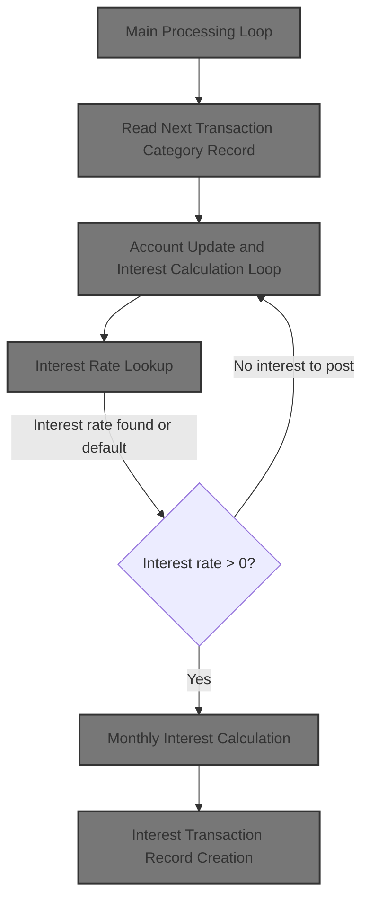

## Dependencies

### Programs

- <SwmToken path="app/cbl/CBACT04C.cbl" pos="181:14:14" line-data="           DISPLAY &#39;START OF EXECUTION OF PROGRAM CBACT04C&#39;.                    ">`CBACT04C`</SwmToken> (<SwmPath>[app/cbl/CBACT04C.cbl](app/cbl/CBACT04C.cbl)</SwmPath>)
- <SwmToken path="app/cbl/CBACT04C.cbl" pos="632:4:4" line-data="           CALL &#39;CEE3ABD&#39; USING ABCODE, TIMING.                                 ">`CEE3ABD`</SwmToken>

### Copybooks

- <SwmToken path="app/cbl/CBACT04C.cbl" pos="97:3:3" line-data="       COPY CVTRA01Y.                                                           ">`CVTRA01Y`</SwmToken> (<SwmPath>[app/cpy/CVTRA01Y.cpy](app/cpy/CVTRA01Y.cpy)</SwmPath>)
- <SwmToken path="app/cbl/CBACT04C.cbl" pos="102:3:3" line-data="       COPY CVACT03Y.                                                           ">`CVACT03Y`</SwmToken> (<SwmPath>[app/cpy/CVACT03Y.cpy](app/cpy/CVACT03Y.cpy)</SwmPath>)
- <SwmToken path="app/cbl/CBACT04C.cbl" pos="107:3:3" line-data="       COPY CVTRA02Y.                                                           ">`CVTRA02Y`</SwmToken> (<SwmPath>[app/cpy/CVTRA02Y.cpy](app/cpy/CVTRA02Y.cpy)</SwmPath>)
- <SwmToken path="app/cbl/CBACT04C.cbl" pos="112:3:3" line-data="       COPY CVACT01Y.                                                           ">`CVACT01Y`</SwmToken> (<SwmPath>[app/cpy/CVACT01Y.cpy](app/cpy/CVACT01Y.cpy)</SwmPath>)
- <SwmToken path="app/cbl/CBACT04C.cbl" pos="117:3:3" line-data="       COPY CVTRA05Y.                                                           ">`CVTRA05Y`</SwmToken> (<SwmPath>[app/cpy/CVTRA05Y.cpy](app/cpy/CVTRA05Y.cpy)</SwmPath>)

# Where is this program used?

This program is used once, as represented in the following diagram:

```mermaid
graph TD
  e5iod("INTCALC") --> 5ore9("Interest Calculation Batch Program (CBACT04C)"):::currentEntity
click e5iod openCode "app/jcl/INTCALC.jcl:1"
  
  
click 5ore9 openCode "app/cbl/CBACT04C.cbl:1"
    classDef currentEntity color:#000000,fill:#7CB9F4

%% Swimm:
%% graph TD
%%   e5iod("INTCALC") --> 5ore9("Interest Calculation Batch Program (<SwmToken path="app/cbl/CBACT04C.cbl" pos="181:14:14" line-data="           DISPLAY &#39;START OF EXECUTION OF PROGRAM CBACT04C&#39;.                    ">`CBACT04C`</SwmToken>)"):::currentEntity
%% click e5iod openCode "<SwmPath>[app/jcl/INTCALC.jcl](app/jcl/INTCALC.jcl)</SwmPath>:1"
%%   
%%   
%% click 5ore9 openCode "<SwmPath>[app/cbl/CBACT04C.cbl](app/cbl/CBACT04C.cbl)</SwmPath>:1"
%%     classDef currentEntity color:#000000,fill:#7CB9F4
```

## Input and Output Tables/Files used in the Program

| Table / File Name                                                                                                                                                             | Type | Description                                | Usage Mode   | Key Fields / Layout Highlights |
| ----------------------------------------------------------------------------------------------------------------------------------------------------------------------------- | ---- | ------------------------------------------ | ------------ | ------------------------------ |
| <SwmToken path="app/cbl/CBACT04C.cbl" pos="291:7:9" line-data="           OPEN I-O ACCOUNT-FILE                                                ">`ACCOUNT-FILE`</SwmToken>    | File | Credit card account master details         | Input/Output | File resource                  |
| <SwmToken path="app/cbl/CBACT04C.cbl" pos="272:5:7" line-data="           OPEN INPUT DISCGRP-FILE                                              ">`DISCGRP-FILE`</SwmToken>    | File | Disclosure group interest rates            | Input        | File resource                  |
| <SwmToken path="app/cbl/CBACT04C.cbl" pos="356:3:7" line-data="           REWRITE FD-ACCTFILE-REC FROM  ACCOUNT-RECORD                         ">`FD-ACCTFILE-REC`</SwmToken> | File | Account record for update operations       | Output       | File resource                  |
| <SwmToken path="app/cbl/CBACT04C.cbl" pos="500:3:7" line-data="           WRITE FD-TRANFILE-REC FROM TRAN-RECORD                               ">`FD-TRANFILE-REC`</SwmToken> | File | Individual transaction record for output   | Output       | File resource                  |
| <SwmToken path="app/cbl/CBACT04C.cbl" pos="236:5:7" line-data="           OPEN INPUT TCATBAL-FILE                                              ">`TCATBAL-FILE`</SwmToken>    | File | Account transaction category balances      | Input        | File resource                  |
| <SwmToken path="app/cbl/CBACT04C.cbl" pos="309:5:7" line-data="           OPEN OUTPUT TRANSACT-FILE                                            ">`TRANSACT-FILE`</SwmToken>   | File | Generated transaction records for interest | Output       | File resource                  |
| <SwmToken path="app/cbl/CBACT04C.cbl" pos="254:5:7" line-data="           OPEN INPUT XREF-FILE                                                 ">`XREF-FILE`</SwmToken>       | File | Card-to-account cross-reference mapping    | Input        | File resource                  |

&nbsp;

## Detailed View of the Program's Functionality

# Detailed Explanation of the Code Flow in <SwmPath>[app/cbl/CBACT04C.cbl](app/cbl/CBACT04C.cbl)</SwmPath>

## A. Program Overview and Structure

This program is a batch interest calculator for a mainframe credit card system. It processes transaction category balances, calculates monthly interest for each account, and writes interest transactions. The program is structured as a classic COBOL batch job, with explicit file handling, error checking, and a main processing loop.

---

## B. File Definitions and Setup

**File Assignments and Organization**

- The program defines five main files:
  1. Transaction Category Balance file (drives the batch process, sequential access)
  2. Card Cross-Reference file (random access, for card/account lookups)
  3. Account Master file (random access, for updating balances)
  4. Disclosure Group file (random access, for interest rate lookup)
  5. Transaction file (sequential output, for writing new transactions)

Each file has a status field for error handling.

---

## C. Program Startup and File Opening

**Startup Sequence**

- The program begins by displaying a startup message.
- It then opens each required file in a specific order:
  1. Transaction Category Balance file (input)
  2. Cross-Reference file (input)
  3. Disclosure Group file (input)
  4. Account file (input-output, for updates)
  5. Transaction file (output, for new records)

**Error Handling**

- After each file open, the program checks the file status.
- If a file fails to open, it displays an error message, formats and displays the file status, and then terminates the program immediately.

---

## D. Main Processing Loop

**Loop Structure**

- The program enters a loop that continues until the end-of-file flag is set.
- In each iteration:
  - It reads the next transaction category balance record.
  - If the read is successful, it increments a record counter and displays the record.
  - If the read fails due to end-of-file, it sets the flag to exit the loop.
  - If the read fails for any other reason, it displays an error and terminates.

---

## E. Per-Record Processing

**Account Change Detection**

- For each transaction category balance record:
  - The program checks if the account ID has changed compared to the last processed record.
  - If this is a new account (and not the very first record), it writes out the updated data for the previous account.
  - It then resets the running total for interest, updates the last account number, and loads the new account and cross-reference data.

**Account and Cross-Reference Data Loading**

- The program reads the account master record for the current account ID.
- It also reads the cross-reference record for the current account ID.
- If either read fails, it displays an error and terminates.

---

## F. Interest Rate Lookup

**Disclosure Group Lookup**

- The program prepares keys and attempts to read the disclosure group record, which contains the interest rate.
- If the record is found, it proceeds.
- If the record is missing (special status code), it tries to read a default group record instead.
- If the default group record is also missing, it displays an error and terminates.

---

## G. Interest Calculation and Transaction Creation

**Interest Calculation**

- If a valid interest rate is found, the program calculates the monthly interest:
  - The formula is: (balance \* interest rate) / 1200
  - The result is added to the running total for the account.

**Interest Transaction Creation**

- The program creates a new transaction record for the calculated interest:
  - It generates a unique transaction ID using the processing date and a running suffix.
  - It sets the transaction type, category, source, description, amount, and card number.
  - It generates a DB2-format timestamp for the transaction.
  - It writes the transaction record to the transaction file.
- If the write fails, it displays an error and terminates.

---

## H. Account Update After Interest

**Posting Interest**

- When the account changes or at the end of processing, the program posts the accumulated interest to the account balance.
- It resets the current cycle's credit and debit amounts to zero.
- It writes the updated account record back to the account file.
- If the write fails, it displays an error and terminates.

---

## I. File Closure and Program Termination

**Orderly Shutdown**

- After processing all records, the program closes all files in the reverse order they were opened.
- For each file, it checks the close status.
- If any close fails, it displays an error and terminates.

**Final Message**

- The program displays an end-of-execution message and exits.

---

## J. Error Handling Routines

**Consistent Error Reporting**

- For any file operation error, the program:
  - Displays a descriptive error message.
  - Formats and displays the file status code in a consistent way.
  - Calls a system abend routine to terminate the program with a recognizable code.

---

## K. Timestamp Generation

<SwmToken path="app/cbl/CBACT04C.cbl" pos="496:7:7" line-data="           PERFORM Z-GET-DB2-FORMAT-TIMESTAMP                                   ">`DB2`</SwmToken> **Timestamp Formatting**

- The program includes a routine to generate a DB2-compatible timestamp from the current date and time.
- This timestamp is used for transaction records.

---

## L. Unimplemented Features

**Fee Calculation Placeholder**

- There is a placeholder for a fee calculation routine, but it is not implemented.

---

## M. Summary

**Overall Flow**

1. Open all required files, aborting on any error.
2. Loop through each transaction category balance record:
   - Detect account changes, update previous account if needed.
   - Load account and cross-reference data.
   - Lookup interest rate (with fallback to default).
   - Calculate and accumulate interest.
   - Write interest transaction.
3. After all records, update the last account.
4. Close all files, aborting on any error.
5. Display start and end messages for traceability.

**Key Points**

- The program is highly defensive: any file error results in immediate termination.
- All file operations are checked and logged.
- The main logic is driven by the transaction category balance file.
- Interest is calculated and posted per account, with transactions written for audit.
- The code is modular, with clear separation of file handling, processing, and error routines.

# Rule Definition

| Paragraph Name                                                                                                                                                                                                                                                                                                                                                                                                                                                                                                                                                                                                                                                                                                                                                                                                                                                                                                               | Rule ID | Category          | Description                                                                                                                                                                                                                                        | Conditions                                                                                                                                                                                                               | Remarks                                                                                                                                                                                                                                           |
| ---------------------------------------------------------------------------------------------------------------------------------------------------------------------------------------------------------------------------------------------------------------------------------------------------------------------------------------------------------------------------------------------------------------------------------------------------------------------------------------------------------------------------------------------------------------------------------------------------------------------------------------------------------------------------------------------------------------------------------------------------------------------------------------------------------------------------------------------------------------------------------------------------------------------------- | ------- | ----------------- | -------------------------------------------------------------------------------------------------------------------------------------------------------------------------------------------------------------------------------------------------- | ------------------------------------------------------------------------------------------------------------------------------------------------------------------------------------------------------------------------ | ------------------------------------------------------------------------------------------------------------------------------------------------------------------------------------------------------------------------------------------------- |
| <SwmToken path="app/cbl/CBACT04C.cbl" pos="182:3:7" line-data="           PERFORM 0000-TCATBALF-OPEN.                                          ">`0000-TCATBALF-OPEN`</SwmToken>, <SwmToken path="app/cbl/CBACT04C.cbl" pos="183:3:7" line-data="           PERFORM 0100-XREFFILE-OPEN.                                          ">`0100-XREFFILE-OPEN`</SwmToken>, <SwmToken path="app/cbl/CBACT04C.cbl" pos="184:3:7" line-data="           PERFORM 0200-DISCGRP-OPEN.                                           ">`0200-DISCGRP-OPEN`</SwmToken>, <SwmToken path="app/cbl/CBACT04C.cbl" pos="185:3:7" line-data="           PERFORM 0300-ACCTFILE-OPEN.                                          ">`0300-ACCTFILE-OPEN`</SwmToken>, <SwmToken path="app/cbl/CBACT04C.cbl" pos="186:3:7" line-data="           PERFORM 0400-TRANFILE-OPEN.                                          ">`0400-TRANFILE-OPEN`</SwmToken>      | RL-001  | Conditional Logic | All required files must be opened in a specific sequence before processing begins. If any file fails to open, the program must halt further processing and terminate.                                                                              | Program start; each file open operation must return a success status ('00').                                                                                                                                             | File status '00' indicates success; any other status triggers program termination. No processing occurs if any file fails to open.                                                                                                                |
| PROCEDURE DIVISION main loop (PERFORM UNTIL <SwmToken path="app/cbl/CBACT04C.cbl" pos="188:5:9" line-data="           PERFORM UNTIL END-OF-FILE = &#39;Y&#39;                                      ">`END-OF-FILE`</SwmToken> = 'Y'), <SwmToken path="app/cbl/CBACT04C.cbl" pos="190:3:9" line-data="                   PERFORM 1000-TCATBALF-GET-NEXT                               ">`1000-TCATBALF-GET-NEXT`</SwmToken>                                                                                                                                                                                                                                                                                                                                                                                                                                                                                                   | RL-002  | Conditional Logic | Iterate over each record in the Transaction Category Balance File until end-of-file is reached, processing each record according to business logic.                                                                                                | File successfully opened; <SwmToken path="app/cbl/CBACT04C.cbl" pos="188:5:9" line-data="           PERFORM UNTIL END-OF-FILE = &#39;Y&#39;                                      ">`END-OF-FILE`</SwmToken> flag is 'N'. | Records are read sequentially; end-of-file is detected by file status '10'.                                                                                                                                                                       |
| PROCEDURE DIVISION main loop, <SwmToken path="app/cbl/CBACT04C.cbl" pos="196:3:7" line-data="                          PERFORM 1050-UPDATE-ACCOUNT                           ">`1050-UPDATE-ACCOUNT`</SwmToken>                                                                                                                                                                                                                                                                                                                                                                                                                                                                                                                                                                                                                                                                                                              | RL-003  | Conditional Logic | Detect when the account ID changes between records. When a new account is encountered (and not the first record), update the previous account's data, post accumulated interest, and reset cycle counters.                                         | Current record's account ID differs from last processed account ID; not the first record.                                                                                                                                | Account data is updated by adding accumulated interest to the account balance and resetting cycle credit/debit to zero.                                                                                                                           |
| <SwmToken path="app/cbl/CBACT04C.cbl" pos="213:3:9" line-data="                     PERFORM 1200-GET-INTEREST-RATE                             ">`1200-GET-INTEREST-RATE`</SwmToken>, <SwmToken path="app/cbl/CBACT04C.cbl" pos="438:3:13" line-data="               PERFORM 1200-A-GET-DEFAULT-INT-RATE                              ">`1200-A-GET-DEFAULT-INT-RATE`</SwmToken>                                                                                                                                                                                                                                                                                                                                                                                                                                                                                                                                             | RL-004  | Conditional Logic | For each transaction category record, look up the interest rate using account group ID, transaction type code, and transaction category code. If not found, attempt to retrieve the default interest rate using 'DEFAULT' as the account group ID. | Interest rate lookup fails (file status '23' or interest rate is zero).                                                                                                                                                  | Interest rate field is packed decimal, offset 0, length 4. If not found, skip interest calculation for this record.                                                                                                                               |
| <SwmToken path="app/cbl/CBACT04C.cbl" pos="215:3:7" line-data="                       PERFORM 1300-COMPUTE-INTEREST                            ">`1300-COMPUTE-INTEREST`</SwmToken>                                                                                                                                                                                                                                                                                                                                                                                                                                                                                                                                                                                                                                                                                                                                          | RL-005  | Computation       | Calculate monthly interest for the transaction category using the formula: Monthly Interest = (Transaction Category Balance \* Interest Rate) / 1200.                                                                                              | Interest rate found and not zero.                                                                                                                                                                                        | Transaction Category Balance is packed decimal, offset 0, length 6; Interest Rate is packed decimal, offset 0, length 4. Result is a numeric value with two decimal places.                                                                       |
| <SwmToken path="app/cbl/CBACT04C.cbl" pos="468:3:9" line-data="           PERFORM 1300-B-WRITE-TX.                                             ">`1300-B-WRITE-TX`</SwmToken>                                                                                                                                                                                                                                                                                                                                                                                                                                                                                                                                                                                                                                                                                                                                                | RL-006  | Data Assignment   | Create a transaction record in the Transaction File for the calculated interest, including all required fields and formatting.                                                                                                                     | Monthly interest calculated for a transaction category.                                                                                                                                                                  | Transaction ID: unique, 16 characters; Account ID: 11 digits; Card number: 16 characters; Transaction type, category, source, description, amount, timestamps as per transaction file layout. All fields packed at specified offsets and lengths. |
| PROCEDURE DIVISION main loop (PERFORM UNTIL <SwmToken path="app/cbl/CBACT04C.cbl" pos="188:5:9" line-data="           PERFORM UNTIL END-OF-FILE = &#39;Y&#39;                                      ">`END-OF-FILE`</SwmToken> = 'Y'), <SwmToken path="app/cbl/CBACT04C.cbl" pos="196:3:7" line-data="                          PERFORM 1050-UPDATE-ACCOUNT                           ">`1050-UPDATE-ACCOUNT`</SwmToken>                                                                                                                                                                                                                                                                                                                                                                                                                                                                                                      | RL-007  | Conditional Logic | After all records are processed, update the last account's data with the accumulated interest and reset cycle credit and debit.                                                                                                                    | End-of-file reached after processing all records.                                                                                                                                                                        | Same update logic as for account change: add accumulated interest, reset cycle counters.                                                                                                                                                          |
| <SwmToken path="app/cbl/CBACT04C.cbl" pos="224:3:7" line-data="           PERFORM 9000-TCATBALF-CLOSE.                                         ">`9000-TCATBALF-CLOSE`</SwmToken>, <SwmToken path="app/cbl/CBACT04C.cbl" pos="225:3:7" line-data="           PERFORM 9100-XREFFILE-CLOSE.                                         ">`9100-XREFFILE-CLOSE`</SwmToken>, <SwmToken path="app/cbl/CBACT04C.cbl" pos="226:3:7" line-data="           PERFORM 9200-DISCGRP-CLOSE.                                          ">`9200-DISCGRP-CLOSE`</SwmToken>, <SwmToken path="app/cbl/CBACT04C.cbl" pos="227:3:7" line-data="           PERFORM 9300-ACCTFILE-CLOSE.                                         ">`9300-ACCTFILE-CLOSE`</SwmToken>, <SwmToken path="app/cbl/CBACT04C.cbl" pos="228:3:7" line-data="           PERFORM 9400-TRANFILE-CLOSE.                                         ">`9400-TRANFILE-CLOSE`</SwmToken> | RL-008  | Conditional Logic | All files must be closed in the reverse order of opening. If any file fails to close, the program must halt and terminate.                                                                                                                         | End of processing; each file close operation must return a success status ('00').                                                                                                                                        | File status '00' indicates success; any other status triggers program termination.                                                                                                                                                                |
| Throughout record extraction and assignment (see <SwmToken path="app/cbl/CBACT04C.cbl" pos="67:3:11" line-data="           05 FD-FD-TRAN-CAT-DATA               PIC X(33).                      ">`FD-FD-TRAN-CAT-DATA`</SwmToken>, <SwmToken path="app/cbl/CBACT04C.cbl" pos="82:3:7" line-data="           05 FD-DISCGRP-DATA                   PIC X(34).                      ">`FD-DISCGRP-DATA`</SwmToken>, etc.)                                                                                                                                                                                                                                                                                                                                                                                                                                                                                                      | RL-009  | Data Assignment   | All packed decimal fields must be read and written at the specified offsets and lengths within the packed string fields.                                                                                                                           | Whenever reading or writing packed decimal fields.                                                                                                                                                                       | Transaction Category Balance: offset 0, length 6; Interest Rate: offset 0, length 4. All packed fields must be handled according to their specified offsets and lengths.                                                                          |

# User Stories

## User Story 1: File lifecycle management and error handling

---

### Story Description:

As a system, I want to open all required files in sequence at startup and close them in reverse order at shutdown, halting processing if any file operation fails so that data integrity and process reliability are maintained.

---

### Business Rule Mapping:

| Rule ID | Paragraph Name                                                                                                                                                                                                                                                                                                                                                                                                                                                                                                                                                                                                                                                                                                                                                                                                                                                                                                               | Rule Description                                                                                                                                                      |
| ------- | ---------------------------------------------------------------------------------------------------------------------------------------------------------------------------------------------------------------------------------------------------------------------------------------------------------------------------------------------------------------------------------------------------------------------------------------------------------------------------------------------------------------------------------------------------------------------------------------------------------------------------------------------------------------------------------------------------------------------------------------------------------------------------------------------------------------------------------------------------------------------------------------------------------------------------- | --------------------------------------------------------------------------------------------------------------------------------------------------------------------- |
| RL-001  | <SwmToken path="app/cbl/CBACT04C.cbl" pos="182:3:7" line-data="           PERFORM 0000-TCATBALF-OPEN.                                          ">`0000-TCATBALF-OPEN`</SwmToken>, <SwmToken path="app/cbl/CBACT04C.cbl" pos="183:3:7" line-data="           PERFORM 0100-XREFFILE-OPEN.                                          ">`0100-XREFFILE-OPEN`</SwmToken>, <SwmToken path="app/cbl/CBACT04C.cbl" pos="184:3:7" line-data="           PERFORM 0200-DISCGRP-OPEN.                                           ">`0200-DISCGRP-OPEN`</SwmToken>, <SwmToken path="app/cbl/CBACT04C.cbl" pos="185:3:7" line-data="           PERFORM 0300-ACCTFILE-OPEN.                                          ">`0300-ACCTFILE-OPEN`</SwmToken>, <SwmToken path="app/cbl/CBACT04C.cbl" pos="186:3:7" line-data="           PERFORM 0400-TRANFILE-OPEN.                                          ">`0400-TRANFILE-OPEN`</SwmToken>      | All required files must be opened in a specific sequence before processing begins. If any file fails to open, the program must halt further processing and terminate. |
| RL-008  | <SwmToken path="app/cbl/CBACT04C.cbl" pos="224:3:7" line-data="           PERFORM 9000-TCATBALF-CLOSE.                                         ">`9000-TCATBALF-CLOSE`</SwmToken>, <SwmToken path="app/cbl/CBACT04C.cbl" pos="225:3:7" line-data="           PERFORM 9100-XREFFILE-CLOSE.                                         ">`9100-XREFFILE-CLOSE`</SwmToken>, <SwmToken path="app/cbl/CBACT04C.cbl" pos="226:3:7" line-data="           PERFORM 9200-DISCGRP-CLOSE.                                          ">`9200-DISCGRP-CLOSE`</SwmToken>, <SwmToken path="app/cbl/CBACT04C.cbl" pos="227:3:7" line-data="           PERFORM 9300-ACCTFILE-CLOSE.                                         ">`9300-ACCTFILE-CLOSE`</SwmToken>, <SwmToken path="app/cbl/CBACT04C.cbl" pos="228:3:7" line-data="           PERFORM 9400-TRANFILE-CLOSE.                                         ">`9400-TRANFILE-CLOSE`</SwmToken> | All files must be closed in the reverse order of opening. If any file fails to close, the program must halt and terminate.                                            |
| RL-009  | Throughout record extraction and assignment (see <SwmToken path="app/cbl/CBACT04C.cbl" pos="67:3:11" line-data="           05 FD-FD-TRAN-CAT-DATA               PIC X(33).                      ">`FD-FD-TRAN-CAT-DATA`</SwmToken>, <SwmToken path="app/cbl/CBACT04C.cbl" pos="82:3:7" line-data="           05 FD-DISCGRP-DATA                   PIC X(34).                      ">`FD-DISCGRP-DATA`</SwmToken>, etc.)                                                                                                                                                                                                                                                                                                                                                                                                                                                                                                      | All packed decimal fields must be read and written at the specified offsets and lengths within the packed string fields.                                              |

---

### Relevant Functionality:

- <SwmToken path="app/cbl/CBACT04C.cbl" pos="182:3:7" line-data="           PERFORM 0000-TCATBALF-OPEN.                                          ">`0000-TCATBALF-OPEN`</SwmToken>
  1. **RL-001:**
     - For each file in the required sequence:
       - Attempt to open the file.
       - If open status is not '00', display error, terminate program.
       - If open status is '00', continue to next file.
- <SwmToken path="app/cbl/CBACT04C.cbl" pos="224:3:7" line-data="           PERFORM 9000-TCATBALF-CLOSE.                                         ">`9000-TCATBALF-CLOSE`</SwmToken>
  1. **RL-008:**
     - For each file in reverse order:
       - Attempt to close the file.
       - If close status is not '00', display error, terminate program.
       - If close status is '00', continue to next file.
- **Throughout record extraction and assignment (see** <SwmToken path="app/cbl/CBACT04C.cbl" pos="67:3:11" line-data="           05 FD-FD-TRAN-CAT-DATA               PIC X(33).                      ">`FD-FD-TRAN-CAT-DATA`</SwmToken>
  1. **RL-009:**
     - When extracting packed decimal fields:
       - Read bytes at specified offset and length from packed string field.
     - When writing packed decimal fields:
       - Write bytes at specified offset and length into packed string field.

## User Story 2: Transaction Category Balance record processing and account update

---

### Story Description:

As a system, I want to iterate over each Transaction Category Balance record, detect when the account ID changes, update the previous account's data with accumulated interest, and reset cycle counters so that account balances and transaction cycles are accurately maintained.

---

### Business Rule Mapping:

| Rule ID | Paragraph Name                                                                                                                                                                                                                                                                                                                                                                                                             | Rule Description                                                                                                                                                                                           |
| ------- | -------------------------------------------------------------------------------------------------------------------------------------------------------------------------------------------------------------------------------------------------------------------------------------------------------------------------------------------------------------------------------------------------------------------------- | ---------------------------------------------------------------------------------------------------------------------------------------------------------------------------------------------------------- |
| RL-002  | PROCEDURE DIVISION main loop (PERFORM UNTIL <SwmToken path="app/cbl/CBACT04C.cbl" pos="188:5:9" line-data="           PERFORM UNTIL END-OF-FILE = &#39;Y&#39;                                      ">`END-OF-FILE`</SwmToken> = 'Y'), <SwmToken path="app/cbl/CBACT04C.cbl" pos="190:3:9" line-data="                   PERFORM 1000-TCATBALF-GET-NEXT                               ">`1000-TCATBALF-GET-NEXT`</SwmToken> | Iterate over each record in the Transaction Category Balance File until end-of-file is reached, processing each record according to business logic.                                                        |
| RL-007  | PROCEDURE DIVISION main loop (PERFORM UNTIL <SwmToken path="app/cbl/CBACT04C.cbl" pos="188:5:9" line-data="           PERFORM UNTIL END-OF-FILE = &#39;Y&#39;                                      ">`END-OF-FILE`</SwmToken> = 'Y'), <SwmToken path="app/cbl/CBACT04C.cbl" pos="196:3:7" line-data="                          PERFORM 1050-UPDATE-ACCOUNT                           ">`1050-UPDATE-ACCOUNT`</SwmToken>    | After all records are processed, update the last account's data with the accumulated interest and reset cycle credit and debit.                                                                            |
| RL-003  | PROCEDURE DIVISION main loop, <SwmToken path="app/cbl/CBACT04C.cbl" pos="196:3:7" line-data="                          PERFORM 1050-UPDATE-ACCOUNT                           ">`1050-UPDATE-ACCOUNT`</SwmToken>                                                                                                                                                                                                            | Detect when the account ID changes between records. When a new account is encountered (and not the first record), update the previous account's data, post accumulated interest, and reset cycle counters. |
| RL-009  | Throughout record extraction and assignment (see <SwmToken path="app/cbl/CBACT04C.cbl" pos="67:3:11" line-data="           05 FD-FD-TRAN-CAT-DATA               PIC X(33).                      ">`FD-FD-TRAN-CAT-DATA`</SwmToken>, <SwmToken path="app/cbl/CBACT04C.cbl" pos="82:3:7" line-data="           05 FD-DISCGRP-DATA                   PIC X(34).                      ">`FD-DISCGRP-DATA`</SwmToken>, etc.)    | All packed decimal fields must be read and written at the specified offsets and lengths within the packed string fields.                                                                                   |

---

### Relevant Functionality:

- **PROCEDURE DIVISION main loop (PERFORM UNTIL** <SwmToken path="app/cbl/CBACT04C.cbl" pos="188:5:9" line-data="           PERFORM UNTIL END-OF-FILE = &#39;Y&#39;                                      ">`END-OF-FILE`</SwmToken> **= 'Y')**
  1. **RL-002:**
     - While <SwmToken path="app/cbl/CBACT04C.cbl" pos="188:5:9" line-data="           PERFORM UNTIL END-OF-FILE = &#39;Y&#39;                                      ">`END-OF-FILE`</SwmToken> is 'N':
       - Read next record from Transaction Category Balance File.
       - If end-of-file detected, set <SwmToken path="app/cbl/CBACT04C.cbl" pos="188:5:9" line-data="           PERFORM UNTIL END-OF-FILE = &#39;Y&#39;                                      ">`END-OF-FILE`</SwmToken> to 'Y'.
       - Otherwise, process the record.
  2. **RL-007:**
     - After processing all records:
       - Add accumulated interest to last account's balance.
       - Reset cycle credit and debit to zero.
       - Write updated account data.
- **PROCEDURE DIVISION main loop**
  1. **RL-003:**
     - If current account ID != last account ID:
       - If not first record:
         - Add accumulated interest to account balance.
         - Reset cycle credit and debit to zero.
         - Write updated account data.
       - Reset interest accumulator for new account.
       - Load new account and cross-reference data.
- **Throughout record extraction and assignment (see** <SwmToken path="app/cbl/CBACT04C.cbl" pos="67:3:11" line-data="           05 FD-FD-TRAN-CAT-DATA               PIC X(33).                      ">`FD-FD-TRAN-CAT-DATA`</SwmToken>
  1. **RL-009:**
     - When extracting packed decimal fields:
       - Read bytes at specified offset and length from packed string field.
     - When writing packed decimal fields:
       - Write bytes at specified offset and length into packed string field.

## User Story 3: Interest calculation and transaction creation

---

### Story Description:

As a system, I want to look up the interest rate for each transaction category, calculate monthly interest, and create a transaction record for the calculated interest so that interest accruals are correctly posted and recorded for each account.

---

### Business Rule Mapping:

| Rule ID | Paragraph Name                                                                                                                                                                                                                                                                                                                                                                                                          | Rule Description                                                                                                                                                                                                                                   |
| ------- | ----------------------------------------------------------------------------------------------------------------------------------------------------------------------------------------------------------------------------------------------------------------------------------------------------------------------------------------------------------------------------------------------------------------------- | -------------------------------------------------------------------------------------------------------------------------------------------------------------------------------------------------------------------------------------------------- |
| RL-004  | <SwmToken path="app/cbl/CBACT04C.cbl" pos="213:3:9" line-data="                     PERFORM 1200-GET-INTEREST-RATE                             ">`1200-GET-INTEREST-RATE`</SwmToken>, <SwmToken path="app/cbl/CBACT04C.cbl" pos="438:3:13" line-data="               PERFORM 1200-A-GET-DEFAULT-INT-RATE                              ">`1200-A-GET-DEFAULT-INT-RATE`</SwmToken>                                        | For each transaction category record, look up the interest rate using account group ID, transaction type code, and transaction category code. If not found, attempt to retrieve the default interest rate using 'DEFAULT' as the account group ID. |
| RL-005  | <SwmToken path="app/cbl/CBACT04C.cbl" pos="215:3:7" line-data="                       PERFORM 1300-COMPUTE-INTEREST                            ">`1300-COMPUTE-INTEREST`</SwmToken>                                                                                                                                                                                                                                     | Calculate monthly interest for the transaction category using the formula: Monthly Interest = (Transaction Category Balance \* Interest Rate) / 1200.                                                                                              |
| RL-006  | <SwmToken path="app/cbl/CBACT04C.cbl" pos="468:3:9" line-data="           PERFORM 1300-B-WRITE-TX.                                             ">`1300-B-WRITE-TX`</SwmToken>                                                                                                                                                                                                                                           | Create a transaction record in the Transaction File for the calculated interest, including all required fields and formatting.                                                                                                                     |
| RL-009  | Throughout record extraction and assignment (see <SwmToken path="app/cbl/CBACT04C.cbl" pos="67:3:11" line-data="           05 FD-FD-TRAN-CAT-DATA               PIC X(33).                      ">`FD-FD-TRAN-CAT-DATA`</SwmToken>, <SwmToken path="app/cbl/CBACT04C.cbl" pos="82:3:7" line-data="           05 FD-DISCGRP-DATA                   PIC X(34).                      ">`FD-DISCGRP-DATA`</SwmToken>, etc.) | All packed decimal fields must be read and written at the specified offsets and lengths within the packed string fields.                                                                                                                           |

---

### Relevant Functionality:

- <SwmToken path="app/cbl/CBACT04C.cbl" pos="213:3:9" line-data="                     PERFORM 1200-GET-INTEREST-RATE                             ">`1200-GET-INTEREST-RATE`</SwmToken>
  1. **RL-004:**
     - Attempt to read interest rate using account group ID, transaction type code, and category code.
     - If not found (file status '23'), set account group ID to 'DEFAULT' and retry.
     - If still not found, skip interest calculation.
- <SwmToken path="app/cbl/CBACT04C.cbl" pos="215:3:7" line-data="                       PERFORM 1300-COMPUTE-INTEREST                            ">`1300-COMPUTE-INTEREST`</SwmToken>
  1. **RL-005:**
     - If interest rate is found and not zero:
       - Monthly Interest = (Transaction Category Balance \* Interest Rate) / 1200
       - Add monthly interest to running total interest for the account.
- <SwmToken path="app/cbl/CBACT04C.cbl" pos="468:3:9" line-data="           PERFORM 1300-B-WRITE-TX.                                             ">`1300-B-WRITE-TX`</SwmToken>
  1. **RL-006:**
     - Generate unique transaction ID (concatenate date and incrementing suffix).
     - Assign account ID, card number, transaction type, category, source, description, amount, timestamps.
     - Pack all transaction details into output record as per layout.
     - Write transaction record to Transaction File.
- **Throughout record extraction and assignment (see** <SwmToken path="app/cbl/CBACT04C.cbl" pos="67:3:11" line-data="           05 FD-FD-TRAN-CAT-DATA               PIC X(33).                      ">`FD-FD-TRAN-CAT-DATA`</SwmToken>
  1. **RL-009:**
     - When extracting packed decimal fields:
       - Read bytes at specified offset and length from packed string field.
     - When writing packed decimal fields:
       - Write bytes at specified offset and length into packed string field.

# Workflow

# Startup and File Initialization

```mermaid
%%{init: {"flowchart": {"defaultRenderer": "elk"}} }%%
flowchart TD
  node1["Start: Begin monthly interest calculation process"]
  click node1 openCode "app/cbl/CBACT04C.cbl:180:186"
  node1 --> node2["Transaction Category File Open and Error Handling"]
  
  node2 --> node3["Cross-Reference File Open and Error Handling"]
  
  node3 --> node4["Disclosure Group File Open and Error Handling"]
  
  node4 --> node5["Account File Open and Error Handling"]
  
  node5 --> node6["Transaction File Open and Error Handling"]
  

  subgraph loop1["For each transaction category balance record"]
    node6 --> node7{"Are there more records? (END-OF-FILE = 'N')"}
    click node7 openCode "app/cbl/CBACT04C.cbl:188:190"
    node7 -->|"Yes"| node8["Read Next Transaction Category Record"]
    
    node8 --> node9["Increment record count and display record"]
    click node9 openCode "app/cbl/CBACT04C.cbl:192:193"
    node9 --> node10{"Is this a new account? (TRANCAT-ACCT-ID NOT= WS-LAST-ACCT-NUM)"}
    click node10 openCode "app/cbl/CBACT04C.cbl:194:206"
    node10 -->|"Yes"| node11{"Is this the first account? (WS-FIRST-TIME = 'Y')"}
    click node11 openCode "app/cbl/CBACT04C.cbl:195:199"
    node11 -->|"No"| node12["Write Updated Account Data"]
    
    node11 -->|"Yes"| node13["Mark first account processed"]
    click node13 openCode "app/cbl/CBACT04C.cbl:198:199"
    node12 --> node14["Reset total interest, update account tracking"]
    click node14 openCode "app/cbl/CBACT04C.cbl:200:202"
    node13 --> node14
    node14 --> node15["Load Account Data"]
    
    node15 --> node16["Load Cross-Reference Data"]
    
    node16 --> node17["Interest Rate Lookup"]
    
    node17 --> node18{"Is interest rate found? (DIS-INT-RATE NOT = 0)"}
    click node18 openCode "app/cbl/CBACT04C.cbl:214:217"
    node18 -->|"Yes"| node19["Monthly Interest Calculation"]
    
    node19 --> node20["Interest Transaction Record Creation"]
    
    node20 --> node7
    node18 -->|"No"| node21["Default Interest Rate Fallback"]
    
    node21 --> node22{"Is default interest rate found? (DIS-INT-RATE NOT = 0)"}
    click node22 openCode "app/cbl/CBACT04C.cbl:214:217"
    node22 -->|"Yes"| node19
    node22 -->|"No"| node7
    node10 -->|"No"| node7
  end

  node7 -->|"No"| node23["Update last account"]
  click node23 openCode "app/cbl/CBACT04C.cbl:350:371"
  node23 --> node24["Close all files and end process"]
  click node24 openCode "app/cbl/CBACT04C.cbl:224:232"
classDef HeadingStyle fill:#777777,stroke:#333,stroke-width:2px;
click node2 goToHeading "Transaction Category File Open and Error Handling"
node2:::HeadingStyle
click node3 goToHeading "Cross-Reference File Open and Error Handling"
node3:::HeadingStyle
click node4 goToHeading "Disclosure Group File Open and Error Handling"
node4:::HeadingStyle
click node5 goToHeading "Account File Open and Error Handling"
node5:::HeadingStyle
click node6 goToHeading "Transaction File Open and Error Handling"
node6:::HeadingStyle
click node8 goToHeading "Read Next Transaction Category Record"
node8:::HeadingStyle
click node12 goToHeading "Write Updated Account Data"
node12:::HeadingStyle
click node15 goToHeading "Load Account Data"
node15:::HeadingStyle
click node16 goToHeading "Load Cross-Reference Data"
node16:::HeadingStyle
click node17 goToHeading "Interest Rate Lookup"
node17:::HeadingStyle
click node21 goToHeading "Default Interest Rate Fallback"
node21:::HeadingStyle
click node19 goToHeading "Monthly Interest Calculation"
node19:::HeadingStyle
click node20 goToHeading "Interest Transaction Record Creation"
node20:::HeadingStyle

%% Swimm:
%% %%{init: {"flowchart": {"defaultRenderer": "elk"}} }%%
%% flowchart TD
%%   node1["Start: Begin monthly interest calculation process"]
%%   click node1 openCode "<SwmPath>[app/cbl/CBACT04C.cbl](app/cbl/CBACT04C.cbl)</SwmPath>:180:186"
%%   node1 --> node2["Transaction Category File Open and Error Handling"]
%%   
%%   node2 --> node3["Cross-Reference File Open and Error Handling"]
%%   
%%   node3 --> node4["Disclosure Group File Open and Error Handling"]
%%   
%%   node4 --> node5["Account File Open and Error Handling"]
%%   
%%   node5 --> node6["Transaction File Open and Error Handling"]
%%   
%% 
%%   subgraph loop1["For each transaction category balance record"]
%%     node6 --> node7{"Are there more records? (<SwmToken path="app/cbl/CBACT04C.cbl" pos="188:5:9" line-data="           PERFORM UNTIL END-OF-FILE = &#39;Y&#39;                                      ">`END-OF-FILE`</SwmToken> = 'N')"}
%%     click node7 openCode "<SwmPath>[app/cbl/CBACT04C.cbl](app/cbl/CBACT04C.cbl)</SwmPath>:188:190"
%%     node7 -->|"Yes"| node8["Read Next Transaction Category Record"]
%%     
%%     node8 --> node9["Increment record count and display record"]
%%     click node9 openCode "<SwmPath>[app/cbl/CBACT04C.cbl](app/cbl/CBACT04C.cbl)</SwmPath>:192:193"
%%     node9 --> node10{"Is this a new account? (<SwmToken path="app/cbl/CBACT04C.cbl" pos="194:3:7" line-data="                     IF TRANCAT-ACCT-ID NOT= WS-LAST-ACCT-NUM                   ">`TRANCAT-ACCT-ID`</SwmToken> NOT= <SwmToken path="app/cbl/CBACT04C.cbl" pos="194:12:18" line-data="                     IF TRANCAT-ACCT-ID NOT= WS-LAST-ACCT-NUM                   ">`WS-LAST-ACCT-NUM`</SwmToken>)"}
%%     click node10 openCode "<SwmPath>[app/cbl/CBACT04C.cbl](app/cbl/CBACT04C.cbl)</SwmPath>:194:206"
%%     node10 -->|"Yes"| node11{"Is this the first account? (<SwmToken path="app/cbl/CBACT04C.cbl" pos="195:3:7" line-data="                       IF WS-FIRST-TIME NOT = &#39;Y&#39;                               ">`WS-FIRST-TIME`</SwmToken> = 'Y')"}
%%     click node11 openCode "<SwmPath>[app/cbl/CBACT04C.cbl](app/cbl/CBACT04C.cbl)</SwmPath>:195:199"
%%     node11 -->|"No"| node12["Write Updated Account Data"]
%%     
%%     node11 -->|"Yes"| node13["Mark first account processed"]
%%     click node13 openCode "<SwmPath>[app/cbl/CBACT04C.cbl](app/cbl/CBACT04C.cbl)</SwmPath>:198:199"
%%     node12 --> node14["Reset total interest, update account tracking"]
%%     click node14 openCode "<SwmPath>[app/cbl/CBACT04C.cbl](app/cbl/CBACT04C.cbl)</SwmPath>:200:202"
%%     node13 --> node14
%%     node14 --> node15["Load Account Data"]
%%     
%%     node15 --> node16["Load Cross-Reference Data"]
%%     
%%     node16 --> node17["Interest Rate Lookup"]
%%     
%%     node17 --> node18{"Is interest rate found? (<SwmToken path="app/cbl/CBACT04C.cbl" pos="214:3:7" line-data="                     IF DIS-INT-RATE NOT = 0                                    ">`DIS-INT-RATE`</SwmToken> NOT = 0)"}
%%     click node18 openCode "<SwmPath>[app/cbl/CBACT04C.cbl](app/cbl/CBACT04C.cbl)</SwmPath>:214:217"
%%     node18 -->|"Yes"| node19["Monthly Interest Calculation"]
%%     
%%     node19 --> node20["Interest Transaction Record Creation"]
%%     
%%     node20 --> node7
%%     node18 -->|"No"| node21["Default Interest Rate Fallback"]
%%     
%%     node21 --> node22{"Is default interest rate found? (<SwmToken path="app/cbl/CBACT04C.cbl" pos="214:3:7" line-data="                     IF DIS-INT-RATE NOT = 0                                    ">`DIS-INT-RATE`</SwmToken> NOT = 0)"}
%%     click node22 openCode "<SwmPath>[app/cbl/CBACT04C.cbl](app/cbl/CBACT04C.cbl)</SwmPath>:214:217"
%%     node22 -->|"Yes"| node19
%%     node22 -->|"No"| node7
%%     node10 -->|"No"| node7
%%   end
%% 
%%   node7 -->|"No"| node23["Update last account"]
%%   click node23 openCode "<SwmPath>[app/cbl/CBACT04C.cbl](app/cbl/CBACT04C.cbl)</SwmPath>:350:371"
%%   node23 --> node24["Close all files and end process"]
%%   click node24 openCode "<SwmPath>[app/cbl/CBACT04C.cbl](app/cbl/CBACT04C.cbl)</SwmPath>:224:232"
%% classDef HeadingStyle fill:#777777,stroke:#333,stroke-width:2px;
%% click node2 goToHeading "Transaction Category File Open and Error Handling"
%% node2:::HeadingStyle
%% click node3 goToHeading "Cross-Reference File Open and Error Handling"
%% node3:::HeadingStyle
%% click node4 goToHeading "Disclosure Group File Open and Error Handling"
%% node4:::HeadingStyle
%% click node5 goToHeading "Account File Open and Error Handling"
%% node5:::HeadingStyle
%% click node6 goToHeading "Transaction File Open and Error Handling"
%% node6:::HeadingStyle
%% click node8 goToHeading "Read Next Transaction Category Record"
%% node8:::HeadingStyle
%% click node12 goToHeading "Write Updated Account Data"
%% node12:::HeadingStyle
%% click node15 goToHeading "Load Account Data"
%% node15:::HeadingStyle
%% click node16 goToHeading "Load Cross-Reference Data"
%% node16:::HeadingStyle
%% click node17 goToHeading "Interest Rate Lookup"
%% node17:::HeadingStyle
%% click node21 goToHeading "Default Interest Rate Fallback"
%% node21:::HeadingStyle
%% click node19 goToHeading "Monthly Interest Calculation"
%% node19:::HeadingStyle
%% click node20 goToHeading "Interest Transaction Record Creation"
%% node20:::HeadingStyle
```

This section ensures that all required data files are available and accessible before the monthly interest calculation process begins. It validates file readiness and handles errors to prevent incomplete or inaccurate processing.

<SwmSnippet path="/app/cbl/CBACT04C.cbl" line="180">

---

In <SwmToken path="app/cbl/CBACT04C.cbl" pos="180:1:3" line-data="       PROCEDURE DIVISION USING EXTERNAL-PARMS.                                 ">`PROCEDURE DIVISION`</SwmToken>, the program starts up and opens all the files it needs, starting with the transaction category balance file, since that's the main driver for the batch process.

```cobol
       PROCEDURE DIVISION USING EXTERNAL-PARMS.                                 
           DISPLAY 'START OF EXECUTION OF PROGRAM CBACT04C'.                    
           PERFORM 0000-TCATBALF-OPEN.                                          
           PERFORM 0100-XREFFILE-OPEN.                                          
           PERFORM 0200-DISCGRP-OPEN.                                           
           PERFORM 0300-ACCTFILE-OPEN.                                          
           PERFORM 0400-TRANFILE-OPEN.                                          
```

---

</SwmSnippet>

## Transaction Category File Open and Error Handling

```mermaid
%%{init: {"flowchart": {"defaultRenderer": "elk"}} }%%
flowchart TD
    node1["Attempt to open Transaction Category Balance file"] --> node2{"Was file opened successfully? (TCATBALF-STATUS = '00')"}
    click node1 openCode "app/cbl/CBACT04C.cbl:234:236"
    click node2 openCode "app/cbl/CBACT04C.cbl:237:241"
    node2 -->|"Yes"| node3["Continue processing"]
    click node3 openCode "app/cbl/CBACT04C.cbl:242:243"
    node2 -->|"No"| node4["Display error message"]
    click node4 openCode "app/cbl/CBACT04C.cbl:245:246"
    node4 --> node5["Show IO status"]
    click node5 openCode "app/cbl/CBACT04C.cbl:635:648"
    node5 --> node6["Halt program"]
    click node6 openCode "app/cbl/CBACT04C.cbl:628:632"

classDef HeadingStyle fill:#777777,stroke:#333,stroke-width:2px;

%% Swimm:
%% %%{init: {"flowchart": {"defaultRenderer": "elk"}} }%%
%% flowchart TD
%%     node1["Attempt to open Transaction Category Balance file"] --> node2{"Was file opened successfully? (<SwmToken path="app/cbl/CBACT04C.cbl" pos="237:3:5" line-data="           IF  TCATBALF-STATUS = &#39;00&#39;                                           ">`TCATBALF-STATUS`</SwmToken> = '00')"}
%%     click node1 openCode "<SwmPath>[app/cbl/CBACT04C.cbl](app/cbl/CBACT04C.cbl)</SwmPath>:234:236"
%%     click node2 openCode "<SwmPath>[app/cbl/CBACT04C.cbl](app/cbl/CBACT04C.cbl)</SwmPath>:237:241"
%%     node2 -->|"Yes"| node3["Continue processing"]
%%     click node3 openCode "<SwmPath>[app/cbl/CBACT04C.cbl](app/cbl/CBACT04C.cbl)</SwmPath>:242:243"
%%     node2 -->|"No"| node4["Display error message"]
%%     click node4 openCode "<SwmPath>[app/cbl/CBACT04C.cbl](app/cbl/CBACT04C.cbl)</SwmPath>:245:246"
%%     node4 --> node5["Show IO status"]
%%     click node5 openCode "<SwmPath>[app/cbl/CBACT04C.cbl](app/cbl/CBACT04C.cbl)</SwmPath>:635:648"
%%     node5 --> node6["Halt program"]
%%     click node6 openCode "<SwmPath>[app/cbl/CBACT04C.cbl](app/cbl/CBACT04C.cbl)</SwmPath>:628:632"
%% 
%% classDef HeadingStyle fill:#777777,stroke:#333,stroke-width:2px;
```

This section governs the rules for opening the Transaction Category Balance file and handling any errors that occur during this process. It ensures that file access issues are detected early, reported clearly, and that the program does not continue in an invalid state.

| Category       | Rule Name                        | Description                                                                                                       |
| -------------- | -------------------------------- | ----------------------------------------------------------------------------------------------------------------- |
| Business logic | Continue on successful file open | If the Transaction Category Balance file is opened successfully, the system must continue with normal processing. |

<SwmSnippet path="/app/cbl/CBACT04C.cbl" line="234">

---

In <SwmToken path="app/cbl/CBACT04C.cbl" pos="234:1:5" line-data="       0000-TCATBALF-OPEN.                                                      ">`0000-TCATBALF-OPEN`</SwmToken>, the code tries to open the transaction category balance file for reading. It sets a default result code, attempts the open, and then checks the status. If the open works, it marks success; otherwise, it flags an error for later handling.

```cobol
       0000-TCATBALF-OPEN.                                                      
           MOVE 8 TO APPL-RESULT.                                               
           OPEN INPUT TCATBAL-FILE                                              
           IF  TCATBALF-STATUS = '00'                                           
               MOVE 0 TO APPL-RESULT                                            
           ELSE                                                                 
               MOVE 12 TO APPL-RESULT                                           
           END-IF                                                               
```

---

</SwmSnippet>

<SwmSnippet path="/app/cbl/CBACT04C.cbl" line="242">

---

If the file open fails, the code displays an error, formats and shows the IO status, and then aborts. The display routine makes the error output consistent.

```cobol
           IF  APPL-AOK                                                         
               CONTINUE                                                         
           ELSE                                                                 
               DISPLAY 'ERROR OPENING TRANSACTION CATEGORY BALANCE'             
               MOVE TCATBALF-STATUS TO IO-STATUS                                
               PERFORM 9910-DISPLAY-IO-STATUS                                   
               PERFORM 9999-ABEND-PROGRAM                                       
           END-IF                                                               
           EXIT.                                                                
```

---

</SwmSnippet>

<SwmSnippet path="/app/cbl/CBACT04C.cbl" line="635">

---

<SwmToken path="app/cbl/CBACT04C.cbl" pos="635:1:7" line-data="       9910-DISPLAY-IO-STATUS.                                                  ">`9910-DISPLAY-IO-STATUS`</SwmToken> formats and displays the IO status code. It checks if the status is non-numeric or starts with '9' (special case), then builds a four-digit status string using some binary/character juggling. Otherwise, it just pads and displays the code. This keeps error reporting consistent and readable.

```cobol
       9910-DISPLAY-IO-STATUS.                                                  
           IF  IO-STATUS NOT NUMERIC                                            
           OR  IO-STAT1 = '9'                                                   
               MOVE IO-STAT1 TO IO-STATUS-04(1:1)                               
               MOVE 0        TO TWO-BYTES-BINARY                                
               MOVE IO-STAT2 TO TWO-BYTES-RIGHT                                 
               MOVE TWO-BYTES-BINARY TO IO-STATUS-0403                          
               DISPLAY 'FILE STATUS IS: NNNN' IO-STATUS-04                      
           ELSE                                                                 
               MOVE '0000' TO IO-STATUS-04                                      
               MOVE IO-STATUS TO IO-STATUS-04(3:2)                              
               DISPLAY 'FILE STATUS IS: NNNN' IO-STATUS-04                      
           END-IF                                                               
           EXIT.                                                                
```

---

</SwmSnippet>

<SwmSnippet path="/app/cbl/CBACT04C.cbl" line="628">

---

<SwmToken path="app/cbl/CBACT04C.cbl" pos="628:1:5" line-data="       9999-ABEND-PROGRAM.                                                      ">`9999-ABEND-PROGRAM`</SwmToken> just logs that the program is abending, sets the abend code and timing, and calls the system abend routine. No cleanup or recovery, just a hard stop with a recognizable code.

```cobol
       9999-ABEND-PROGRAM.                                                      
           DISPLAY 'ABENDING PROGRAM'                                           
           MOVE 0 TO TIMING                                                     
           MOVE 999 TO ABCODE                                                   
           CALL 'CEE3ABD' USING ABCODE, TIMING.                                 
```

---

</SwmSnippet>

## Cross-Reference File Open and Error Handling

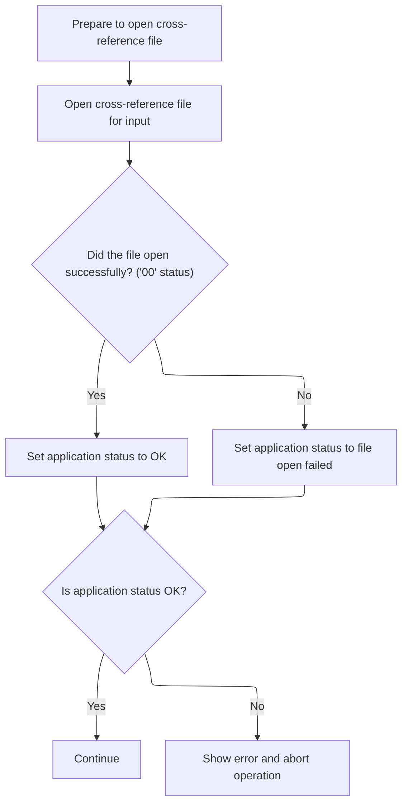

This section ensures that the cross-reference file is available for input operations and that any issues encountered during the file open process are handled in a controlled manner, maintaining application integrity and providing clear feedback to the user or operator.

| Category        | Rule Name                          | Description                                                                                                                                       |
| --------------- | ---------------------------------- | ------------------------------------------------------------------------------------------------------------------------------------------------- |
| Data validation | Cross-reference file open required | The application must attempt to open the cross-reference file for input before proceeding with any operations that require it.                    |
| Business logic  | Successful file open status        | If the cross-reference file is opened successfully (status code '00'), the application status must be set to OK, allowing processing to continue. |

<SwmSnippet path="/app/cbl/CBACT04C.cbl" line="252">

---

In <SwmToken path="app/cbl/CBACT04C.cbl" pos="252:1:5" line-data="       0100-XREFFILE-OPEN.                                                      ">`0100-XREFFILE-OPEN`</SwmToken>, the program opens the cross-reference file and sets up for error handling if the open fails.

```cobol
       0100-XREFFILE-OPEN.                                                      
           MOVE 8 TO APPL-RESULT.                                               
           OPEN INPUT XREF-FILE                                                 
           IF  XREFFILE-STATUS = '00'                                           
               MOVE 0 TO APPL-RESULT                                            
           ELSE                                                                 
               MOVE 12 TO APPL-RESULT                                           
           END-IF                                                               
```

---

</SwmSnippet>

<SwmSnippet path="/app/cbl/CBACT04C.cbl" line="260">

---

After opening the cross-reference file, if it fails, the code displays an error with the status, formats and shows the IO status, and then aborts. Same error handling as the other file opens.

```cobol
           IF  APPL-AOK                                                         
               CONTINUE                                                         
           ELSE                                                                 
               DISPLAY 'ERROR OPENING CROSS REF FILE'   XREFFILE-STATUS         
               MOVE XREFFILE-STATUS TO IO-STATUS                                
               PERFORM 9910-DISPLAY-IO-STATUS                                   
               PERFORM 9999-ABEND-PROGRAM                                       
           END-IF                                                               
           EXIT.                                                                
```

---

</SwmSnippet>

## Disclosure Group File Open and Error Handling

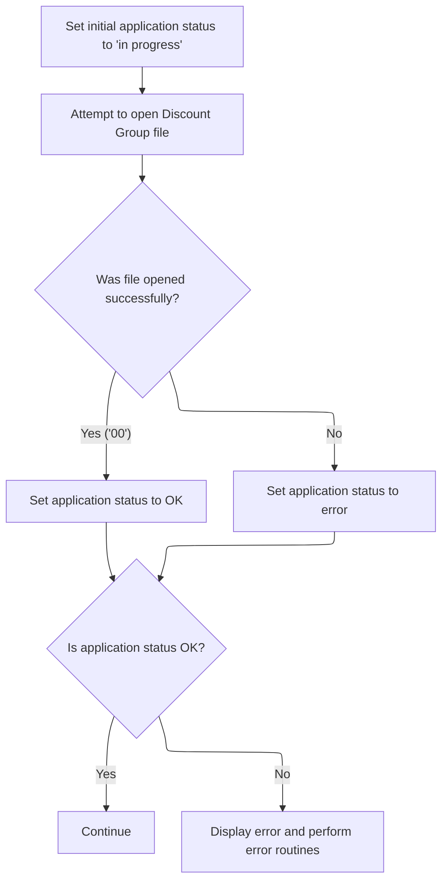

This section governs the business logic and error handling for opening the Disclosure Group file, ensuring that the application only proceeds if the file is available and accessible. It also manages user-facing error messaging and program termination in case of failure.

| Category        | Rule Name                      | Description                                                                                                                                |
| --------------- | ------------------------------ | ------------------------------------------------------------------------------------------------------------------------------------------ |
| Data validation | Disclosure Group File Required | The application must attempt to open the Disclosure Group file before performing any interest rate lookups.                                |
| Data validation | Abort on File Open Error       | The application must not proceed with interest rate lookups or further processing if the Disclosure Group file is not successfully opened. |
| Business logic  | Successful File Open           | If the Disclosure Group file is opened successfully, the application status must be set to OK and processing may continue.                 |

<SwmSnippet path="/app/cbl/CBACT04C.cbl" line="270">

---

In <SwmToken path="app/cbl/CBACT04C.cbl" pos="270:1:5" line-data="       0200-DISCGRP-OPEN.                                                       ">`0200-DISCGRP-OPEN`</SwmToken>, the code opens the disclosure group file for input, sets a result code based on the open status, and gets ready for error handling if needed. This file is needed for interest rate lookups.

```cobol
       0200-DISCGRP-OPEN.                                                       
           MOVE 8 TO APPL-RESULT.                                               
           OPEN INPUT DISCGRP-FILE                                              
           IF  DISCGRP-STATUS = '00'                                            
               MOVE 0 TO APPL-RESULT                                            
           ELSE                                                                 
               MOVE 12 TO APPL-RESULT                                           
           END-IF                                                               
```

---

</SwmSnippet>

<SwmSnippet path="/app/cbl/CBACT04C.cbl" line="278">

---

After opening the disclosure group file, if it fails, the code displays an error, formats and shows the IO status, and then aborts. Same error handling as the other file opens.

```cobol
           IF  APPL-AOK                                                         
               CONTINUE                                                         
           ELSE                                                                 
               DISPLAY 'ERROR OPENING DALY REJECTS FILE'                        
               MOVE DISCGRP-STATUS TO IO-STATUS                                 
               PERFORM 9910-DISPLAY-IO-STATUS                                   
               PERFORM 9999-ABEND-PROGRAM                                       
           END-IF                                                               
           EXIT.                                                                
```

---

</SwmSnippet>

## Account File Open and Error Handling

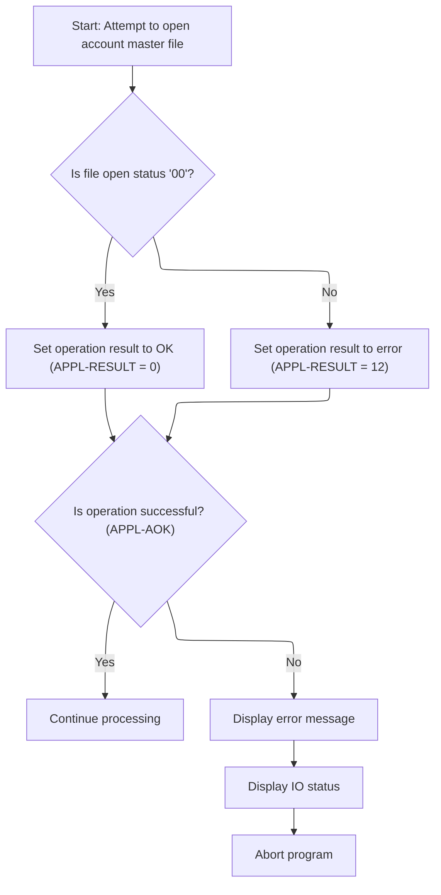

This section governs the business rules for opening the account master file and handling any errors that may occur during the process. It ensures that the application only continues processing if the file is available and accessible, and provides clear error reporting and termination if not.

<SwmSnippet path="/app/cbl/CBACT04C.cbl" line="289">

---

In <SwmToken path="app/cbl/CBACT04C.cbl" pos="289:1:5" line-data="       0300-ACCTFILE-OPEN.                                                      ">`0300-ACCTFILE-OPEN`</SwmToken>, the code opens the account file for update (<SwmToken path="app/cbl/CBACT04C.cbl" pos="291:3:5" line-data="           OPEN I-O ACCOUNT-FILE                                                ">`I-O`</SwmToken>), sets a result code based on the open status, and prepares for error handling if needed. The result codes (8, 0, 12) are used to track the open state and errors.

```cobol
       0300-ACCTFILE-OPEN.                                                      
           MOVE 8 TO APPL-RESULT.                                               
           OPEN I-O ACCOUNT-FILE                                                
           IF  ACCTFILE-STATUS = '00'                                           
               MOVE 0 TO APPL-RESULT                                            
           ELSE                                                                 
               MOVE 12 TO APPL-RESULT                                           
           END-IF                                                               
```

---

</SwmSnippet>

<SwmSnippet path="/app/cbl/CBACT04C.cbl" line="297">

---

After opening the account file, if it fails, the code displays an error, formats and shows the IO status, and then aborts. <SwmToken path="app/cbl/CBACT04C.cbl" pos="297:3:5" line-data="           IF  APPL-AOK                                                         ">`APPL-AOK`</SwmToken> is used to check if things are fine before continuing. Same error handling as the other file opens.

```cobol
           IF  APPL-AOK                                                         
               CONTINUE                                                         
           ELSE                                                                 
               DISPLAY 'ERROR OPENING ACCOUNT MASTER FILE'                      
               MOVE ACCTFILE-STATUS TO IO-STATUS                                
               PERFORM 9910-DISPLAY-IO-STATUS                                   
               PERFORM 9999-ABEND-PROGRAM                                       
           END-IF                                                               
           EXIT.                                                                
```

---

</SwmSnippet>

## Transaction File Preparation

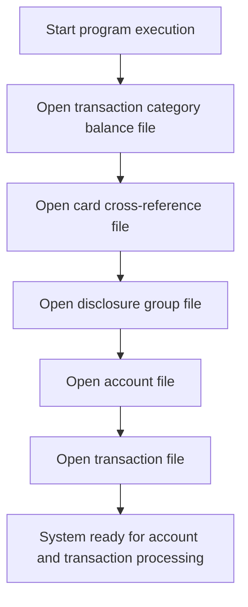

<SwmSnippet path="/app/cbl/CBACT04C.cbl" line="180">

---

After opening the account file, the code opens the transaction file to prepare for writing out results.

```cobol
       PROCEDURE DIVISION USING EXTERNAL-PARMS.                                 
           DISPLAY 'START OF EXECUTION OF PROGRAM CBACT04C'.                    
           PERFORM 0000-TCATBALF-OPEN.                                          
           PERFORM 0100-XREFFILE-OPEN.                                          
           PERFORM 0200-DISCGRP-OPEN.                                           
           PERFORM 0300-ACCTFILE-OPEN.                                          
           PERFORM 0400-TRANFILE-OPEN.                                          
```

---

</SwmSnippet>

## Transaction File Open and Error Handling

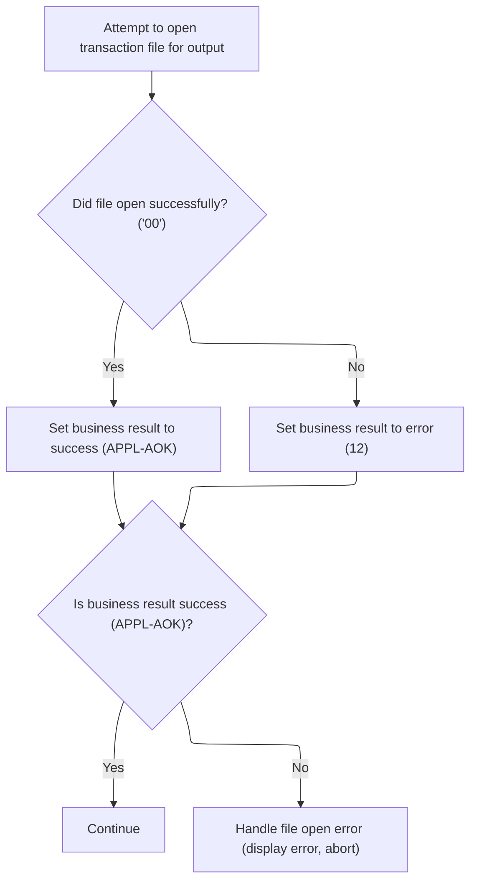

This section governs the process of opening the transaction file for output, determining the success or failure of the operation, and handling errors if the file cannot be opened. It ensures that transaction records can be written only if the file is available, and provides clear error feedback and program termination if not.

| Category       | Rule Name                       | Description                                                                                                                                                                                                                                                                 |
| -------------- | ------------------------------- | --------------------------------------------------------------------------------------------------------------------------------------------------------------------------------------------------------------------------------------------------------------------------- |
| Business logic | Successful file open            | If the transaction file opens successfully, the business result must be set to 'success' (<SwmToken path="app/cbl/CBACT04C.cbl" pos="242:3:5" line-data="           IF  APPL-AOK                                                         ">`APPL-AOK`</SwmToken>, value 0). |
| Business logic | Operation in progress indicator | The business result code must be set to 8 before attempting to open the transaction file, indicating the operation is in progress.                                                                                                                                          |

<SwmSnippet path="/app/cbl/CBACT04C.cbl" line="307">

---

In <SwmToken path="app/cbl/CBACT04C.cbl" pos="307:1:5" line-data="       0400-TRANFILE-OPEN.                                                      ">`0400-TRANFILE-OPEN`</SwmToken>, the code opens the transaction file for output, sets a result code based on the open status, and prepares for error handling if needed. This file is where new transaction records will be written.

```cobol
       0400-TRANFILE-OPEN.                                                      
           MOVE 8 TO APPL-RESULT.                                               
           OPEN OUTPUT TRANSACT-FILE                                            
           IF  TRANFILE-STATUS = '00'                                           
               MOVE 0 TO APPL-RESULT                                            
           ELSE                                                                 
               MOVE 12 TO APPL-RESULT                                           
           END-IF                                                               
```

---

</SwmSnippet>

<SwmSnippet path="/app/cbl/CBACT04C.cbl" line="315">

---

After opening the transaction file, if it fails, the code displays an error, formats and shows the IO status, and then aborts. Same error handling as the other file opens.

```cobol
           IF  APPL-AOK                                                         
               CONTINUE                                                         
           ELSE                                                                 
               DISPLAY 'ERROR OPENING TRANSACTION FILE'                         
               MOVE TRANFILE-STATUS TO IO-STATUS                                
               PERFORM 9910-DISPLAY-IO-STATUS                                   
               PERFORM 9999-ABEND-PROGRAM                                       
           END-IF                                                               
           EXIT.                                                                
```

---

</SwmSnippet>

## Main Processing Loop

<SwmSnippet path="/app/cbl/CBACT04C.cbl" line="188">

---

After opening all files, the code loops, calling <SwmToken path="app/cbl/CBACT04C.cbl" pos="190:3:9" line-data="                   PERFORM 1000-TCATBALF-GET-NEXT                               ">`1000-TCATBALF-GET-NEXT`</SwmToken> to read records until <SwmToken path="app/cbl/CBACT04C.cbl" pos="188:5:9" line-data="           PERFORM UNTIL END-OF-FILE = &#39;Y&#39;                                      ">`END-OF-FILE`</SwmToken>.

```cobol
           PERFORM UNTIL END-OF-FILE = 'Y'                                      
               IF  END-OF-FILE = 'N'                                            
                   PERFORM 1000-TCATBALF-GET-NEXT                               
```

---

</SwmSnippet>

## Read Next Transaction Category Record

```mermaid
%%{init: {"flowchart": {"defaultRenderer": "elk"}} }%%
flowchart TD
    node1["Read next transaction category balance record"] --> node2{"Was record read successfully?"}
    click node1 openCode "app/cbl/CBACT04C.cbl:326:326"
    node2 -->|"Yes (TCATBALF-STATUS = '00')"| node3["Business outcome: Success (APPL-RESULT = 0)"]
    click node2 openCode "app/cbl/CBACT04C.cbl:327:327"
    click node3 openCode "app/cbl/CBACT04C.cbl:328:328"
    node2 -->|"No"| node4{"Was end of file reached?"}
    click node4 openCode "app/cbl/CBACT04C.cbl:330:330"
    node4 -->|"Yes (TCATBALF-STATUS = '10')"| node5["Business outcome: End of file (APPL-RESULT = 16, END-OF-FILE = 'Y')"]
    click node5 openCode "app/cbl/CBACT04C.cbl:331:340"
    node4 -->|"No"| node6["Business outcome: Error (APPL-RESULT = 12, error displayed)"]
    click node6 openCode "app/cbl/CBACT04C.cbl:333:346"
classDef HeadingStyle fill:#777777,stroke:#333,stroke-width:2px;

%% Swimm:
%% %%{init: {"flowchart": {"defaultRenderer": "elk"}} }%%
%% flowchart TD
%%     node1["Read next transaction category balance record"] --> node2{"Was record read successfully?"}
%%     click node1 openCode "<SwmPath>[app/cbl/CBACT04C.cbl](app/cbl/CBACT04C.cbl)</SwmPath>:326:326"
%%     node2 -->|"Yes (<SwmToken path="app/cbl/CBACT04C.cbl" pos="237:3:5" line-data="           IF  TCATBALF-STATUS = &#39;00&#39;                                           ">`TCATBALF-STATUS`</SwmToken> = '00')"| node3["Business outcome: Success (<SwmToken path="app/cbl/CBACT04C.cbl" pos="235:7:9" line-data="           MOVE 8 TO APPL-RESULT.                                               ">`APPL-RESULT`</SwmToken> = 0)"]
%%     click node2 openCode "<SwmPath>[app/cbl/CBACT04C.cbl](app/cbl/CBACT04C.cbl)</SwmPath>:327:327"
%%     click node3 openCode "<SwmPath>[app/cbl/CBACT04C.cbl](app/cbl/CBACT04C.cbl)</SwmPath>:328:328"
%%     node2 -->|"No"| node4{"Was end of file reached?"}
%%     click node4 openCode "<SwmPath>[app/cbl/CBACT04C.cbl](app/cbl/CBACT04C.cbl)</SwmPath>:330:330"
%%     node4 -->|"Yes (<SwmToken path="app/cbl/CBACT04C.cbl" pos="237:3:5" line-data="           IF  TCATBALF-STATUS = &#39;00&#39;                                           ">`TCATBALF-STATUS`</SwmToken> = '10')"| node5["Business outcome: End of file (<SwmToken path="app/cbl/CBACT04C.cbl" pos="235:7:9" line-data="           MOVE 8 TO APPL-RESULT.                                               ">`APPL-RESULT`</SwmToken> = 16, <SwmToken path="app/cbl/CBACT04C.cbl" pos="188:5:9" line-data="           PERFORM UNTIL END-OF-FILE = &#39;Y&#39;                                      ">`END-OF-FILE`</SwmToken> = 'Y')"]
%%     click node5 openCode "<SwmPath>[app/cbl/CBACT04C.cbl](app/cbl/CBACT04C.cbl)</SwmPath>:331:340"
%%     node4 -->|"No"| node6["Business outcome: Error (<SwmToken path="app/cbl/CBACT04C.cbl" pos="235:7:9" line-data="           MOVE 8 TO APPL-RESULT.                                               ">`APPL-RESULT`</SwmToken> = 12, error displayed)"]
%%     click node6 openCode "<SwmPath>[app/cbl/CBACT04C.cbl](app/cbl/CBACT04C.cbl)</SwmPath>:333:346"
%% classDef HeadingStyle fill:#777777,stroke:#333,stroke-width:2px;
```

This section governs how the application processes the reading of transaction category balance records, and determines the business outcome for each read attempt, including handling end-of-file and error conditions.

| Category       | Rule Name              | Description                                                                                                                                                                                                                                                                                                                                                                                                                                                                                  |
| -------------- | ---------------------- | -------------------------------------------------------------------------------------------------------------------------------------------------------------------------------------------------------------------------------------------------------------------------------------------------------------------------------------------------------------------------------------------------------------------------------------------------------------------------------------------- |
| Business logic | Successful record read | If the transaction category balance record is read successfully, the business outcome is marked as success and <SwmToken path="app/cbl/CBACT04C.cbl" pos="235:7:9" line-data="           MOVE 8 TO APPL-RESULT.                                               ">`APPL-RESULT`</SwmToken> is set to 0.                                                                                                                                                                                        |
| Business logic | End of file reached    | If the end of the file is reached while reading, the business outcome is marked as end-of-file, <SwmToken path="app/cbl/CBACT04C.cbl" pos="235:7:9" line-data="           MOVE 8 TO APPL-RESULT.                                               ">`APPL-RESULT`</SwmToken> is set to 16, and <SwmToken path="app/cbl/CBACT04C.cbl" pos="188:5:9" line-data="           PERFORM UNTIL END-OF-FILE = &#39;Y&#39;                                      ">`END-OF-FILE`</SwmToken> is set to 'Y'. |

<SwmSnippet path="/app/cbl/CBACT04C.cbl" line="325">

---

In <SwmToken path="app/cbl/CBACT04C.cbl" pos="325:1:7" line-data="       1000-TCATBALF-GET-NEXT.                                                  ">`1000-TCATBALF-GET-NEXT`</SwmToken>, the code reads the next transaction category balance record, sets <SwmToken path="app/cbl/CBACT04C.cbl" pos="328:7:9" line-data="               MOVE 0 TO APPL-RESULT                                            ">`APPL-RESULT`</SwmToken> to indicate success, end-of-file, or error, and then branches based on the result. These codes drive the main loop's control flow.

```cobol
       1000-TCATBALF-GET-NEXT.                                                  
           READ TCATBAL-FILE INTO TRAN-CAT-BAL-RECORD.                          
           IF  TCATBALF-STATUS  = '00'                                          
               MOVE 0 TO APPL-RESULT                                            
           ELSE                                                                 
               IF  TCATBALF-STATUS  = '10'                                      
                   MOVE 16 TO APPL-RESULT                                       
               ELSE                                                             
                   MOVE 12 TO APPL-RESULT                                       
               END-IF                                                           
```

---

</SwmSnippet>

<SwmSnippet path="/app/cbl/CBACT04C.cbl" line="335">

---

After reading the next record, if it's successful, the code just continues. If it's end-of-file, it sets the flag to exit the loop. If it's an error, it displays an error, formats and shows the IO status, and aborts. <SwmToken path="app/cbl/CBACT04C.cbl" pos="336:3:5" line-data="           IF  APPL-AOK                                                         ">`APPL-AOK`</SwmToken> and <SwmToken path="app/cbl/CBACT04C.cbl" pos="339:3:5" line-data="               IF  APPL-EOF                                                     ">`APPL-EOF`</SwmToken> are the flags that control this flow.

```cobol
           END-IF                                                               
           IF  APPL-AOK                                                         
               CONTINUE                                                         
           ELSE                                                                 
               IF  APPL-EOF                                                     
                   MOVE 'Y' TO END-OF-FILE                                      
               ELSE                                                             
                   DISPLAY 'ERROR READING TRANSACTION CATEGORY FILE'            
                   MOVE TCATBALF-STATUS TO IO-STATUS                            
                   PERFORM 9910-DISPLAY-IO-STATUS                               
                   PERFORM 9999-ABEND-PROGRAM                                   
               END-IF                                                           
           END-IF                                                               
           EXIT.                                                                
```

---

</SwmSnippet>

## Account Update and Interest Calculation Loop

```mermaid
%%{init: {"flowchart": {"defaultRenderer": "elk"}} }%%
flowchart TD
  subgraph loop1["For each transaction category balance record while END-OF-FILE = 'N'"]
    node1["Increment record count"]
    click node1 openCode "app/cbl/CBACT04C.cbl:192:192"
    node1 --> node2{"Is this a new account? (TRANCAT-ACCT-ID ≠ WS-LAST-ACCT-NUM)"}
    click node2 openCode "app/cbl/CBACT04C.cbl:194:194"
    node2 -->|"Yes"| node3{"Is this the first record? (WS-FIRST-TIME = 'Y')"}
    click node3 openCode "app/cbl/CBACT04C.cbl:195:195"
    node3 -->|"No"| node4["Update previous account"]
    click node4 openCode "app/cbl/CBACT04C.cbl:196:196"
    node3 -->|"Yes"| node5["Set first time to 'N'"]
    click node5 openCode "app/cbl/CBACT04C.cbl:198:198"
    node4 --> node6["Reset totals, set last account, get account & xref data"]
    click node6 openCode "app/cbl/CBACT04C.cbl:200:205"
    node5 --> node6
    node2 -->|"No"| node7["Set disclosure group fields"]
    click node7 openCode "app/cbl/CBACT04C.cbl:210:212"
    node6 --> node7
    node7 --> node8["Get interest rate"]
    click node8 openCode "app/cbl/CBACT04C.cbl:213:213"
    node8 --> node9{"Interest rate not zero? (DIS-INT-RATE ≠ 0)"}
    click node9 openCode "app/cbl/CBACT04C.cbl:214:214"
    node9 -->|"Yes"| node10["Compute interest and fees"]
    click node10 openCode "app/cbl/CBACT04C.cbl:215:216"
    node9 -->|"No"| node11["Skip interest/fees"]
    click node11 openCode "app/cbl/CBACT04C.cbl:217:217"
    node10 --> node11
  end
classDef HeadingStyle fill:#777777,stroke:#333,stroke-width:2px;

%% Swimm:
%% %%{init: {"flowchart": {"defaultRenderer": "elk"}} }%%
%% flowchart TD
%%   subgraph loop1["For each transaction category balance record while <SwmToken path="app/cbl/CBACT04C.cbl" pos="188:5:9" line-data="           PERFORM UNTIL END-OF-FILE = &#39;Y&#39;                                      ">`END-OF-FILE`</SwmToken> = 'N'"]
%%     node1["Increment record count"]
%%     click node1 openCode "<SwmPath>[app/cbl/CBACT04C.cbl](app/cbl/CBACT04C.cbl)</SwmPath>:192:192"
%%     node1 --> node2{"Is this a new account? (<SwmToken path="app/cbl/CBACT04C.cbl" pos="194:3:7" line-data="                     IF TRANCAT-ACCT-ID NOT= WS-LAST-ACCT-NUM                   ">`TRANCAT-ACCT-ID`</SwmToken> ≠ <SwmToken path="app/cbl/CBACT04C.cbl" pos="194:12:18" line-data="                     IF TRANCAT-ACCT-ID NOT= WS-LAST-ACCT-NUM                   ">`WS-LAST-ACCT-NUM`</SwmToken>)"}
%%     click node2 openCode "<SwmPath>[app/cbl/CBACT04C.cbl](app/cbl/CBACT04C.cbl)</SwmPath>:194:194"
%%     node2 -->|"Yes"| node3{"Is this the first record? (<SwmToken path="app/cbl/CBACT04C.cbl" pos="195:3:7" line-data="                       IF WS-FIRST-TIME NOT = &#39;Y&#39;                               ">`WS-FIRST-TIME`</SwmToken> = 'Y')"}
%%     click node3 openCode "<SwmPath>[app/cbl/CBACT04C.cbl](app/cbl/CBACT04C.cbl)</SwmPath>:195:195"
%%     node3 -->|"No"| node4["Update previous account"]
%%     click node4 openCode "<SwmPath>[app/cbl/CBACT04C.cbl](app/cbl/CBACT04C.cbl)</SwmPath>:196:196"
%%     node3 -->|"Yes"| node5["Set first time to 'N'"]
%%     click node5 openCode "<SwmPath>[app/cbl/CBACT04C.cbl](app/cbl/CBACT04C.cbl)</SwmPath>:198:198"
%%     node4 --> node6["Reset totals, set last account, get account & xref data"]
%%     click node6 openCode "<SwmPath>[app/cbl/CBACT04C.cbl](app/cbl/CBACT04C.cbl)</SwmPath>:200:205"
%%     node5 --> node6
%%     node2 -->|"No"| node7["Set disclosure group fields"]
%%     click node7 openCode "<SwmPath>[app/cbl/CBACT04C.cbl](app/cbl/CBACT04C.cbl)</SwmPath>:210:212"
%%     node6 --> node7
%%     node7 --> node8["Get interest rate"]
%%     click node8 openCode "<SwmPath>[app/cbl/CBACT04C.cbl](app/cbl/CBACT04C.cbl)</SwmPath>:213:213"
%%     node8 --> node9{"Interest rate not zero? (<SwmToken path="app/cbl/CBACT04C.cbl" pos="214:3:7" line-data="                     IF DIS-INT-RATE NOT = 0                                    ">`DIS-INT-RATE`</SwmToken> ≠ 0)"}
%%     click node9 openCode "<SwmPath>[app/cbl/CBACT04C.cbl](app/cbl/CBACT04C.cbl)</SwmPath>:214:214"
%%     node9 -->|"Yes"| node10["Compute interest and fees"]
%%     click node10 openCode "<SwmPath>[app/cbl/CBACT04C.cbl](app/cbl/CBACT04C.cbl)</SwmPath>:215:216"
%%     node9 -->|"No"| node11["Skip interest/fees"]
%%     click node11 openCode "<SwmPath>[app/cbl/CBACT04C.cbl](app/cbl/CBACT04C.cbl)</SwmPath>:217:217"
%%     node10 --> node11
%%   end
%% classDef HeadingStyle fill:#777777,stroke:#333,stroke-width:2px;
```

<SwmSnippet path="/app/cbl/CBACT04C.cbl" line="191">

---

Back in <SwmToken path="app/cbl/CBACT04C.cbl" pos="180:1:3" line-data="       PROCEDURE DIVISION USING EXTERNAL-PARMS.                                 ">`PROCEDURE DIVISION`</SwmToken>, after reading a record, the code checks if it's a new account. If so, and it's not the first time, it calls <SwmToken path="app/cbl/CBACT04C.cbl" pos="196:3:7" line-data="                          PERFORM 1050-UPDATE-ACCOUNT                           ">`1050-UPDATE-ACCOUNT`</SwmToken> to save the previous account's updates. Then it resets totals, loads new account and xref data, fetches the interest rate, and if there's an interest rate, computes interest and fees.

```cobol
                   IF  END-OF-FILE = 'N'                                        
                     ADD 1 TO WS-RECORD-COUNT                                   
                     DISPLAY TRAN-CAT-BAL-RECORD                                
                     IF TRANCAT-ACCT-ID NOT= WS-LAST-ACCT-NUM                   
                       IF WS-FIRST-TIME NOT = 'Y'                               
                          PERFORM 1050-UPDATE-ACCOUNT                           
                       ELSE                                                     
                          MOVE 'N' TO WS-FIRST-TIME                             
                       END-IF                                                   
                       MOVE 0 TO WS-TOTAL-INT                                   
                       MOVE TRANCAT-ACCT-ID TO WS-LAST-ACCT-NUM                 
                       MOVE TRANCAT-ACCT-ID TO FD-ACCT-ID                       
                       PERFORM 1100-GET-ACCT-DATA                               
                       MOVE TRANCAT-ACCT-ID TO FD-XREF-ACCT-ID                  
                       PERFORM 1110-GET-XREF-DATA                               
                     END-IF                                                     
      *              DISPLAY 'ACCT-GROUP-ID: ' ACCT-GROUP-ID                    
      *              DISPLAY 'TRANCAT-CD: ' TRANCAT-CD                          
      *              DISPLAY 'TRANCAT-TYPE-CD: ' TRANCAT-TYPE-CD                
                     MOVE ACCT-GROUP-ID TO FD-DIS-ACCT-GROUP-ID                 
                     MOVE TRANCAT-CD TO FD-DIS-TRAN-CAT-CD                      
                     MOVE TRANCAT-TYPE-CD TO FD-DIS-TRAN-TYPE-CD                
                     PERFORM 1200-GET-INTEREST-RATE                             
                     IF DIS-INT-RATE NOT = 0                                    
                       PERFORM 1300-COMPUTE-INTEREST                            
                       PERFORM 1400-COMPUTE-FEES                                
                     END-IF                                                     
                   END-IF                                                       
```

---

</SwmSnippet>

## Write Updated Account Data

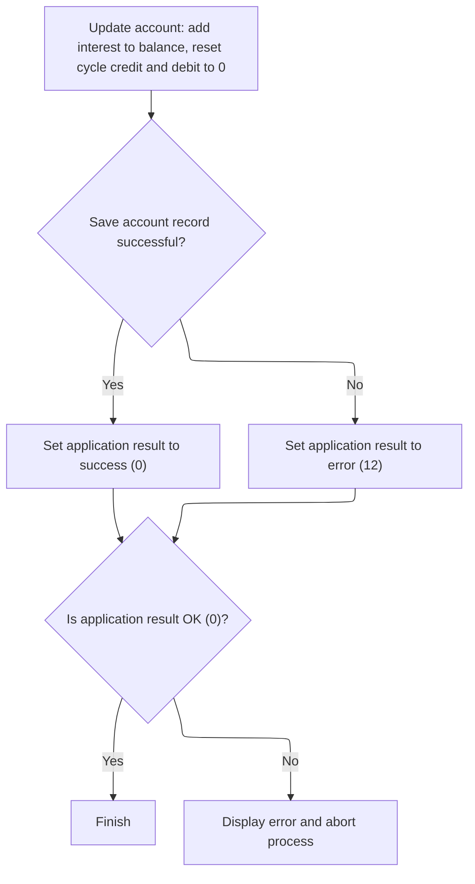

This section is responsible for updating an account at the end of a cycle by posting accrued interest, resetting cycle transaction counters, and ensuring the changes are saved. It also determines the outcome status for the operation.

| Category        | Rule Name                | Description                                                                                                          |
| --------------- | ------------------------ | -------------------------------------------------------------------------------------------------------------------- |
| Data validation | Successful Update Status | If the account record is successfully saved after updating, the operation result must be set to success (0).         |
| Business logic  | Interest Posting         | The total interest calculated for the account must be added to the current account balance at the end of each cycle. |
| Business logic  | Cycle Reset              | At the end of each cycle, the account's current cycle credit and debit amounts must be reset to zero.                |

<SwmSnippet path="/app/cbl/CBACT04C.cbl" line="350">

---

In <SwmToken path="app/cbl/CBACT04C.cbl" pos="350:1:5" line-data="       1050-UPDATE-ACCOUNT.                                                     ">`1050-UPDATE-ACCOUNT`</SwmToken>, the code posts the total interest to the account balance, resets the current cycle's credit and debit, and writes the updated record back to the file. It then checks if the write succeeded or failed.

```cobol
       1050-UPDATE-ACCOUNT.                                                     
      * Update the balances in account record to reflect posted trans.          
           ADD WS-TOTAL-INT  TO ACCT-CURR-BAL                                   
           MOVE 0 TO ACCT-CURR-CYC-CREDIT                                       
           MOVE 0 TO ACCT-CURR-CYC-DEBIT                                        
                                                                                
           REWRITE FD-ACCTFILE-REC FROM  ACCOUNT-RECORD                         
           IF  ACCTFILE-STATUS  = '00'                                          
               MOVE 0 TO APPL-RESULT                                            
           ELSE                                                                 
               MOVE 12 TO APPL-RESULT                                           
           END-IF                                                               
```

---

</SwmSnippet>

<SwmSnippet path="/app/cbl/CBACT04C.cbl" line="362">

---

After writing the updated account, if it fails, the code displays an error, formats and shows the IO status, and then aborts. Same error handling as the other file operations.

```cobol
           IF  APPL-AOK                                                         
               CONTINUE                                                         
           ELSE                                                                 
               DISPLAY 'ERROR RE-WRITING ACCOUNT FILE'                          
               MOVE ACCTFILE-STATUS  TO IO-STATUS                               
               PERFORM 9910-DISPLAY-IO-STATUS                                   
               PERFORM 9999-ABEND-PROGRAM                                       
           END-IF                                                               
           EXIT.                                                                
```

---

</SwmSnippet>

## Load Account Data

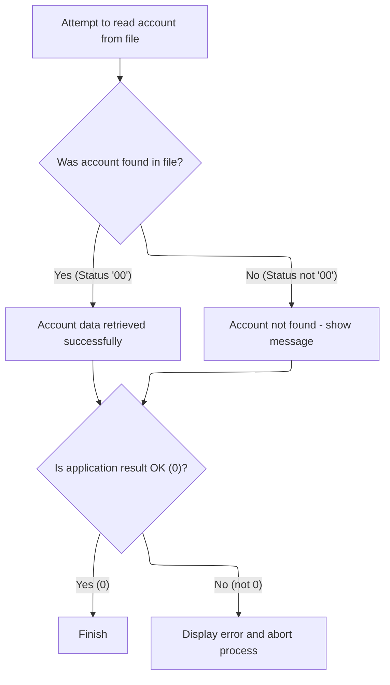

The main product role of this section is to retrieve account information by account ID from the account file, provide user feedback if the account is not found, and ensure robust error handling in case of file access issues.

| Category        | Rule Name                      | Description                                                                                                                                                                                                                             |
| --------------- | ------------------------------ | --------------------------------------------------------------------------------------------------------------------------------------------------------------------------------------------------------------------------------------- |
| Data validation | Account not found notification | If the account ID does not exist in the account file, a message indicating 'Account not found' must be displayed to the user.                                                                                                           |
| Business logic  | Account retrieval on match     | If the account ID exists in the account file, the corresponding account data must be retrieved and made available for further processing.                                                                                               |
| Business logic  | Result code assignment         | A result code must be set after attempting to read the account file: 0 if the account is found, 12 if not found, and other values for different error conditions. This result code determines subsequent processing and error handling. |

<SwmSnippet path="/app/cbl/CBACT04C.cbl" line="372">

---

In <SwmToken path="app/cbl/CBACT04C.cbl" pos="372:1:7" line-data="       1100-GET-ACCT-DATA.                                                      ">`1100-GET-ACCT-DATA`</SwmToken>, the code reads the account record by ID, displays a message if not found, sets a result code based on the read status, and prepares for error handling if needed.

```cobol
       1100-GET-ACCT-DATA.                                                      
           READ ACCOUNT-FILE INTO ACCOUNT-RECORD                                
               INVALID KEY                                                      
                  DISPLAY 'ACCOUNT NOT FOUND: ' FD-ACCT-ID                      
           END-READ                                                             
                                                                                
           IF  ACCTFILE-STATUS  = '00'                                          
               MOVE 0 TO APPL-RESULT                                            
           ELSE                                                                 
               MOVE 12 TO APPL-RESULT                                           
           END-IF                                                               
```

---

</SwmSnippet>

<SwmSnippet path="/app/cbl/CBACT04C.cbl" line="383">

---

After reading the account, if it fails, the code displays an error, formats and shows the IO status, and then aborts. Same error handling as the other file operations.

```cobol
           IF  APPL-AOK                                                         
               CONTINUE                                                         
           ELSE                                                                 
               DISPLAY 'ERROR READING ACCOUNT FILE'                             
               MOVE ACCTFILE-STATUS  TO IO-STATUS                               
               PERFORM 9910-DISPLAY-IO-STATUS                                   
               PERFORM 9999-ABEND-PROGRAM                                       
           END-IF                                                               
           EXIT.                                                                
```

---

</SwmSnippet>

## Load Cross-Reference Data

```mermaid
%%{init: {"flowchart": {"defaultRenderer": "elk"}} }%%
flowchart TD
    node1["Retrieve account data for given Account ID"]
    click node1 openCode "app/cbl/CBACT04C.cbl:394:395"
    node1 --> node2{"Is XREFFILE-STATUS = '00'?"}
    click node2 openCode "app/cbl/CBACT04C.cbl:400:400"
    node2 -->|"Yes"| node3["Set result to success (APPL-RESULT = 0)"]
    click node3 openCode "app/cbl/CBACT04C.cbl:401:401"
    node2 -->|"No"| node4["Set result to not found (APPL-RESULT = 12)"]
    click node4 openCode "app/cbl/CBACT04C.cbl:403:403"
    node3 --> node5{"Is APPL-RESULT = 0 (APPL-AOK)?"}
    click node5 openCode "app/cbl/CBACT04C.cbl:405:405"
    node4 --> node5
    node5 -->|"Yes"| node6["Operation successful"]
    click node6 openCode "app/cbl/CBACT04C.cbl:406:406"
    node5 -->|"No"| node7["Report error and abort process"]
    click node7 openCode "app/cbl/CBACT04C.cbl:408:411"
classDef HeadingStyle fill:#777777,stroke:#333,stroke-width:2px;

%% Swimm:
%% %%{init: {"flowchart": {"defaultRenderer": "elk"}} }%%
%% flowchart TD
%%     node1["Retrieve account data for given Account ID"]
%%     click node1 openCode "<SwmPath>[app/cbl/CBACT04C.cbl](app/cbl/CBACT04C.cbl)</SwmPath>:394:395"
%%     node1 --> node2{"Is <SwmToken path="app/cbl/CBACT04C.cbl" pos="255:3:5" line-data="           IF  XREFFILE-STATUS = &#39;00&#39;                                           ">`XREFFILE-STATUS`</SwmToken> = '00'?"}
%%     click node2 openCode "<SwmPath>[app/cbl/CBACT04C.cbl](app/cbl/CBACT04C.cbl)</SwmPath>:400:400"
%%     node2 -->|"Yes"| node3["Set result to success (<SwmToken path="app/cbl/CBACT04C.cbl" pos="235:7:9" line-data="           MOVE 8 TO APPL-RESULT.                                               ">`APPL-RESULT`</SwmToken> = 0)"]
%%     click node3 openCode "<SwmPath>[app/cbl/CBACT04C.cbl](app/cbl/CBACT04C.cbl)</SwmPath>:401:401"
%%     node2 -->|"No"| node4["Set result to not found (<SwmToken path="app/cbl/CBACT04C.cbl" pos="235:7:9" line-data="           MOVE 8 TO APPL-RESULT.                                               ">`APPL-RESULT`</SwmToken> = 12)"]
%%     click node4 openCode "<SwmPath>[app/cbl/CBACT04C.cbl](app/cbl/CBACT04C.cbl)</SwmPath>:403:403"
%%     node3 --> node5{"Is <SwmToken path="app/cbl/CBACT04C.cbl" pos="235:7:9" line-data="           MOVE 8 TO APPL-RESULT.                                               ">`APPL-RESULT`</SwmToken> = 0 (<SwmToken path="app/cbl/CBACT04C.cbl" pos="242:3:5" line-data="           IF  APPL-AOK                                                         ">`APPL-AOK`</SwmToken>)?"}
%%     click node5 openCode "<SwmPath>[app/cbl/CBACT04C.cbl](app/cbl/CBACT04C.cbl)</SwmPath>:405:405"
%%     node4 --> node5
%%     node5 -->|"Yes"| node6["Operation successful"]
%%     click node6 openCode "<SwmPath>[app/cbl/CBACT04C.cbl](app/cbl/CBACT04C.cbl)</SwmPath>:406:406"
%%     node5 -->|"No"| node7["Report error and abort process"]
%%     click node7 openCode "<SwmPath>[app/cbl/CBACT04C.cbl](app/cbl/CBACT04C.cbl)</SwmPath>:408:411"
%% classDef HeadingStyle fill:#777777,stroke:#333,stroke-width:2px;
```

This section governs the process of retrieving cross-reference data for a credit card account, ensuring that only valid account records are processed and that errors are handled appropriately.

| Category        | Rule Name                 | Description                                                                                                                                 |
| --------------- | ------------------------- | ------------------------------------------------------------------------------------------------------------------------------------------- |
| Data validation | Account ID validation     | Only records with a valid Account ID are eligible for cross-reference lookup; invalid or missing Account IDs will not be processed.         |
| Business logic  | Successful account lookup | If the cross-reference record for the provided Account ID is found, the operation is considered successful and the result code is set to 0. |

<SwmSnippet path="/app/cbl/CBACT04C.cbl" line="393">

---

In <SwmToken path="app/cbl/CBACT04C.cbl" pos="393:1:7" line-data="       1110-GET-XREF-DATA.                                                      ">`1110-GET-XREF-DATA`</SwmToken>, the code reads the cross-reference record by account ID, displays a message if not found, sets a result code based on the read status, and prepares for error handling if needed. <SwmToken path="app/cbl/CBACT04C.cbl" pos="401:7:9" line-data="               MOVE 0 TO APPL-RESULT                                            ">`APPL-RESULT`</SwmToken> and <SwmToken path="app/cbl/CBACT04C.cbl" pos="242:3:5" line-data="           IF  APPL-AOK                                                         ">`APPL-AOK`</SwmToken> control the flow.

```cobol
       1110-GET-XREF-DATA.                                                      
           READ XREF-FILE INTO CARD-XREF-RECORD                                 
            KEY IS FD-XREF-ACCT-ID                                              
               INVALID KEY                                                      
                  DISPLAY 'ACCOUNT NOT FOUND: ' FD-XREF-ACCT-ID                 
           END-READ                                                             
                                                                                
           IF  XREFFILE-STATUS   = '00'                                         
               MOVE 0 TO APPL-RESULT                                            
           ELSE                                                                 
               MOVE 12 TO APPL-RESULT                                           
           END-IF                                                               
```

---

</SwmSnippet>

<SwmSnippet path="/app/cbl/CBACT04C.cbl" line="405">

---

After reading the cross-reference record, if it fails, the code displays an error, formats and shows the IO status, and then aborts. Same error handling as the other file operations.

```cobol
           IF  APPL-AOK                                                         
               CONTINUE                                                         
           ELSE                                                                 
               DISPLAY 'ERROR READING XREF FILE'                                
               MOVE XREFFILE-STATUS  TO IO-STATUS                               
               PERFORM 9910-DISPLAY-IO-STATUS                                   
               PERFORM 9999-ABEND-PROGRAM                                       
           END-IF                                                               
           EXIT.                                                                
```

---

</SwmSnippet>

## Interest Rate Lookup

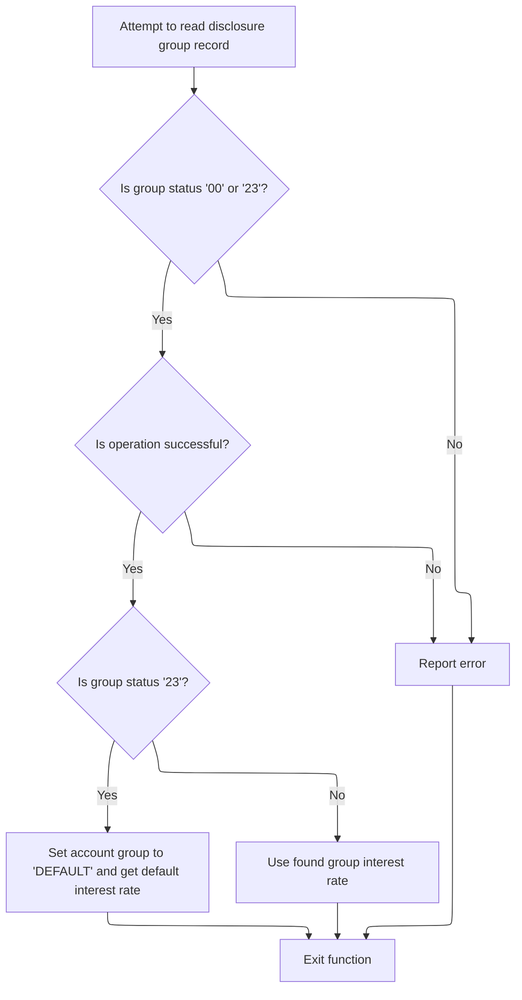

This section governs how the system determines the interest rate for a credit card account by looking up the disclosure group record. It ensures that a valid interest rate is always available, either from the specific group or a default, and handles errors gracefully.

| Category       | Rule Name                      | Description                                                                                                                                    |
| -------------- | ------------------------------ | ---------------------------------------------------------------------------------------------------------------------------------------------- |
| Business logic | Use group interest rate        | If the disclosure group record is found (status '00'), use the interest rate associated with that group for the account.                       |
| Business logic | Default interest rate fallback | If the disclosure group record is missing (status '23'), set the account group to 'DEFAULT' and use the default interest rate for the account. |

<SwmSnippet path="/app/cbl/CBACT04C.cbl" line="415">

---

In <SwmToken path="app/cbl/CBACT04C.cbl" pos="415:1:7" line-data="       1200-GET-INTEREST-RATE.                                                  ">`1200-GET-INTEREST-RATE`</SwmToken>, the code reads the disclosure group record, sets <SwmToken path="app/cbl/CBACT04C.cbl" pos="423:7:9" line-data="               MOVE 0 TO APPL-RESULT                                            ">`APPL-RESULT`</SwmToken> to success if the record is found or missing (status '23'), and otherwise flags an error for handling. This lets the program fall back to a default if needed.

```cobol
       1200-GET-INTEREST-RATE.                                                  
           READ DISCGRP-FILE INTO DIS-GROUP-RECORD                              
                INVALID KEY                                                     
                   DISPLAY 'DISCLOSURE GROUP RECORD MISSING'                    
                   DISPLAY 'TRY WITH DEFAULT GROUP CODE'                        
           END-READ.                                                            
                                                                                
           IF  DISCGRP-STATUS  = '00'  OR '23'                                  
               MOVE 0 TO APPL-RESULT                                            
           ELSE                                                                 
               MOVE 12 TO APPL-RESULT                                           
           END-IF                                                               
```

---

</SwmSnippet>

<SwmSnippet path="/app/cbl/CBACT04C.cbl" line="428">

---

After reading the interest rate record, if it fails, the code displays an error, formats and shows the IO status, and then aborts. Same error handling as the other file operations.

```cobol
           IF  APPL-AOK                                                         
               CONTINUE                                                         
           ELSE                                                                 
               DISPLAY 'ERROR READING DISCLOSURE GROUP FILE'                    
               MOVE DISCGRP-STATUS  TO IO-STATUS                                
               PERFORM 9910-DISPLAY-IO-STATUS                                   
               PERFORM 9999-ABEND-PROGRAM                                       
           END-IF                                                               
```

---

</SwmSnippet>

<SwmSnippet path="/app/cbl/CBACT04C.cbl" line="436">

---

After <SwmToken path="app/cbl/CBACT04C.cbl" pos="213:3:9" line-data="                     PERFORM 1200-GET-INTEREST-RATE                             ">`1200-GET-INTEREST-RATE`</SwmToken> tries to read the disclosure group record, if <SwmToken path="app/cbl/CBACT04C.cbl" pos="436:3:5" line-data="           IF  DISCGRP-STATUS  = &#39;23&#39;                                           ">`DISCGRP-STATUS`</SwmToken> is '23' (record not found), it sets <SwmToken path="app/cbl/CBACT04C.cbl" pos="437:9:17" line-data="               MOVE &#39;DEFAULT&#39; TO FD-DIS-ACCT-GROUP-ID                           ">`FD-DIS-ACCT-GROUP-ID`</SwmToken> to 'DEFAULT' and calls <SwmToken path="app/cbl/CBACT04C.cbl" pos="438:3:13" line-data="               PERFORM 1200-A-GET-DEFAULT-INT-RATE                              ">`1200-A-GET-DEFAULT-INT-RATE`</SwmToken>. This lets the program fetch a fallback interest rate for cases where the specific group is missing, so downstream calculations don't break.

```cobol
           IF  DISCGRP-STATUS  = '23'                                           
               MOVE 'DEFAULT' TO FD-DIS-ACCT-GROUP-ID                           
               PERFORM 1200-A-GET-DEFAULT-INT-RATE                              
           END-IF                                                               
           EXIT.                                                                
```

---

</SwmSnippet>

## Default Interest Rate Fallback

```mermaid
%%{init: {"flowchart": {"defaultRenderer": "elk"}} }%%
flowchart TD
    node1["Read default interest rate group file"]
    click node1 openCode "app/cbl/CBACT04C.cbl:444:444"
    node1 --> node2{"DISCGRP-STATUS = '00'?"}
    click node2 openCode "app/cbl/CBACT04C.cbl:446:450"
    node2 -->|"Yes"| node3["Set operation result to OK (APPL-RESULT = 0)"]
    click node3 openCode "app/cbl/CBACT04C.cbl:447:447"
    node2 -->|"No"| node4["Set operation result to error (APPL-RESULT = 12)"]
    click node4 openCode "app/cbl/CBACT04C.cbl:449:449"
    node3 --> node5{"APPL-AOK? (APPL-RESULT = 0)"}
    node4 --> node5
    click node5 openCode "app/cbl/CBACT04C.cbl:452:459"
    node5 -->|"Yes"| node6["Continue"]
    click node6 openCode "app/cbl/CBACT04C.cbl:453:453"
    node5 -->|"No"| node7["Display error and abort"]
    click node7 openCode "app/cbl/CBACT04C.cbl:455:458"

classDef HeadingStyle fill:#777777,stroke:#333,stroke-width:2px;

%% Swimm:
%% %%{init: {"flowchart": {"defaultRenderer": "elk"}} }%%
%% flowchart TD
%%     node1["Read default interest rate group file"]
%%     click node1 openCode "<SwmPath>[app/cbl/CBACT04C.cbl](app/cbl/CBACT04C.cbl)</SwmPath>:444:444"
%%     node1 --> node2{"<SwmToken path="app/cbl/CBACT04C.cbl" pos="273:3:5" line-data="           IF  DISCGRP-STATUS = &#39;00&#39;                                            ">`DISCGRP-STATUS`</SwmToken> = '00'?"}
%%     click node2 openCode "<SwmPath>[app/cbl/CBACT04C.cbl](app/cbl/CBACT04C.cbl)</SwmPath>:446:450"
%%     node2 -->|"Yes"| node3["Set operation result to OK (<SwmToken path="app/cbl/CBACT04C.cbl" pos="235:7:9" line-data="           MOVE 8 TO APPL-RESULT.                                               ">`APPL-RESULT`</SwmToken> = 0)"]
%%     click node3 openCode "<SwmPath>[app/cbl/CBACT04C.cbl](app/cbl/CBACT04C.cbl)</SwmPath>:447:447"
%%     node2 -->|"No"| node4["Set operation result to error (<SwmToken path="app/cbl/CBACT04C.cbl" pos="235:7:9" line-data="           MOVE 8 TO APPL-RESULT.                                               ">`APPL-RESULT`</SwmToken> = 12)"]
%%     click node4 openCode "<SwmPath>[app/cbl/CBACT04C.cbl](app/cbl/CBACT04C.cbl)</SwmPath>:449:449"
%%     node3 --> node5{"<SwmToken path="app/cbl/CBACT04C.cbl" pos="242:3:5" line-data="           IF  APPL-AOK                                                         ">`APPL-AOK`</SwmToken>? (<SwmToken path="app/cbl/CBACT04C.cbl" pos="235:7:9" line-data="           MOVE 8 TO APPL-RESULT.                                               ">`APPL-RESULT`</SwmToken> = 0)"}
%%     node4 --> node5
%%     click node5 openCode "<SwmPath>[app/cbl/CBACT04C.cbl](app/cbl/CBACT04C.cbl)</SwmPath>:452:459"
%%     node5 -->|"Yes"| node6["Continue"]
%%     click node6 openCode "<SwmPath>[app/cbl/CBACT04C.cbl](app/cbl/CBACT04C.cbl)</SwmPath>:453:453"
%%     node5 -->|"No"| node7["Display error and abort"]
%%     click node7 openCode "<SwmPath>[app/cbl/CBACT04C.cbl](app/cbl/CBACT04C.cbl)</SwmPath>:455:458"
%% 
%% classDef HeadingStyle fill:#777777,stroke:#333,stroke-width:2px;
```

This section ensures that the default interest rate disclosure group record is available for use in credit card operations. It validates the availability of the record and provides clear error handling if the record cannot be accessed.

| Category        | Rule Name              | Description                                                                                                                                                                                                                                                                          |
| --------------- | ---------------------- | ------------------------------------------------------------------------------------------------------------------------------------------------------------------------------------------------------------------------------------------------------------------------------------ |
| Data validation | Successful record read | If the default disclosure group record is successfully read, the operation result must be set to OK (<SwmToken path="app/cbl/CBACT04C.cbl" pos="235:7:9" line-data="           MOVE 8 TO APPL-RESULT.                                               ">`APPL-RESULT`</SwmToken> = 0). |

<SwmSnippet path="/app/cbl/CBACT04C.cbl" line="443">

---

In <SwmToken path="app/cbl/CBACT04C.cbl" pos="443:1:11" line-data="       1200-A-GET-DEFAULT-INT-RATE.                                             ">`1200-A-GET-DEFAULT-INT-RATE`</SwmToken>, the code reads the default disclosure group record and sets <SwmToken path="app/cbl/CBACT04C.cbl" pos="447:7:9" line-data="               MOVE 0 TO APPL-RESULT                                            ">`APPL-RESULT`</SwmToken> based on the file status. It doesn't calculate anything, just checks if the record is available for later use.

```cobol
       1200-A-GET-DEFAULT-INT-RATE.                                             
           READ DISCGRP-FILE INTO DIS-GROUP-RECORD                              
                                                                                
           IF  DISCGRP-STATUS  = '00'                                           
               MOVE 0 TO APPL-RESULT                                            
           ELSE                                                                 
               MOVE 12 TO APPL-RESULT                                           
           END-IF                                                               
```

---

</SwmSnippet>

<SwmSnippet path="/app/cbl/CBACT04C.cbl" line="452">

---

After trying to read the default disclosure group record, if it fails, the code displays an error, formats the IO status for clarity, and then abends. This makes error reporting consistent and easy to spot in logs.

```cobol
           IF  APPL-AOK                                                         
               CONTINUE                                                         
           ELSE                                                                 
               DISPLAY 'ERROR READING DEFAULT DISCLOSURE GROUP'                 
               MOVE DISCGRP-STATUS  TO IO-STATUS                                
               PERFORM 9910-DISPLAY-IO-STATUS                                   
               PERFORM 9999-ABEND-PROGRAM                                       
           END-IF                                                               
           EXIT.                                                                
```

---

</SwmSnippet>

## Monthly Interest Calculation

This section is responsible for calculating the monthly interest for a credit card account based on its transaction category balance and the disclosed interest rate. The calculated interest is then added to the account's total interest and recorded as a transaction for audit and reporting purposes.

| Category       | Rule Name                      | Description                                                                                                                                                     |
| -------------- | ------------------------------ | --------------------------------------------------------------------------------------------------------------------------------------------------------------- |
| Business logic | Monthly interest formula       | Monthly interest for an account is calculated by multiplying the transaction category balance by the disclosed interest rate, then dividing the result by 1200. |
| Business logic | Interest accumulation          | The calculated monthly interest must be added to the running total interest for the account.                                                                    |
| Business logic | Interest transaction recording | Each monthly interest calculation must be recorded as a transaction for the account.                                                                            |

<SwmSnippet path="/app/cbl/CBACT04C.cbl" line="462">

---

<SwmToken path="app/cbl/CBACT04C.cbl" pos="462:1:5" line-data="       1300-COMPUTE-INTEREST.                                                   ">`1300-COMPUTE-INTEREST`</SwmToken> calculates the monthly interest for the account, adds it to the running total, and then calls <SwmToken path="app/cbl/CBACT04C.cbl" pos="468:3:9" line-data="           PERFORM 1300-B-WRITE-TX.                                             ">`1300-B-WRITE-TX`</SwmToken> to record the interest as a transaction.

```cobol
       1300-COMPUTE-INTEREST.                                                   
                                                                                
           COMPUTE WS-MONTHLY-INT                                               
            = ( TRAN-CAT-BAL * DIS-INT-RATE) / 1200                             
                                                                                
           ADD WS-MONTHLY-INT  TO WS-TOTAL-INT                                  
           PERFORM 1300-B-WRITE-TX.                                             
                                                                                
           EXIT.                                                                
```

---

</SwmSnippet>

## Interest Transaction Record Creation

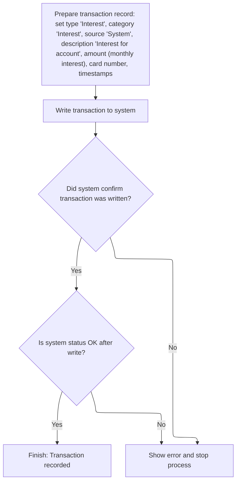

This section governs the creation of interest transaction records for credit card accounts, ensuring that monthly interest charges are correctly calculated, recorded, and tracked in the system.

| Category        | Rule Name                               | Description                                                                                                                                                                                                                                                           |
| --------------- | --------------------------------------- | --------------------------------------------------------------------------------------------------------------------------------------------------------------------------------------------------------------------------------------------------------------------- |
| Data validation | System status validation after write    | If the system status is not OK after writing the transaction, an error message must be displayed and the process must stop.                                                                                                                                           |
| Business logic  | Interest transaction classification     | The transaction record for interest must have the type code set to '01', category code set to '05', and source set to 'System'.                                                                                                                                       |
| Business logic  | Interest transaction description format | The transaction description must include the phrase 'Int. for <SwmToken path="app/cbl/CBACT04C.cbl" pos="485:9:11" line-data="           STRING &#39;Int. for a/c &#39; ,                                             ">`a/c`</SwmToken>' followed by the account ID. |
| Business logic  | Interest calculation formula            | The transaction amount for interest must be calculated as (Account Category Balance \* Display Interest Rate) / 1200.                                                                                                                                                 |
| Business logic  | Unique transaction ID generation        | Each interest transaction must have a unique transaction ID, generated using the transaction date and a numeric suffix.                                                                                                                                               |
| Business logic  | Timestamping transaction records        | The transaction record must include both original and processed timestamps in DB2-compatible format.                                                                                                                                                                  |

<SwmSnippet path="/app/cbl/CBACT04C.cbl" line="473">

---

In <SwmToken path="app/cbl/CBACT04C.cbl" pos="473:1:7" line-data="       1300-B-WRITE-TX.                                                         ">`1300-B-WRITE-TX`</SwmToken>, the code builds a transaction record for the interest charge, sets all the required fields (type, category, source, description, amount, card number), and generates a unique transaction ID using the date and a suffix.

```cobol
       1300-B-WRITE-TX.                                                         
           ADD 1 TO WS-TRANID-SUFFIX                                            
                                                                                
           STRING PARM-DATE,                                                    
                  WS-TRANID-SUFFIX                                              
             DELIMITED BY SIZE                                                  
             INTO TRAN-ID                                                       
           END-STRING.                                                          
                                                                                
           MOVE '01'                 TO TRAN-TYPE-CD                            
           MOVE '05'                 TO TRAN-CAT-CD                             
           MOVE 'System'             TO TRAN-SOURCE                             
           STRING 'Int. for a/c ' ,                                             
                  ACCT-ID                                                       
                  DELIMITED BY SIZE                                             
            INTO TRAN-DESC                                                      
           END-STRING                                                           
           MOVE WS-MONTHLY-INT       TO TRAN-AMT                                
           MOVE 0                    TO TRAN-MERCHANT-ID                        
           MOVE SPACES               TO TRAN-MERCHANT-NAME                      
           MOVE SPACES               TO TRAN-MERCHANT-CITY                      
           MOVE SPACES               TO TRAN-MERCHANT-ZIP                       
           MOVE XREF-CARD-NUM        TO TRAN-CARD-NUM                           
```

---

</SwmSnippet>

<SwmSnippet path="/app/cbl/CBACT04C.cbl" line="496">

---

After setting up the transaction fields, the code calls <SwmToken path="app/cbl/CBACT04C.cbl" pos="496:3:11" line-data="           PERFORM Z-GET-DB2-FORMAT-TIMESTAMP                                   ">`Z-GET-DB2-FORMAT-TIMESTAMP`</SwmToken> to generate a DB2-compatible timestamp for the transaction record.

```cobol
           PERFORM Z-GET-DB2-FORMAT-TIMESTAMP                                   
```

---

</SwmSnippet>

<SwmSnippet path="/app/cbl/CBACT04C.cbl" line="497">

---

After getting the timestamp, the code sets both <SwmToken path="app/cbl/CBACT04C.cbl" pos="497:11:15" line-data="           MOVE DB2-FORMAT-TS        TO TRAN-ORIG-TS                            ">`TRAN-ORIG-TS`</SwmToken> and <SwmToken path="app/cbl/CBACT04C.cbl" pos="498:11:15" line-data="           MOVE DB2-FORMAT-TS        TO TRAN-PROC-TS                            ">`TRAN-PROC-TS`</SwmToken>, writes the transaction record, and checks the file status to see if the write worked.

```cobol
           MOVE DB2-FORMAT-TS        TO TRAN-ORIG-TS                            
           MOVE DB2-FORMAT-TS        TO TRAN-PROC-TS                            
                                                                                
           WRITE FD-TRANFILE-REC FROM TRAN-RECORD                               
           IF  TRANFILE-STATUS   = '00'                                         
               MOVE 0 TO APPL-RESULT                                            
           ELSE                                                                 
               MOVE 12 TO APPL-RESULT                                           
           END-IF                                                               
```

---

</SwmSnippet>

<SwmSnippet path="/app/cbl/CBACT04C.cbl" line="507">

---

If writing the transaction record fails, the code displays a formatted error message for the transaction file status and then abends. This keeps error handling consistent.

```cobol
           IF  APPL-AOK                                                         
               CONTINUE                                                         
           ELSE                                                                 
               DISPLAY 'ERROR WRITING TRANSACTION RECORD'                       
               MOVE TRANFILE-STATUS   TO IO-STATUS                              
               PERFORM 9910-DISPLAY-IO-STATUS                                   
               PERFORM 9999-ABEND-PROGRAM                                       
           END-IF                                                               
           EXIT.                                                                
```

---

</SwmSnippet>

## Account Update After Interest

<SwmSnippet path="/app/cbl/CBACT04C.cbl" line="219">

---

Back in PROCEDURE-DIVISION, after returning from <SwmToken path="app/cbl/CBACT04C.cbl" pos="215:3:7" line-data="                       PERFORM 1300-COMPUTE-INTEREST                            ">`1300-COMPUTE-INTEREST`</SwmToken>, the code updates the account record to reflect the new interest and resets cycle values before continuing the batch loop.

```cobol
               ELSE                                                             
                    PERFORM 1050-UPDATE-ACCOUNT                                 
               END-IF                                                           
           END-PERFORM.                                                         
```

---

</SwmSnippet>

<SwmSnippet path="/app/cbl/CBACT04C.cbl" line="224">

---

At the end of PROCEDURE-DIVISION, the code closes all the files used in the batch process, starting with the transaction balance file. Each close checks for errors and logs them if needed.

```cobol
           PERFORM 9000-TCATBALF-CLOSE.                                         
           PERFORM 9100-XREFFILE-CLOSE.                                         
           PERFORM 9200-DISCGRP-CLOSE.                                          
           PERFORM 9300-ACCTFILE-CLOSE.                                         
           PERFORM 9400-TRANFILE-CLOSE.                                         
                                                                                
           DISPLAY 'END OF EXECUTION OF PROGRAM CBACT04C'.                      
                                                                                
           GOBACK.                                                              
```

---

</SwmSnippet>

# Transaction Balance File Closure

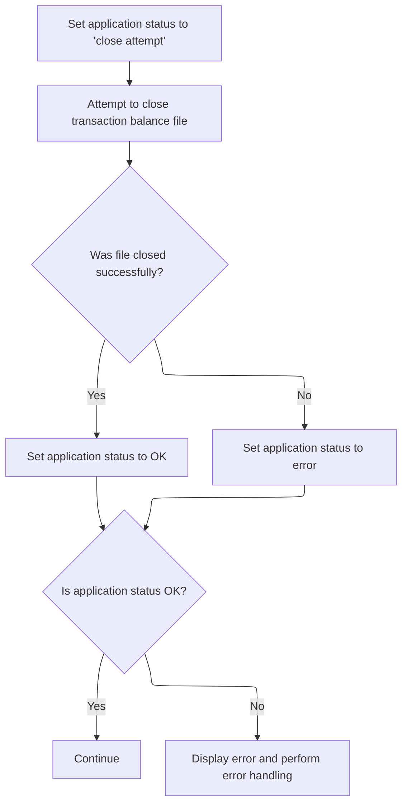

This section ensures that the transaction balance file is properly closed and that the application status reflects the outcome. It also provides consistent error handling and messaging if the file closure fails.

| Category       | Rule Name               | Description                                                                                                                                                                                                                                                                       |
| -------------- | ----------------------- | --------------------------------------------------------------------------------------------------------------------------------------------------------------------------------------------------------------------------------------------------------------------------------- |
| Business logic | Pre-close status set    | When attempting to close the transaction balance file, the application status must be set to 'close attempt' before the operation begins.                                                                                                                                         |
| Business logic | Successful file closure | If the transaction balance file is closed successfully, the application status must be set to OK (<SwmToken path="app/cbl/CBACT04C.cbl" pos="235:7:9" line-data="           MOVE 8 TO APPL-RESULT.                                               ">`APPL-RESULT`</SwmToken> = 0). |
| Business logic | Post-close continuation | If the application status is OK after closing the file, the system must continue with subsequent operations without interruption.                                                                                                                                                 |

<SwmSnippet path="/app/cbl/CBACT04C.cbl" line="522">

---

In <SwmToken path="app/cbl/CBACT04C.cbl" pos="522:1:5" line-data="       9000-TCATBALF-CLOSE.                                                     ">`9000-TCATBALF-CLOSE`</SwmToken>, the code closes the transaction balance file and sets <SwmToken path="app/cbl/CBACT04C.cbl" pos="523:7:9" line-data="           MOVE 8 TO  APPL-RESULT.                                              ">`APPL-RESULT`</SwmToken> based on whether the close worked or not.

```cobol
       9000-TCATBALF-CLOSE.                                                     
           MOVE 8 TO  APPL-RESULT.                                              
           CLOSE TCATBAL-FILE                                                   
           IF  TCATBALF-STATUS = '00'                                           
               MOVE 0 TO  APPL-RESULT                                           
           ELSE                                                                 
               MOVE 12 TO APPL-RESULT                                           
           END-IF                                                               
```

---

</SwmSnippet>

<SwmSnippet path="/app/cbl/CBACT04C.cbl" line="530">

---

If closing the transaction balance file fails, the code displays a formatted error message for the file status and then abends. This keeps error handling consistent.

```cobol
           IF  APPL-AOK                                                         
               CONTINUE                                                         
           ELSE                                                                 
               DISPLAY 'ERROR CLOSING TRANSACTION BALANCE FILE'                 
               MOVE TCATBALF-STATUS  TO IO-STATUS                               
               PERFORM 9910-DISPLAY-IO-STATUS                                   
               PERFORM 9999-ABEND-PROGRAM                                       
           END-IF                                                               
           EXIT.                                                                
```

---

</SwmSnippet>

# Cross-Reference File Closure

```mermaid
%%{init: {"flowchart": {"defaultRenderer": "elk"}} }%%
flowchart TD
    node1["Mark operation as in progress (APPL-RESULT = 8)"]
    click node1 openCode "app/cbl/CBACT04C.cbl:542:542"
    node1 --> node2["Attempt to close cross-reference file"]
    click node2 openCode "app/cbl/CBACT04C.cbl:543:543"
    node2 --> node3{"Was file closed successfully?
(XREFFILE-STATUS = '00')"}
    click node3 openCode "app/cbl/CBACT04C.cbl:544:548"
    node3 -->|"Yes"| node4["Mark operation as successful (APPL-RESULT = 0)"]
    click node4 openCode "app/cbl/CBACT04C.cbl:545:545"
    node3 -->|"No"| node5["Mark operation as failed (APPL-RESULT = 12)"]
    click node5 openCode "app/cbl/CBACT04C.cbl:547:547"
    node4 --> node6{"Is operation result OK?
(APPL-RESULT = 0 / APPL-AOK)"}
    node5 --> node6
    click node6 openCode "app/cbl/CBACT04C.cbl:549:556"
    node6 -->|"Yes"| node7["Continue"]
    click node7 openCode "app/cbl/CBACT04C.cbl:550:550"
    node6 -->|"No"| node8["Display error message, show I/O status, terminate"]
    click node8 openCode "app/cbl/CBACT04C.cbl:552:555"

classDef HeadingStyle fill:#777777,stroke:#333,stroke-width:2px;

%% Swimm:
%% %%{init: {"flowchart": {"defaultRenderer": "elk"}} }%%
%% flowchart TD
%%     node1["Mark operation as in progress (<SwmToken path="app/cbl/CBACT04C.cbl" pos="235:7:9" line-data="           MOVE 8 TO APPL-RESULT.                                               ">`APPL-RESULT`</SwmToken> = 8)"]
%%     click node1 openCode "<SwmPath>[app/cbl/CBACT04C.cbl](app/cbl/CBACT04C.cbl)</SwmPath>:542:542"
%%     node1 --> node2["Attempt to close cross-reference file"]
%%     click node2 openCode "<SwmPath>[app/cbl/CBACT04C.cbl](app/cbl/CBACT04C.cbl)</SwmPath>:543:543"
%%     node2 --> node3{"Was file closed successfully?
%% (<SwmToken path="app/cbl/CBACT04C.cbl" pos="255:3:5" line-data="           IF  XREFFILE-STATUS = &#39;00&#39;                                           ">`XREFFILE-STATUS`</SwmToken> = '00')"}
%%     click node3 openCode "<SwmPath>[app/cbl/CBACT04C.cbl](app/cbl/CBACT04C.cbl)</SwmPath>:544:548"
%%     node3 -->|"Yes"| node4["Mark operation as successful (<SwmToken path="app/cbl/CBACT04C.cbl" pos="235:7:9" line-data="           MOVE 8 TO APPL-RESULT.                                               ">`APPL-RESULT`</SwmToken> = 0)"]
%%     click node4 openCode "<SwmPath>[app/cbl/CBACT04C.cbl](app/cbl/CBACT04C.cbl)</SwmPath>:545:545"
%%     node3 -->|"No"| node5["Mark operation as failed (<SwmToken path="app/cbl/CBACT04C.cbl" pos="235:7:9" line-data="           MOVE 8 TO APPL-RESULT.                                               ">`APPL-RESULT`</SwmToken> = 12)"]
%%     click node5 openCode "<SwmPath>[app/cbl/CBACT04C.cbl](app/cbl/CBACT04C.cbl)</SwmPath>:547:547"
%%     node4 --> node6{"Is operation result OK?
%% (<SwmToken path="app/cbl/CBACT04C.cbl" pos="235:7:9" line-data="           MOVE 8 TO APPL-RESULT.                                               ">`APPL-RESULT`</SwmToken> = 0 / <SwmToken path="app/cbl/CBACT04C.cbl" pos="242:3:5" line-data="           IF  APPL-AOK                                                         ">`APPL-AOK`</SwmToken>)"}
%%     node5 --> node6
%%     click node6 openCode "<SwmPath>[app/cbl/CBACT04C.cbl](app/cbl/CBACT04C.cbl)</SwmPath>:549:556"
%%     node6 -->|"Yes"| node7["Continue"]
%%     click node7 openCode "<SwmPath>[app/cbl/CBACT04C.cbl](app/cbl/CBACT04C.cbl)</SwmPath>:550:550"
%%     node6 -->|"No"| node8["Display error message, show I/O status, terminate"]
%%     click node8 openCode "<SwmPath>[app/cbl/CBACT04C.cbl](app/cbl/CBACT04C.cbl)</SwmPath>:552:555"
%% 
%% classDef HeadingStyle fill:#777777,stroke:#333,stroke-width:2px;
```

This section governs the business rules for closing the cross-reference file, ensuring that the operation's outcome is clearly indicated and that errors are handled consistently for audit and operational reliability.

| Category       | Rule Name               | Description                                                                                                                                                                                                                                                                                           |
| -------------- | ----------------------- | ----------------------------------------------------------------------------------------------------------------------------------------------------------------------------------------------------------------------------------------------------------------------------------------------------- |
| Business logic | Successful File Closure | If the cross-reference file is closed successfully (file status '00'), the operation result must be set to 'success' (<SwmToken path="app/cbl/CBACT04C.cbl" pos="235:7:9" line-data="           MOVE 8 TO APPL-RESULT.                                               ">`APPL-RESULT`</SwmToken> = 0). |

<SwmSnippet path="/app/cbl/CBACT04C.cbl" line="541">

---

In <SwmToken path="app/cbl/CBACT04C.cbl" pos="541:1:5" line-data="       9100-XREFFILE-CLOSE.                                                     ">`9100-XREFFILE-CLOSE`</SwmToken>, the code closes the cross-reference file and sets <SwmToken path="app/cbl/CBACT04C.cbl" pos="542:7:9" line-data="           MOVE 8 TO APPL-RESULT.                                               ">`APPL-RESULT`</SwmToken> based on whether the close worked or not.

```cobol
       9100-XREFFILE-CLOSE.                                                     
           MOVE 8 TO APPL-RESULT.                                               
           CLOSE XREF-FILE                                                      
           IF  XREFFILE-STATUS = '00'                                           
               MOVE 0 TO APPL-RESULT                                            
           ELSE                                                                 
               MOVE 12 TO APPL-RESULT                                           
           END-IF                                                               
```

---

</SwmSnippet>

<SwmSnippet path="/app/cbl/CBACT04C.cbl" line="549">

---

If closing the cross-reference file fails, the code displays a formatted error message for the file status and then abends. This keeps error handling consistent.

```cobol
           IF  APPL-AOK                                                         
               CONTINUE                                                         
           ELSE                                                                 
               DISPLAY 'ERROR CLOSING CROSS REF FILE'                           
               MOVE XREFFILE-STATUS TO IO-STATUS                                
               PERFORM 9910-DISPLAY-IO-STATUS                                   
               PERFORM 9999-ABEND-PROGRAM                                       
           END-IF                                                               
           EXIT.                                                                
```

---

</SwmSnippet>

# Disclosure Group File Closure

```mermaid
%%{init: {"flowchart": {"defaultRenderer": "elk"}} }%%
flowchart TD
    node1["Attempt to close Disclosure Group file"] --> node2{"Was file closed successfully?"}
    click node1 openCode "app/cbl/CBACT04C.cbl:561:561"
    node2 -->|"Yes (DISCGRP-STATUS = '00')"| node3["Set business outcome to success"]
    click node2 openCode "app/cbl/CBACT04C.cbl:562:562"
    click node3 openCode "app/cbl/CBACT04C.cbl:563:563"
    node2 -->|"No"| node4["Set business outcome to error"]
    click node4 openCode "app/cbl/CBACT04C.cbl:565:565"
    node3 --> node5{"Is operation successful?"}
    node4 --> node5
    click node5 openCode "app/cbl/CBACT04C.cbl:567:567"
    node5 -->|"Yes (APPL-AOK)"| node6["Finish"]
    click node6 openCode "app/cbl/CBACT04C.cbl:568:568"
    node5 -->|"No"| node7["Display error and handle failure"]
    click node7 openCode "app/cbl/CBACT04C.cbl:570:573"
    node7 --> node6
classDef HeadingStyle fill:#777777,stroke:#333,stroke-width:2px;

%% Swimm:
%% %%{init: {"flowchart": {"defaultRenderer": "elk"}} }%%
%% flowchart TD
%%     node1["Attempt to close Disclosure Group file"] --> node2{"Was file closed successfully?"}
%%     click node1 openCode "<SwmPath>[app/cbl/CBACT04C.cbl](app/cbl/CBACT04C.cbl)</SwmPath>:561:561"
%%     node2 -->|"Yes (<SwmToken path="app/cbl/CBACT04C.cbl" pos="273:3:5" line-data="           IF  DISCGRP-STATUS = &#39;00&#39;                                            ">`DISCGRP-STATUS`</SwmToken> = '00')"| node3["Set business outcome to success"]
%%     click node2 openCode "<SwmPath>[app/cbl/CBACT04C.cbl](app/cbl/CBACT04C.cbl)</SwmPath>:562:562"
%%     click node3 openCode "<SwmPath>[app/cbl/CBACT04C.cbl](app/cbl/CBACT04C.cbl)</SwmPath>:563:563"
%%     node2 -->|"No"| node4["Set business outcome to error"]
%%     click node4 openCode "<SwmPath>[app/cbl/CBACT04C.cbl](app/cbl/CBACT04C.cbl)</SwmPath>:565:565"
%%     node3 --> node5{"Is operation successful?"}
%%     node4 --> node5
%%     click node5 openCode "<SwmPath>[app/cbl/CBACT04C.cbl](app/cbl/CBACT04C.cbl)</SwmPath>:567:567"
%%     node5 -->|"Yes (<SwmToken path="app/cbl/CBACT04C.cbl" pos="242:3:5" line-data="           IF  APPL-AOK                                                         ">`APPL-AOK`</SwmToken>)"| node6["Finish"]
%%     click node6 openCode "<SwmPath>[app/cbl/CBACT04C.cbl](app/cbl/CBACT04C.cbl)</SwmPath>:568:568"
%%     node5 -->|"No"| node7["Display error and handle failure"]
%%     click node7 openCode "<SwmPath>[app/cbl/CBACT04C.cbl](app/cbl/CBACT04C.cbl)</SwmPath>:570:573"
%%     node7 --> node6
%% classDef HeadingStyle fill:#777777,stroke:#333,stroke-width:2px;
```

This section governs the business rules for closing the Disclosure Group file, ensuring that the outcome is clearly determined and that any errors are handled in a standardized way to maintain data integrity and operational consistency.

| Category        | Rule Name                  | Description                                                                                                                                                                                                                                                                                                                                                                                                        |
| --------------- | -------------------------- | ------------------------------------------------------------------------------------------------------------------------------------------------------------------------------------------------------------------------------------------------------------------------------------------------------------------------------------------------------------------------------------------------------------------ |
| Data validation | Success outcome validation | The business outcome is only considered successful if <SwmToken path="app/cbl/CBACT04C.cbl" pos="235:7:9" line-data="           MOVE 8 TO APPL-RESULT.                                               ">`APPL-RESULT`</SwmToken> equals 0 (<SwmToken path="app/cbl/CBACT04C.cbl" pos="242:3:5" line-data="           IF  APPL-AOK                                                         ">`APPL-AOK`</SwmToken>). |
| Business logic  | Successful file closure    | If the Disclosure Group file is closed successfully (status code '00'), the business outcome is set to success.                                                                                                                                                                                                                                                                                                    |
| Business logic  | File closure failure       | If the Disclosure Group file closure fails (status code not '00'), the business outcome is set to error.                                                                                                                                                                                                                                                                                                           |

<SwmSnippet path="/app/cbl/CBACT04C.cbl" line="559">

---

In <SwmToken path="app/cbl/CBACT04C.cbl" pos="559:1:5" line-data="       9200-DISCGRP-CLOSE.                                                      ">`9200-DISCGRP-CLOSE`</SwmToken>, the code closes the disclosure group file and sets <SwmToken path="app/cbl/CBACT04C.cbl" pos="560:7:9" line-data="           MOVE 8 TO APPL-RESULT.                                               ">`APPL-RESULT`</SwmToken> based on whether the close worked or not.

```cobol
       9200-DISCGRP-CLOSE.                                                      
           MOVE 8 TO APPL-RESULT.                                               
           CLOSE DISCGRP-FILE                                                   
           IF  DISCGRP-STATUS = '00'                                            
               MOVE 0 TO APPL-RESULT                                            
           ELSE                                                                 
               MOVE 12 TO APPL-RESULT                                           
           END-IF                                                               
```

---

</SwmSnippet>

<SwmSnippet path="/app/cbl/CBACT04C.cbl" line="567">

---

If closing the disclosure group file fails, the code displays a formatted error message for the file status and then abends. This keeps error handling consistent.

```cobol
           IF  APPL-AOK                                                         
               CONTINUE                                                         
           ELSE                                                                 
               DISPLAY 'ERROR CLOSING DISCLOSURE GROUP FILE'                    
               MOVE DISCGRP-STATUS TO IO-STATUS                                 
               PERFORM 9910-DISPLAY-IO-STATUS                                   
               PERFORM 9999-ABEND-PROGRAM                                       
           END-IF                                                               
           EXIT.                                                                
```

---

</SwmSnippet>

# Account File Closure

```mermaid
%%{init: {"flowchart": {"defaultRenderer": "elk"}} }%%
flowchart TD
    node0["Set intermediate error state"] --> node1["Attempt to close account file"]
    click node0 openCode "app/cbl/CBACT04C.cbl:578:578"
    click node1 openCode "app/cbl/CBACT04C.cbl:579:579"
    node1 --> node2{"Was account file closed successfully?"}
    click node2 openCode "app/cbl/CBACT04C.cbl:580:584"
    node2 -->|"Yes"| node3{"Is operation result OK?"}
    click node3 openCode "app/cbl/CBACT04C.cbl:585:586"
    node2 -->|"No"| node4["Handle file close error"]
    click node4 openCode "app/cbl/CBACT04C.cbl:583:584"
    node3 -->|"Yes"| node5["Continue"]
    click node5 openCode "app/cbl/CBACT04C.cbl:586:586"
    node3 -->|"No"| node6["Display error and terminate"]
    click node6 openCode "app/cbl/CBACT04C.cbl:587:591"
    node4 -->|"Error"| node6
classDef HeadingStyle fill:#777777,stroke:#333,stroke-width:2px;

%% Swimm:
%% %%{init: {"flowchart": {"defaultRenderer": "elk"}} }%%
%% flowchart TD
%%     node0["Set intermediate error state"] --> node1["Attempt to close account file"]
%%     click node0 openCode "<SwmPath>[app/cbl/CBACT04C.cbl](app/cbl/CBACT04C.cbl)</SwmPath>:578:578"
%%     click node1 openCode "<SwmPath>[app/cbl/CBACT04C.cbl](app/cbl/CBACT04C.cbl)</SwmPath>:579:579"
%%     node1 --> node2{"Was account file closed successfully?"}
%%     click node2 openCode "<SwmPath>[app/cbl/CBACT04C.cbl](app/cbl/CBACT04C.cbl)</SwmPath>:580:584"
%%     node2 -->|"Yes"| node3{"Is operation result OK?"}
%%     click node3 openCode "<SwmPath>[app/cbl/CBACT04C.cbl](app/cbl/CBACT04C.cbl)</SwmPath>:585:586"
%%     node2 -->|"No"| node4["Handle file close error"]
%%     click node4 openCode "<SwmPath>[app/cbl/CBACT04C.cbl](app/cbl/CBACT04C.cbl)</SwmPath>:583:584"
%%     node3 -->|"Yes"| node5["Continue"]
%%     click node5 openCode "<SwmPath>[app/cbl/CBACT04C.cbl](app/cbl/CBACT04C.cbl)</SwmPath>:586:586"
%%     node3 -->|"No"| node6["Display error and terminate"]
%%     click node6 openCode "<SwmPath>[app/cbl/CBACT04C.cbl](app/cbl/CBACT04C.cbl)</SwmPath>:587:591"
%%     node4 -->|"Error"| node6
%% classDef HeadingStyle fill:#777777,stroke:#333,stroke-width:2px;
```

The Account File Closure section ensures that the account file is properly closed at the end of processing. It tracks the outcome of the closure operation and enforces consistent error handling if the file cannot be closed.

| Category       | Rule Name               | Description                                                                                                                                                                                                                                                                                  |
| -------------- | ----------------------- | -------------------------------------------------------------------------------------------------------------------------------------------------------------------------------------------------------------------------------------------------------------------------------------------- |
| Business logic | Mandatory file closure  | The account file must be closed at the end of processing to ensure data integrity and release system resources.                                                                                                                                                                              |
| Business logic | Success result tracking | If the account file is closed successfully, the operation result must be set to 0 (<SwmToken path="app/cbl/CBACT04C.cbl" pos="242:3:5" line-data="           IF  APPL-AOK                                                         ">`APPL-AOK`</SwmToken>), indicating a successful closure. |

<SwmSnippet path="/app/cbl/CBACT04C.cbl" line="577">

---

In <SwmToken path="app/cbl/CBACT04C.cbl" pos="577:1:5" line-data="       9300-ACCTFILE-CLOSE.                                                     ">`9300-ACCTFILE-CLOSE`</SwmToken>, the code closes the account file and sets <SwmToken path="app/cbl/CBACT04C.cbl" pos="578:7:9" line-data="           MOVE 8 TO APPL-RESULT.                                               ">`APPL-RESULT`</SwmToken> to 0 or 12 depending on the file status. The numeric codes are just for tracking state.

```cobol
       9300-ACCTFILE-CLOSE.                                                     
           MOVE 8 TO APPL-RESULT.                                               
           CLOSE ACCOUNT-FILE                                                   
           IF  ACCTFILE-STATUS  = '00'                                          
               MOVE 0 TO APPL-RESULT                                            
           ELSE                                                                 
               MOVE 12 TO APPL-RESULT                                           
           END-IF                                                               
```

---

</SwmSnippet>

<SwmSnippet path="/app/cbl/CBACT04C.cbl" line="585">

---

If closing the account file fails, the code displays a formatted error message for the file status and then abends. This keeps error handling consistent.

```cobol
           IF  APPL-AOK                                                         
               CONTINUE                                                         
           ELSE                                                                 
               DISPLAY 'ERROR CLOSING ACCOUNT FILE'                             
               MOVE ACCTFILE-STATUS  TO IO-STATUS                               
               PERFORM 9910-DISPLAY-IO-STATUS                                   
               PERFORM 9999-ABEND-PROGRAM                                       
           END-IF                                                               
           EXIT.                                                                
```

---

</SwmSnippet>

# Transaction File Closure

```mermaid
%%{init: {"flowchart": {"defaultRenderer": "elk"}} }%%
flowchart TD
    node1["Prepare to close transaction file (set result to 'In Progress')"]
    click node1 openCode "app/cbl/CBACT04C.cbl:595:596"
    node1 --> node2["Attempt to close transaction file"]
    click node2 openCode "app/cbl/CBACT04C.cbl:597:597"
    node2 --> node3{"Was file closed successfully?"}
    click node3 openCode "app/cbl/CBACT04C.cbl:598:602"
    node3 -->|"Yes ('00')"| node4["Set result: Success (0)"]
    click node4 openCode "app/cbl/CBACT04C.cbl:599:599"
    node3 -->|"No"| node5["Set result: Error (12)"]
    click node5 openCode "app/cbl/CBACT04C.cbl:601:601"
    node4 --> node6{"Is operation successful? (result = 0)"}
    node5 --> node6
    click node6 openCode "app/cbl/CBACT04C.cbl:603:610"
    node6 -->|"Yes"| node7["Finish: File closed successfully"]
    click node7 openCode "app/cbl/CBACT04C.cbl:611:611"
    node6 -->|"No"| node8["Show error and handle failure"]
    click node8 openCode "app/cbl/CBACT04C.cbl:606:610"
    node8 --> node7
classDef HeadingStyle fill:#777777,stroke:#333,stroke-width:2px;

%% Swimm:
%% %%{init: {"flowchart": {"defaultRenderer": "elk"}} }%%
%% flowchart TD
%%     node1["Prepare to close transaction file (set result to 'In Progress')"]
%%     click node1 openCode "<SwmPath>[app/cbl/CBACT04C.cbl](app/cbl/CBACT04C.cbl)</SwmPath>:595:596"
%%     node1 --> node2["Attempt to close transaction file"]
%%     click node2 openCode "<SwmPath>[app/cbl/CBACT04C.cbl](app/cbl/CBACT04C.cbl)</SwmPath>:597:597"
%%     node2 --> node3{"Was file closed successfully?"}
%%     click node3 openCode "<SwmPath>[app/cbl/CBACT04C.cbl](app/cbl/CBACT04C.cbl)</SwmPath>:598:602"
%%     node3 -->|"Yes ('00')"| node4["Set result: Success (0)"]
%%     click node4 openCode "<SwmPath>[app/cbl/CBACT04C.cbl](app/cbl/CBACT04C.cbl)</SwmPath>:599:599"
%%     node3 -->|"No"| node5["Set result: Error (12)"]
%%     click node5 openCode "<SwmPath>[app/cbl/CBACT04C.cbl](app/cbl/CBACT04C.cbl)</SwmPath>:601:601"
%%     node4 --> node6{"Is operation successful? (result = 0)"}
%%     node5 --> node6
%%     click node6 openCode "<SwmPath>[app/cbl/CBACT04C.cbl](app/cbl/CBACT04C.cbl)</SwmPath>:603:610"
%%     node6 -->|"Yes"| node7["Finish: File closed successfully"]
%%     click node7 openCode "<SwmPath>[app/cbl/CBACT04C.cbl](app/cbl/CBACT04C.cbl)</SwmPath>:611:611"
%%     node6 -->|"No"| node8["Show error and handle failure"]
%%     click node8 openCode "<SwmPath>[app/cbl/CBACT04C.cbl](app/cbl/CBACT04C.cbl)</SwmPath>:606:610"
%%     node8 --> node7
%% classDef HeadingStyle fill:#777777,stroke:#333,stroke-width:2px;
```

This section governs the business rules for closing the transaction file, ensuring that the file closure is validated, the result is recorded, and errors are handled in a consistent manner for audit and operational reliability.

| Category       | Rule Name                    | Description                                                                                               |
| -------------- | ---------------------------- | --------------------------------------------------------------------------------------------------------- |
| Business logic | Successful File Closure      | If the transaction file is closed successfully (status code '00'), the result must be set to Success (0). |
| Business logic | File Closure Failure         | If the transaction file closure fails (any status other than '00'), the result must be set to Error (12). |
| Business logic | Normal Completion on Success | If the result is Success (0), the process completes normally and no further error handling is required.   |

<SwmSnippet path="/app/cbl/CBACT04C.cbl" line="595">

---

In <SwmToken path="app/cbl/CBACT04C.cbl" pos="595:1:5" line-data="       9400-TRANFILE-CLOSE.                                                     ">`9400-TRANFILE-CLOSE`</SwmToken>, the code closes the transaction file and sets <SwmToken path="app/cbl/CBACT04C.cbl" pos="596:7:9" line-data="           MOVE 8 TO APPL-RESULT.                                               ">`APPL-RESULT`</SwmToken> based on whether the close worked or not.

```cobol
       9400-TRANFILE-CLOSE.                                                     
           MOVE 8 TO APPL-RESULT.                                               
           CLOSE TRANSACT-FILE                                                  
           IF  TRANFILE-STATUS  = '00'                                          
               MOVE 0 TO APPL-RESULT                                            
           ELSE                                                                 
               MOVE 12 TO APPL-RESULT                                           
           END-IF                                                               
```

---

</SwmSnippet>

<SwmSnippet path="/app/cbl/CBACT04C.cbl" line="603">

---

If closing the transaction file fails, the code displays a formatted error message for the file status and then abends. This keeps error handling consistent.

```cobol
           IF  APPL-AOK                                                         
               CONTINUE                                                         
           ELSE                                                                 
               DISPLAY 'ERROR CLOSING TRANSACTION FILE'                         
               MOVE TRANFILE-STATUS  TO IO-STATUS                               
               PERFORM 9910-DISPLAY-IO-STATUS                                   
               PERFORM 9999-ABEND-PROGRAM                                       
           END-IF                                                               
           EXIT.                                                                
```

---

</SwmSnippet>

&nbsp;

*This is an auto-generated document by Swimm 🌊 and has not yet been verified by a human*

<SwmMeta version="3.0.0" repo-id="Z2l0aHViJTNBJTNBU3dpbW1pby1NRi1DcmVkaXRjYXJkLURlbW8xJTNBJTNBR2lyaS1Td2ltbQ==" repo-name="Swimmio-MF-Creditcard-Demo1"><sup>Powered by [Swimm](https://app.swimm.io/)</sup></SwmMeta>
