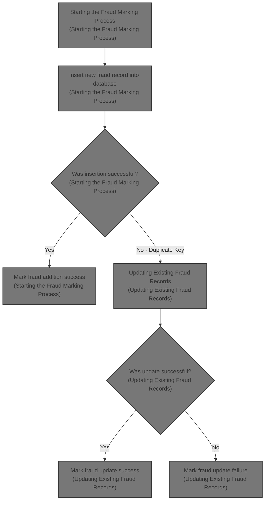
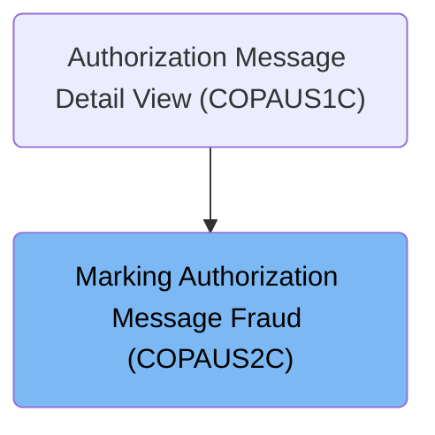

# Overview

This document explains the flow of marking credit card authorization messages as fraudulent by capturing current timestamps and managing fraud records in the database with detailed transaction and merchant information.

## Dependencies

### Program

- COPAUS2C (<SwmPath>[app/…/cbl/COPAUS2C.cbl](app/app-authorization-ims-db2-mq/cbl/COPAUS2C.cbl)</SwmPath>)

### Copybooks

- SQLCA
- AUTHFRDS (<SwmPath>[app/…/dcl/AUTHFRDS.dcl](app/app-authorization-ims-db2-mq/dcl/AUTHFRDS.dcl)</SwmPath>)
- CIPAUDTY (<SwmPath>[app/…/cpy/CIPAUDTY.cpy](app/app-authorization-ims-db2-mq/cpy/CIPAUDTY.cpy)</SwmPath>)

# Where is this program used?

This program is used once, as represented in the following diagram:

&nbsp;

*This is an auto-generated document by Swimm 🌊 and has not yet been verified by a human*

<SwmMeta version="3.0.0" repo-id="Z2l0aHViJTNBJTNBU3dpbW1pby1NRi1DcmVkaXRjYXJkLURlbW8xJTNBJTNBR2lyaS1Td2ltbQ==" repo-name="Swimmio-MF-Creditcard-Demo1">Powered by [Swimm](https://app.swimm.io/)</SwmMeta>
