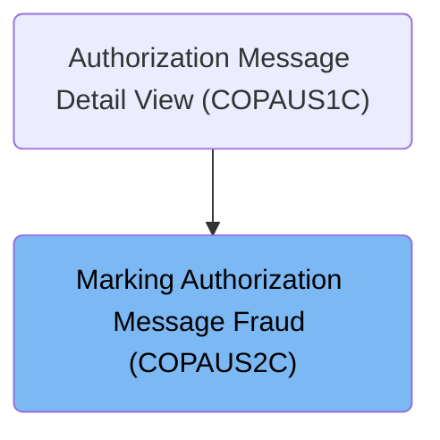

# Overview

## Dependencies

### Program

- <SwmToken path="app/app-authorization-ims-db2-mq/cbl/COPAUS2C.cbl" pos="2:7:7" line-data="      * Program     : COPAUS2C.CBL">`COPAUS2C`</SwmToken> (<SwmPath>[app/…/cbl/COPAUS2C.cbl](app/app-authorization-ims-db2-mq/cbl/COPAUS2C.cbl)</SwmPath>)

### Copybooks

- SQLCA
- AUTHFRDS (<SwmPath>[app/…/dcl/AUTHFRDS.dcl](app/app-authorization-ims-db2-mq/dcl/AUTHFRDS.dcl)</SwmPath>)
- CIPAUDTY (<SwmPath>[app/…/cpy/CIPAUDTY.cpy](app/app-authorization-ims-db2-mq/cpy/CIPAUDTY.cpy)</SwmPath>)

# Where is this program used?

This program is used once, as represented in the following diagram:



# Workflow

# Preparing and Storing Fraud Authorization Data

```mermaid
%%{init: {"flowchart": {"defaultRenderer": "elk"}} }%%
flowchart TD
    node1["Get current time and format date"]
    click node1 openCode "app/app-authorization-ims-db2-mq/cbl/COPAUS2C.cbl:91:100"
    node2["Map authorization data fields to internal variables"]
    click node2 openCode "app/app-authorization-ims-db2-mq/cbl/COPAUS2C.cbl:101:139"
    node3["Insert authorization record into database"]
    click node3 openCode "app/app-authorization-ims-db2-mq/cbl/COPAUS2C.cbl:141:198"
    node4{"Did insert succeed?"}
    click node4 openCode "app/app-authorization-ims-db2-mq/cbl/COPAUS2C.cbl:199:216"
    node4 -->|"Yes"| node5["Mark update success and set success message"]
    click node5 openCode "app/app-authorization-ims-db2-mq/cbl/COPAUS2C.cbl:199:202"
    node4 -->|"No"| node6{"Is error duplicate record (SQLCODE = -803)?"}
    click node6 openCode "app/app-authorization-ims-db2-mq/cbl/COPAUS2C.cbl:203:204"
    node6 -->|"Yes"| node7["Perform fraud update"]
    click node7 openCode "app/app-authorization-ims-db2-mq/cbl/COPAUS2C.cbl:204:205"
    node6 -->|"No"| node8["Mark update failure and log system error"]
    click node8 openCode "app/app-authorization-ims-db2-mq/cbl/COPAUS2C.cbl:206:215"
    node5 --> node9["Return from function"]
    click node9 openCode "app/app-authorization-ims-db2-mq/cbl/COPAUS2C.cbl:218:219"
    node7 --> node9
    node8 --> node9
    node1 --> node2 --> node3 --> node4
classDef HeadingStyle fill:#777777,stroke:#333,stroke-width:2px;

%% Swimm:
%% %%{init: {"flowchart": {"defaultRenderer": "elk"}} }%%
%% flowchart TD
%%     node1["Get current time and format date"]
%%     click node1 openCode "<SwmPath>[app/…/cbl/COPAUS2C.cbl](app/app-authorization-ims-db2-mq/cbl/COPAUS2C.cbl)</SwmPath>:91:100"
%%     node2["Map authorization data fields to internal variables"]
%%     click node2 openCode "<SwmPath>[app/…/cbl/COPAUS2C.cbl](app/app-authorization-ims-db2-mq/cbl/COPAUS2C.cbl)</SwmPath>:101:139"
%%     node3["Insert authorization record into database"]
%%     click node3 openCode "<SwmPath>[app/…/cbl/COPAUS2C.cbl](app/app-authorization-ims-db2-mq/cbl/COPAUS2C.cbl)</SwmPath>:141:198"
%%     node4{"Did insert succeed?"}
%%     click node4 openCode "<SwmPath>[app/…/cbl/COPAUS2C.cbl](app/app-authorization-ims-db2-mq/cbl/COPAUS2C.cbl)</SwmPath>:199:216"
%%     node4 -->|"Yes"| node5["Mark update success and set success message"]
%%     click node5 openCode "<SwmPath>[app/…/cbl/COPAUS2C.cbl](app/app-authorization-ims-db2-mq/cbl/COPAUS2C.cbl)</SwmPath>:199:202"
%%     node4 -->|"No"| node6{"Is error duplicate record (SQLCODE = -803)?"}
%%     click node6 openCode "<SwmPath>[app/…/cbl/COPAUS2C.cbl](app/app-authorization-ims-db2-mq/cbl/COPAUS2C.cbl)</SwmPath>:203:204"
%%     node6 -->|"Yes"| node7["Perform fraud update"]
%%     click node7 openCode "<SwmPath>[app/…/cbl/COPAUS2C.cbl](app/app-authorization-ims-db2-mq/cbl/COPAUS2C.cbl)</SwmPath>:204:205"
%%     node6 -->|"No"| node8["Mark update failure and log system error"]
%%     click node8 openCode "<SwmPath>[app/…/cbl/COPAUS2C.cbl](app/app-authorization-ims-db2-mq/cbl/COPAUS2C.cbl)</SwmPath>:206:215"
%%     node5 --> node9["Return from function"]
%%     click node9 openCode "<SwmPath>[app/…/cbl/COPAUS2C.cbl](app/app-authorization-ims-db2-mq/cbl/COPAUS2C.cbl)</SwmPath>:218:219"
%%     node7 --> node9
%%     node8 --> node9
%%     node1 --> node2 --> node3 --> node4
%% classDef HeadingStyle fill:#777777,stroke:#333,stroke-width:2px;
```



This section prepares and stores fraud authorization data by formatting timestamps, mapping authorization and merchant data fields, and inserting or updating records in the AUTHFRDS database table.

| Category       | Rule Name                         | Description                                                                                                                                             |
| -------------- | --------------------------------- | ------------------------------------------------------------------------------------------------------------------------------------------------------- |
| Business logic | Fraud report date setting         | Set the fraud report date to the current system date at the time of processing the authorization data.                                                  |
| Business logic | Authorization date extraction     | Extract the year, month, and day components from the original authorization date, which is provided in YYMMDD format, for use in fraud data processing. |
| Business logic | Authorization time inversion      | Invert the authorization time by subtracting it from 999999999 to reverse its order for internal processing and sorting purposes.                       |
| Business logic | Data mapping for fraud record     | Map all relevant authorization and merchant data fields from the input to internal variables to prepare for database insertion.                         |
| Business logic | Insert fraud authorization record | Insert a new fraud authorization record into the AUTHFRDS table with all mapped data fields and the current fraud report date.                          |
| Business logic | Mark update success               | If the insert or update operation succeeds, mark the fraud update as successful and set a success message.                                              |
| Technical step | Return control after processing   | Return control to the caller after completing the insert or update operation, with success or failure status set accordingly.                           |

<SwmSnippet path="/app/app-authorization-ims-db2-mq/cbl/COPAUS2C.cbl" line="89">

---

Here we start by getting the current time and formatting it, then set the fraud report date. We extract year, month, and day from the original authorization date, invert the authorization time to reverse its order, and move all relevant authorization and merchant data into working storage variables. This sets up the data for insertion into the AUTHFRDS table.

```cobol
       MAIN-PARA.                                                               
                                                                                
           EXEC CICS ASKTIME NOHANDLE                                           
              ABSTIME(WS-ABS-TIME)                                              
              NOHANDLE                                                          
           END-EXEC                                                             
           EXEC CICS FORMATTIME                                                 
             ABSTIME(WS-ABS-TIME)                                               
             MMDDYY(WS-CUR-DATE)                                                
             DATESEP                                                            
             NOHANDLE                                                           
           END-EXEC                                                             
```

---

</SwmSnippet>

<SwmSnippet path="/app/app-authorization-ims-db2-mq/cbl/COPAUS2C.cbl" line="101">

---

Next we extract year, month, and day from the original authorization date assuming it's in YYMMDD format. We invert the authorization time by subtracting it from 999999999 to reverse its order Then we move all authorization and merchant data fields into working storage variables for the database insert.

```cobol
           MOVE WS-CUR-DATE       TO PA-FRAUD-RPT-DATE                          
                                                                                
           MOVE PA-AUTH-ORIG-DATE(1:2) TO WS-AUTH-YY                            
           MOVE PA-AUTH-ORIG-DATE(3:2) TO WS-AUTH-MM                            
           MOVE PA-AUTH-ORIG-DATE(5:2) TO WS-AUTH-DD                            
                                                                                
           COMPUTE WS-AUTH-TIME = 999999999 - PA-AUTH-TIME-9C                   
           MOVE WS-AUTH-TIME-AN(1:2) TO WS-AUTH-HH                              
           MOVE WS-AUTH-TIME-AN(3:2) TO WS-AUTH-MI                              
           MOVE WS-AUTH-TIME-AN(5:2) TO WS-AUTH-SS                              
           MOVE WS-AUTH-TIME-AN(7:3) TO WS-AUTH-SSS                             
                                                                                
           MOVE PA-CARD-NUM          TO CARD-NUM                                
           MOVE WS-AUTH-TS           TO AUTH-TS                                 
           MOVE PA-AUTH-TYPE         TO AUTH-TYPE                               
           MOVE PA-CARD-EXPIRY-DATE  TO CARD-EXPIRY-DATE                        
           MOVE PA-MESSAGE-TYPE      TO MESSAGE-TYPE                            
           MOVE PA-MESSAGE-SOURCE    TO MESSAGE-SOURCE                          
           MOVE PA-AUTH-ID-CODE      TO AUTH-ID-CODE                            
           MOVE PA-AUTH-RESP-CODE    TO AUTH-RESP-CODE                          
           MOVE PA-AUTH-RESP-REASON  TO AUTH-RESP-REASON                        
           MOVE PA-PROCESSING-CODE   TO PROCESSING-CODE                         
           MOVE PA-TRANSACTION-AMT   TO TRANSACTION-AMT                         
           MOVE PA-APPROVED-AMT      TO APPROVED-AMT                            
           MOVE PA-MERCHANT-CATAGORY-CODE                                       
                                     TO MERCHANT-CATAGORY-CODE                  
           MOVE PA-ACQR-COUNTRY-CODE TO ACQR-COUNTRY-CODE                       
           MOVE PA-POS-ENTRY-MODE    TO POS-ENTRY-MODE                          
           MOVE PA-MERCHANT-ID       TO MERCHANT-ID                             
           MOVE LENGTH OF PA-MERCHANT-NAME TO MERCHANT-NAME-LEN                 
           MOVE PA-MERCHANT-NAME     TO MERCHANT-NAME-TEXT                      
           MOVE PA-MERCHANT-CITY     TO MERCHANT-CITY                           
           MOVE PA-MERCHANT-STATE    TO MERCHANT-STATE                          
           MOVE PA-MERCHANT-ZIP      TO MERCHANT-ZIP                            
           MOVE PA-TRANSACTION-ID    TO TRANSACTION-ID                          
           MOVE PA-MATCH-STATUS      TO MATCH-STATUS                            
           MOVE WS-FRD-ACTION        TO AUTH-FRAUD                              
           MOVE WS-ACCT-ID           TO ACCT-ID                                 
           MOVE WS-CUST-ID           TO CUST-ID                                 
```

---

</SwmSnippet>

<SwmSnippet path="/app/app-authorization-ims-db2-mq/cbl/COPAUS2C.cbl" line="141">

---

Here we execute the SQL insert into the AUTHFRDS table using all the prepared data fields. This is the core step where the fraud authorization data is stored. If the insert fails due to a duplicate key, the flow will handle it later by updating the existing record.

```cobol
           EXEC SQL                                                             
                INSERT INTO CARDDEMO.AUTHFRDS
                      (CARD_NUM                                                 
                      ,AUTH_TS                                                  
                      ,AUTH_TYPE                                                
                      ,CARD_EXPIRY_DATE                                         
                      ,MESSAGE_TYPE                                             
                      ,MESSAGE_SOURCE                                           
                      ,AUTH_ID_CODE                                             
                      ,AUTH_RESP_CODE                                           
                      ,AUTH_RESP_REASON                                         
                      ,PROCESSING_CODE                                          
                      ,TRANSACTION_AMT                                          
                      ,APPROVED_AMT                                             
                      ,MERCHANT_CATAGORY_CODE                                   
                      ,ACQR_COUNTRY_CODE                                        
                      ,POS_ENTRY_MODE                                           
                      ,MERCHANT_ID                                              
                      ,MERCHANT_NAME                                            
                      ,MERCHANT_CITY                                            
                      ,MERCHANT_STATE                                           
                      ,MERCHANT_ZIP                                             
                      ,TRANSACTION_ID                                           
                      ,MATCH_STATUS                                             
                      ,AUTH_FRAUD                                               
                      ,FRAUD_RPT_DATE                                           
                      ,ACCT_ID                                                  
                      ,CUST_ID)                                                 
                  VALUES                                                        
                    ( :CARD-NUM                                                 
                     ,TIMESTAMP_FORMAT (:AUTH-TS,                               
                                        'YY-MM-DD HH24.MI.SSNNNNNN')            
                     ,:AUTH-TYPE                                                
                     ,:CARD-EXPIRY-DATE                                         
                     ,:MESSAGE-TYPE                                             
                     ,:MESSAGE-SOURCE                                           
                     ,:AUTH-ID-CODE                                             
                     ,:AUTH-RESP-CODE                                           
                     ,:AUTH-RESP-REASON                                         
                     ,:PROCESSING-CODE                                          
                     ,:TRANSACTION-AMT                                          
                     ,:APPROVED-AMT                                             
                     ,:MERCHANT-CATAGORY-CODE                                   
                     ,:ACQR-COUNTRY-CODE                                        
                     ,:POS-ENTRY-MODE                                           
                     ,:MERCHANT-ID                                              
                     ,:MERCHANT-NAME                                            
                     ,:MERCHANT-CITY                                            
                     ,:MERCHANT-STATE                                           
                     ,:MERCHANT-ZIP                                             
                     ,:TRANSACTION-ID                                           
                     ,:MATCH-STATUS                                             
                     ,:AUTH-FRAUD                                               
                     ,CURRENT DATE                                              
                     ,:ACCT-ID                                                  
                     ,:CUST-ID                                                  
                    )                                                           
           END-EXEC                                                             
```

---

</SwmSnippet>

<SwmSnippet path="/app/app-authorization-ims-db2-mq/cbl/COPAUS2C.cbl" line="199">

---

After the insert, we check SQLCODE. If zero, we mark success. If -803, we call <SwmToken path="app/app-authorization-ims-db2-mq/cbl/COPAUS2C.cbl" pos="204:3:5" line-data="                 PERFORM FRAUD-UPDATE                                           ">`FRAUD-UPDATE`</SwmToken> to update the existing record. Otherwise, we mark failure and build an error message with SQLCODE and SQLSTATE for diagnostics.

```cobol
           IF SQLCODE = ZERO                                                    
              SET WS-FRD-UPDT-SUCCESS TO TRUE                                   
              MOVE 'ADD SUCCESS'      TO WS-FRD-ACT-MSG                         
           ELSE                                                                 
              IF SQLCODE = -803                                                 
                 PERFORM FRAUD-UPDATE                                           
              ELSE                                                              
                 SET WS-FRD-UPDT-FAILED  TO TRUE                                
                                                                                
                 MOVE SQLCODE            TO WS-SQLCODE                          
                 MOVE SQLSTATE           TO WS-SQLSTATE                         
                                                                                
                 STRING ' SYSTEM ERROR DB2: CODE:' WS-SQLCODE                   
                        ', STATE: ' WS-SQLSTATE   DELIMITED BY SIZE             
                 INTO WS-FRD-ACT-MSG                                            
                 END-STRING                                                     
              END-IF                                                            
```

---

</SwmSnippet>

<SwmSnippet path="/app/app-authorization-ims-db2-mq/cbl/COPAUS2C.cbl" line="216">

---

Finally we end <SwmToken path="app/app-authorization-ims-db2-mq/cbl/COPAUS2C.cbl" pos="89:1:3" line-data="       MAIN-PARA.                                                               ">`MAIN-PARA`</SwmToken> by returning control to the caller with EXEC CICS RETURN, after setting success or failure flags based on the insert or update outcome.

```cobol
           END-IF                                                               
                                                                                
           EXEC CICS RETURN                                                     
           END-EXEC                                                             
```

---

</SwmSnippet>

&nbsp;

*This is an auto-generated document by Swimm 🌊 and has not yet been verified by a human*

<SwmMeta version="3.0.0" repo-id="Z2l0aHViJTNBJTNBU3dpbW1pby1NRi1DcmVkaXRjYXJkLURlbW8xJTNBJTNBR2lyaS1Td2ltbQ==" repo-name="Swimmio-MF-Creditcard-Demo1"><sup>Powered by [Swimm](https://app.swimm.io/)</sup></SwmMeta>
