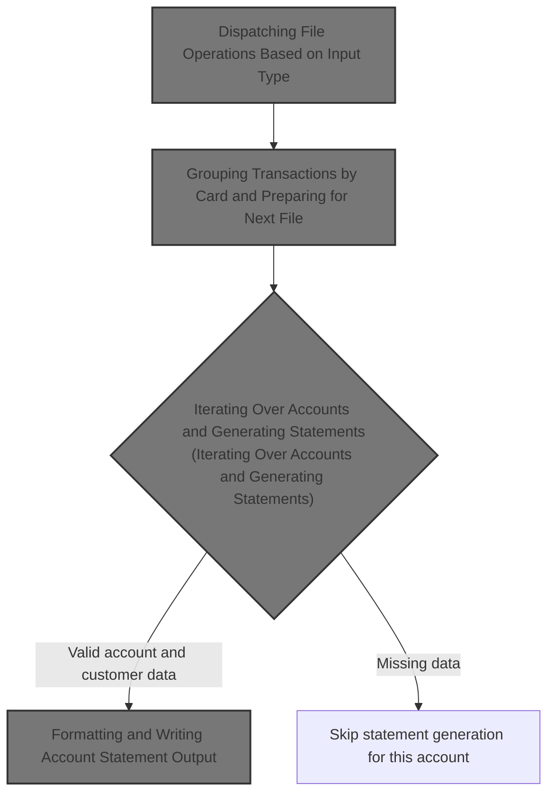
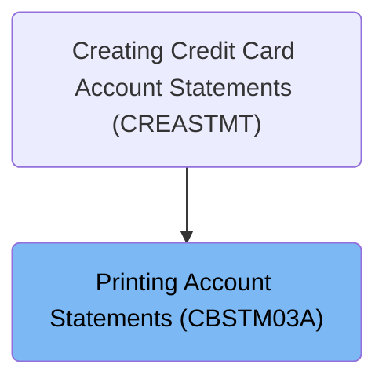

# Overview

This document describes the flow for generating credit card account statements. The process aggregates transaction records by card, retrieves customer and account information, and produces formatted statements in both text and HTML formats.

## Dependencies

### Programs

- CBSTM03A (<SwmPath>[app/cbl/CBSTM03A.CBL](app/cbl/CBSTM03A.CBL)</SwmPath>)
- CBSTM03B (<SwmPath>[app/cbl/CBSTM03B.CBL](app/cbl/CBSTM03B.CBL)</SwmPath>)
- CEE3ABD

### Copybooks

- COSTM01 (<SwmPath>[app/cpy/COSTM01.CPY](app/cpy/COSTM01.CPY)</SwmPath>)
- CVACT03Y (<SwmPath>[app/cpy/CVACT03Y.cpy](app/cpy/CVACT03Y.cpy)</SwmPath>)
- CUSTREC (<SwmPath>[app/cpy/CUSTREC.cpy](app/cpy/CUSTREC.cpy)</SwmPath>)
- CVACT01Y (<SwmPath>[app/cpy/CVACT01Y.cpy](app/cpy/CVACT01Y.cpy)</SwmPath>)

# Where is this program used?

This program is used once, as represented in the following diagram:

&nbsp;

*This is an auto-generated document by Swimm 🌊 and has not yet been verified by a human*

<SwmMeta version="3.0.0" repo-id="Z2l0aHViJTNBJTNBU3dpbW1pby1NRi1DcmVkaXRjYXJkLURlbW8xJTNBJTNBR2lyaS1Td2ltbQ==" repo-name="Swimmio-MF-Creditcard-Demo1">Powered by [Swimm](https://app.swimm.io/)</SwmMeta>
