# Overview

This document describes the flow for generating credit card account statements. The process takes transaction, customer, account, and cross-reference data, groups transactions by card, retrieves relevant customer and account details, and produces formatted statements in both plain text and HTML.

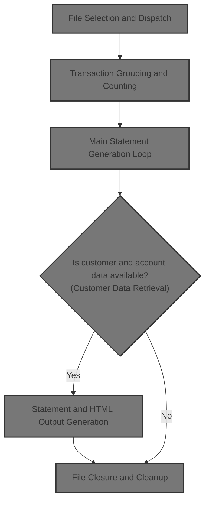

## Dependencies

### Programs

- <SwmToken path="app/cbl/CBSTM03A.CBL" pos="2:6:6" line-data="       PROGRAM-ID.    CBSTM03A.">`CBSTM03A`</SwmToken> (<SwmPath>[app/cbl/CBSTM03A.CBL](app/cbl/CBSTM03A.CBL)</SwmPath>)
- <SwmToken path="app/cbl/CBSTM03A.CBL" pos="351:4:4" line-data="           CALL &#39;CBSTM03B&#39; USING WS-M03B-AREA.">`CBSTM03B`</SwmToken> (<SwmPath>[app/cbl/CBSTM03B.CBL](app/cbl/CBSTM03B.CBL)</SwmPath>)
- <SwmToken path="app/cbl/CBSTM03A.CBL" pos="923:4:4" line-data="           CALL &#39;CEE3ABD&#39;.">`CEE3ABD`</SwmToken>

### Copybooks

- <SwmToken path="app/cbl/CBSTM03A.CBL" pos="51:3:3" line-data="       COPY COSTM01.">`COSTM01`</SwmToken> (<SwmPath>[app/cpy/COSTM01.CPY](app/cpy/COSTM01.CPY)</SwmPath>)
- <SwmToken path="app/cbl/CBSTM03A.CBL" pos="53:3:3" line-data="       COPY CVACT03Y.">`CVACT03Y`</SwmToken> (<SwmPath>[app/cpy/CVACT03Y.cpy](app/cpy/CVACT03Y.cpy)</SwmPath>)
- CUSTREC (<SwmPath>[app/cpy/CUSTREC.cpy](app/cpy/CUSTREC.cpy)</SwmPath>)
- <SwmToken path="app/cbl/CBSTM03A.CBL" pos="57:3:3" line-data="       COPY CVACT01Y.">`CVACT01Y`</SwmToken> (<SwmPath>[app/cpy/CVACT01Y.cpy](app/cpy/CVACT01Y.cpy)</SwmPath>)

# Where is this program used?

This program is used once, as represented in the following diagram:

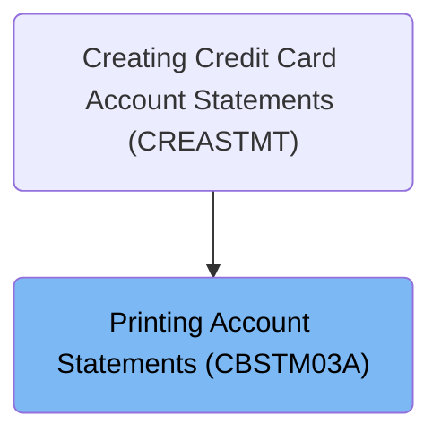

## Input and Output Tables/Files used in the Program

| Table / File Name                                                                                                                                 | Type | Description                                 | Usage Mode | Key Fields / Layout Highlights |
| ------------------------------------------------------------------------------------------------------------------------------------------------- | ---- | ------------------------------------------- | ---------- | ------------------------------ |
| <SwmToken path="app/cbl/CBSTM03A.CBL" pos="440:3:7" line-data="           WRITE FD-HTMLFILE-REC FROM HTML-FIXED-LN.">`FD-HTMLFILE-REC`</SwmToken> | File | Record for HTML statement line output       | Output     | File resource                  |
| <SwmToken path="app/cbl/CBSTM03A.CBL" pos="435:3:7" line-data="           WRITE FD-STMTFILE-REC FROM ST-LINE12.">`FD-STMTFILE-REC`</SwmToken>     | File | Record for plain text statement line output | Output     | File resource                  |
| <SwmToken path="app/cbl/CBSTM03A.CBL" pos="293:5:7" line-data="           OPEN OUTPUT STMT-FILE HTML-FILE.">`STMT-FILE`</SwmToken>                | File | Plain text account statement output file    | Output     | File resource                  |

&nbsp;

## Detailed View of the Program's Functionality

# Program Initialization and Mainframe Control Block Setup

At the start, the program sets up pointers to the mainframe control blocks, which are essential for accessing job and step information in the JCL environment. It does this by assigning addresses for the PSA, TCB, and TIOT blocks. Once these pointers are set, the program displays the current job and step names to indicate which JCL job and step are running.

Next, the program prepares to walk through the TIOT entries, which represent the DD (Data Definition) names allocated to the job. It displays a header for the DD names and then enters a loop to process each TIOT entry.

# Inspection of DD Names and UCB Validity

The program loops through each DD name in the TIOT structure. For each entry, it checks if the associated Unit Control Block (UCB) is valid or null. If the UCB is valid, it displays the DD name as valid; if not, it displays it as null. This loop continues until the end of the TIOT entries is reached.

After the loop, the program performs one final check on the last TIOT entry to ensure its UCB status is displayed. This guarantees that all DD names and their statuses are reported.

# File Preparation for Transaction Processing

Once the DD name inspection is complete, the program opens the output files for statement and HTML generation. It also initializes the in-memory tables used for transaction grouping and counting. This sets the stage for the main processing logic.

# File Selection and Dispatch

The program uses a dispatcher mechanism to determine which file or process type to handle next. It evaluates a control variable to decide whether to process the transaction file, cross-reference file, customer file, account file, or to begin reading transactions. Based on the value, it alters the jump point and dispatches to the appropriate file open or read routine. If the value does not match any known type, the program exits.

# Transaction File Open and Initial Read

When the transaction file is selected, the program sets up the file open request and calls a subroutine to perform the actual open operation. It checks the return code to ensure the file was opened successfully. If the open fails, it aborts with an error message.

After opening, the program immediately attempts to read the first transaction record. If the read is successful, it prepares the transaction record by saving the card number, initializing counters, and setting up for transaction grouping. If the read fails, it aborts.

# Transaction Grouping and Counting

The program enters a loop to read and group transaction records by card number. For each transaction record, it checks if the card number matches the previous one. If it does, it increments the transaction count for the current card group. If not, it stores the transaction count for the previous card, starts a new card group, and resets the counter.

Each transaction's card number and details are saved into in-memory arrays. The program continues reading records until the end of the file is reached or an error occurs. When the end of the file is detected, it finalizes the last card group and transitions to processing the cross-reference file.

# Main Statement Generation Loop

The program enters its main processing loop, which continues until all cross-reference records are processed. For each cross-reference record, it retrieves the next record and checks for end-of-file. If not at the end, it proceeds to retrieve customer and account data, generate the statement, and process transactions for the account.

# Customer Data Retrieval

Using the customer ID from the cross-reference record, the program sets up a keyed read for the customer file and calls the subroutine to fetch the record. It checks the return code to ensure the record was found. If not, it aborts with an error message. If successful, it makes the customer record available for further processing.

# Account Data Retrieval

Similarly, the program uses the account ID from the cross-reference record to set up a keyed read for the account file. It calls the subroutine to fetch the account record and checks the return code. If the record is not found, it aborts. If successful, it makes the account record available for statement generation.

# Statement and HTML Output Generation

The program initializes the statement lines and writes the first record to the output file. It then calls a routine to write the HTML header, setting up the structure for the HTML output.

Next, it builds the full name and address strings for the statement, moves account and credit score data into the output fields, and writes the main HTML section with customer and account data. This includes formatted paragraphs for each data field and structured HTML table rows.

After preparing the data, the program writes all the statement lines to the output file, finalizing the statement output for the current account.

# Transaction Matching and Statement Detailing

For each card in the card list, the program checks if the card matches the current cross-reference record. If it does, it processes each transaction for that card, adds the transaction amount to the total, and writes the transaction details to both the statement and HTML outputs.

After all transactions for the card are processed, the program aggregates the total transaction amount, writes summary lines to the statement, and outputs the closing HTML tags to finalize the report.

# File Closure and Cleanup

Once all processing is complete, the program closes all files used during the run. For each file (transaction, cross-reference, customer, account), it sets up the close request and calls the subroutine to perform the actual close operation. It checks the return code for each close operation and aborts if any close fails. Finally, it closes the statement and HTML output files, ensuring all data is properly written and finalized.

# Error Handling and Program Termination

Throughout the program, error handling is performed after each file operation. If any file open, read, or close operation fails, the program displays an error message with the return code and aborts execution. The program terminates cleanly when all processing is complete or if an unrecoverable error occurs.

# Rule Definition

| Paragraph Name                         | Rule ID | Category          | Description                                                                                                                                                                                                                                                                                                  | Conditions                                                                                                                | Remarks                                                                                                                                                                                                                                                                                                                                                                                            |
| -------------------------------------- | ------- | ----------------- | ------------------------------------------------------------------------------------------------------------------------------------------------------------------------------------------------------------------------------------------------------------------------------------------------------------ | ------------------------------------------------------------------------------------------------------------------------- | -------------------------------------------------------------------------------------------------------------------------------------------------------------------------------------------------------------------------------------------------------------------------------------------------------------------------------------------------------------------------------------------------- |
| 266-291                                | RL-001  | Conditional Logic | The program must inspect the JCL environment and display the job name, step name, and DD names for the running job. For each DD name, it must indicate whether the DD is valid or null based on the UCB status.                                                                                              | Program is running in a mainframe batch environment; TIOT and UCB control blocks are accessible.                          | Output format: Displayed strings showing job name, step name, and DD name with status ('valid UCB' or 'null UCB'). No specific field sizes required for display.                                                                                                                                                                                                                                   |
| 818-853                                | RL-002  | Computation       | The program reads transaction records sequentially, grouping transactions by card number. For each card, up to 10 transactions are stored in memory, and the transaction count is tracked per card. Up to 51 cards may be grouped in memory.                                                                 | Transaction records are available; card grouping does not exceed 51 cards; transaction count per card does not exceed 10. | Memory limits: 51 cards, 10 transactions per card. Transaction details stored: card number, transaction ID, transaction rest (details).                                                                                                                                                                                                                                                            |
| 317-328, 345-366, 368-391, 392-415     | RL-003  | Conditional Logic | The program processes cross-reference records sequentially. For each, it retrieves the corresponding customer record using customer ID and account record using account ID. If either retrieval fails, processing stops for that record.                                                                     | Cross-reference record is available; customer/account retrieval returns success code.                                     | Retrieval uses subroutine <SwmToken path="app/cbl/CBSTM03A.CBL" pos="351:4:4" line-data="           CALL &#39;CBSTM03B&#39; USING WS-M03B-AREA.">`CBSTM03B`</SwmToken> with <SwmToken path="app/cbl/CBSTM03A.CBL" pos="371:5:7" line-data="           SET M03B-READ-K TO TRUE.">`READ-K`</SwmToken> operation. If retrieval fails, program displays error and abends.                              |
| 458-505, 506-556, 558-673              | RL-004  | Data Assignment   | For each account, the program generates a statement in both plain text and HTML formats, including customer name and address, account ID, current balance, FICO score, transaction summary table, and total transaction amount. Headers, sections, and footers are formatted as described in output samples. | Customer and account records are successfully retrieved; transactions are available for the account.                      | Plain text: 80-character lines, fixed field sizes for name, address, account info, transaction details. HTML: structured tags, sections, and tables as defined in <SwmToken path="app/cbl/CBSTM03A.CBL" pos="148:3:5" line-data="       01  HTML-LINES.">`HTML-LINES`</SwmToken>. Output must match sample formats.                                                                                |
| 416-457, 675-724                       | RL-005  | Computation       | The program matches transactions to the current account using card number, aggregates transaction amounts, and outputs each transaction detail to both statement formats.                                                                                                                                    | Transactions are grouped and available for the current card/account.                                                      | Transaction details: ID, description, amount. Aggregation: sum of transaction amounts per account. Output: details written to both plain text and HTML formats.                                                                                                                                                                                                                                    |
| 331-339, 856-920                       | RL-006  | Conditional Logic | After processing all records, the program must close all files used in the process, ensuring all output is finalized.                                                                                                                                                                                        | End of processing; all records have been handled.                                                                         | Files to close: TRNXFILE, XREFFILE, CUSTFILE, ACCTFILE, <SwmToken path="app/cbl/CBSTM03A.CBL" pos="293:5:7" line-data="           OPEN OUTPUT STMT-FILE HTML-FILE.">`STMT-FILE`</SwmToken>, <SwmToken path="app/cbl/CBSTM03A.CBL" pos="293:9:11" line-data="           OPEN OUTPUT STMT-FILE HTML-FILE.">`HTML-FILE`</SwmToken>. Return codes checked for successful close.                        |
| 43-47, 58-79, 225-234, 85-147, 148-224 | RL-007  | Data Assignment   | The program must preserve the record sizes and field order for file compatibility, ensuring that output and intermediate data structures match expected formats.                                                                                                                                             | Any file read/write or output operation.                                                                                  | Record sizes: <SwmToken path="app/cbl/CBSTM03A.CBL" pos="293:5:7" line-data="           OPEN OUTPUT STMT-FILE HTML-FILE.">`STMT-FILE`</SwmToken> (80 bytes), <SwmToken path="app/cbl/CBSTM03A.CBL" pos="293:9:11" line-data="           OPEN OUTPUT STMT-FILE HTML-FILE.">`HTML-FILE`</SwmToken> (100 bytes), transaction and account records as defined. Field order must match file definitions. |
| 298-315                                | RL-008  | Conditional Logic | The program must select and dispatch file operations based on the value of the requested file or process type. Supported types are transaction file, cross-reference file, customer file, account file, and transaction read operation. Each type routes to the appropriate file open or read routine.       | The dispatch variable is set to a supported file or process type.                                                         | Supported values: transaction file, cross-reference file, customer file, account file, transaction read operation. Dispatch uses control flow statements to route to the correct paragraph.                                                                                                                                                                                                        |
| 730-762                                | RL-009  | Conditional Logic | When opening the transaction file, the program must verify successful open and read the first transaction record. If successful, it initializes card grouping and counters: sets the current card number, sets card count to 1, and transaction count to 0.                                                  | The dispatch variable is set to transaction file; file open and read return code is success or warning.                   | Return codes: success, success with warning. Card grouping: first card number is saved, card count = 1, transaction count = 0.                                                                                                                                                                                                                                                                     |

# User Stories

## User Story 1: Job Environment Inspection and Initialization

---

### Story Description:

As a mainframe operator, I want to inspect the JCL environment, view job and DD name information, select and dispatch file operations, and initialize card grouping and counters, so that the batch job starts with the correct setup and environment validation.

---

### Business Rule Mapping:

| Rule ID | Paragraph Name | Rule Description                                                                                                                                                                                                                                                                                       |
| ------- | -------------- | ------------------------------------------------------------------------------------------------------------------------------------------------------------------------------------------------------------------------------------------------------------------------------------------------------ |
| RL-001  | 266-291        | The program must inspect the JCL environment and display the job name, step name, and DD names for the running job. For each DD name, it must indicate whether the DD is valid or null based on the UCB status.                                                                                        |
| RL-008  | 298-315        | The program must select and dispatch file operations based on the value of the requested file or process type. Supported types are transaction file, cross-reference file, customer file, account file, and transaction read operation. Each type routes to the appropriate file open or read routine. |
| RL-009  | 730-762        | When opening the transaction file, the program must verify successful open and read the first transaction record. If successful, it initializes card grouping and counters: sets the current card number, sets card count to 1, and transaction count to 0.                                            |

---

### Relevant Functionality:

- **266-291**
  1. **RL-001:**
     - Set addressability to PSA, TCB, and TIOT blocks
     - Display job and step names
     - Loop through TIOT entries:
       - For each DD name, check UCB status
       - Display DD name and whether UCB is valid or null
- **298-315**
  1. **RL-008:**
     - Evaluate the dispatch variable
     - For each supported value, alter control flow and go to the corresponding file open/read paragraph
     - If value is not supported, go to program end
- **730-762**
  1. **RL-009:**
     - Set the dispatch variable to transaction file, set open flag
     - Call subroutine to open file
     - If open is successful, set read flag and call subroutine to read first record
     - If read is successful, move record to transaction buffer
     - Initialize card grouping: save current card number, set card count to 1, transaction count to 0
     - Set dispatch variable to transaction read operation and restart dispatch

## User Story 2: Process Transactions and Cross-References

---

### Story Description:

As a system, I want to read transaction records sequentially, group transactions by card number, process cross-reference records to retrieve customer and account data, and match transactions to accounts, so that I can aggregate transaction data and prepare for statement generation.

---

### Business Rule Mapping:

| Rule ID | Paragraph Name                     | Rule Description                                                                                                                                                                                                                             |
| ------- | ---------------------------------- | -------------------------------------------------------------------------------------------------------------------------------------------------------------------------------------------------------------------------------------------- |
| RL-002  | 818-853                            | The program reads transaction records sequentially, grouping transactions by card number. For each card, up to 10 transactions are stored in memory, and the transaction count is tracked per card. Up to 51 cards may be grouped in memory. |
| RL-003  | 317-328, 345-366, 368-391, 392-415 | The program processes cross-reference records sequentially. For each, it retrieves the corresponding customer record using customer ID and account record using account ID. If either retrieval fails, processing stops for that record.     |
| RL-005  | 416-457, 675-724                   | The program matches transactions to the current account using card number, aggregates transaction amounts, and outputs each transaction detail to both statement formats.                                                                    |

---

### Relevant Functionality:

- **818-853**
  1. **RL-002:**
     - For each transaction record:
       - If card number matches previous, increment transaction count
       - Else, save transaction count for previous card, increment card count, reset transaction count
       - Store card number, transaction ID, and details in memory
     - On end of file, save final transaction count
- **317-328**
  1. **RL-003:**
     - Loop until end of cross-reference file
       - Get next cross-reference record
       - Retrieve customer record by customer ID
       - Retrieve account record by account ID
       - If either retrieval fails, display error and abend
       - If both succeed, proceed to statement creation
- **416-457**
  1. **RL-005:**
     - For each card/account:
       - Loop through grouped transactions
       - Output transaction details to statement files
       - Add transaction amount to total
     - After all transactions, write total amount to output

## User Story 3: Generate Account Statements

---

### Story Description:

As an account holder, I want to receive statements in both plain text and HTML formats that include my name, address, account details, FICO score, and a summary of my transactions, so that I can review my account activity in a clear and accessible format.

---

### Business Rule Mapping:

| Rule ID | Paragraph Name            | Rule Description                                                                                                                                                                                                                                                                                             |
| ------- | ------------------------- | ------------------------------------------------------------------------------------------------------------------------------------------------------------------------------------------------------------------------------------------------------------------------------------------------------------ |
| RL-004  | 458-505, 506-556, 558-673 | For each account, the program generates a statement in both plain text and HTML formats, including customer name and address, account ID, current balance, FICO score, transaction summary table, and total transaction amount. Headers, sections, and footers are formatted as described in output samples. |
| RL-005  | 416-457, 675-724          | The program matches transactions to the current account using card number, aggregates transaction amounts, and outputs each transaction detail to both statement formats.                                                                                                                                    |

---

### Relevant Functionality:

- **458-505**
  1. **RL-004:**
     - Initialize statement lines
     - Write header and customer/account details to output files
     - Format and write transaction summary table
     - Write total transaction amount and footer
     - For HTML, use predefined tags and structure for output
- **416-457**
  1. **RL-005:**
     - For each card/account:
       - Loop through grouped transactions
       - Output transaction details to statement files
       - Add transaction amount to total
     - After all transactions, write total amount to output

## User Story 4: Finalize Output and Ensure File Compatibility

---

### Story Description:

As a system, I want to close all files used in the process, finalize all output, and preserve record sizes and field order, so that data integrity is maintained and file compatibility with other mainframe processes is ensured.

---

### Business Rule Mapping:

| Rule ID | Paragraph Name                         | Rule Description                                                                                                                                                 |
| ------- | -------------------------------------- | ---------------------------------------------------------------------------------------------------------------------------------------------------------------- |
| RL-006  | 331-339, 856-920                       | After processing all records, the program must close all files used in the process, ensuring all output is finalized.                                            |
| RL-007  | 43-47, 58-79, 225-234, 85-147, 148-224 | The program must preserve the record sizes and field order for file compatibility, ensuring that output and intermediate data structures match expected formats. |

---

### Relevant Functionality:

- **331-339**
  1. **RL-006:**
     - For each file:
       - Set DD and close flag
       - Call subroutine to close file
       - Check return code; if not successful, display error and abend
     - Close output files
- **43-47**
  1. **RL-007:**
     - Define file and record layouts with fixed sizes
     - Assign and move data to output buffers according to field order
     - Write records to files using defined formats

# Workflow

# Setup and JCL Environment Inspection

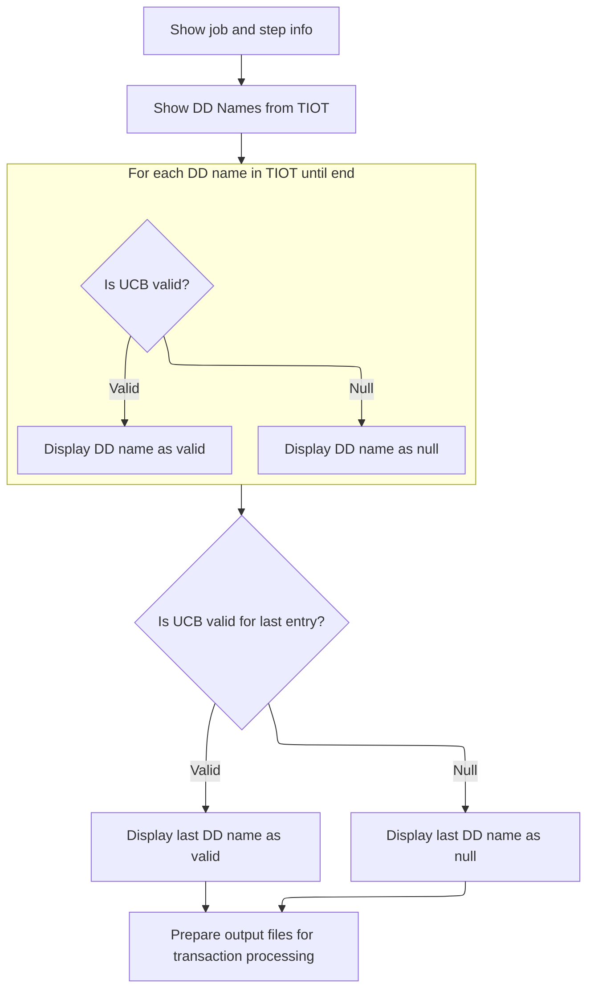

This section provides visibility into the JCL environment by reporting the job, step, and all DD names available to the running job, along with their accessibility status. It ensures that only valid DD names are considered for subsequent processing and that output files are properly initialized.

| Category        | Rule Name                  | Description                                                                                                                          |
| --------------- | -------------------------- | ------------------------------------------------------------------------------------------------------------------------------------ |
| Data validation | UCB validity check         | A DD name must be marked as 'valid' only if its associated UCB is not null; otherwise, it must be marked as 'null'.                  |
| Business logic  | Display job and step info  | The system must display the current JCL job name and step name at the start of the inspection process.                               |
| Business logic  | DD name status reporting   | All DD names defined in the TIOT must be listed, and for each, the system must indicate whether the associated UCB is valid or null. |
| Business logic  | Output file initialization | Once the inspection is complete, the system must initialize all output files required for subsequent transaction processing.         |

<SwmSnippet path="/app/cbl/CBSTM03A.CBL" line="262">

---

In PROCEDURE-DIVISION, the flow starts by setting up pointers to the mainframe control blocks (PSA, TCB, TIOT) and then uses these to walk through the TIOT entries. This lets the program access and display the current JCL job and step, and prepares to check all DD names and their associated UCBs for the running job. The code assumes the TIOT and UCB structures are laid out as expected, and that special values like <SwmToken path="app/cbl/CBSTM03A.CBL" pos="277:9:11" line-data="                      OR TIO-LEN = LOW-VALUES">`LOW-VALUES`</SwmToken> indicate nulls or end-of-list.

```cobol
       PROCEDURE DIVISION.
      *****************************************************************
      *    Check Unit Control blocks                                  *
      *****************************************************************
           SET ADDRESS OF PSA-BLOCK   TO PSAPTR.
           SET ADDRESS OF TCB-BLOCK   TO TCB-POINT.
           SET ADDRESS OF TIOT-BLOCK  TO TIOT-POINT.
           SET TIOT-INDEX             TO TIOT-POINT.
           DISPLAY 'Running JCL : ' TIOTNJOB ' Step ' TIOTJSTP.

           COMPUTE BUMP-TIOT = BUMP-TIOT + LENGTH OF TIOT-BLOCK.
           SET ADDRESS OF TIOT-ENTRY  TO TIOT-INDEX.

           DISPLAY 'DD Names from TIOT: '.
```

---

</SwmSnippet>

<SwmSnippet path="/app/cbl/CBSTM03A.CBL" line="276">

---

Next, the code loops through all TIOT entries, checking if each DD name has a valid or null UCB and displaying the result. This is how it reports which files are actually available to the job at runtime.

```cobol
           PERFORM UNTIL END-OF-TIOT
                      OR TIO-LEN = LOW-VALUES
               IF NOT NULL-UCB
                   DISPLAY ': ' TIOCDDNM ' -- valid UCB'
               ELSE
                   DISPLAY ': ' TIOCDDNM ' --  null UCB'
               END-IF
               COMPUTE BUMP-TIOT = BUMP-TIOT + LENGTH OF TIOT-SEG
               SET ADDRESS OF TIOT-ENTRY TO TIOT-INDEX
           END-PERFORM.
```

---

</SwmSnippet>

<SwmSnippet path="/app/cbl/CBSTM03A.CBL" line="287">

---

After the loop, there's one more check for UCB validity on the current TIOT entry, just to make sure the last DD name's status is displayed.

```cobol
           IF NOT NULL-UCB
               DISPLAY ': ' TIOCDDNM ' -- valid UCB'
           ELSE
               DISPLAY ': ' TIOCDDNM ' -- null  UCB'
           END-IF.
```

---

</SwmSnippet>

<SwmSnippet path="/app/cbl/CBSTM03A.CBL" line="293">

---

After setup, it opens files and jumps to the main processing entry point.

```cobol
           OPEN OUTPUT STMT-FILE HTML-FILE.
           INITIALIZE WS-TRNX-TABLE WS-TRN-TBL-CNTR.

       0000-START.
```

---

</SwmSnippet>

# File Selection and Dispatch

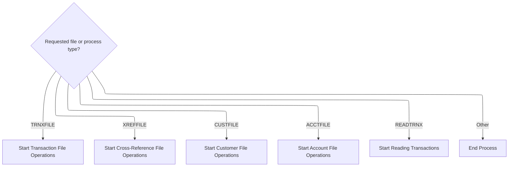

This section governs how the application selects and dispatches the appropriate file operation or process based on a requested file or process type. It ensures that only supported file types or operations are processed, and that unrecognized requests are safely terminated.

| Category       | Rule Name                      | Description                                                                                                    |
| -------------- | ------------------------------ | -------------------------------------------------------------------------------------------------------------- |
| Business logic | Transaction File Selection     | If the requested file or process type is 'TRNXFILE', the system must initiate transaction file operations.     |
| Business logic | Cross-Reference File Selection | If the requested file or process type is 'XREFFILE', the system must initiate cross-reference file operations. |
| Business logic | Customer File Selection        | If the requested file or process type is 'CUSTFILE', the system must initiate customer file operations.        |
| Business logic | Account File Selection         | If the requested file or process type is 'ACCTFILE', the system must initiate account file operations.         |
| Business logic | Transaction Reading Selection  | If the requested file or process type is 'READTRNX', the system must initiate the transaction reading process. |

<SwmSnippet path="/app/cbl/CBSTM03A.CBL" line="296">

---

<SwmToken path="app/cbl/CBSTM03A.CBL" pos="296:1:3" line-data="       0000-START.">`0000-START`</SwmToken> checks <SwmToken path="app/cbl/CBSTM03A.CBL" pos="298:3:7" line-data="           EVALUATE WS-FL-DD">`WS-FL-DD`</SwmToken> and jumps to the right file open or read routine using ALTER/GO TO. If it's a known file type, it sets up the jump and goes to <SwmToken path="app/cbl/CBSTM03A.CBL" pos="300:3:7" line-data="               ALTER 8100-FILE-OPEN TO PROCEED TO 8100-TRNXFILE-OPEN">`8100-FILE-OPEN`</SwmToken> (or the equivalent), otherwise it exits. This is how the program dispatches to the right file handler.

```cobol
       0000-START.

           EVALUATE WS-FL-DD
             WHEN 'TRNXFILE'
               ALTER 8100-FILE-OPEN TO PROCEED TO 8100-TRNXFILE-OPEN
               GO TO 8100-FILE-OPEN
             WHEN 'XREFFILE'
               ALTER 8100-FILE-OPEN TO PROCEED TO 8200-XREFFILE-OPEN
               GO TO 8100-FILE-OPEN
             WHEN 'CUSTFILE'
               ALTER 8100-FILE-OPEN TO PROCEED TO 8300-CUSTFILE-OPEN
               GO TO 8100-FILE-OPEN
             WHEN 'ACCTFILE'
               ALTER 8100-FILE-OPEN TO PROCEED TO 8400-ACCTFILE-OPEN
               GO TO 8100-FILE-OPEN
             WHEN 'READTRNX'
               GO TO 8500-READTRNX-READ
             WHEN OTHER
               GO TO 9999-GOBACK.
```

---

</SwmSnippet>

# Transaction File Open Routing

This section governs the routing logic for opening transaction files within the <SwmToken path="app/cbl/CBSTM03A.CBL" pos="6:7:7" line-data="      * Application : CardDemo">`CardDemo`</SwmToken> mainframe credit card management application. It ensures that when a request to open a transaction file is received, the process is directed to the appropriate file open routine, maintaining the integrity and consistency of transaction processing.

| Category       | Rule Name                               | Description                                                                                                                                                                        |
| -------------- | --------------------------------------- | ---------------------------------------------------------------------------------------------------------------------------------------------------------------------------------- |
| Business logic | Transaction File Open Routing           | When a request to open a transaction file is initiated, the system must always route the request to the designated transaction file open routine.                                  |
| Business logic | Separation of Concerns for File Opening | The system must not perform any additional processing or validation at the routing point; all logic related to opening the file must be handled by the specific file open routine. |

<SwmSnippet path="/app/cbl/CBSTM03A.CBL" line="726">

---

<SwmToken path="app/cbl/CBSTM03A.CBL" pos="726:1:5" line-data="       8100-FILE-OPEN.">`8100-FILE-OPEN`</SwmToken> is just a jump point—after the dispatcher sets it up, it jumps straight to the specific file open routine, here <SwmToken path="app/cbl/CBSTM03A.CBL" pos="727:5:9" line-data="           GO TO 8100-TRNXFILE-OPEN">`8100-TRNXFILE-OPEN`</SwmToken>.

```cobol
       8100-FILE-OPEN.
           GO TO 8100-TRNXFILE-OPEN
           .
```

---

</SwmSnippet>

# Transaction File Open and Read

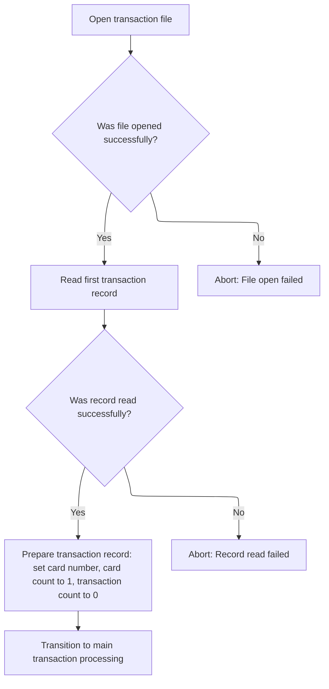

This section governs the initial loading of transaction data by ensuring the transaction file is accessible and the first record is available for processing. It establishes the foundational state for all subsequent transaction processing by validating file access and initializing key counters and variables.

| Category        | Rule Name                       | Description                                                                                                                                                                                     |
| --------------- | ------------------------------- | ----------------------------------------------------------------------------------------------------------------------------------------------------------------------------------------------- |
| Data validation | Transaction file open required  | The transaction file must be opened successfully before any transaction processing can begin. If the file cannot be opened, the process is aborted and an error is reported to the user.        |
| Data validation | First record read required      | The first transaction record must be read successfully from the file before proceeding. If the read fails, the process is aborted and an error is reported.                                     |
| Business logic  | Initial counters and card setup | Upon successful read of the first transaction record, the card number must be saved, the card count initialized to 1, and the transaction count initialized to 0 before main processing begins. |

<SwmSnippet path="/app/cbl/CBSTM03A.CBL" line="730">

---

In <SwmToken path="app/cbl/CBSTM03A.CBL" pos="730:1:5" line-data="       8100-TRNXFILE-OPEN.">`8100-TRNXFILE-OPEN`</SwmToken>, the code sets up for opening the transaction file and calls <SwmToken path="app/cbl/CBSTM03A.CBL" pos="734:4:4" line-data="           CALL &#39;CBSTM03B&#39; USING WS-M03B-AREA.">`CBSTM03B`</SwmToken> to actually do the open. It checks the return code and only continues if the open was successful or had a minor warning.

```cobol
       8100-TRNXFILE-OPEN.
           MOVE 'TRNXFILE' TO WS-M03B-DD.
           SET M03B-OPEN TO TRUE.
           MOVE ZERO TO WS-M03B-RC.
           CALL 'CBSTM03B' USING WS-M03B-AREA.

           IF WS-M03B-RC = '00' OR '04'
               CONTINUE
           ELSE
               DISPLAY 'ERROR OPENING TRNXFILE'
               DISPLAY 'RETURN CODE: ' WS-M03B-RC
               PERFORM 9999-ABEND-PROGRAM
           END-IF.
```

---

</SwmSnippet>

<SwmSnippet path="/app/cbl/CBSTM03B.CBL" line="116">

---

<SwmToken path="app/cbl/CBSTM03B.CBL" pos="116:1:3" line-data="       0000-START.">`0000-START`</SwmToken> in <SwmPath>[app/cbl/CBSTM03B.CBL](app/cbl/CBSTM03B.CBL)</SwmPath> uses a dispatcher variable to pick which file handler block to run, so all file open/read/close logic is centralized and modular.

```cobol
       0000-START.

           EVALUATE LK-M03B-DD
             WHEN 'TRNXFILE'
               PERFORM 1000-TRNXFILE-PROC THRU 1999-EXIT
             WHEN 'XREFFILE'
               PERFORM 2000-XREFFILE-PROC THRU 2999-EXIT
             WHEN 'CUSTFILE'
               PERFORM 3000-CUSTFILE-PROC THRU 3999-EXIT
             WHEN 'ACCTFILE'
               PERFORM 4000-ACCTFILE-PROC THRU 4999-EXIT
             WHEN OTHER
               GO TO 9999-GOBACK.
```

---

</SwmSnippet>

<SwmSnippet path="/app/cbl/CBSTM03A.CBL" line="744">

---

Back in <SwmToken path="app/cbl/CBSTM03A.CBL" pos="300:15:19" line-data="               ALTER 8100-FILE-OPEN TO PROCEED TO 8100-TRNXFILE-OPEN">`8100-TRNXFILE-OPEN`</SwmToken>, after returning from <SwmToken path="app/cbl/CBSTM03A.CBL" pos="746:4:4" line-data="           CALL &#39;CBSTM03B&#39; USING WS-M03B-AREA.">`CBSTM03B`</SwmToken>, the code checks if the read worked (return code '00' or '04'). If not, it aborts. This keeps file I/O handling consistent and centralized.

```cobol
           SET M03B-READ TO TRUE.
           MOVE SPACES TO WS-M03B-FLDT.
           CALL 'CBSTM03B' USING WS-M03B-AREA.

           IF WS-M03B-RC = '00' OR '04'
               CONTINUE
           ELSE
               DISPLAY 'ERROR READING TRNXFILE'
               DISPLAY 'RETURN CODE: ' WS-M03B-RC
               PERFORM 9999-ABEND-PROGRAM
           END-IF.
```

---

</SwmSnippet>

<SwmSnippet path="/app/cbl/CBSTM03A.CBL" line="756">

---

After opening and reading the transaction file, this part sets up counters and saves the card number, then sets the file flag to 'READTRNX' and jumps back to <SwmToken path="app/cbl/CBSTM03A.CBL" pos="761:5:7" line-data="           GO TO 0000-START.">`0000-START`</SwmToken> to kick off transaction grouping.

```cobol
           MOVE WS-M03B-FLDT TO TRNX-RECORD.
           MOVE TRNX-CARD-NUM TO WS-SAVE-CARD.
           MOVE 1 TO CR-CNT.
           MOVE 0 TO TR-CNT.
           MOVE 'READTRNX' TO WS-FL-DD.
           GO TO 0000-START.
           EXIT.
```

---

</SwmSnippet>

# Transaction Grouping and Counting

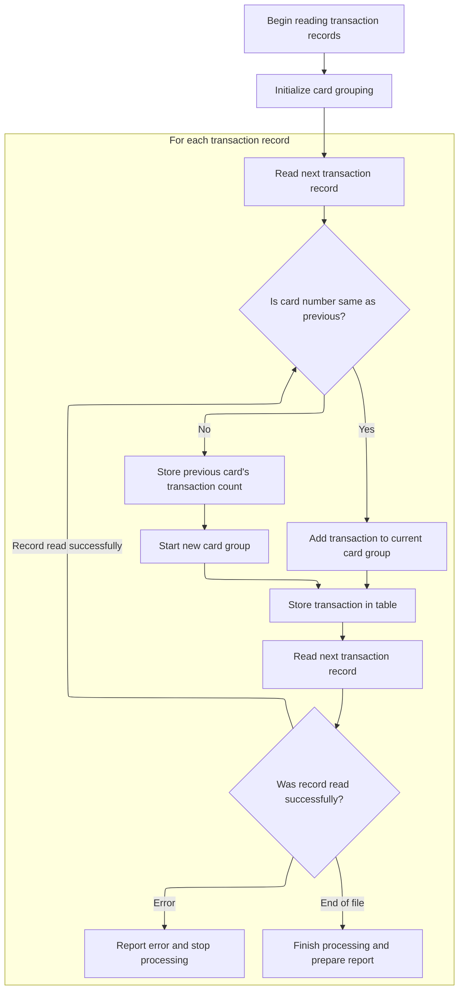

This section is responsible for grouping transaction records by card number and counting the number of transactions for each card. It ensures that all transactions for a given card are collected together and that the total count per card is accurately maintained for reporting and downstream processing.

| Category        | Rule Name                            | Description                                                                                                                                                                                               |
| --------------- | ------------------------------------ | --------------------------------------------------------------------------------------------------------------------------------------------------------------------------------------------------------- |
| Data validation | Enforce group and transaction limits | A maximum of 51 card groups and 10 transactions per card group can be stored. If these limits are exceeded, additional transactions or card groups are not processed.                                     |
| Business logic  | Group by card number                 | Each transaction must be assigned to a group based on its card number. Transactions with the same card number are grouped together.                                                                       |
| Business logic  | Count transactions per card          | For each card group, the total number of transactions must be counted and stored.                                                                                                                         |
| Business logic  | Start new group on card change       | If a transaction record's card number does not match the previous record's card number, the current group is closed, its transaction count is stored, and a new group is started for the new card number. |
| Business logic  | Finalize last group at end of file   | If the end of the transaction file is reached, the last card group's transaction count must be stored and the grouping process must be finalized.                                                         |

<SwmSnippet path="/app/cbl/CBSTM03A.CBL" line="818">

---

In <SwmToken path="app/cbl/CBSTM03A.CBL" pos="818:1:5" line-data="       8500-READTRNX-READ.">`8500-READTRNX-READ`</SwmToken>, the code checks if the current transaction matches the previous card number. If so, it bumps the transaction count; if not, it stores the count for the last card and starts a new group. This is how it builds up the in-memory grouping of transactions by card.

```cobol
       8500-READTRNX-READ.
           IF WS-SAVE-CARD = TRNX-CARD-NUM
               ADD 1 TO TR-CNT
           ELSE
               MOVE TR-CNT TO WS-TRCT (CR-CNT)
               ADD 1 TO CR-CNT
               MOVE 1 TO TR-CNT
           END-IF.
```

---

</SwmSnippet>

<SwmSnippet path="/app/cbl/CBSTM03A.CBL" line="827">

---

Next, the code saves the current transaction's card number and details into the arrays, then calls <SwmToken path="app/cbl/CBSTM03A.CBL" pos="835:4:4" line-data="           CALL &#39;CBSTM03B&#39; USING WS-M03B-AREA.">`CBSTM03B`</SwmToken> to read the next record. This is how it builds up the grouped transaction data in memory.

```cobol
           MOVE TRNX-CARD-NUM TO WS-CARD-NUM (CR-CNT).
           MOVE TRNX-ID TO WS-TRAN-NUM (CR-CNT, TR-CNT).
           MOVE TRNX-REST TO WS-TRAN-REST (CR-CNT, TR-CNT).
           MOVE TRNX-CARD-NUM TO WS-SAVE-CARD.

           MOVE 'TRNXFILE' TO WS-M03B-DD.
           SET M03B-READ TO TRUE.
           MOVE SPACES TO WS-M03B-FLDT.
           CALL 'CBSTM03B' USING WS-M03B-AREA.
```

---

</SwmSnippet>

<SwmSnippet path="/app/cbl/CBSTM03A.CBL" line="837">

---

After returning from <SwmToken path="app/cbl/CBSTM03A.CBL" pos="351:4:4" line-data="           CALL &#39;CBSTM03B&#39; USING WS-M03B-AREA.">`CBSTM03B`</SwmToken> in <SwmToken path="app/cbl/CBSTM03A.CBL" pos="840:5:9" line-data="               GO TO 8500-READTRNX-READ">`8500-READTRNX-READ`</SwmToken>, the code checks the return code: if it's '00', it loops to read the next record; if it's '10', it jumps to <SwmToken path="app/cbl/CBSTM03A.CBL" pos="842:5:7" line-data="               GO TO 8599-EXIT">`8599-EXIT`</SwmToken> to finish up; otherwise, it aborts. This is how it handles end-of-file and errors cleanly.

```cobol
           EVALUATE WS-M03B-RC
             WHEN '00'
               MOVE WS-M03B-FLDT TO TRNX-RECORD
               GO TO 8500-READTRNX-READ
             WHEN '10'
               GO TO 8599-EXIT
             WHEN OTHER
               DISPLAY 'ERROR READING TRNXFILE'
               DISPLAY 'RETURN CODE: ' WS-M03B-RC
               PERFORM 9999-ABEND-PROGRAM
           END-EVALUATE.
```

---

</SwmSnippet>

<SwmSnippet path="/app/cbl/CBSTM03A.CBL" line="849">

---

This wraps up transaction grouping and triggers the next file phase.

```cobol
       8599-EXIT.
           MOVE TR-CNT TO WS-TRCT (CR-CNT).
           MOVE 'XREFFILE' TO WS-FL-DD.
           GO TO 0000-START.
           EXIT.
```

---

</SwmSnippet>

# Main Statement Generation Loop

```mermaid
%%{init: {"flowchart": {"defaultRenderer": "elk"}} }%%
flowchart TD
    node1["Start processing credit card accounts"]
    click node1 openCode "app/cbl/CBSTM03A.CBL:316:316"
    subgraph loop1["For each cross-reference record until END-OF-FILE = 'Y'"]
      node1 --> node2{"Is END-OF-FILE = 'N'?"}
      click node2 openCode "app/cbl/CBSTM03A.CBL:317:318"
      node2 -->|"Yes"| node3["Read next cross-reference record"]
      click node3 openCode "app/cbl/CBSTM03A.CBL:319:320"
      node3 --> node4{"Is END-OF-FILE = 'N' after read?"}
      click node4 openCode "app/cbl/CBSTM03A.CBL:320:320"
      node4 -->|"Yes"| node5["Customer Data Retrieval"]
      
      node5 --> node6["Account Data Retrieval"]
      
      node6 --> node7["Statement and HTML Output Generation"]
      
      node7 --> node8["Transaction Matching and Statement Detailing"]
      
      node8 --> node2
      node4 -->|"No"| node2
    end
    node2 -->|"No"| node9["Close all files"]
    click node9 openCode "app/cbl/CBSTM03A.CBL:331:339"

classDef HeadingStyle fill:#777777,stroke:#333,stroke-width:2px;
click node5 goToHeading "Customer Data Retrieval"
node5:::HeadingStyle
click node6 goToHeading "Account Data Retrieval"
node6:::HeadingStyle
click node7 goToHeading "Statement and HTML Output Generation"
node7:::HeadingStyle
click node8 goToHeading "Transaction Matching and Statement Detailing"
node8:::HeadingStyle

%% Swimm:
%% %%{init: {"flowchart": {"defaultRenderer": "elk"}} }%%
%% flowchart TD
%%     node1["Start processing credit card accounts"]
%%     click node1 openCode "<SwmPath>[app/cbl/CBSTM03A.CBL](app/cbl/CBSTM03A.CBL)</SwmPath>:316:316"
%%     subgraph loop1["For each cross-reference record until <SwmToken path="app/cbl/CBSTM03A.CBL" pos="317:5:9" line-data="           PERFORM UNTIL END-OF-FILE = &#39;Y&#39;">`END-OF-FILE`</SwmToken> = 'Y'"]
%%       node1 --> node2{"Is <SwmToken path="app/cbl/CBSTM03A.CBL" pos="317:5:9" line-data="           PERFORM UNTIL END-OF-FILE = &#39;Y&#39;">`END-OF-FILE`</SwmToken> = 'N'?"}
%%       click node2 openCode "<SwmPath>[app/cbl/CBSTM03A.CBL](app/cbl/CBSTM03A.CBL)</SwmPath>:317:318"
%%       node2 -->|"Yes"| node3["Read next cross-reference record"]
%%       click node3 openCode "<SwmPath>[app/cbl/CBSTM03A.CBL](app/cbl/CBSTM03A.CBL)</SwmPath>:319:320"
%%       node3 --> node4{"Is <SwmToken path="app/cbl/CBSTM03A.CBL" pos="317:5:9" line-data="           PERFORM UNTIL END-OF-FILE = &#39;Y&#39;">`END-OF-FILE`</SwmToken> = 'N' after read?"}
%%       click node4 openCode "<SwmPath>[app/cbl/CBSTM03A.CBL](app/cbl/CBSTM03A.CBL)</SwmPath>:320:320"
%%       node4 -->|"Yes"| node5["Customer Data Retrieval"]
%%       
%%       node5 --> node6["Account Data Retrieval"]
%%       
%%       node6 --> node7["Statement and HTML Output Generation"]
%%       
%%       node7 --> node8["Transaction Matching and Statement Detailing"]
%%       
%%       node8 --> node2
%%       node4 -->|"No"| node2
%%     end
%%     node2 -->|"No"| node9["Close all files"]
%%     click node9 openCode "<SwmPath>[app/cbl/CBSTM03A.CBL](app/cbl/CBSTM03A.CBL)</SwmPath>:331:339"
%% 
%% classDef HeadingStyle fill:#777777,stroke:#333,stroke-width:2px;
%% click node5 goToHeading "Customer Data Retrieval"
%% node5:::HeadingStyle
%% click node6 goToHeading "Account Data Retrieval"
%% node6:::HeadingStyle
%% click node7 goToHeading "Statement and HTML Output Generation"
%% node7:::HeadingStyle
%% click node8 goToHeading "Transaction Matching and Statement Detailing"
%% node8:::HeadingStyle
```

The Main Statement Generation Loop is responsible for iterating through all credit card account cross-reference records, retrieving the necessary customer and account data, generating formatted statements, and appending transaction details for each account. This ensures that every active account receives a complete and accurate statement for the processing period.

| Category        | Rule Name                        | Description                                                                                                                                         |
| --------------- | -------------------------------- | --------------------------------------------------------------------------------------------------------------------------------------------------- |
| Data validation | Data Retrieval Requirement       | If customer or account data cannot be retrieved for a record, statement generation for that account must not proceed and an error must be reported. |
| Business logic  | Statement for Each Account       | A statement must be generated for every cross-reference record unless the end-of-file condition is reached.                                         |
| Business logic  | Statement Content Requirements   | Each generated statement must include the customer's name, address, account ID, current balance, and FICO credit score.                             |
| Business logic  | Transaction Inclusion and Totals | All transactions for the account must be matched and included in the statement, with totals calculated and displayed.                               |
| Business logic  | Multi-format Statement Output    | Statements must be produced in both plain text and HTML formats for each account processed.                                                         |

<SwmSnippet path="/app/cbl/CBSTM03A.CBL" line="316">

---

In <SwmToken path="app/cbl/CBSTM03A.CBL" pos="316:1:3" line-data="       1000-MAINLINE.">`1000-MAINLINE`</SwmToken>, the code loops until all cross-reference records are processed. For each, it fetches the next record, then pulls customer and account data, creates the statement, and processes transactions. The loop is driven by <SwmToken path="app/cbl/CBSTM03A.CBL" pos="317:5:9" line-data="           PERFORM UNTIL END-OF-FILE = &#39;Y&#39;">`END-OF-FILE`</SwmToken>.

```cobol
       1000-MAINLINE.
           PERFORM UNTIL END-OF-FILE = 'Y'
               IF  END-OF-FILE = 'N'
                   PERFORM 1000-XREFFILE-GET-NEXT
                   IF  END-OF-FILE = 'N'
                       PERFORM 2000-CUSTFILE-GET
                       PERFORM 3000-ACCTFILE-GET
                       PERFORM 5000-CREATE-STATEMENT
                       MOVE 1 TO CR-JMP
                       MOVE ZERO TO WS-TOTAL-AMT
                       PERFORM 4000-TRNXFILE-GET
                   END-IF
               END-IF
           END-PERFORM.
```

---

</SwmSnippet>

<SwmSnippet path="/app/cbl/CBSTM03A.CBL" line="345">

---

<SwmToken path="app/cbl/CBSTM03A.CBL" pos="345:1:7" line-data="       1000-XREFFILE-GET-NEXT.">`1000-XREFFILE-GET-NEXT`</SwmToken> sets up for reading the next cross-reference record and calls <SwmToken path="app/cbl/CBSTM03A.CBL" pos="351:4:4" line-data="           CALL &#39;CBSTM03B&#39; USING WS-M03B-AREA.">`CBSTM03B`</SwmToken> to do the read. It checks the return code for end-of-file or errors, and moves the result into the working record.

```cobol
       1000-XREFFILE-GET-NEXT.

           MOVE 'XREFFILE' TO WS-M03B-DD.
           SET M03B-READ TO TRUE.
           MOVE ZERO TO WS-M03B-RC.
           MOVE SPACES TO WS-M03B-FLDT.
           CALL 'CBSTM03B' USING WS-M03B-AREA.

           EVALUATE WS-M03B-RC
             WHEN '00'
               CONTINUE
             WHEN '10'
               MOVE 'Y' TO END-OF-FILE
             WHEN OTHER
               DISPLAY 'ERROR READING XREFFILE'
               DISPLAY 'RETURN CODE: ' WS-M03B-RC
               PERFORM 9999-ABEND-PROGRAM
           END-EVALUATE.

           MOVE WS-M03B-FLDT TO CARD-XREF-RECORD.

           EXIT.
```

---

</SwmSnippet>

## Customer Data Retrieval

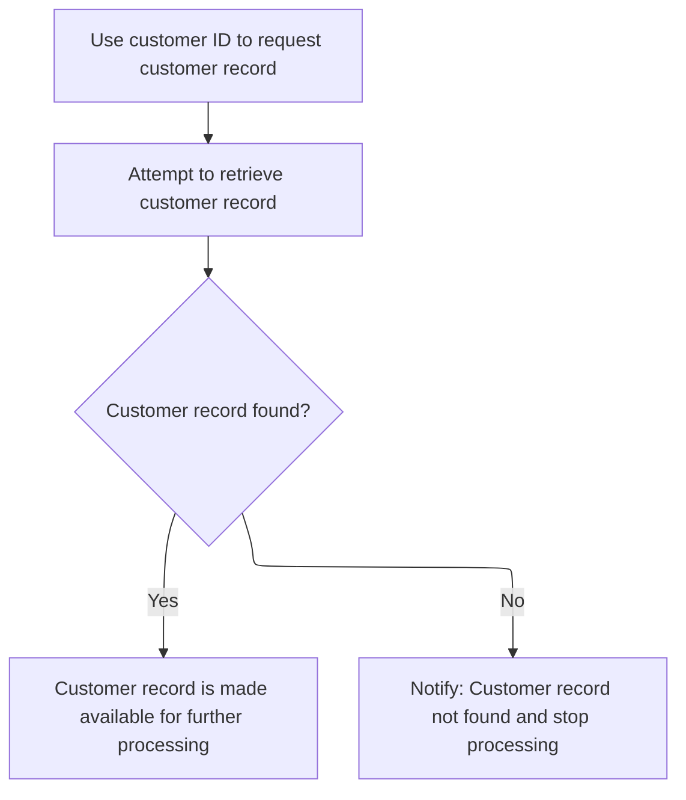

The main product role of this section is to ensure that customer data can be reliably retrieved using a customer ID, and to handle cases where the customer record does not exist. This is critical for downstream processes that depend on accurate customer information.

| Category        | Rule Name                         | Description                                                                                                                                          |
| --------------- | --------------------------------- | ---------------------------------------------------------------------------------------------------------------------------------------------------- |
| Data validation | Customer ID Existence Requirement | A customer record must be retrieved using a valid customer ID. If the customer ID does not exist in the system, no customer record will be returned. |
| Business logic  | Customer Record Availability      | If a customer record is found, it must be made available for all subsequent business processes that require customer information.                    |

<SwmSnippet path="/app/cbl/CBSTM03A.CBL" line="368">

---

In <SwmToken path="app/cbl/CBSTM03A.CBL" pos="368:1:5" line-data="       2000-CUSTFILE-GET.">`2000-CUSTFILE-GET`</SwmToken>, the code sets up a keyed read for the customer file using the customer ID from the cross-reference, then calls <SwmToken path="app/cbl/CBSTM03A.CBL" pos="377:4:4" line-data="           CALL &#39;CBSTM03B&#39; USING WS-M03B-AREA.">`CBSTM03B`</SwmToken> to fetch the record.

```cobol
       2000-CUSTFILE-GET.

           MOVE 'CUSTFILE' TO WS-M03B-DD.
           SET M03B-READ-K TO TRUE.
           MOVE XREF-CUST-ID TO WS-M03B-KEY.
           MOVE ZERO TO WS-M03B-KEY-LN.
           COMPUTE WS-M03B-KEY-LN = LENGTH OF XREF-CUST-ID.
           MOVE ZERO TO WS-M03B-RC.
           MOVE SPACES TO WS-M03B-FLDT.
           CALL 'CBSTM03B' USING WS-M03B-AREA.
```

---

</SwmSnippet>

<SwmSnippet path="/app/cbl/CBSTM03A.CBL" line="379">

---

After returning from <SwmToken path="app/cbl/CBSTM03A.CBL" pos="351:4:4" line-data="           CALL &#39;CBSTM03B&#39; USING WS-M03B-AREA.">`CBSTM03B`</SwmToken> in <SwmToken path="app/cbl/CBSTM03A.CBL" pos="321:3:7" line-data="                       PERFORM 2000-CUSTFILE-GET">`2000-CUSTFILE-GET`</SwmToken>, the code checks the return code and aborts if the read failed. If successful, it moves the result into <SwmToken path="app/cbl/CBSTM03A.CBL" pos="388:11:13" line-data="           MOVE WS-M03B-FLDT TO CUSTOMER-RECORD.">`CUSTOMER-RECORD`</SwmToken> for use in statement generation.

```cobol
           EVALUATE WS-M03B-RC
             WHEN '00'
               CONTINUE
             WHEN OTHER
               DISPLAY 'ERROR READING CUSTFILE'
               DISPLAY 'RETURN CODE: ' WS-M03B-RC
               PERFORM 9999-ABEND-PROGRAM
           END-EVALUATE.

           MOVE WS-M03B-FLDT TO CUSTOMER-RECORD.

           EXIT.
```

---

</SwmSnippet>

## Account Data Retrieval

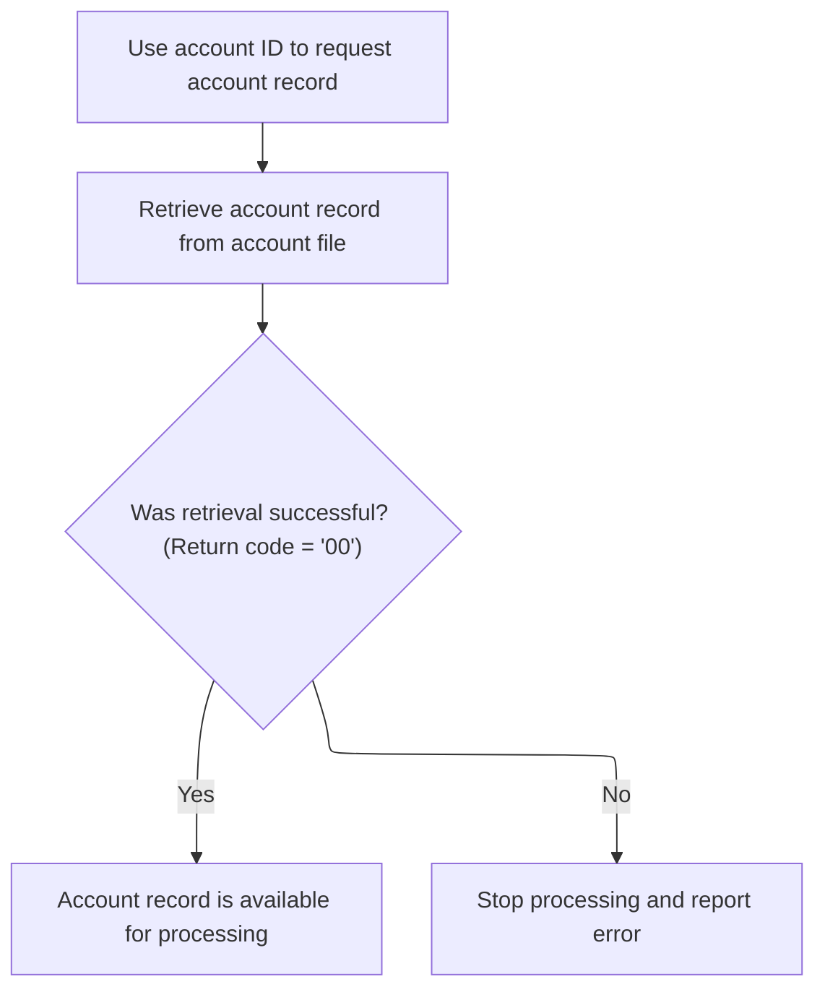

The main product role of this section is to ensure that the correct account record is retrieved for a given account ID, enabling subsequent processing such as statement generation or account management. If the account record cannot be retrieved, the process is halted and an error is reported.

| Category        | Rule Name                               | Description                                                                                                                                    |
| --------------- | --------------------------------------- | ---------------------------------------------------------------------------------------------------------------------------------------------- |
| Data validation | Valid account ID required               | An account record must be retrieved using a valid account ID. If the account ID is missing or invalid, the retrieval process must not proceed. |
| Data validation | Account record matches account ID       | The account record retrieved must correspond exactly to the account ID provided, ensuring data consistency and accuracy.                       |
| Business logic  | Successful retrieval enables processing | If the account record is successfully retrieved (return code '00'), the record must be made available for further business processing.         |

<SwmSnippet path="/app/cbl/CBSTM03A.CBL" line="392">

---

In <SwmToken path="app/cbl/CBSTM03A.CBL" pos="392:1:5" line-data="       3000-ACCTFILE-GET.">`3000-ACCTFILE-GET`</SwmToken>, the code sets up a keyed read for the account file using the account ID from the cross-reference, then calls <SwmToken path="app/cbl/CBSTM03A.CBL" pos="401:4:4" line-data="           CALL &#39;CBSTM03B&#39; USING WS-M03B-AREA.">`CBSTM03B`</SwmToken> to fetch the record.

```cobol
       3000-ACCTFILE-GET.

           MOVE 'ACCTFILE' TO WS-M03B-DD.
           SET M03B-READ-K TO TRUE.
           MOVE XREF-ACCT-ID TO WS-M03B-KEY.
           MOVE ZERO TO WS-M03B-KEY-LN.
           COMPUTE WS-M03B-KEY-LN = LENGTH OF XREF-ACCT-ID.
           MOVE ZERO TO WS-M03B-RC.
           MOVE SPACES TO WS-M03B-FLDT.
           CALL 'CBSTM03B' USING WS-M03B-AREA.
```

---

</SwmSnippet>

<SwmSnippet path="/app/cbl/CBSTM03A.CBL" line="403">

---

After returning from <SwmToken path="app/cbl/CBSTM03A.CBL" pos="351:4:4" line-data="           CALL &#39;CBSTM03B&#39; USING WS-M03B-AREA.">`CBSTM03B`</SwmToken> in <SwmToken path="app/cbl/CBSTM03A.CBL" pos="322:3:7" line-data="                       PERFORM 3000-ACCTFILE-GET">`3000-ACCTFILE-GET`</SwmToken>, the code checks the return code and aborts if the read failed. If successful, it moves the result into <SwmToken path="app/cbl/CBSTM03A.CBL" pos="412:11:13" line-data="           MOVE WS-M03B-FLDT TO ACCOUNT-RECORD.">`ACCOUNT-RECORD`</SwmToken> for use in statement generation.

```cobol
           EVALUATE WS-M03B-RC
             WHEN '00'
               CONTINUE
             WHEN OTHER
               DISPLAY 'ERROR READING ACCTFILE'
               DISPLAY 'RETURN CODE: ' WS-M03B-RC
               PERFORM 9999-ABEND-PROGRAM
           END-EVALUATE.

           MOVE WS-M03B-FLDT TO ACCOUNT-RECORD.

           EXIT.
```

---

</SwmSnippet>

## Statement and HTML Output Generation

This section creates the core outputs for the credit card statement process, ensuring that both human-readable (plain text) and web-friendly (HTML) versions are generated for each account. It ensures all required customer and account information is included and formatted according to business presentation standards.

| Category        | Rule Name                      | Description                                                                                                                                                                                      |
| --------------- | ------------------------------ | ------------------------------------------------------------------------------------------------------------------------------------------------------------------------------------------------ |
| Data validation | Required Statement Fields      | The statement and HTML output must include the customer's full name, address (up to three lines), account ID, current balance, and FICO credit score for each account.                           |
| Data validation | Dynamic Account ID Insertion   | The account ID must be dynamically inserted into both the statement and HTML outputs for each account processed.                                                                                 |
| Business logic  | HTML Structure and Readability | The HTML output must use paragraph tags for each data field and include section headers and separators to ensure readability and consistent presentation.                                        |
| Business logic  | Statement Format Consistency   | The statement output must use fixed-width lines, with specific lines reserved for section headers, separators, and transaction summaries, to maintain a consistent format across all statements. |
| Business logic  | Section Header Requirement     | Section headers such as 'Basic Details' and 'TRANSACTION SUMMARY' must be present in both outputs to clearly delineate statement sections.                                                       |

<SwmSnippet path="/app/cbl/CBSTM03A.CBL" line="458">

---

In <SwmToken path="app/cbl/CBSTM03A.CBL" pos="458:1:5" line-data="       5000-CREATE-STATEMENT.">`5000-CREATE-STATEMENT`</SwmToken>, the code initializes the statement lines, writes the first record, and then calls <SwmToken path="app/cbl/CBSTM03A.CBL" pos="461:3:9" line-data="           PERFORM 5100-WRITE-HTML-HEADER THRU 5100-EXIT.">`5100-WRITE-HTML-HEADER`</SwmToken> to start the HTML output. This sets up both output formats from the start.

```cobol
       5000-CREATE-STATEMENT.
           INITIALIZE STATEMENT-LINES.
           WRITE FD-STMTFILE-REC FROM ST-LINE0.
           PERFORM 5100-WRITE-HTML-HEADER THRU 5100-EXIT.
```

---

</SwmSnippet>

<SwmSnippet path="/app/cbl/CBSTM03A.CBL" line="506">

---

<SwmToken path="app/cbl/CBSTM03A.CBL" pos="506:1:7" line-data="       5100-WRITE-HTML-HEADER.">`5100-WRITE-HTML-HEADER`</SwmToken> writes the HTML header by setting specific flags for each line, which loads the right HTML string and writes it out. The account ID is inserted dynamically in one line. This modularizes the HTML output.

```cobol
       5100-WRITE-HTML-HEADER.

           SET HTML-L01 TO TRUE.
           WRITE FD-HTMLFILE-REC FROM HTML-FIXED-LN.
           SET HTML-L02 TO TRUE.
           WRITE FD-HTMLFILE-REC FROM HTML-FIXED-LN.
           SET HTML-L03 TO TRUE.
           WRITE FD-HTMLFILE-REC FROM HTML-FIXED-LN.
           SET HTML-L04 TO TRUE.
           WRITE FD-HTMLFILE-REC FROM HTML-FIXED-LN.
           SET HTML-L05 TO TRUE.
           WRITE FD-HTMLFILE-REC FROM HTML-FIXED-LN.
           SET HTML-L06 TO TRUE.
           WRITE FD-HTMLFILE-REC FROM HTML-FIXED-LN.
           SET HTML-L07 TO TRUE.
           WRITE FD-HTMLFILE-REC FROM HTML-FIXED-LN.
           SET HTML-L08 TO TRUE.
           WRITE FD-HTMLFILE-REC FROM HTML-FIXED-LN.
           SET HTML-LTRS TO TRUE.
           WRITE FD-HTMLFILE-REC FROM HTML-FIXED-LN.
           SET HTML-L10 TO TRUE.
           WRITE FD-HTMLFILE-REC FROM HTML-FIXED-LN.

           MOVE ACCT-ID TO L11-ACCT.
           WRITE FD-HTMLFILE-REC FROM HTML-L11.
           SET HTML-LTDE TO TRUE.
           WRITE FD-HTMLFILE-REC FROM HTML-FIXED-LN.
           SET HTML-LTRE TO TRUE.
           WRITE FD-HTMLFILE-REC FROM HTML-FIXED-LN.
           SET HTML-LTRS TO TRUE.
           WRITE FD-HTMLFILE-REC FROM HTML-FIXED-LN.
           SET HTML-L15 TO TRUE.
           WRITE FD-HTMLFILE-REC FROM HTML-FIXED-LN.
           SET HTML-L16 TO TRUE.
           WRITE FD-HTMLFILE-REC FROM HTML-FIXED-LN.
           SET HTML-L17 TO TRUE.
           WRITE FD-HTMLFILE-REC FROM HTML-FIXED-LN.
           SET HTML-L18 TO TRUE.
           WRITE FD-HTMLFILE-REC FROM HTML-FIXED-LN.
           SET HTML-LTDE TO TRUE.
           WRITE FD-HTMLFILE-REC FROM HTML-FIXED-LN.
           SET HTML-LTRE TO TRUE.
           WRITE FD-HTMLFILE-REC FROM HTML-FIXED-LN.
           SET HTML-LTRS TO TRUE.
           WRITE FD-HTMLFILE-REC FROM HTML-FIXED-LN.
           SET HTML-L22-35 TO TRUE.
           WRITE FD-HTMLFILE-REC FROM HTML-FIXED-LN.
```

---

</SwmSnippet>

<SwmSnippet path="/app/cbl/CBSTM03A.CBL" line="462">

---

After returning from <SwmToken path="app/cbl/CBSTM03A.CBL" pos="461:3:9" line-data="           PERFORM 5100-WRITE-HTML-HEADER THRU 5100-EXIT.">`5100-WRITE-HTML-HEADER`</SwmToken> in <SwmToken path="app/cbl/CBSTM03A.CBL" pos="323:3:7" line-data="                       PERFORM 5000-CREATE-STATEMENT">`5000-CREATE-STATEMENT`</SwmToken>, the code builds up the full name and address strings for the statement, and moves account and credit score data into the output fields. This preps all the data for output.

```cobol
           STRING CUST-FIRST-NAME DELIMITED BY ' '
                  ' ' DELIMITED BY SIZE
                  CUST-MIDDLE-NAME DELIMITED BY ' '
                  ' ' DELIMITED BY SIZE
                  CUST-LAST-NAME DELIMITED BY ' '
                  ' ' DELIMITED BY SIZE
                  INTO ST-NAME
           END-STRING.
           MOVE CUST-ADDR-LINE-1 TO ST-ADD1.
           MOVE CUST-ADDR-LINE-2 TO ST-ADD2.
           STRING CUST-ADDR-LINE-3 DELIMITED BY ' '
                  ' ' DELIMITED BY SIZE
                  CUST-ADDR-STATE-CD DELIMITED BY ' '
                  ' ' DELIMITED BY SIZE
                  CUST-ADDR-COUNTRY-CD DELIMITED BY ' '
                  ' ' DELIMITED BY SIZE
                  CUST-ADDR-ZIP DELIMITED BY ' '
                  ' ' DELIMITED BY SIZE
                  INTO ST-ADD3
           END-STRING.

           MOVE ACCT-ID TO ST-ACCT-ID.
           MOVE ACCT-CURR-BAL TO ST-CURR-BAL.
           MOVE CUST-FICO-CREDIT-SCORE TO ST-FICO-SCORE.
```

---

</SwmSnippet>

<SwmSnippet path="/app/cbl/CBSTM03A.CBL" line="486">

---

Next, the code calls <SwmToken path="app/cbl/CBSTM03A.CBL" pos="486:3:9" line-data="           PERFORM 5200-WRITE-HTML-NMADBS THRU 5200-EXIT.">`5200-WRITE-HTML-NMADBS`</SwmToken> to write the main HTML section with the customer and account data, right after the header.

```cobol
           PERFORM 5200-WRITE-HTML-NMADBS THRU 5200-EXIT.
```

---

</SwmSnippet>

<SwmSnippet path="/app/cbl/CBSTM03A.CBL" line="558">

---

<SwmToken path="app/cbl/CBSTM03A.CBL" pos="558:1:7" line-data="       5200-WRITE-HTML-NMADBS.">`5200-WRITE-HTML-NMADBS`</SwmToken> writes out the customer and account data as HTML paragraphs, using a bunch of flag-based template lines for structure and headings. Each data field gets its own formatted paragraph, and the layout is controlled by setting flags for the right HTML lines.

```cobol
       5200-WRITE-HTML-NMADBS.

           MOVE ST-NAME TO L23-NAME.
           MOVE SPACES TO FD-HTMLFILE-REC
           STRING '<p style="font-size:16px">' DELIMITED BY '*'
                  L23-NAME DELIMITED BY '  '
                  '  ' DELIMITED BY SIZE
                  '</p>' DELIMITED BY '*'
                  INTO FD-HTMLFILE-REC
           END-STRING.
           WRITE FD-HTMLFILE-REC.
           MOVE SPACES TO HTML-ADDR-LN.
           STRING '<p>' DELIMITED BY '*'
                  ST-ADD1 DELIMITED BY '  '
                  '  ' DELIMITED BY SIZE
                  '</p>' DELIMITED BY '*'
                  INTO HTML-ADDR-LN
           END-STRING.
           WRITE FD-HTMLFILE-REC FROM HTML-ADDR-LN.
           MOVE SPACES TO HTML-ADDR-LN.
           STRING '<p>' DELIMITED BY '*'
                  ST-ADD2 DELIMITED BY '  '
                  '  ' DELIMITED BY SIZE
                  '</p>' DELIMITED BY '*'
                  INTO HTML-ADDR-LN
           END-STRING.
           WRITE FD-HTMLFILE-REC FROM HTML-ADDR-LN.
           MOVE SPACES TO HTML-ADDR-LN.
           STRING '<p>' DELIMITED BY '*'
                  ST-ADD3 DELIMITED BY '  '
                  '  ' DELIMITED BY SIZE
                  '</p>' DELIMITED BY '*'
                  INTO HTML-ADDR-LN
           END-STRING.
           WRITE FD-HTMLFILE-REC FROM HTML-ADDR-LN.

           SET HTML-LTDE TO TRUE.
           WRITE FD-HTMLFILE-REC FROM HTML-FIXED-LN.
           SET HTML-LTRE TO TRUE.
           WRITE FD-HTMLFILE-REC FROM HTML-FIXED-LN.
           SET HTML-LTRS TO TRUE.
           WRITE FD-HTMLFILE-REC FROM HTML-FIXED-LN.
           SET HTML-L30-42 TO TRUE.
           WRITE FD-HTMLFILE-REC FROM HTML-FIXED-LN.
           SET HTML-L31 TO TRUE.
           WRITE FD-HTMLFILE-REC FROM HTML-FIXED-LN.
           SET HTML-LTDE TO TRUE.
           WRITE FD-HTMLFILE-REC FROM HTML-FIXED-LN.
           SET HTML-LTRE TO TRUE.
           WRITE FD-HTMLFILE-REC FROM HTML-FIXED-LN.
           SET HTML-LTRS TO TRUE.
           WRITE FD-HTMLFILE-REC FROM HTML-FIXED-LN.
           SET HTML-L22-35 TO TRUE.
           WRITE FD-HTMLFILE-REC FROM HTML-FIXED-LN.

           MOVE SPACES TO HTML-BSIC-LN.
           STRING '<p>Account ID         : ' DELIMITED BY '*'
                  ST-ACCT-ID DELIMITED BY '*'
                  '</p>' DELIMITED BY '*'
                  INTO HTML-BSIC-LN
           END-STRING.
           WRITE FD-HTMLFILE-REC FROM HTML-BSIC-LN.
           MOVE SPACES TO HTML-BSIC-LN.
           STRING '<p>Current Balance    : ' DELIMITED BY '*'
                  ST-CURR-BAL DELIMITED BY '*'
                  '</p>' DELIMITED BY '*'
                  INTO HTML-BSIC-LN
           END-STRING.
           WRITE FD-HTMLFILE-REC FROM HTML-BSIC-LN.
           MOVE SPACES TO HTML-BSIC-LN.
           STRING '<p>FICO Score         : ' DELIMITED BY '*'
                  ST-FICO-SCORE DELIMITED BY '*'
                  '</p>' DELIMITED BY '*'
                  INTO HTML-BSIC-LN
           END-STRING.
           WRITE FD-HTMLFILE-REC FROM HTML-BSIC-LN.
           SET HTML-LTDE TO TRUE.
           WRITE FD-HTMLFILE-REC FROM HTML-FIXED-LN.
           SET HTML-LTRE TO TRUE.
           WRITE FD-HTMLFILE-REC FROM HTML-FIXED-LN.
           SET HTML-LTRS TO TRUE.
           WRITE FD-HTMLFILE-REC FROM HTML-FIXED-LN.
           SET HTML-L30-42 TO TRUE.
           WRITE FD-HTMLFILE-REC FROM HTML-FIXED-LN.
           SET HTML-L43 TO TRUE.
           WRITE FD-HTMLFILE-REC FROM HTML-FIXED-LN.
           SET HTML-LTDE TO TRUE.
           WRITE FD-HTMLFILE-REC FROM HTML-FIXED-LN.
           SET HTML-LTRE TO TRUE.
           WRITE FD-HTMLFILE-REC FROM HTML-FIXED-LN.
           SET HTML-LTRS TO TRUE.
           WRITE FD-HTMLFILE-REC FROM HTML-FIXED-LN.
           SET HTML-L47 TO TRUE.
           WRITE FD-HTMLFILE-REC FROM HTML-FIXED-LN.
           SET HTML-L48 TO TRUE.
           WRITE FD-HTMLFILE-REC FROM HTML-FIXED-LN.
           SET HTML-LTDE TO TRUE.
           WRITE FD-HTMLFILE-REC FROM HTML-FIXED-LN.
           SET HTML-L50 TO TRUE.
           WRITE FD-HTMLFILE-REC FROM HTML-FIXED-LN.
           SET HTML-L51 TO TRUE.
           WRITE FD-HTMLFILE-REC FROM HTML-FIXED-LN.
           SET HTML-LTDE TO TRUE.
           WRITE FD-HTMLFILE-REC FROM HTML-FIXED-LN.
           SET HTML-L53 TO TRUE.
           WRITE FD-HTMLFILE-REC FROM HTML-FIXED-LN.
           SET HTML-L54 TO TRUE.
           WRITE FD-HTMLFILE-REC FROM HTML-FIXED-LN.
           SET HTML-LTDE TO TRUE.
           WRITE FD-HTMLFILE-REC FROM HTML-FIXED-LN.
           SET HTML-LTRE TO TRUE.
           WRITE FD-HTMLFILE-REC FROM HTML-FIXED-LN.
```

---

</SwmSnippet>

<SwmSnippet path="/app/cbl/CBSTM03A.CBL" line="488">

---

After returning from <SwmToken path="app/cbl/CBSTM03A.CBL" pos="486:3:9" line-data="           PERFORM 5200-WRITE-HTML-NMADBS THRU 5200-EXIT.">`5200-WRITE-HTML-NMADBS`</SwmToken> in <SwmToken path="app/cbl/CBSTM03A.CBL" pos="323:3:7" line-data="                       PERFORM 5000-CREATE-STATEMENT">`5000-CREATE-STATEMENT`</SwmToken>, the code writes out all the statement lines to the output file, with some lines repeated for formatting. This finalizes the statement output for this account.

```cobol
           WRITE FD-STMTFILE-REC FROM ST-LINE1.
           WRITE FD-STMTFILE-REC FROM ST-LINE2.
           WRITE FD-STMTFILE-REC FROM ST-LINE3.
           WRITE FD-STMTFILE-REC FROM ST-LINE4.
           WRITE FD-STMTFILE-REC FROM ST-LINE5.
           WRITE FD-STMTFILE-REC FROM ST-LINE6.
           WRITE FD-STMTFILE-REC FROM ST-LINE5.
           WRITE FD-STMTFILE-REC FROM ST-LINE7.
           WRITE FD-STMTFILE-REC FROM ST-LINE8.
           WRITE FD-STMTFILE-REC FROM ST-LINE9.
           WRITE FD-STMTFILE-REC FROM ST-LINE10.
           WRITE FD-STMTFILE-REC FROM ST-LINE11.
           WRITE FD-STMTFILE-REC FROM ST-LINE12.
           WRITE FD-STMTFILE-REC FROM ST-LINE13.
           WRITE FD-STMTFILE-REC FROM ST-LINE12.

           EXIT.
```

---

</SwmSnippet>

## Transaction Matching and Statement Detailing

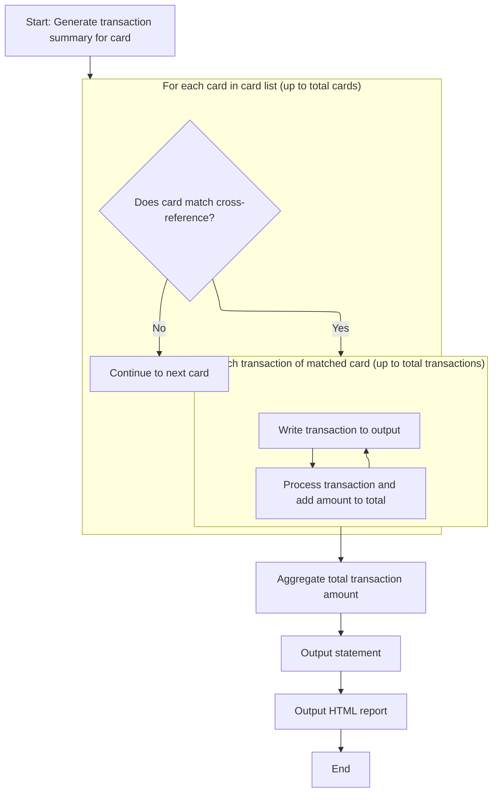

This section is responsible for matching credit card transactions to the correct account, generating a detailed statement and HTML report for each account, including transaction details and totals.

| Category        | Rule Name             | Description                                                                                                                              |
| --------------- | --------------------- | ---------------------------------------------------------------------------------------------------------------------------------------- |
| Data validation | Card-account matching | Only transactions for cards that match the current account's cross-reference record are included in the statement and report.            |
| Business logic  | Transaction inclusion | All transactions for a matched card are listed in the statement and report, including transaction ID, details, and amount.               |
| Business logic  | Total calculation     | The total transaction amount for the statement period is calculated by summing the amounts of all included transactions for the account. |

<SwmSnippet path="/app/cbl/CBSTM03A.CBL" line="416">

---

In <SwmToken path="app/cbl/CBSTM03A.CBL" pos="416:1:5" line-data="       4000-TRNXFILE-GET.">`4000-TRNXFILE-GET`</SwmToken>, the code loops through all card numbers, and for the one matching the current account, it processes each transaction, writes it to the outputs, and totals the amounts. After all transactions, it writes summary lines and HTML closing tags.

```cobol
       4000-TRNXFILE-GET.
           PERFORM VARYING CR-JMP FROM 1 BY 1
             UNTIL CR-JMP > CR-CNT
             OR (WS-CARD-NUM (CR-JMP) > XREF-CARD-NUM)
               IF XREF-CARD-NUM = WS-CARD-NUM (CR-JMP)
                   MOVE WS-CARD-NUM (CR-JMP) TO TRNX-CARD-NUM
                   PERFORM VARYING TR-JMP FROM 1 BY 1
                     UNTIL (TR-JMP > WS-TRCT (CR-JMP))
                       MOVE WS-TRAN-NUM (CR-JMP, TR-JMP)
                         TO TRNX-ID
                       MOVE WS-TRAN-REST (CR-JMP, TR-JMP)
                         TO TRNX-REST
                       PERFORM 6000-WRITE-TRANS
                       ADD TRNX-AMT TO WS-TOTAL-AMT
                   END-PERFORM
               END-IF
           END-PERFORM.
```

---

</SwmSnippet>

<SwmSnippet path="/app/cbl/CBSTM03A.CBL" line="433">

---

This writes the totals and closes out the statement and HTML output for the account.

```cobol
           MOVE WS-TOTAL-AMT TO WS-TRN-AMT.
           MOVE WS-TRN-AMT TO ST-TOTAL-TRAMT.
           WRITE FD-STMTFILE-REC FROM ST-LINE12.
           WRITE FD-STMTFILE-REC FROM ST-LINE14A.
           WRITE FD-STMTFILE-REC FROM ST-LINE15.

           SET HTML-LTRS TO TRUE.
           WRITE FD-HTMLFILE-REC FROM HTML-FIXED-LN.
           SET HTML-L10 TO TRUE.
           WRITE FD-HTMLFILE-REC FROM HTML-FIXED-LN.
           SET HTML-L75 TO TRUE.
           WRITE FD-HTMLFILE-REC FROM HTML-FIXED-LN.
           SET HTML-LTDE TO TRUE.
           WRITE FD-HTMLFILE-REC FROM HTML-FIXED-LN.
           SET HTML-LTRE TO TRUE.
           WRITE FD-HTMLFILE-REC FROM HTML-FIXED-LN.
           SET HTML-L78 TO TRUE.
           WRITE FD-HTMLFILE-REC FROM HTML-FIXED-LN.
           SET HTML-L79 TO TRUE.
           WRITE FD-HTMLFILE-REC FROM HTML-FIXED-LN.
           SET HTML-L80 TO TRUE.
           WRITE FD-HTMLFILE-REC FROM HTML-FIXED-LN.

           EXIT.
```

---

</SwmSnippet>

## File Closure and Cleanup

```mermaid
%%{init: {"flowchart": {"defaultRenderer": "elk"}} }%%
flowchart TD
    node1["Close transaction file"]
    click node1 openCode "app/cbl/CBSTM03A.CBL:856:870"
    node1 --> node2{"Closed successfully?"}
    click node2 openCode "app/cbl/CBSTM03A.CBL:862:868"
    node2 -->|"Yes"| node3["Close cross-reference file"]
    click node3 openCode "app/cbl/CBSTM03A.CBL:873:887"
    node2 -->|"No"| node7["Handle error and terminate"]
    click node7 openCode "app/cbl/CBSTM03A.CBL:867:868"
    node3 --> node4{"Closed successfully?"}
    click node4 openCode "app/cbl/CBSTM03A.CBL:879:885"
    node4 -->|"Yes"| node5["Close customer file"]
    click node5 openCode "app/cbl/CBSTM03A.CBL:889:903"
    node4 -->|"No"| node7
    node5 --> node6{"Closed successfully?"}
    click node6 openCode "app/cbl/CBSTM03A.CBL:895:901"
    node6 -->|"Yes"| node8["Close account file"]
    click node8 openCode "app/cbl/CBSTM03A.CBL:905:919"
    node6 -->|"No"| node7
    node8 --> node9{"Closed successfully?"}
    click node9 openCode "app/cbl/CBSTM03A.CBL:911:917"
    node9 -->|"Yes"| node10["Finish: All files closed"]
    click node10 openCode "app/cbl/CBSTM03A.CBL:339:339"
    node9 -->|"No"| node7
    node7 --> node10
classDef HeadingStyle fill:#777777,stroke:#333,stroke-width:2px;

%% Swimm:
%% %%{init: {"flowchart": {"defaultRenderer": "elk"}} }%%
%% flowchart TD
%%     node1["Close transaction file"]
%%     click node1 openCode "<SwmPath>[app/cbl/CBSTM03A.CBL](app/cbl/CBSTM03A.CBL)</SwmPath>:856:870"
%%     node1 --> node2{"Closed successfully?"}
%%     click node2 openCode "<SwmPath>[app/cbl/CBSTM03A.CBL](app/cbl/CBSTM03A.CBL)</SwmPath>:862:868"
%%     node2 -->|"Yes"| node3["Close cross-reference file"]
%%     click node3 openCode "<SwmPath>[app/cbl/CBSTM03A.CBL](app/cbl/CBSTM03A.CBL)</SwmPath>:873:887"
%%     node2 -->|"No"| node7["Handle error and terminate"]
%%     click node7 openCode "<SwmPath>[app/cbl/CBSTM03A.CBL](app/cbl/CBSTM03A.CBL)</SwmPath>:867:868"
%%     node3 --> node4{"Closed successfully?"}
%%     click node4 openCode "<SwmPath>[app/cbl/CBSTM03A.CBL](app/cbl/CBSTM03A.CBL)</SwmPath>:879:885"
%%     node4 -->|"Yes"| node5["Close customer file"]
%%     click node5 openCode "<SwmPath>[app/cbl/CBSTM03A.CBL](app/cbl/CBSTM03A.CBL)</SwmPath>:889:903"
%%     node4 -->|"No"| node7
%%     node5 --> node6{"Closed successfully?"}
%%     click node6 openCode "<SwmPath>[app/cbl/CBSTM03A.CBL](app/cbl/CBSTM03A.CBL)</SwmPath>:895:901"
%%     node6 -->|"Yes"| node8["Close account file"]
%%     click node8 openCode "<SwmPath>[app/cbl/CBSTM03A.CBL](app/cbl/CBSTM03A.CBL)</SwmPath>:905:919"
%%     node6 -->|"No"| node7
%%     node8 --> node9{"Closed successfully?"}
%%     click node9 openCode "<SwmPath>[app/cbl/CBSTM03A.CBL](app/cbl/CBSTM03A.CBL)</SwmPath>:911:917"
%%     node9 -->|"Yes"| node10["Finish: All files closed"]
%%     click node10 openCode "<SwmPath>[app/cbl/CBSTM03A.CBL](app/cbl/CBSTM03A.CBL)</SwmPath>:339:339"
%%     node9 -->|"No"| node7
%%     node7 --> node10
%% classDef HeadingStyle fill:#777777,stroke:#333,stroke-width:2px;
```

<SwmSnippet path="/app/cbl/CBSTM03A.CBL" line="331">

---

After returning from <SwmToken path="app/cbl/CBSTM03A.CBL" pos="326:3:7" line-data="                       PERFORM 4000-TRNXFILE-GET">`4000-TRNXFILE-GET`</SwmToken> in <SwmToken path="app/cbl/CBSTM03A.CBL" pos="316:1:3" line-data="       1000-MAINLINE.">`1000-MAINLINE`</SwmToken>, the code closes all the files used in the process, making sure everything is properly finalized and written out.

```cobol
           PERFORM 9100-TRNXFILE-CLOSE.

           PERFORM 9200-XREFFILE-CLOSE.

           PERFORM 9300-CUSTFILE-CLOSE.

           PERFORM 9400-ACCTFILE-CLOSE.

           CLOSE STMT-FILE HTML-FILE.
```

---

</SwmSnippet>

<SwmSnippet path="/app/cbl/CBSTM03A.CBL" line="856">

---

<SwmToken path="app/cbl/CBSTM03A.CBL" pos="856:1:5" line-data="       9100-TRNXFILE-CLOSE.">`9100-TRNXFILE-CLOSE`</SwmToken> wraps up transaction file access by calling <SwmToken path="app/cbl/CBSTM03A.CBL" pos="860:4:4" line-data="           CALL &#39;CBSTM03B&#39; USING WS-M03B-AREA.">`CBSTM03B`</SwmToken> to do the actual close, and aborts if the close fails.

```cobol
       9100-TRNXFILE-CLOSE.
           MOVE 'TRNXFILE' TO WS-M03B-DD.
           SET M03B-CLOSE TO TRUE.
           MOVE ZERO TO WS-M03B-RC.
           CALL 'CBSTM03B' USING WS-M03B-AREA.

           IF WS-M03B-RC = '00' OR '04'
               CONTINUE
           ELSE
               DISPLAY 'ERROR CLOSING TRNXFILE'
               DISPLAY 'RETURN CODE: ' WS-M03B-RC
               PERFORM 9999-ABEND-PROGRAM
           END-IF.

           EXIT.
```

---

</SwmSnippet>

<SwmSnippet path="/app/cbl/CBSTM03A.CBL" line="873">

---

<SwmToken path="app/cbl/CBSTM03A.CBL" pos="873:1:5" line-data="       9200-XREFFILE-CLOSE.">`9200-XREFFILE-CLOSE`</SwmToken> is where we finish up with the cross-reference file. It sets up the close request and calls <SwmToken path="app/cbl/CBSTM03A.CBL" pos="877:4:4" line-data="           CALL &#39;CBSTM03B&#39; USING WS-M03B-AREA.">`CBSTM03B`</SwmToken>, which does the mainframe file close and returns a status. If the close fails, we display the error and terminate. This keeps file handling modular and error-safe.

```cobol
       9200-XREFFILE-CLOSE.
           MOVE 'XREFFILE' TO WS-M03B-DD.
           SET M03B-CLOSE TO TRUE.
           MOVE ZERO TO WS-M03B-RC.
           CALL 'CBSTM03B' USING WS-M03B-AREA.

           IF WS-M03B-RC = '00' OR '04'
               CONTINUE
           ELSE
               DISPLAY 'ERROR CLOSING XREFFILE'
               DISPLAY 'RETURN CODE: ' WS-M03B-RC
               PERFORM 9999-ABEND-PROGRAM
           END-IF.

           EXIT.
```

---

</SwmSnippet>

<SwmSnippet path="/app/cbl/CBSTM03A.CBL" line="889">

---

<SwmToken path="app/cbl/CBSTM03A.CBL" pos="889:1:5" line-data="       9300-CUSTFILE-CLOSE.">`9300-CUSTFILE-CLOSE`</SwmToken> is where we close out the customer file. It sets up the close operation and calls <SwmToken path="app/cbl/CBSTM03A.CBL" pos="893:4:4" line-data="           CALL &#39;CBSTM03B&#39; USING WS-M03B-AREA.">`CBSTM03B`</SwmToken>, which does the actual file close and gives us a status code. If the close fails, we abort. This keeps file handling clean and modular.

```cobol
       9300-CUSTFILE-CLOSE.
           MOVE 'CUSTFILE' TO WS-M03B-DD.
           SET M03B-CLOSE TO TRUE.
           MOVE ZERO TO WS-M03B-RC.
           CALL 'CBSTM03B' USING WS-M03B-AREA.

           IF WS-M03B-RC = '00' OR '04'
               CONTINUE
           ELSE
               DISPLAY 'ERROR CLOSING CUSTFILE'
               DISPLAY 'RETURN CODE: ' WS-M03B-RC
               PERFORM 9999-ABEND-PROGRAM
           END-IF.

           EXIT.
```

---

</SwmSnippet>

<SwmSnippet path="/app/cbl/CBSTM03A.CBL" line="905">

---

<SwmToken path="app/cbl/CBSTM03A.CBL" pos="905:1:5" line-data="       9400-ACCTFILE-CLOSE.">`9400-ACCTFILE-CLOSE`</SwmToken> is where we close the account file. It sets up the close request and calls <SwmToken path="app/cbl/CBSTM03A.CBL" pos="909:4:4" line-data="           CALL &#39;CBSTM03B&#39; USING WS-M03B-AREA.">`CBSTM03B`</SwmToken>, which does the mainframe file close and returns a status code. If the close fails, we abort. This keeps file closure logic centralized and error-safe.

```cobol
       9400-ACCTFILE-CLOSE.
           MOVE 'ACCTFILE' TO WS-M03B-DD.
           SET M03B-CLOSE TO TRUE.
           MOVE ZERO TO WS-M03B-RC.
           CALL 'CBSTM03B' USING WS-M03B-AREA.

           IF WS-M03B-RC = '00' OR '04'
               CONTINUE
           ELSE
               DISPLAY 'ERROR CLOSING ACCTFILE'
               DISPLAY 'RETURN CODE: ' WS-M03B-RC
               PERFORM 9999-ABEND-PROGRAM
           END-IF.

           EXIT.
```

---

</SwmSnippet>

&nbsp;

*This is an auto-generated document by Swimm 🌊 and has not yet been verified by a human*

<SwmMeta version="3.0.0" repo-id="Z2l0aHViJTNBJTNBU3dpbW1pby1NRi1DcmVkaXRjYXJkLURlbW8xJTNBJTNBR2lyaS1Td2ltbQ==" repo-name="Swimmio-MF-Creditcard-Demo1"><sup>Powered by [Swimm](https://app.swimm.io/)</sup></SwmMeta>
