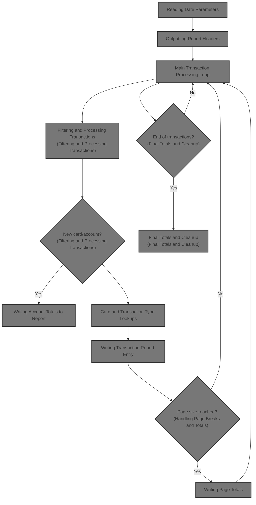
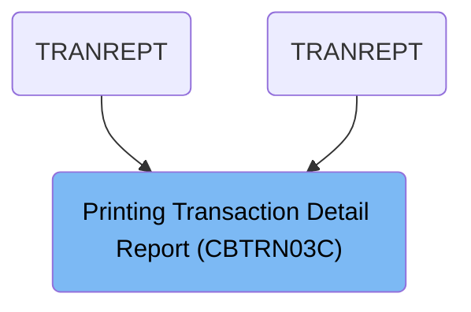

# Overview

This document explains the flow of generating a transaction detail report for credit card accounts. The process involves reading transaction records, filtering by reporting period, organizing transactions by account, type, and category, and producing a formatted report with totals and headers for business analysis.

## Dependencies

### Programs

- CBTRN03C (<SwmPath>[app/cbl/CBTRN03C.cbl](app/cbl/CBTRN03C.cbl)</SwmPath>)
- CEE3ABD

### Copybooks

- CVTRA05Y (<SwmPath>[app/cpy/CVTRA05Y.cpy](app/cpy/CVTRA05Y.cpy)</SwmPath>)
- CVACT03Y (<SwmPath>[app/cpy/CVACT03Y.cpy](app/cpy/CVACT03Y.cpy)</SwmPath>)
- CVTRA03Y (<SwmPath>[app/cpy/CVTRA03Y.cpy](app/cpy/CVTRA03Y.cpy)</SwmPath>)
- CVTRA04Y (<SwmPath>[app/cpy/CVTRA04Y.cpy](app/cpy/CVTRA04Y.cpy)</SwmPath>)
- CVTRA07Y (<SwmPath>[app/cpy/CVTRA07Y.cpy](app/cpy/CVTRA07Y.cpy)</SwmPath>)

# Where is this program used?

This program is used multiple times in the codebase as represented in the following diagram:

&nbsp;

*This is an auto-generated document by Swimm 🌊 and has not yet been verified by a human*

<SwmMeta version="3.0.0" repo-id="Z2l0aHViJTNBJTNBU3dpbW1pby1NRi1DcmVkaXRjYXJkLURlbW8xJTNBJTNBR2lyaS1Td2ltbQ==" repo-name="Swimmio-MF-Creditcard-Demo1">Powered by [Swimm](https://app.swimm.io/)</SwmMeta>
