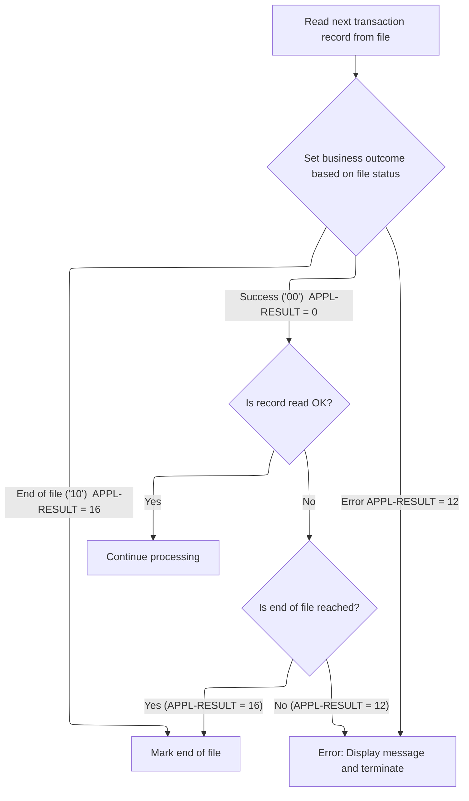

# Overview

This document explains the flow for generating a transaction detail report. The process validates required data sources, determines the reporting period, filters transactions, performs lookups, and writes detailed records to the report, managing totals and formatting for business review.


## Dependencies

### Programs

- <SwmToken path="app/cbl/CBTRN03C.cbl" pos="160:14:14" line-data="           DISPLAY &#39;START OF EXECUTION OF PROGRAM CBTRN03C&#39;.                    ">`CBTRN03C`</SwmToken> (<SwmPath>[app/cbl/CBTRN03C.cbl](app/cbl/CBTRN03C.cbl)</SwmPath>)
- <SwmToken path="app/cbl/CBTRN03C.cbl" pos="630:4:4" line-data="           CALL &#39;CEE3ABD&#39; USING ABCODE, TIMING.                                 ">`CEE3ABD`</SwmToken>

### Copybooks

- <SwmToken path="app/cbl/CBTRN03C.cbl" pos="93:3:3" line-data="       COPY CVTRA05Y.                                                           ">`CVTRA05Y`</SwmToken> (<SwmPath>[app/cpy/CVTRA05Y.cpy](app/cpy/CVTRA05Y.cpy)</SwmPath>)
- <SwmToken path="app/cbl/CBTRN03C.cbl" pos="98:3:3" line-data="       COPY CVACT03Y.                                                           ">`CVACT03Y`</SwmToken> (<SwmPath>[app/cpy/CVACT03Y.cpy](app/cpy/CVACT03Y.cpy)</SwmPath>)
- <SwmToken path="app/cbl/CBTRN03C.cbl" pos="103:3:3" line-data="       COPY CVTRA03Y.                                                           ">`CVTRA03Y`</SwmToken> (<SwmPath>[app/cpy/CVTRA03Y.cpy](app/cpy/CVTRA03Y.cpy)</SwmPath>)
- <SwmToken path="app/cbl/CBTRN03C.cbl" pos="108:3:3" line-data="       COPY CVTRA04Y.                                                           ">`CVTRA04Y`</SwmToken> (<SwmPath>[app/cpy/CVTRA04Y.cpy](app/cpy/CVTRA04Y.cpy)</SwmPath>)
- <SwmToken path="app/cbl/CBTRN03C.cbl" pos="113:3:3" line-data="       COPY CVTRA07Y.                                                           ">`CVTRA07Y`</SwmToken> (<SwmPath>[app/cpy/CVTRA07Y.cpy](app/cpy/CVTRA07Y.cpy)</SwmPath>)

# Where is this program used?

This program is used multiple times in the codebase as represented in the following diagram:


## Input and Output Tables/Files used in the Program

| Table / File Name                                                                                                                                                               | Type | Description                                 | Usage Mode | Key Fields / Layout Highlights |
| ------------------------------------------------------------------------------------------------------------------------------------------------------------------------------- | ---- | ------------------------------------------- | ---------- | ------------------------------ |
| <SwmToken path="app/cbl/CBTRN03C.cbl" pos="221:3:7" line-data="           READ DATE-PARMS-FILE INTO WS-DATEPARM-RECORD                         ">`DATE-PARMS-FILE`</SwmToken>   | File | Reporting date range parameters             | Input      | File resource                  |
| <SwmToken path="app/cbl/CBTRN03C.cbl" pos="295:11:15" line-data="           MOVE REPORT-PAGE-TOTALS TO FD-REPTFILE-REC                           ">`FD-REPTFILE-REC`</SwmToken> | File | Single line of transaction report output    | Output     | File resource                  |
| <SwmToken path="app/cbl/CBTRN03C.cbl" pos="396:5:7" line-data="           OPEN OUTPUT REPORT-FILE                                              ">`REPORT-FILE`</SwmToken>       | File | Generated transaction detail report output  | Output     | File resource                  |
| <SwmToken path="app/cbl/CBTRN03C.cbl" pos="450:5:7" line-data="           OPEN INPUT TRANCATG-FILE                                             ">`TRANCATG-FILE`</SwmToken>     | File | Transaction category codes and descriptions | Input      | File resource                  |
| <SwmToken path="app/cbl/CBTRN03C.cbl" pos="249:3:5" line-data="           READ TRANSACT-FILE INTO TRAN-RECORD.                                 ">`TRANSACT-FILE`</SwmToken>     | File | Credit card transaction history records     | Input      | File resource                  |
| <SwmToken path="app/cbl/CBTRN03C.cbl" pos="432:5:7" line-data="           OPEN INPUT TRANTYPE-FILE                                             ">`TRANTYPE-FILE`</SwmToken>     | File | Transaction type codes and descriptions     | Input      | File resource                  |
| <SwmToken path="app/cbl/CBTRN03C.cbl" pos="414:5:7" line-data="           OPEN INPUT XREF-FILE                                                 ">`XREF-FILE`</SwmToken>         | File | Card-to-account cross-reference mapping     | Input      | File resource                  |

&nbsp;

## Detailed View of the Program's Functionality

# Detailed Flow of <SwmPath>[app/cbl/CBTRN03C.cbl](app/cbl/CBTRN03C.cbl)</SwmPath>

## a. Program Initialization and File Opening

When the program starts, it displays a message indicating execution has begun. It then sequentially opens all required files: the transaction input file, the report output file, the card cross-reference file, the transaction type file, the transaction category file, and the date parameter file. For each file, the program checks if the open operation was successful. If any file fails to open, it displays an error message, shows a formatted file status code for easier troubleshooting, and then terminates the program immediately.

## b. Reading and Validating Date Parameters

After all files are open, the program reads the date parameter file to obtain the reporting period (start and end dates). It checks the file status after the read:

- If successful, it displays the reporting period.
- If the end of file is reached, it sets an internal flag to indicate no more processing is needed.
- If an error occurs, it displays an error message, shows the file status, and terminates.

## c. Main Transaction Processing Loop

The program enters a loop that continues until the end-of-file flag is set. In each iteration:

1. It checks if processing should continue (i.e., not at end-of-file).
2. It reads the next transaction record from the transaction file.
   - If the read is successful, it continues.
   - If end-of-file is reached, it sets the flag to exit the loop.
   - If an error occurs, it displays an error message, shows the file status, and terminates.

## d. Filtering Transactions by Date

For each transaction record read, the program checks if the transaction date falls within the reporting period (between the start and end dates). If not, it skips further processing for that record.

## e. Handling Card Number Changes and Account Totals

If the card number in the current transaction is different from the previously processed card number:

- If this is not the first card being processed, the program writes the accumulated account total for the previous card to the report.
- It then updates the current card number and prepares for the new card.
- It performs a lookup in the card cross-reference file to validate and retrieve additional card information. If the lookup fails, it displays an error and terminates.

## f. Transaction Type and Category Lookups

For each transaction, the program:

- Looks up the transaction type in the transaction type file. If not found, it displays an error and terminates.
- Looks up the transaction category in the transaction category file using a composite key. If not found, it displays an error and terminates.

## g. Writing Transaction Details to the Report

Before writing transaction details:

- If this is the first transaction being processed, or if a page break is needed (based on a line counter and page size), the program writes report headers and, if necessary, page totals.
- It then adds the transaction amount to both the page total and the account total.
- It writes the transaction detail line to the report, including all relevant information (transaction ID, account ID, type, category, source, amount, etc.).
- The line counter is incremented after each write.

## h. Writing Account, Page, and Grand Totals

- When a card number changes, the program writes the account total for the previous card to the report, resets the account total accumulator, and writes a section header for the new card.
- When a page is full, it writes the page total, adds it to the grand total, resets the page total, and writes a section header for the new page.
- At the end of processing, it writes any remaining page and grand totals to the report.

## i. Closing Files and Program Termination

After all transactions are processed:

- The program closes each file in turn (transaction, report, cross-reference, transaction type, transaction category, and date parameter files).
- For each close operation, it checks the status. If any close fails, it displays an error message, shows the file status, and terminates.
- Finally, it displays a message indicating the end of execution and exits the program.

## j. Error Handling and Status Display

Throughout the program, whenever a file operation (open, read, write, close) fails, the program:

- Displays a specific error message.
- Moves the file status code into a general-purpose status variable.
- Calls a routine to format and display the status code in a human-readable way, handling both standard and vendor-specific codes.
- Terminates the program to prevent further processing with incomplete or corrupted data.

## k. Abnormal Termination Routine

If a fatal error occurs, the program calls a special routine that:

- Displays a message indicating the program is abending (abnormally ending).
- Sets special codes for timing and abend reason.
- Calls a system-level routine to force program termination.

---

This structure ensures robust error handling, clear reporting, and accurate processing of transaction data for the credit card management application. Each step is modularized for maintainability and clarity, with strong emphasis on data integrity and traceable error reporting.

# Rule Definition

| Paragraph Name                                                                                                                                                                                                                                                                                                                                                                                                                                                                                                                                                                                                                                                                                                                                                                                                                                                                                                                                                                                                                                                                                                                       | Rule ID | Category          | Description                                                                                                                                                                                                                                                                                  | Conditions                                                                                                                                                                                                                   | Remarks                                                                                                                                                                                                                                                                                                                                                                                                                                                                                                                                                                                                                                                                                                                                                                                                                                                                                                                                                                                                                                                                                                                                                                          |
| ------------------------------------------------------------------------------------------------------------------------------------------------------------------------------------------------------------------------------------------------------------------------------------------------------------------------------------------------------------------------------------------------------------------------------------------------------------------------------------------------------------------------------------------------------------------------------------------------------------------------------------------------------------------------------------------------------------------------------------------------------------------------------------------------------------------------------------------------------------------------------------------------------------------------------------------------------------------------------------------------------------------------------------------------------------------------------------------------------------------------------------ | ------- | ----------------- | -------------------------------------------------------------------------------------------------------------------------------------------------------------------------------------------------------------------------------------------------------------------------------------------- | ---------------------------------------------------------------------------------------------------------------------------------------------------------------------------------------------------------------------------- | -------------------------------------------------------------------------------------------------------------------------------------------------------------------------------------------------------------------------------------------------------------------------------------------------------------------------------------------------------------------------------------------------------------------------------------------------------------------------------------------------------------------------------------------------------------------------------------------------------------------------------------------------------------------------------------------------------------------------------------------------------------------------------------------------------------------------------------------------------------------------------------------------------------------------------------------------------------------------------------------------------------------------------------------------------------------------------------------------------------------------------------------------------------------------------- |
| <SwmToken path="app/cbl/CBTRN03C.cbl" pos="161:3:7" line-data="           PERFORM 0000-TRANFILE-OPEN.                                          ">`0000-TRANFILE-OPEN`</SwmToken>, <SwmToken path="app/cbl/CBTRN03C.cbl" pos="162:3:7" line-data="           PERFORM 0100-REPTFILE-OPEN.                                          ">`0100-REPTFILE-OPEN`</SwmToken>, <SwmToken path="app/cbl/CBTRN03C.cbl" pos="163:3:7" line-data="           PERFORM 0200-CARDXREF-OPEN.                                          ">`0200-CARDXREF-OPEN`</SwmToken>, <SwmToken path="app/cbl/CBTRN03C.cbl" pos="164:3:7" line-data="           PERFORM 0300-TRANTYPE-OPEN.                                          ">`0300-TRANTYPE-OPEN`</SwmToken>, <SwmToken path="app/cbl/CBTRN03C.cbl" pos="165:3:7" line-data="           PERFORM 0400-TRANCATG-OPEN.                                          ">`0400-TRANCATG-OPEN`</SwmToken>, <SwmToken path="app/cbl/CBTRN03C.cbl" pos="166:3:7" line-data="           PERFORM 0500-DATEPARM-OPEN.                                          ">`0500-DATEPARM-OPEN`</SwmToken>                           | RL-001  | Data Assignment   | At the beginning of processing, the program must open all necessary files: the transaction file (sequential), report file (sequential, output), cross-reference file (indexed), transaction type file (indexed), transaction category file (indexed), and date parameters file (sequential). | Program startup.                                                                                                                                                                                                             | Files: <SwmToken path="app/cbl/CBTRN03C.cbl" pos="249:3:5" line-data="           READ TRANSACT-FILE INTO TRAN-RECORD.                                 ">`TRANSACT-FILE`</SwmToken>, <SwmToken path="app/cbl/CBTRN03C.cbl" pos="396:5:7" line-data="           OPEN OUTPUT REPORT-FILE                                              ">`REPORT-FILE`</SwmToken>, <SwmToken path="app/cbl/CBTRN03C.cbl" pos="414:5:7" line-data="           OPEN INPUT XREF-FILE                                                 ">`XREF-FILE`</SwmToken>, <SwmToken path="app/cbl/CBTRN03C.cbl" pos="432:5:7" line-data="           OPEN INPUT TRANTYPE-FILE                                             ">`TRANTYPE-FILE`</SwmToken>, <SwmToken path="app/cbl/CBTRN03C.cbl" pos="450:5:7" line-data="           OPEN INPUT TRANCATG-FILE                                             ">`TRANCATG-FILE`</SwmToken>, <SwmToken path="app/cbl/CBTRN03C.cbl" pos="221:3:7" line-data="           READ DATE-PARMS-FILE INTO WS-DATEPARM-RECORD                         ">`DATE-PARMS-FILE`</SwmToken>. Each file must be opened in the correct mode (input/output, sequential/indexed as appropriate). |
| <SwmToken path="app/cbl/CBTRN03C.cbl" pos="168:3:7" line-data="           PERFORM 0550-DATEPARM-READ.                                          ">`0550-DATEPARM-READ`</SwmToken>                                                                                                                                                                                                                                                                                                                                                                                                                                                                                                                                                                                                                                                                                                                                                                                                                                                                                                                                                     | RL-002  | Data Assignment   | The program reads the date parameters file and extracts the start and end dates to define the reporting period for transaction filtering.                                                                                                                                                    | After opening <SwmToken path="app/cbl/CBTRN03C.cbl" pos="221:3:7" line-data="           READ DATE-PARMS-FILE INTO WS-DATEPARM-RECORD                         ">`DATE-PARMS-FILE`</SwmToken>, before processing transactions. | Start and end dates are extracted as strings of 10 characters each from the date parameter record.                                                                                                                                                                                                                                                                                                                                                                                                                                                                                                                                                                                                                                                                                                                                                                                                                                                                                                                                                                                                                                                                               |
| <SwmToken path="app/cbl/CBTRN03C.cbl" pos="172:3:9" line-data="                PERFORM 1000-TRANFILE-GET-NEXT                                  ">`1000-TRANFILE-GET-NEXT`</SwmToken>, main PERFORM UNTIL loop (lines 170-206)                                                                                                                                                                                                                                                                                                                                                                                                                                                                                                                                                                                                                                                                                                                                                                                                                                                                                                        | RL-003  | Conditional Logic | For each transaction record, parse the record and include it for further processing only if its processing timestamp falls within the reporting period defined by the start and end dates.                                                                                                   | Each transaction record read from <SwmToken path="app/cbl/CBTRN03C.cbl" pos="249:3:5" line-data="           READ TRANSACT-FILE INTO TRAN-RECORD.                                 ">`TRANSACT-FILE`</SwmToken>.               | Transaction processing timestamp is compared as a string (first 10 characters) to the start and end dates. Only transactions within the inclusive range are processed.                                                                                                                                                                                                                                                                                                                                                                                                                                                                                                                                                                                                                                                                                                                                                                                                                                                                                                                                                                                                           |
| <SwmToken path="app/cbl/CBTRN03C.cbl" pos="187:3:9" line-data="                     PERFORM 1500-A-LOOKUP-XREF                                 ">`1500-A-LOOKUP-XREF`</SwmToken>, <SwmToken path="app/cbl/CBTRN03C.cbl" pos="190:3:9" line-data="                   PERFORM 1500-B-LOOKUP-TRANTYPE                               ">`1500-B-LOOKUP-TRANTYPE`</SwmToken>, <SwmToken path="app/cbl/CBTRN03C.cbl" pos="195:3:9" line-data="                   PERFORM 1500-C-LOOKUP-TRANCATG                               ">`1500-C-LOOKUP-TRANCATG`</SwmToken>                                                                                                                                                                                                                                                                                                                                                                                                                                                                                                                                                                         | RL-004  | Conditional Logic | For each transaction, perform lookups in the cross-reference, transaction type, and transaction category files using the appropriate keys to retrieve additional data needed for reporting.                                                                                                  | For each transaction that passes the date filter.                                                                                                                                                                            | Lookups use the card number, transaction type code, and transaction category code as keys. If a lookup fails, processing is terminated with an error.                                                                                                                                                                                                                                                                                                                                                                                                                                                                                                                                                                                                                                                                                                                                                                                                                                                                                                                                                                                                                            |
| main PERFORM UNTIL loop (lines 170-206), <SwmToken path="app/cbl/CBTRN03C.cbl" pos="183:3:9" line-data="                       PERFORM 1120-WRITE-ACCOUNT-TOTALS                        ">`1120-WRITE-ACCOUNT-TOTALS`</SwmToken>                                                                                                                                                                                                                                                                                                                                                                                                                                                                                                                                                                                                                                                                                                                                                                                                                                                                                                     | RL-005  | Conditional Logic | Transactions are grouped by card number. When the card number changes, the program writes the accumulated account totals to the report before starting a new group.                                                                                                                          | When the card number of the current transaction differs from the previous transaction.                                                                                                                                       | Account totals are reset after being written. The report line for account totals is fixed-width (133 bytes).                                                                                                                                                                                                                                                                                                                                                                                                                                                                                                                                                                                                                                                                                                                                                                                                                                                                                                                                                                                                                                                                     |
| <SwmToken path="app/cbl/CBTRN03C.cbl" pos="196:3:9" line-data="                   PERFORM 1100-WRITE-TRANSACTION-REPORT                        ">`1100-WRITE-TRANSACTION-REPORT`</SwmToken>, <SwmToken path="app/cbl/CBTRN03C.cbl" pos="202:3:9" line-data="                 PERFORM 1110-WRITE-PAGE-TOTALS                                 ">`1110-WRITE-PAGE-TOTALS`</SwmToken>, <SwmToken path="app/cbl/CBTRN03C.cbl" pos="203:3:9" line-data="                 PERFORM 1110-WRITE-GRAND-TOTALS                                ">`1110-WRITE-GRAND-TOTALS`</SwmToken>                                                                                                                                                                                                                                                                                                                                                                                                                                                                                                                                                             | RL-006  | Computation       | The program maintains running totals for each account, each page (every 20 lines), and the entire report (grand total). Totals are updated with each transaction amount processed.                                                                                                           | Each time a transaction is processed and written to the report.                                                                                                                                                              | Page size is 20 lines. Totals are numeric values with two decimal places. Totals are reset after being written to the report.                                                                                                                                                                                                                                                                                                                                                                                                                                                                                                                                                                                                                                                                                                                                                                                                                                                                                                                                                                                                                                                    |
| <SwmToken path="app/cbl/CBTRN03C.cbl" pos="196:3:9" line-data="                   PERFORM 1100-WRITE-TRANSACTION-REPORT                        ">`1100-WRITE-TRANSACTION-REPORT`</SwmToken>, <SwmToken path="app/cbl/CBTRN03C.cbl" pos="279:3:7" line-data="              PERFORM 1120-WRITE-HEADERS                                        ">`1120-WRITE-HEADERS`</SwmToken>, <SwmToken path="app/cbl/CBTRN03C.cbl" pos="289:3:7" line-data="           PERFORM 1120-WRITE-DETAIL                                            ">`1120-WRITE-DETAIL`</SwmToken>, <SwmToken path="app/cbl/CBTRN03C.cbl" pos="202:3:9" line-data="                 PERFORM 1110-WRITE-PAGE-TOTALS                                 ">`1110-WRITE-PAGE-TOTALS`</SwmToken>, <SwmToken path="app/cbl/CBTRN03C.cbl" pos="183:3:9" line-data="                       PERFORM 1120-WRITE-ACCOUNT-TOTALS                        ">`1120-WRITE-ACCOUNT-TOTALS`</SwmToken>, <SwmToken path="app/cbl/CBTRN03C.cbl" pos="203:3:9" line-data="                 PERFORM 1110-WRITE-GRAND-TOTALS                                ">`1110-WRITE-GRAND-TOTALS`</SwmToken> | RL-007  | Data Assignment   | The report file is written as a fixed-width, readable report. Each line is 133 bytes and includes headers, transaction details, account totals, page totals, and grand totals in a structured format.                                                                                        | Whenever a report line is written.                                                                                                                                                                                           | Each report line is exactly 133 bytes. Headers, details, and totals have specific formats and field alignments. Numeric fields are right-aligned and zero-padded as needed.                                                                                                                                                                                                                                                                                                                                                                                                                                                                                                                                                                                                                                                                                                                                                                                                                                                                                                                                                                                                      |
| <SwmToken path="app/cbl/CBTRN03C.cbl" pos="202:3:9" line-data="                 PERFORM 1110-WRITE-PAGE-TOTALS                                 ">`1110-WRITE-PAGE-TOTALS`</SwmToken>, <SwmToken path="app/cbl/CBTRN03C.cbl" pos="183:3:9" line-data="                       PERFORM 1120-WRITE-ACCOUNT-TOTALS                        ">`1120-WRITE-ACCOUNT-TOTALS`</SwmToken>, <SwmToken path="app/cbl/CBTRN03C.cbl" pos="196:3:9" line-data="                   PERFORM 1100-WRITE-TRANSACTION-REPORT                        ">`1100-WRITE-TRANSACTION-REPORT`</SwmToken>                                                                                                                                                                                                                                                                                                                                                                                                                                                                                                                                                           | RL-008  | Data Assignment   | After writing account totals, page totals, or headers, the program resets the corresponding accumulators and counters to prepare for the next group or page.                                                                                                                                 | After writing account totals, page totals, or headers.                                                                                                                                                                       | Account and page totals are reset to zero. Line counter is incremented after each report line.                                                                                                                                                                                                                                                                                                                                                                                                                                                                                                                                                                                                                                                                                                                                                                                                                                                                                                                                                                                                                                                                                   |
| <SwmToken path="app/cbl/CBTRN03C.cbl" pos="208:3:7" line-data="           PERFORM 9000-TRANFILE-CLOSE.                                         ">`9000-TRANFILE-CLOSE`</SwmToken>, <SwmToken path="app/cbl/CBTRN03C.cbl" pos="209:3:7" line-data="           PERFORM 9100-REPTFILE-CLOSE.                                         ">`9100-REPTFILE-CLOSE`</SwmToken>, <SwmToken path="app/cbl/CBTRN03C.cbl" pos="210:3:7" line-data="           PERFORM 9200-CARDXREF-CLOSE.                                         ">`9200-CARDXREF-CLOSE`</SwmToken>, <SwmToken path="app/cbl/CBTRN03C.cbl" pos="211:3:7" line-data="           PERFORM 9300-TRANTYPE-CLOSE.                                         ">`9300-TRANTYPE-CLOSE`</SwmToken>, <SwmToken path="app/cbl/CBTRN03C.cbl" pos="212:3:7" line-data="           PERFORM 9400-TRANCATG-CLOSE.                                         ">`9400-TRANCATG-CLOSE`</SwmToken>, <SwmToken path="app/cbl/CBTRN03C.cbl" pos="213:3:7" line-data="           PERFORM 9500-DATEPARM-CLOSE.                                         ">`9500-DATEPARM-CLOSE`</SwmToken>                     | RL-009  | Data Assignment   | At the end of processing, the program must close all files to ensure all data is written and resources are released.                                                                                                                                                                         | After all transactions have been processed and the report is complete.                                                                                                                                                       | All files opened at startup must be closed. Errors during close must be logged and handled.                                                                                                                                                                                                                                                                                                                                                                                                                                                                                                                                                                                                                                                                                                                                                                                                                                                                                                                                                                                                                                                                                      |
| <SwmToken path="app/cbl/CBTRN03C.cbl" pos="196:3:9" line-data="                   PERFORM 1100-WRITE-TRANSACTION-REPORT                        ">`1100-WRITE-TRANSACTION-REPORT`</SwmToken>, <SwmToken path="app/cbl/CBTRN03C.cbl" pos="202:3:9" line-data="                 PERFORM 1110-WRITE-PAGE-TOTALS                                 ">`1110-WRITE-PAGE-TOTALS`</SwmToken>, <SwmToken path="app/cbl/CBTRN03C.cbl" pos="183:3:9" line-data="                       PERFORM 1120-WRITE-ACCOUNT-TOTALS                        ">`1120-WRITE-ACCOUNT-TOTALS`</SwmToken>, <SwmToken path="app/cbl/CBTRN03C.cbl" pos="203:3:9" line-data="                 PERFORM 1110-WRITE-GRAND-TOTALS                                ">`1110-WRITE-GRAND-TOTALS`</SwmToken>                                                                                                                                                                                                                                                                                                                                                                    | RL-010  | Computation       | All numeric fields stored as packed decimal must be correctly unpacked for use in calculations and formatted as readable numbers for reporting.                                                                                                                                              | Whenever a packed decimal field is used in a calculation or written to the report.                                                                                                                                           | Packed decimal fields are converted to standard numeric format with two decimal places for calculations and output.                                                                                                                                                                                                                                                                                                                                                                                                                                                                                                                                                                                                                                                                                                                                                                                                                                                                                                                                                                                                                                                              |

# User Stories

## User Story 1: Reliable File Management

---

### Story Description:

As a system, I want to open all necessary files at startup and close them at the end of processing so that data can be reliably read, written, and resources are properly managed.

---

### Business Rule Mapping:

| Rule ID | Paragraph Name                                                                                                                                                                                                                                                                                                                                                                                                                                                                                                                                                                                                                                                                                                                                                                                                                                                                                                                                                                                                                                                                                                   | Rule Description                                                                                                                                                                                                                                                                             |
| ------- | ---------------------------------------------------------------------------------------------------------------------------------------------------------------------------------------------------------------------------------------------------------------------------------------------------------------------------------------------------------------------------------------------------------------------------------------------------------------------------------------------------------------------------------------------------------------------------------------------------------------------------------------------------------------------------------------------------------------------------------------------------------------------------------------------------------------------------------------------------------------------------------------------------------------------------------------------------------------------------------------------------------------------------------------------------------------------------------------------------------------- | -------------------------------------------------------------------------------------------------------------------------------------------------------------------------------------------------------------------------------------------------------------------------------------------- |
| RL-001  | <SwmToken path="app/cbl/CBTRN03C.cbl" pos="161:3:7" line-data="           PERFORM 0000-TRANFILE-OPEN.                                          ">`0000-TRANFILE-OPEN`</SwmToken>, <SwmToken path="app/cbl/CBTRN03C.cbl" pos="162:3:7" line-data="           PERFORM 0100-REPTFILE-OPEN.                                          ">`0100-REPTFILE-OPEN`</SwmToken>, <SwmToken path="app/cbl/CBTRN03C.cbl" pos="163:3:7" line-data="           PERFORM 0200-CARDXREF-OPEN.                                          ">`0200-CARDXREF-OPEN`</SwmToken>, <SwmToken path="app/cbl/CBTRN03C.cbl" pos="164:3:7" line-data="           PERFORM 0300-TRANTYPE-OPEN.                                          ">`0300-TRANTYPE-OPEN`</SwmToken>, <SwmToken path="app/cbl/CBTRN03C.cbl" pos="165:3:7" line-data="           PERFORM 0400-TRANCATG-OPEN.                                          ">`0400-TRANCATG-OPEN`</SwmToken>, <SwmToken path="app/cbl/CBTRN03C.cbl" pos="166:3:7" line-data="           PERFORM 0500-DATEPARM-OPEN.                                          ">`0500-DATEPARM-OPEN`</SwmToken>       | At the beginning of processing, the program must open all necessary files: the transaction file (sequential), report file (sequential, output), cross-reference file (indexed), transaction type file (indexed), transaction category file (indexed), and date parameters file (sequential). |
| RL-009  | <SwmToken path="app/cbl/CBTRN03C.cbl" pos="208:3:7" line-data="           PERFORM 9000-TRANFILE-CLOSE.                                         ">`9000-TRANFILE-CLOSE`</SwmToken>, <SwmToken path="app/cbl/CBTRN03C.cbl" pos="209:3:7" line-data="           PERFORM 9100-REPTFILE-CLOSE.                                         ">`9100-REPTFILE-CLOSE`</SwmToken>, <SwmToken path="app/cbl/CBTRN03C.cbl" pos="210:3:7" line-data="           PERFORM 9200-CARDXREF-CLOSE.                                         ">`9200-CARDXREF-CLOSE`</SwmToken>, <SwmToken path="app/cbl/CBTRN03C.cbl" pos="211:3:7" line-data="           PERFORM 9300-TRANTYPE-CLOSE.                                         ">`9300-TRANTYPE-CLOSE`</SwmToken>, <SwmToken path="app/cbl/CBTRN03C.cbl" pos="212:3:7" line-data="           PERFORM 9400-TRANCATG-CLOSE.                                         ">`9400-TRANCATG-CLOSE`</SwmToken>, <SwmToken path="app/cbl/CBTRN03C.cbl" pos="213:3:7" line-data="           PERFORM 9500-DATEPARM-CLOSE.                                         ">`9500-DATEPARM-CLOSE`</SwmToken> | At the end of processing, the program must close all files to ensure all data is written and resources are released.                                                                                                                                                                         |

---

### Relevant Functionality:

- <SwmToken path="app/cbl/CBTRN03C.cbl" pos="161:3:7" line-data="           PERFORM 0000-TRANFILE-OPEN.                                          ">`0000-TRANFILE-OPEN`</SwmToken>
  1. **RL-001:**
     - For each required file:
       - Open the file in the specified mode (input/output, sequential/indexed).
       - If the file fails to open, log an error and terminate processing.
- <SwmToken path="app/cbl/CBTRN03C.cbl" pos="208:3:7" line-data="           PERFORM 9000-TRANFILE-CLOSE.                                         ">`9000-TRANFILE-CLOSE`</SwmToken>
  1. **RL-009:**
     - For each file opened at startup:
       - Close the file.
       - If an error occurs, log the error and terminate processing.

## User Story 2: Accurate Transaction Processing and Data Enrichment

---

### Story Description:

As a user, I want the system to process each transaction, filter by reporting period, and enrich transaction data with account, type, and category information so that the report contains complete and accurate details for each transaction.

---

### Business Rule Mapping:

| Rule ID | Paragraph Name                                                                                                                                                                                                                                                                                                                                                                                                                                                                                                                                               | Rule Description                                                                                                                                                                            |
| ------- | ------------------------------------------------------------------------------------------------------------------------------------------------------------------------------------------------------------------------------------------------------------------------------------------------------------------------------------------------------------------------------------------------------------------------------------------------------------------------------------------------------------------------------------------------------------ | ------------------------------------------------------------------------------------------------------------------------------------------------------------------------------------------- |
| RL-003  | <SwmToken path="app/cbl/CBTRN03C.cbl" pos="172:3:9" line-data="                PERFORM 1000-TRANFILE-GET-NEXT                                  ">`1000-TRANFILE-GET-NEXT`</SwmToken>, main PERFORM UNTIL loop (lines 170-206)                                                                                                                                                                                                                                                                                                                                | For each transaction record, parse the record and include it for further processing only if its processing timestamp falls within the reporting period defined by the start and end dates.  |
| RL-004  | <SwmToken path="app/cbl/CBTRN03C.cbl" pos="187:3:9" line-data="                     PERFORM 1500-A-LOOKUP-XREF                                 ">`1500-A-LOOKUP-XREF`</SwmToken>, <SwmToken path="app/cbl/CBTRN03C.cbl" pos="190:3:9" line-data="                   PERFORM 1500-B-LOOKUP-TRANTYPE                               ">`1500-B-LOOKUP-TRANTYPE`</SwmToken>, <SwmToken path="app/cbl/CBTRN03C.cbl" pos="195:3:9" line-data="                   PERFORM 1500-C-LOOKUP-TRANCATG                               ">`1500-C-LOOKUP-TRANCATG`</SwmToken> | For each transaction, perform lookups in the cross-reference, transaction type, and transaction category files using the appropriate keys to retrieve additional data needed for reporting. |

---

### Relevant Functionality:

- <SwmToken path="app/cbl/CBTRN03C.cbl" pos="172:3:9" line-data="                PERFORM 1000-TRANFILE-GET-NEXT                                  ">`1000-TRANFILE-GET-NEXT`</SwmToken>
  1. **RL-003:**
     - Read the next transaction record.
     - Extract the processing timestamp.
     - If the timestamp is within the start and end dates (inclusive), continue processing.
     - Otherwise, skip to the next record.
- <SwmToken path="app/cbl/CBTRN03C.cbl" pos="187:3:9" line-data="                     PERFORM 1500-A-LOOKUP-XREF                                 ">`1500-A-LOOKUP-XREF`</SwmToken>
  1. **RL-004:**
     - For each transaction:
       - Lookup card/account reference data using the card number.
       - Lookup transaction type data using the transaction type code.
       - Lookup transaction category data using both transaction type and category codes.
       - If any lookup fails, log an error and terminate processing.

## User Story 3: Grouped Reporting and Totals Calculation

---

### Story Description:

As a user, I want transactions to be grouped by card number, with account totals, page totals, and grand totals calculated and reported so that I can see summarized financial information at multiple levels.

---

### Business Rule Mapping:

| Rule ID | Paragraph Name                                                                                                                                                                                                                                                                                                                                                                                                                                                                                                                                                             | Rule Description                                                                                                                                                                   |
| ------- | -------------------------------------------------------------------------------------------------------------------------------------------------------------------------------------------------------------------------------------------------------------------------------------------------------------------------------------------------------------------------------------------------------------------------------------------------------------------------------------------------------------------------------------------------------------------------- | ---------------------------------------------------------------------------------------------------------------------------------------------------------------------------------- |
| RL-006  | <SwmToken path="app/cbl/CBTRN03C.cbl" pos="196:3:9" line-data="                   PERFORM 1100-WRITE-TRANSACTION-REPORT                        ">`1100-WRITE-TRANSACTION-REPORT`</SwmToken>, <SwmToken path="app/cbl/CBTRN03C.cbl" pos="202:3:9" line-data="                 PERFORM 1110-WRITE-PAGE-TOTALS                                 ">`1110-WRITE-PAGE-TOTALS`</SwmToken>, <SwmToken path="app/cbl/CBTRN03C.cbl" pos="203:3:9" line-data="                 PERFORM 1110-WRITE-GRAND-TOTALS                                ">`1110-WRITE-GRAND-TOTALS`</SwmToken>   | The program maintains running totals for each account, each page (every 20 lines), and the entire report (grand total). Totals are updated with each transaction amount processed. |
| RL-008  | <SwmToken path="app/cbl/CBTRN03C.cbl" pos="202:3:9" line-data="                 PERFORM 1110-WRITE-PAGE-TOTALS                                 ">`1110-WRITE-PAGE-TOTALS`</SwmToken>, <SwmToken path="app/cbl/CBTRN03C.cbl" pos="183:3:9" line-data="                       PERFORM 1120-WRITE-ACCOUNT-TOTALS                        ">`1120-WRITE-ACCOUNT-TOTALS`</SwmToken>, <SwmToken path="app/cbl/CBTRN03C.cbl" pos="196:3:9" line-data="                   PERFORM 1100-WRITE-TRANSACTION-REPORT                        ">`1100-WRITE-TRANSACTION-REPORT`</SwmToken> | After writing account totals, page totals, or headers, the program resets the corresponding accumulators and counters to prepare for the next group or page.                       |

---

### Relevant Functionality:

- <SwmToken path="app/cbl/CBTRN03C.cbl" pos="196:3:9" line-data="                   PERFORM 1100-WRITE-TRANSACTION-REPORT                        ">`1100-WRITE-TRANSACTION-REPORT`</SwmToken>
  1. **RL-006:**
     - For each transaction:
       - Add the transaction amount to the account total, page total, and grand total.
     - When a page or account total is written:
       - Reset the corresponding accumulator.
- <SwmToken path="app/cbl/CBTRN03C.cbl" pos="202:3:9" line-data="                 PERFORM 1110-WRITE-PAGE-TOTALS                                 ">`1110-WRITE-PAGE-TOTALS`</SwmToken>
  1. **RL-008:**
     - After writing account totals:
       - Reset account total accumulator to zero.
     - After writing page totals:
       - Reset page total accumulator to zero.
     - After writing any report line:
       - Increment the line counter.

## User Story 4: Readable and Structured Report Output

---

### Story Description:

As a user, I want the report file to be written in a fixed-width, readable format with properly formatted numeric fields so that the report is easy to read and interpret.

---

### Business Rule Mapping:

| Rule ID | Paragraph Name                                                                                                                                                                                                                                                                                                                                                                                                                                                                                                                                                                                                                                                                                                                                                                                                                                                                                                                                                                                                                                                                                                                       | Rule Description                                                                                                                                                                                      |
| ------- | ------------------------------------------------------------------------------------------------------------------------------------------------------------------------------------------------------------------------------------------------------------------------------------------------------------------------------------------------------------------------------------------------------------------------------------------------------------------------------------------------------------------------------------------------------------------------------------------------------------------------------------------------------------------------------------------------------------------------------------------------------------------------------------------------------------------------------------------------------------------------------------------------------------------------------------------------------------------------------------------------------------------------------------------------------------------------------------------------------------------------------------ | ----------------------------------------------------------------------------------------------------------------------------------------------------------------------------------------------------- |
| RL-007  | <SwmToken path="app/cbl/CBTRN03C.cbl" pos="196:3:9" line-data="                   PERFORM 1100-WRITE-TRANSACTION-REPORT                        ">`1100-WRITE-TRANSACTION-REPORT`</SwmToken>, <SwmToken path="app/cbl/CBTRN03C.cbl" pos="279:3:7" line-data="              PERFORM 1120-WRITE-HEADERS                                        ">`1120-WRITE-HEADERS`</SwmToken>, <SwmToken path="app/cbl/CBTRN03C.cbl" pos="289:3:7" line-data="           PERFORM 1120-WRITE-DETAIL                                            ">`1120-WRITE-DETAIL`</SwmToken>, <SwmToken path="app/cbl/CBTRN03C.cbl" pos="202:3:9" line-data="                 PERFORM 1110-WRITE-PAGE-TOTALS                                 ">`1110-WRITE-PAGE-TOTALS`</SwmToken>, <SwmToken path="app/cbl/CBTRN03C.cbl" pos="183:3:9" line-data="                       PERFORM 1120-WRITE-ACCOUNT-TOTALS                        ">`1120-WRITE-ACCOUNT-TOTALS`</SwmToken>, <SwmToken path="app/cbl/CBTRN03C.cbl" pos="203:3:9" line-data="                 PERFORM 1110-WRITE-GRAND-TOTALS                                ">`1110-WRITE-GRAND-TOTALS`</SwmToken> | The report file is written as a fixed-width, readable report. Each line is 133 bytes and includes headers, transaction details, account totals, page totals, and grand totals in a structured format. |
| RL-010  | <SwmToken path="app/cbl/CBTRN03C.cbl" pos="196:3:9" line-data="                   PERFORM 1100-WRITE-TRANSACTION-REPORT                        ">`1100-WRITE-TRANSACTION-REPORT`</SwmToken>, <SwmToken path="app/cbl/CBTRN03C.cbl" pos="202:3:9" line-data="                 PERFORM 1110-WRITE-PAGE-TOTALS                                 ">`1110-WRITE-PAGE-TOTALS`</SwmToken>, <SwmToken path="app/cbl/CBTRN03C.cbl" pos="183:3:9" line-data="                       PERFORM 1120-WRITE-ACCOUNT-TOTALS                        ">`1120-WRITE-ACCOUNT-TOTALS`</SwmToken>, <SwmToken path="app/cbl/CBTRN03C.cbl" pos="203:3:9" line-data="                 PERFORM 1110-WRITE-GRAND-TOTALS                                ">`1110-WRITE-GRAND-TOTALS`</SwmToken>                                                                                                                                                                                                                                                                                                                                                                    | All numeric fields stored as packed decimal must be correctly unpacked for use in calculations and formatted as readable numbers for reporting.                                                       |

---

### Relevant Functionality:

- <SwmToken path="app/cbl/CBTRN03C.cbl" pos="196:3:9" line-data="                   PERFORM 1100-WRITE-TRANSACTION-REPORT                        ">`1100-WRITE-TRANSACTION-REPORT`</SwmToken>
  1. **RL-007:**
     - When writing to the report:
       - Format each line to be exactly 133 bytes.
       - Write headers at the start and after each page break.
       - Write transaction details for each transaction.
       - Write account, page, and grand totals at the appropriate points.
  2. **RL-010:**
     - When reading a packed decimal field:
       - Unpack the value to a standard numeric format.
     - When writing to the report:
       - Format the numeric value as a string with two decimal places.

## User Story 5: Reporting Period Definition and Transaction Filtering

---

### Story Description:

As a user, I want the system to read date parameters and use them to filter transactions by processing timestamp so that only relevant transactions within the reporting period are included in the report.

---

### Business Rule Mapping:

| Rule ID | Paragraph Name                                                                                                                                                                                                                | Rule Description                                                                                                                                                                           |
| ------- | ----------------------------------------------------------------------------------------------------------------------------------------------------------------------------------------------------------------------------- | ------------------------------------------------------------------------------------------------------------------------------------------------------------------------------------------ |
| RL-002  | <SwmToken path="app/cbl/CBTRN03C.cbl" pos="168:3:7" line-data="           PERFORM 0550-DATEPARM-READ.                                          ">`0550-DATEPARM-READ`</SwmToken>                                              | The program reads the date parameters file and extracts the start and end dates to define the reporting period for transaction filtering.                                                  |
| RL-003  | <SwmToken path="app/cbl/CBTRN03C.cbl" pos="172:3:9" line-data="                PERFORM 1000-TRANFILE-GET-NEXT                                  ">`1000-TRANFILE-GET-NEXT`</SwmToken>, main PERFORM UNTIL loop (lines 170-206) | For each transaction record, parse the record and include it for further processing only if its processing timestamp falls within the reporting period defined by the start and end dates. |

---

### Relevant Functionality:

- <SwmToken path="app/cbl/CBTRN03C.cbl" pos="168:3:7" line-data="           PERFORM 0550-DATEPARM-READ.                                          ">`0550-DATEPARM-READ`</SwmToken>
  1. **RL-002:**
     - Read a record from the date parameters file into a working area.
     - Extract the start date and end date fields.
     - If the file is empty or an error occurs, set end-of-file or terminate with an error.
- <SwmToken path="app/cbl/CBTRN03C.cbl" pos="172:3:9" line-data="                PERFORM 1000-TRANFILE-GET-NEXT                                  ">`1000-TRANFILE-GET-NEXT`</SwmToken>
  1. **RL-003:**
     - Read the next transaction record.
     - Extract the processing timestamp.
     - If the timestamp is within the start and end dates (inclusive), continue processing.
     - Otherwise, skip to the next record.

## User Story 6: Accurate Transaction Processing, Data Enrichment, and Grouping

---

### Story Description:

As a user, I want the system to process each transaction, enrich transaction data with account, type, and category information, and group transactions by card number so that the report contains complete, organized, and accurate details for each account.

---

### Business Rule Mapping:

| Rule ID | Paragraph Name                                                                                                                                                                                                                                                                                                                                                                                                                                                                                                                                               | Rule Description                                                                                                                                                                            |
| ------- | ------------------------------------------------------------------------------------------------------------------------------------------------------------------------------------------------------------------------------------------------------------------------------------------------------------------------------------------------------------------------------------------------------------------------------------------------------------------------------------------------------------------------------------------------------------ | ------------------------------------------------------------------------------------------------------------------------------------------------------------------------------------------- |
| RL-004  | <SwmToken path="app/cbl/CBTRN03C.cbl" pos="187:3:9" line-data="                     PERFORM 1500-A-LOOKUP-XREF                                 ">`1500-A-LOOKUP-XREF`</SwmToken>, <SwmToken path="app/cbl/CBTRN03C.cbl" pos="190:3:9" line-data="                   PERFORM 1500-B-LOOKUP-TRANTYPE                               ">`1500-B-LOOKUP-TRANTYPE`</SwmToken>, <SwmToken path="app/cbl/CBTRN03C.cbl" pos="195:3:9" line-data="                   PERFORM 1500-C-LOOKUP-TRANCATG                               ">`1500-C-LOOKUP-TRANCATG`</SwmToken> | For each transaction, perform lookups in the cross-reference, transaction type, and transaction category files using the appropriate keys to retrieve additional data needed for reporting. |
| RL-005  | main PERFORM UNTIL loop (lines 170-206), <SwmToken path="app/cbl/CBTRN03C.cbl" pos="183:3:9" line-data="                       PERFORM 1120-WRITE-ACCOUNT-TOTALS                        ">`1120-WRITE-ACCOUNT-TOTALS`</SwmToken>                                                                                                                                                                                                                                                                                                                             | Transactions are grouped by card number. When the card number changes, the program writes the accumulated account totals to the report before starting a new group.                         |

---

### Relevant Functionality:

- <SwmToken path="app/cbl/CBTRN03C.cbl" pos="187:3:9" line-data="                     PERFORM 1500-A-LOOKUP-XREF                                 ">`1500-A-LOOKUP-XREF`</SwmToken>
  1. **RL-004:**
     - For each transaction:
       - Lookup card/account reference data using the card number.
       - Lookup transaction type data using the transaction type code.
       - Lookup transaction category data using both transaction type and category codes.
       - If any lookup fails, log an error and terminate processing.
- **main PERFORM UNTIL loop (lines 170-206)**
  1. **RL-005:**
     - For each transaction:
       - If the card number changes:
         - Write the accumulated account totals to the report.
         - Reset the account total accumulator.
         - Start accumulating for the new card number.

# Workflow

# Startup and File Initialization


The main product role for this section is to ensure that all required data sources and output files are accessible and valid before any transaction processing begins. This guarantees that the application can reliably generate transaction reports and handle errors gracefully if initialization fails.

| Category        | Rule Name                      | Description                                                                                                                                                                                                                                 |
| --------------- | ------------------------------ | ------------------------------------------------------------------------------------------------------------------------------------------------------------------------------------------------------------------------------------------- |
| Data validation | Mandatory file readiness       | The application must not proceed with transaction processing unless all required files (transaction, report, card cross-reference, transaction type, transaction category, and date parameter files) are successfully opened and validated. |
| Data validation | Date parameter validation      | The application must read and validate the date parameters from the date parameter file before processing any transactions. If the date parameters are missing or invalid, the application must terminate with an error message.            |
| Technical step  | Program execution notification | The application must display a clear message indicating the start and end of program execution to provide operational transparency to users and operators.                                                                                  |

<SwmSnippet path="/app/cbl/CBTRN03C.cbl" line="159">

---

In <SwmToken path="app/cbl/CBTRN03C.cbl" pos="159:1:3" line-data="       PROCEDURE DIVISION.                                                      ">`PROCEDURE DIVISION`</SwmToken>, execution starts, and the transaction file is opened right away to make sure transaction data is accessible before anything else happens.

```cobol
       PROCEDURE DIVISION.                                                      
           DISPLAY 'START OF EXECUTION OF PROGRAM CBTRN03C'.                    
           PERFORM 0000-TRANFILE-OPEN.                                          
           PERFORM 0100-REPTFILE-OPEN.                                          
           PERFORM 0200-CARDXREF-OPEN.                                          
           PERFORM 0300-TRANTYPE-OPEN.                                          
           PERFORM 0400-TRANCATG-OPEN.                                          
           PERFORM 0500-DATEPARM-OPEN.                                          
                                                                                
           PERFORM 0550-DATEPARM-READ.                                          
```

---

</SwmSnippet>

## Opening Transaction File and Handling Errors


This section governs the rules for opening the transaction file, determining if processing can continue, and handling errors in a user-friendly way if the file cannot be accessed. It ensures that only valid files are processed and that failures are clearly communicated for support and debugging.

| Category        | Rule Name                               | Description                                                                                                                           |
| --------------- | --------------------------------------- | ------------------------------------------------------------------------------------------------------------------------------------- |
| Data validation | Standardized business status codes      | The business status must be set to a specific value: 0 for success and 12 for failure, to standardize downstream logic and reporting. |
| Business logic  | Successful file open enables processing | If the transaction file is opened successfully, the business status must be set to success, allowing further processing to continue.  |

<SwmSnippet path="/app/cbl/CBTRN03C.cbl" line="376">

---

In <SwmToken path="app/cbl/CBTRN03C.cbl" pos="376:1:5" line-data="       0000-TRANFILE-OPEN.                                                      ">`0000-TRANFILE-OPEN`</SwmToken>, the code tries to open the transaction file for input and sets <SwmToken path="app/cbl/CBTRN03C.cbl" pos="377:7:9" line-data="           MOVE 8 TO APPL-RESULT.                                               ">`APPL-RESULT`</SwmToken> to indicate the outcome. It checks the file status and updates <SwmToken path="app/cbl/CBTRN03C.cbl" pos="377:7:9" line-data="           MOVE 8 TO APPL-RESULT.                                               ">`APPL-RESULT`</SwmToken> to 0 if successful or 12 if not. This sets up the rest of the logic to know if the file is usable or if error handling is needed.

```cobol
       0000-TRANFILE-OPEN.                                                      
           MOVE 8 TO APPL-RESULT.                                               
           OPEN INPUT TRANSACT-FILE                                             
           IF TRANFILE-STATUS = '00'                                            
              MOVE 0 TO APPL-RESULT                                             
           ELSE                                                                 
              MOVE 12 TO APPL-RESULT                                            
           END-IF                                                               
```

---

</SwmSnippet>

<SwmSnippet path="/app/cbl/CBTRN03C.cbl" line="384">

---

After trying to open the transaction file, if it didn't work, the code displays an error message, copies the file status for reporting, calls <SwmToken path="app/cbl/CBTRN03C.cbl" pos="389:3:9" line-data="              PERFORM 9910-DISPLAY-IO-STATUS                                    ">`9910-DISPLAY-IO-STATUS`</SwmToken> to show a formatted status code, and then terminates. Showing the IO status helps pinpoint the exact file error for debugging or support.

```cobol
           IF APPL-AOK                                                          
              CONTINUE                                                          
           ELSE                                                                 
              DISPLAY 'ERROR OPENING TRANFILE'                                  
              MOVE TRANFILE-STATUS TO IO-STATUS                                 
              PERFORM 9910-DISPLAY-IO-STATUS                                    
              PERFORM 9999-ABEND-PROGRAM                                        
           END-IF                                                               
           EXIT.                                                                
```

---

</SwmSnippet>

<SwmSnippet path="/app/cbl/CBTRN03C.cbl" line="633">

---

<SwmToken path="app/cbl/CBTRN03C.cbl" pos="633:1:7" line-data="       9910-DISPLAY-IO-STATUS.                                                  ">`9910-DISPLAY-IO-STATUS`</SwmToken> checks if the IO status is non-numeric or if <SwmToken path="app/cbl/CBTRN03C.cbl" pos="635:3:5" line-data="              OR IO-STAT1 = &#39;9&#39;                                                 ">`IO-STAT1`</SwmToken> is '9', which triggers a custom formatting path for the status code. It splits and moves parts of the status into a display field, otherwise it just shows the last two characters. This is all about making file errors more readable, especially for oddball or vendor-specific codes.

```cobol
       9910-DISPLAY-IO-STATUS.                                                  
           IF IO-STATUS NOT NUMERIC                                             
              OR IO-STAT1 = '9'                                                 
              MOVE IO-STAT1 TO IO-STATUS-04(1:1)                                
              MOVE 0 TO TWO-BYTES-BINARY                                        
              MOVE IO-STAT2 TO TWO-BYTES-RIGHT                                  
              MOVE TWO-BYTES-BINARY TO IO-STATUS-0403                           
              DISPLAY 'FILE STATUS IS: NNNN' IO-STATUS-04                       
           ELSE                                                                 
              MOVE '0000' TO IO-STATUS-04                                       
              MOVE IO-STATUS TO IO-STATUS-04(3:2)                               
              DISPLAY 'FILE STATUS IS: NNNN' IO-STATUS-04                       
           END-IF                                                               
           EXIT.                                                                
```

---

</SwmSnippet>

## Opening Report Output File


This section governs the business logic for initializing and validating the output report file before any further processing can occur. It ensures that the system only continues if the report file is available for output, and provides clear error handling if the file cannot be opened.

| Category        | Rule Name                | Description                                                                                                            |
| --------------- | ------------------------ | ---------------------------------------------------------------------------------------------------------------------- |
| Data validation | Continue on Success Only | Processing may only continue if the business status is 'OK' after the report file open attempt.                        |
| Business logic  | Initial Pending Status   | The system must set the initial business status to 'pending' before attempting to open the report output file.         |
| Business logic  | Success Status Update    | If the report output file is opened successfully, the business status must be set to 'OK' to allow further processing. |

<SwmSnippet path="/app/cbl/CBTRN03C.cbl" line="394">

---

In <SwmToken path="app/cbl/CBTRN03C.cbl" pos="394:1:5" line-data="       0100-REPTFILE-OPEN.                                                      ">`0100-REPTFILE-OPEN`</SwmToken>, the report file is opened for output and the result is checked to decide if processing can continue or if error handling is needed.

```cobol
       0100-REPTFILE-OPEN.                                                      
           MOVE 8 TO APPL-RESULT.                                               
           OPEN OUTPUT REPORT-FILE                                              
           IF TRANREPT-STATUS = '00'                                            
              MOVE 0 TO APPL-RESULT                                             
           ELSE                                                                 
              MOVE 12 TO APPL-RESULT                                            
           END-IF                                                               
```

---

</SwmSnippet>

<SwmSnippet path="/app/cbl/CBTRN03C.cbl" line="402">

---

After trying to open the report file, if it fails, the code displays an error message, copies the file status for reporting, calls <SwmToken path="app/cbl/CBTRN03C.cbl" pos="407:3:9" line-data="              PERFORM 9910-DISPLAY-IO-STATUS                                    ">`9910-DISPLAY-IO-STATUS`</SwmToken> to show a formatted status code, and then terminates. This helps pinpoint the exact file error for debugging or support.

```cobol
           IF APPL-AOK                                                          
              CONTINUE                                                          
           ELSE                                                                 
              DISPLAY 'ERROR OPENING REPTFILE'                                  
              MOVE TRANREPT-STATUS TO IO-STATUS                                 
              PERFORM 9910-DISPLAY-IO-STATUS                                    
              PERFORM 9999-ABEND-PROGRAM                                        
           END-IF                                                               
           EXIT.                                                                
```

---

</SwmSnippet>

## Opening Card Cross-Reference Data


This section governs the business logic for opening the card cross-reference file, determining whether processing can continue or if error handling must be invoked based on the file open status.

| Category       | Rule Name                  | Description                                                                                                                                                                                                                                                                                                            |
| -------------- | -------------------------- | ---------------------------------------------------------------------------------------------------------------------------------------------------------------------------------------------------------------------------------------------------------------------------------------------------------------------- |
| Business logic | Successful file open       | If the cross-reference file is opened successfully (status code '00'), the business status is set to OK and processing continues.                                                                                                                                                                                      |
| Business logic | Business status assignment | The business status is determined by the value of <SwmToken path="app/cbl/CBTRN03C.cbl" pos="224:7:9" line-data="                 MOVE 0 TO APPL-RESULT                                          ">`APPL-RESULT`</SwmToken>, where a value of 0 indicates OK and a value of 12 indicates an error in opening the file. |

<SwmSnippet path="/app/cbl/CBTRN03C.cbl" line="412">

---

In <SwmToken path="app/cbl/CBTRN03C.cbl" pos="412:1:5" line-data="       0200-CARDXREF-OPEN.                                                      ">`0200-CARDXREF-OPEN`</SwmToken>, the cross-reference file is opened and the result is checked to decide if processing can continue or if error handling is needed.

```cobol
       0200-CARDXREF-OPEN.                                                      
           MOVE 8 TO APPL-RESULT.                                               
           OPEN INPUT XREF-FILE                                                 
           IF  CARDXREF-STATUS = '00'                                           
               MOVE 0 TO APPL-RESULT                                            
           ELSE                                                                 
               MOVE 12 TO APPL-RESULT                                           
           END-IF                                                               
```

---

</SwmSnippet>

<SwmSnippet path="/app/cbl/CBTRN03C.cbl" line="420">

---

After trying to open the cross-reference file, if it fails, the code displays an error message, copies the file status for reporting, calls <SwmToken path="app/cbl/CBTRN03C.cbl" pos="425:3:9" line-data="               PERFORM 9910-DISPLAY-IO-STATUS                                   ">`9910-DISPLAY-IO-STATUS`</SwmToken> to show a formatted status code, and then terminates. This helps pinpoint the exact file error for debugging or support.

```cobol
           IF  APPL-AOK                                                         
               CONTINUE                                                         
           ELSE                                                                 
               DISPLAY 'ERROR OPENING CROSS REF FILE'                           
               MOVE CARDXREF-STATUS TO IO-STATUS                                
               PERFORM 9910-DISPLAY-IO-STATUS                                   
               PERFORM 9999-ABEND-PROGRAM                                       
           END-IF                                                               
           EXIT.                                                                
```

---

</SwmSnippet>

## Opening Transaction Type Data


This section governs the rules for opening the transaction type file and handling the outcome, ensuring that the application only proceeds if the file is accessible and providing clear error feedback if not.

| Category        | Rule Name            | Description                                                                                                                             |
| --------------- | -------------------- | --------------------------------------------------------------------------------------------------------------------------------------- |
| Data validation | Successful file open | If the transaction type file is opened successfully (file status '00'), the operation is marked as successful and processing continues. |

<SwmSnippet path="/app/cbl/CBTRN03C.cbl" line="430">

---

In <SwmToken path="app/cbl/CBTRN03C.cbl" pos="430:1:5" line-data="       0300-TRANTYPE-OPEN.                                                      ">`0300-TRANTYPE-OPEN`</SwmToken>, the transaction type file is opened and the result is checked to decide if processing can continue or if error handling is needed.

```cobol
       0300-TRANTYPE-OPEN.                                                      
           MOVE 8 TO APPL-RESULT.                                               
           OPEN INPUT TRANTYPE-FILE                                             
           IF  TRANTYPE-STATUS = '00'                                           
               MOVE 0 TO APPL-RESULT                                            
           ELSE                                                                 
               MOVE 12 TO APPL-RESULT                                           
           END-IF                                                               
```

---

</SwmSnippet>

<SwmSnippet path="/app/cbl/CBTRN03C.cbl" line="438">

---

After trying to open the transaction type file, if it fails, the code displays an error message, copies the file status for reporting, calls <SwmToken path="app/cbl/CBTRN03C.cbl" pos="443:3:9" line-data="               PERFORM 9910-DISPLAY-IO-STATUS                                   ">`9910-DISPLAY-IO-STATUS`</SwmToken> to show a formatted status code, and then terminates. This helps pinpoint the exact file error for debugging or support.

```cobol
           IF  APPL-AOK                                                         
               CONTINUE                                                         
           ELSE                                                                 
               DISPLAY 'ERROR OPENING TRANSACTION TYPE FILE'                    
               MOVE TRANTYPE-STATUS TO IO-STATUS                                
               PERFORM 9910-DISPLAY-IO-STATUS                                   
               PERFORM 9999-ABEND-PROGRAM                                       
           END-IF                                                               
           EXIT.                                                                
```

---

</SwmSnippet>

## Opening Transaction Category Data


This section governs the rules for accessing transaction category data, ensuring that only successful file access allows further processing, while failures trigger error handling and user notification.

| Category        | Rule Name                   | Description                                                                                                                                  |
| --------------- | --------------------------- | -------------------------------------------------------------------------------------------------------------------------------------------- |
| Data validation | Successful file open        | If the transaction category file is opened successfully (file status '00'), the operation result is set to success and processing continues. |
| Business logic  | Operation result assignment | The operation result is determined by the file status: '00' sets result to 0 (success), any other value sets result to 12 (error).           |

<SwmSnippet path="/app/cbl/CBTRN03C.cbl" line="448">

---

In <SwmToken path="app/cbl/CBTRN03C.cbl" pos="448:1:5" line-data="       0400-TRANCATG-OPEN.                                                      ">`0400-TRANCATG-OPEN`</SwmToken>, the transaction category file is opened and the result is checked to decide if processing can continue or if error handling is needed.

```cobol
       0400-TRANCATG-OPEN.                                                      
           MOVE 8 TO APPL-RESULT.                                               
           OPEN INPUT TRANCATG-FILE                                             
           IF  TRANCATG-STATUS = '00'                                           
               MOVE 0 TO APPL-RESULT                                            
           ELSE                                                                 
               MOVE 12 TO APPL-RESULT                                           
           END-IF                                                               
```

---

</SwmSnippet>

<SwmSnippet path="/app/cbl/CBTRN03C.cbl" line="456">

---

After trying to open the transaction category file, if it fails, the code displays an error message, copies the file status for reporting, calls <SwmToken path="app/cbl/CBTRN03C.cbl" pos="461:3:9" line-data="               PERFORM 9910-DISPLAY-IO-STATUS                                   ">`9910-DISPLAY-IO-STATUS`</SwmToken> to show a formatted status code, and then terminates. This helps pinpoint the exact file error for debugging or support.

```cobol
           IF  APPL-AOK                                                         
               CONTINUE                                                         
           ELSE                                                                 
               DISPLAY 'ERROR OPENING TRANSACTION CATG FILE'                    
               MOVE TRANCATG-STATUS TO IO-STATUS                                
               PERFORM 9910-DISPLAY-IO-STATUS                                   
               PERFORM 9999-ABEND-PROGRAM                                       
           END-IF                                                               
           EXIT.                                                                
```

---

</SwmSnippet>

## Opening Date Parameter File


This section ensures that the date parameter file, which is essential for determining the reporting period, is available and accessible before any further processing occurs. If the file cannot be opened, the system must clearly communicate the error and halt processing to prevent incorrect or incomplete report generation.

| Category        | Rule Name                         | Description                                                                                                        |
| --------------- | --------------------------------- | ------------------------------------------------------------------------------------------------------------------ |
| Data validation | Mandatory file open               | The system must attempt to open the date parameter file before any report processing can proceed.                  |
| Business logic  | Successful file open continuation | If the date parameter file is opened successfully, the operation is marked as successful and processing continues. |

<SwmSnippet path="/app/cbl/CBTRN03C.cbl" line="466">

---

In <SwmToken path="app/cbl/CBTRN03C.cbl" pos="466:1:5" line-data="       0500-DATEPARM-OPEN.                                                      ">`0500-DATEPARM-OPEN`</SwmToken>, the code opens the date parameter file for input and checks if the operation succeeded. If not, it sets an error code so the next logic can handle the failure. This makes sure the date range for the report can be read.

```cobol
       0500-DATEPARM-OPEN.                                                      
           MOVE 8 TO APPL-RESULT.                                               
           OPEN INPUT DATE-PARMS-FILE                                           
           IF  DATEPARM-STATUS = '00'                                           
               MOVE 0 TO APPL-RESULT                                            
           ELSE                                                                 
               MOVE 12 TO APPL-RESULT                                           
           END-IF                                                               
```

---

</SwmSnippet>

<SwmSnippet path="/app/cbl/CBTRN03C.cbl" line="474">

---

After trying to open the date parameter file, if it fails, the code displays an error message, copies the file status for reporting, calls <SwmToken path="app/cbl/CBTRN03C.cbl" pos="479:3:9" line-data="               PERFORM 9910-DISPLAY-IO-STATUS                                   ">`9910-DISPLAY-IO-STATUS`</SwmToken> to show a formatted status code, and then terminates. This helps pinpoint the exact file error for debugging or support.

```cobol
           IF  APPL-AOK                                                         
               CONTINUE                                                         
           ELSE                                                                 
               DISPLAY 'ERROR OPENING DATE PARM FILE'                           
               MOVE DATEPARM-STATUS TO IO-STATUS                                
               PERFORM 9910-DISPLAY-IO-STATUS                                   
               PERFORM 9999-ABEND-PROGRAM                                       
           END-IF                                                               
           EXIT.                                                                
```

---

</SwmSnippet>

## Reading Date Range for Report


<SwmSnippet path="/app/cbl/CBTRN03C.cbl" line="159">

---

After opening the date parameter file in <SwmToken path="app/cbl/CBTRN03C.cbl" pos="159:1:3" line-data="       PROCEDURE DIVISION.                                                      ">`PROCEDURE DIVISION`</SwmToken>, the code reads the date range so it knows which transactions to include.

```cobol
       PROCEDURE DIVISION.                                                      
           DISPLAY 'START OF EXECUTION OF PROGRAM CBTRN03C'.                    
           PERFORM 0000-TRANFILE-OPEN.                                          
           PERFORM 0100-REPTFILE-OPEN.                                          
           PERFORM 0200-CARDXREF-OPEN.                                          
           PERFORM 0300-TRANTYPE-OPEN.                                          
           PERFORM 0400-TRANCATG-OPEN.                                          
           PERFORM 0500-DATEPARM-OPEN.                                          
                                                                                
           PERFORM 0550-DATEPARM-READ.                                          
```

---

</SwmSnippet>

## Reading and Validating Date Parameters


This section governs how the application retrieves and validates the reporting period dates from a parameter file, ensuring correct handling of success, end-of-file, and error conditions.

| Category        | Rule Name                | Description                                                                                                                            |
| --------------- | ------------------------ | -------------------------------------------------------------------------------------------------------------------------------------- |
| Data validation | Date format validation   | The start and end dates for the reporting period must be exactly 10 characters each as defined in the date parameter record structure. |
| Business logic  | Reporting period display | If the date parameters file is read successfully, display the reporting period using the start and end dates from the file.            |
| Business logic  | End-of-file indicator    | If the end of the date parameters file is reached, set the end-of-file indicator to 'Y'.                                               |

<SwmSnippet path="/app/cbl/CBTRN03C.cbl" line="220">

---

In <SwmToken path="app/cbl/CBTRN03C.cbl" pos="220:1:5" line-data="       0550-DATEPARM-READ.                                                      ">`0550-DATEPARM-READ`</SwmToken>, the code reads the date parameter record and checks the file status. It sets <SwmToken path="app/cbl/CBTRN03C.cbl" pos="224:7:9" line-data="                 MOVE 0 TO APPL-RESULT                                          ">`APPL-RESULT`</SwmToken> to indicate success, end of file, or error, so the rest of the logic knows how to proceed.

```cobol
       0550-DATEPARM-READ.                                                      
           READ DATE-PARMS-FILE INTO WS-DATEPARM-RECORD                         
           EVALUATE DATEPARM-STATUS                                             
             WHEN '00'                                                          
                 MOVE 0 TO APPL-RESULT                                          
             WHEN '10'                                                          
                 MOVE 16 TO APPL-RESULT                                         
             WHEN OTHER                                                         
                 MOVE 12 TO APPL-RESULT                                         
           END-EVALUATE                                                         
```

---

</SwmSnippet>

<SwmSnippet path="/app/cbl/CBTRN03C.cbl" line="231">

---

After reading the date parameter, if it failed, the code displays an error message, copies the file status for reporting, calls <SwmToken path="app/cbl/CBTRN03C.cbl" pos="240:3:9" line-data="                 PERFORM 9910-DISPLAY-IO-STATUS                                 ">`9910-DISPLAY-IO-STATUS`</SwmToken> to show a formatted status code, and then terminates. This helps pinpoint the exact file error for debugging or support.

```cobol
           IF APPL-AOK                                                          
              DISPLAY 'Reporting from ' WS-START-DATE                           
                 ' to ' WS-END-DATE                                             
           ELSE                                                                 
              IF APPL-EOF                                                       
                 MOVE 'Y' TO END-OF-FILE                                        
              ELSE                                                              
                 DISPLAY 'ERROR READING DATEPARM FILE'                          
                 MOVE DATEPARM-STATUS TO IO-STATUS                              
                 PERFORM 9910-DISPLAY-IO-STATUS                                 
                 PERFORM 9999-ABEND-PROGRAM                                     
              END-IF                                                            
```

---

</SwmSnippet>

## Main Transaction Processing Loop

<SwmSnippet path="/app/cbl/CBTRN03C.cbl" line="170">

---

After reading the date parameters in <SwmToken path="app/cbl/CBTRN03C.cbl" pos="159:1:3" line-data="       PROCEDURE DIVISION.                                                      ">`PROCEDURE DIVISION`</SwmToken>, the code loops and calls <SwmToken path="app/cbl/CBTRN03C.cbl" pos="172:3:9" line-data="                PERFORM 1000-TRANFILE-GET-NEXT                                  ">`1000-TRANFILE-GET-NEXT`</SwmToken> to process each transaction record.

```cobol
           PERFORM UNTIL END-OF-FILE = 'Y'                                      
             IF END-OF-FILE = 'N'                                               
                PERFORM 1000-TRANFILE-GET-NEXT                                  
```

---

</SwmSnippet>

## Reading Next Transaction Record



This section governs how the application processes the reading of transaction records, including handling successful reads, end-of-file conditions, and file read errors. It ensures that the main processing loop responds correctly to each possible outcome.

| Category       | Rule Name                   | Description                                                                                                                                  |
| -------------- | --------------------------- | -------------------------------------------------------------------------------------------------------------------------------------------- |
| Business logic | Successful transaction read | If the transaction record is read successfully, the business outcome is set to 'success' and processing continues.                           |
| Business logic | End of file handling        | If the end of the transaction file is reached, the business outcome is set to 'end of file' and the application marks the end of processing. |

<SwmSnippet path="/app/cbl/CBTRN03C.cbl" line="248">

---

In <SwmToken path="app/cbl/CBTRN03C.cbl" pos="248:1:7" line-data="       1000-TRANFILE-GET-NEXT.                                                  ">`1000-TRANFILE-GET-NEXT`</SwmToken>, the code reads the next transaction, sets flags for success, EOF, or error, and drives the main loop logic.

```cobol
       1000-TRANFILE-GET-NEXT.                                                  
           READ TRANSACT-FILE INTO TRAN-RECORD.                                 
                                                                                
           EVALUATE TRANFILE-STATUS                                             
             WHEN '00'                                                          
                 MOVE 0 TO APPL-RESULT                                          
             WHEN '10'                                                          
                 MOVE 16 TO APPL-RESULT                                         
             WHEN OTHER                                                         
                 MOVE 12 TO APPL-RESULT                                         
           END-EVALUATE                                                         
```

---

</SwmSnippet>

<SwmSnippet path="/app/cbl/CBTRN03C.cbl" line="260">

---

After reading the transaction file, if it fails (and it's not just end-of-file), the code displays an error message, copies the file status for reporting, calls <SwmToken path="app/cbl/CBTRN03C.cbl" pos="268:3:9" line-data="                 PERFORM 9910-DISPLAY-IO-STATUS                                 ">`9910-DISPLAY-IO-STATUS`</SwmToken> to show a formatted status code, and then terminates. This helps pinpoint the exact file error for debugging or support.

```cobol
           IF APPL-AOK                                                          
              CONTINUE                                                          
           ELSE                                                                 
              IF APPL-EOF                                                       
                 MOVE 'Y' TO END-OF-FILE                                        
              ELSE                                                              
                 DISPLAY 'ERROR READING TRANSACTION FILE'                       
                 MOVE TRANFILE-STATUS TO IO-STATUS                              
                 PERFORM 9910-DISPLAY-IO-STATUS                                 
                 PERFORM 9999-ABEND-PROGRAM                                     
              END-IF                                                            
           END-IF                                                               
           EXIT.                                                                
```

---

</SwmSnippet>

## Filtering and Processing Transactions


<SwmSnippet path="/app/cbl/CBTRN03C.cbl" line="173">

---

After getting a transaction in <SwmToken path="app/cbl/CBTRN03C.cbl" pos="159:1:3" line-data="       PROCEDURE DIVISION.                                                      ">`PROCEDURE DIVISION`</SwmToken>, the code filters out records not in the date range.

```cobol
                IF TRAN-PROC-TS (1:10) >= WS-START-DATE                         
                   AND TRAN-PROC-TS (1:10) <= WS-END-DATE                       
                   CONTINUE                                                     
                ELSE                                                            
                   NEXT SENTENCE                                                
                END-IF                                                          
```

---

</SwmSnippet>

<SwmSnippet path="/app/cbl/CBTRN03C.cbl" line="179">

---

When the card number changes, the code writes the previous account's total to the report before handling the new card.

```cobol
                IF END-OF-FILE = 'N'                                            
                   DISPLAY TRAN-RECORD                                          
                   IF WS-CURR-CARD-NUM NOT= TRAN-CARD-NUM                       
                     IF WS-FIRST-TIME = 'N'                                     
                       PERFORM 1120-WRITE-ACCOUNT-TOTALS                        
                     END-IF                                                     
                     MOVE TRAN-CARD-NUM TO WS-CURR-CARD-NUM                     
                     MOVE TRAN-CARD-NUM TO FD-XREF-CARD-NUM                     
                     PERFORM 1500-A-LOOKUP-XREF                                 
                   END-IF                                                       
                   MOVE TRAN-TYPE-CD OF TRAN-RECORD TO FD-TRAN-TYPE             
                   PERFORM 1500-B-LOOKUP-TRANTYPE                               
                   MOVE TRAN-TYPE-CD OF TRAN-RECORD                             
                     TO FD-TRAN-TYPE-CD OF FD-TRAN-CAT-KEY                      
                   MOVE TRAN-CAT-CD OF TRAN-RECORD                              
                     TO FD-TRAN-CAT-CD OF FD-TRAN-CAT-KEY                       
                   PERFORM 1500-C-LOOKUP-TRANCATG                               
                   PERFORM 1100-WRITE-TRANSACTION-REPORT                        
```

---

</SwmSnippet>

## Writing Account Totals to Report

This section ensures that the current account total is accurately reflected in the report output, maintaining clear and modular reporting logic for account summaries.

| Category       | Rule Name                      | Description                                                                                                             |
| -------------- | ------------------------------ | ----------------------------------------------------------------------------------------------------------------------- |
| Business logic | Account Total Formatting       | The report must include the current account total, formatted as a signed number with commas and two decimal places.     |
| Business logic | Current Account Total Accuracy | The account total in the report must always reflect the latest calculated value for the account at the time of writing. |

<SwmSnippet path="/app/cbl/CBTRN03C.cbl" line="306">

---

In <SwmToken path="app/cbl/CBTRN03C.cbl" pos="306:1:7" line-data="       1120-WRITE-ACCOUNT-TOTALS.                                               ">`1120-WRITE-ACCOUNT-TOTALS`</SwmToken>, the code copies the current account total into the report record, sets up the output structure, and then calls <SwmToken path="app/cbl/CBTRN03C.cbl" pos="309:3:9" line-data="           PERFORM 1111-WRITE-REPORT-REC                                        ">`1111-WRITE-REPORT-REC`</SwmToken> to write it to the report file. This keeps the report output logic modular and clear.

```cobol
       1120-WRITE-ACCOUNT-TOTALS.                                               
           MOVE WS-ACCOUNT-TOTAL   TO REPT-ACCOUNT-TOTAL                        
           MOVE REPORT-ACCOUNT-TOTALS TO FD-REPTFILE-REC                        
           PERFORM 1111-WRITE-REPORT-REC                                        
```

---

</SwmSnippet>

### Writing Report Record to File


This section governs the process of recording transaction report data to an output file, ensuring that the operation is validated and any errors are properly reported and handled for downstream processes.

| Category       | Rule Name               | Description                                                                                                                                                                                                                                                                                                            |
| -------------- | ----------------------- | ---------------------------------------------------------------------------------------------------------------------------------------------------------------------------------------------------------------------------------------------------------------------------------------------------------------------- |
| Business logic | Successful report write | If the transaction report record is written successfully to the output file, the business result code must be set to indicate success (<SwmToken path="app/cbl/CBTRN03C.cbl" pos="224:7:9" line-data="                 MOVE 0 TO APPL-RESULT                                          ">`APPL-RESULT`</SwmToken> = 0). |
| Business logic | Exit on success         | If the business result code indicates success (<SwmToken path="app/cbl/CBTRN03C.cbl" pos="224:7:9" line-data="                 MOVE 0 TO APPL-RESULT                                          ">`APPL-RESULT`</SwmToken> = 0), the function must exit without further error handling.                                  |

<SwmSnippet path="/app/cbl/CBTRN03C.cbl" line="343">

---

In <SwmToken path="app/cbl/CBTRN03C.cbl" pos="343:1:7" line-data="       1111-WRITE-REPORT-REC.                                                   ">`1111-WRITE-REPORT-REC`</SwmToken>, the code writes the prepared report record to the output file and checks if the operation succeeded. If not, it sets an error code for downstream error handling.

```cobol
       1111-WRITE-REPORT-REC.                                                   
                                                                                
           WRITE FD-REPTFILE-REC                                                
           IF TRANREPT-STATUS = '00'                                            
              MOVE 0 TO APPL-RESULT                                             
           ELSE                                                                 
              MOVE 12 TO APPL-RESULT                                            
           END-IF                                                               
```

---

</SwmSnippet>

<SwmSnippet path="/app/cbl/CBTRN03C.cbl" line="351">

---

After writing the report record, if it fails, the code displays an error message, copies the file status for reporting, calls <SwmToken path="app/cbl/CBTRN03C.cbl" pos="356:3:9" line-data="              PERFORM 9910-DISPLAY-IO-STATUS                                    ">`9910-DISPLAY-IO-STATUS`</SwmToken> to show a formatted status code, and then terminates. This helps pinpoint the exact file error for debugging or support.

```cobol
           IF APPL-AOK                                                          
              CONTINUE                                                          
           ELSE                                                                 
              DISPLAY 'ERROR WRITING REPTFILE'                                  
              MOVE TRANREPT-STATUS TO IO-STATUS                                 
              PERFORM 9910-DISPLAY-IO-STATUS                                    
              PERFORM 9999-ABEND-PROGRAM                                        
           END-IF                                                               
           EXIT.                                                                
```

---

</SwmSnippet>

### Resetting Totals and Adding Section Headers


<SwmSnippet path="/app/cbl/CBTRN03C.cbl" line="310">

---

After writing the account total, we reset the accumulator, add a header for the next section, and bump the line counter to keep the report structure clean.

```cobol
           MOVE 0 TO WS-ACCOUNT-TOTAL                                           
           ADD 1 TO WS-LINE-COUNTER                                             
           MOVE TRANSACTION-HEADER-2 TO FD-REPTFILE-REC                         
           PERFORM 1111-WRITE-REPORT-REC                                        
           ADD 1 TO WS-LINE-COUNTER                                             
                                                                                
           EXIT.                                                                
```

---

</SwmSnippet>

## Card and Transaction Type Lookups


<SwmSnippet path="/app/cbl/CBTRN03C.cbl" line="484">

---

<SwmToken path="app/cbl/CBTRN03C.cbl" pos="484:1:7" line-data="       1500-A-LOOKUP-XREF.                                                      ">`1500-A-LOOKUP-XREF`</SwmToken> reads the cross-reference file using the card number. If the card isn't found, it displays an error, sets a specific status code, calls <SwmToken path="app/cbl/CBTRN03C.cbl" pos="489:3:9" line-data="                 PERFORM 9910-DISPLAY-IO-STATUS                                 ">`9910-DISPLAY-IO-STATUS`</SwmToken> to show a formatted error message, and then abends. The display routine makes the file error obvious for whoever is troubleshooting.

```cobol
       1500-A-LOOKUP-XREF.                                                      
           READ XREF-FILE INTO CARD-XREF-RECORD                                 
              INVALID KEY                                                       
                 DISPLAY 'INVALID CARD NUMBER : '  FD-XREF-CARD-NUM             
                 MOVE 23 TO IO-STATUS                                           
                 PERFORM 9910-DISPLAY-IO-STATUS                                 
                 PERFORM 9999-ABEND-PROGRAM                                     
           END-READ                                                             
           EXIT.                                                                
```

---

</SwmSnippet>

<SwmSnippet path="/app/cbl/CBTRN03C.cbl" line="494">

---

<SwmToken path="app/cbl/CBTRN03C.cbl" pos="494:1:7" line-data="       1500-B-LOOKUP-TRANTYPE.                                                  ">`1500-B-LOOKUP-TRANTYPE`</SwmToken> reads the transaction type file using the provided key. If the key isn't found, it sets <SwmToken path="app/cbl/CBTRN03C.cbl" pos="498:7:9" line-data="                 MOVE 23 TO IO-STATUS                                           ">`IO-STATUS`</SwmToken> to 23 (repo-specific error code), displays a formatted error message with <SwmToken path="app/cbl/CBTRN03C.cbl" pos="499:3:9" line-data="                 PERFORM 9910-DISPLAY-IO-STATUS                                 ">`9910-DISPLAY-IO-STATUS`</SwmToken>, and then abends. This makes error reporting uniform and clear for missing transaction types.

```cobol
       1500-B-LOOKUP-TRANTYPE.                                                  
           READ TRANTYPE-FILE INTO TRAN-TYPE-RECORD                             
              INVALID KEY                                                       
                 DISPLAY 'INVALID TRANSACTION TYPE : '  FD-TRAN-TYPE            
                 MOVE 23 TO IO-STATUS                                           
                 PERFORM 9910-DISPLAY-IO-STATUS                                 
                 PERFORM 9999-ABEND-PROGRAM                                     
           END-READ                                                             
           EXIT.                                                                
```

---

</SwmSnippet>

<SwmSnippet path="/app/cbl/CBTRN03C.cbl" line="504">

---

<SwmToken path="app/cbl/CBTRN03C.cbl" pos="504:1:7" line-data="       1500-C-LOOKUP-TRANCATG.                                                  ">`1500-C-LOOKUP-TRANCATG`</SwmToken> tries to read the transaction category file by key. If the key isn't found, it logs an error, sets a repo-specific error code, calls <SwmToken path="app/cbl/CBTRN03C.cbl" pos="509:3:9" line-data="                 PERFORM 9910-DISPLAY-IO-STATUS                                 ">`9910-DISPLAY-IO-STATUS`</SwmToken> for a readable error, and then abends. This stops the run if the lookup fails, so we don't get garbage in the report.

```cobol
       1500-C-LOOKUP-TRANCATG.                                                  
           READ TRANCATG-FILE INTO TRAN-CAT-RECORD                              
              INVALID KEY                                                       
                 DISPLAY 'INVALID TRAN CATG KEY : '  FD-TRAN-CAT-KEY            
                 MOVE 23 TO IO-STATUS                                           
                 PERFORM 9910-DISPLAY-IO-STATUS                                 
                 PERFORM 9999-ABEND-PROGRAM                                     
           END-READ                                                             
           EXIT.                                                                
```

---

</SwmSnippet>

<SwmSnippet path="/app/cbl/CBTRN03C.cbl" line="179">

---

Back in PROCEDURE-DIVISION, after returning from <SwmToken path="app/cbl/CBTRN03C.cbl" pos="195:3:9" line-data="                   PERFORM 1500-C-LOOKUP-TRANCATG                               ">`1500-C-LOOKUP-TRANCATG`</SwmToken>, we have all the reference data for the transaction. Now we call <SwmToken path="app/cbl/CBTRN03C.cbl" pos="196:3:9" line-data="                   PERFORM 1100-WRITE-TRANSACTION-REPORT                        ">`1100-WRITE-TRANSACTION-REPORT`</SwmToken> to actually write the transaction details to the report, using the data we just looked up.

```cobol
                IF END-OF-FILE = 'N'                                            
                   DISPLAY TRAN-RECORD                                          
                   IF WS-CURR-CARD-NUM NOT= TRAN-CARD-NUM                       
                     IF WS-FIRST-TIME = 'N'                                     
                       PERFORM 1120-WRITE-ACCOUNT-TOTALS                        
                     END-IF                                                     
                     MOVE TRAN-CARD-NUM TO WS-CURR-CARD-NUM                     
                     MOVE TRAN-CARD-NUM TO FD-XREF-CARD-NUM                     
                     PERFORM 1500-A-LOOKUP-XREF                                 
                   END-IF                                                       
                   MOVE TRAN-TYPE-CD OF TRAN-RECORD TO FD-TRAN-TYPE             
                   PERFORM 1500-B-LOOKUP-TRANTYPE                               
                   MOVE TRAN-TYPE-CD OF TRAN-RECORD                             
                     TO FD-TRAN-TYPE-CD OF FD-TRAN-CAT-KEY                      
                   MOVE TRAN-CAT-CD OF TRAN-RECORD                              
                     TO FD-TRAN-CAT-CD OF FD-TRAN-CAT-KEY                       
                   PERFORM 1500-C-LOOKUP-TRANCATG                               
                   PERFORM 1100-WRITE-TRANSACTION-REPORT                        
```

---

</SwmSnippet>

## Writing Transaction Report Entries


This section governs how transaction report entries are written, including when to add headers, when to start a new page, and how transaction totals are calculated and displayed.

| Category        | Rule Name                         | Description                                                                                                                                    |
| --------------- | --------------------------------- | ---------------------------------------------------------------------------------------------------------------------------------------------- |
| Data validation | Date range accuracy               | The report header must always display the correct date range for the transactions included in the report.                                      |
| Business logic  | Initial report header requirement | If this is the first time writing to the report, the report must begin with header information, including the date range for the transactions. |
| Business logic  | Page size limit                   | Each page of the report must contain no more than 20 lines of transaction details before a new page is started and headers are re-added.       |
| Business logic  | Page total display                | When a page is full, the report must display the total transaction amount for that page before starting a new page and re-adding headers.      |
| Business logic  | Transaction total accumulation    | Each transaction entry must be added to the running totals for both the current page and the overall account total.                            |

<SwmSnippet path="/app/cbl/CBTRN03C.cbl" line="274">

---

In <SwmToken path="app/cbl/CBTRN03C.cbl" pos="274:1:7" line-data="       1100-WRITE-TRANSACTION-REPORT.                                           ">`1100-WRITE-TRANSACTION-REPORT`</SwmToken>, we check if this is the first time through (<SwmToken path="app/cbl/CBTRN03C.cbl" pos="275:3:7" line-data="           IF WS-FIRST-TIME = &#39;Y&#39;                                               ">`WS-FIRST-TIME`</SwmToken> = 'Y'). If so, we set the flag, move the date range into the header fields, and call <SwmToken path="app/cbl/CBTRN03C.cbl" pos="279:3:7" line-data="              PERFORM 1120-WRITE-HEADERS                                        ">`1120-WRITE-HEADERS`</SwmToken> to write the report headers. This sets up the report structure before any transaction details are added.

```cobol
       1100-WRITE-TRANSACTION-REPORT.                                           
           IF WS-FIRST-TIME = 'Y'                                               
              MOVE 'N' TO WS-FIRST-TIME                                         
              MOVE WS-START-DATE TO REPT-START-DATE                             
              MOVE WS-END-DATE TO REPT-END-DATE                                 
              PERFORM 1120-WRITE-HEADERS                                        
           END-IF                                                               
```

---

</SwmSnippet>

### Adding Report Headers

This section ensures that every generated report starts with a consistent and readable header structure, including the report name, spacing, and column headers, to improve report clarity and usability for business users.

| Category       | Rule Name                  | Description                                                                                                                                                |
| -------------- | -------------------------- | ---------------------------------------------------------------------------------------------------------------------------------------------------------- |
| Business logic | Report name header         | Every report must begin with a report name header as the first line to clearly identify the report's purpose.                                              |
| Business logic | Header spacing             | A blank line must be inserted after the report name header to visually separate the header from the column headers and improve readability.                |
| Business logic | Transaction column headers | The first transaction header line must be written after the blank line to define the columns for the transaction data that follows.                        |
| Business logic | Header underline           | A second transaction header line consisting of dashes must be written after the column headers to visually separate the headers from the transaction data. |
| Business logic | Line counter tracking      | The line counter must be incremented by one for each header or spacing line written to the report to accurately track the number of lines on the page.     |

<SwmSnippet path="/app/cbl/CBTRN03C.cbl" line="324">

---

In <SwmToken path="app/cbl/CBTRN03C.cbl" pos="324:1:5" line-data="       1120-WRITE-HEADERS.                                                      ">`1120-WRITE-HEADERS`</SwmToken>, we prep the report file buffer with the report name header, then call <SwmToken path="app/cbl/CBTRN03C.cbl" pos="326:3:9" line-data="           PERFORM 1111-WRITE-REPORT-REC                                        ">`1111-WRITE-REPORT-REC`</SwmToken> to actually write that header line to the output file.

```cobol
       1120-WRITE-HEADERS.                                                      
           MOVE REPORT-NAME-HEADER TO FD-REPTFILE-REC                           
           PERFORM 1111-WRITE-REPORT-REC                                        
```

---

</SwmSnippet>

<SwmSnippet path="/app/cbl/CBTRN03C.cbl" line="327">

---

After returning from <SwmToken path="app/cbl/CBTRN03C.cbl" pos="330:3:9" line-data="           PERFORM 1111-WRITE-REPORT-REC                                        ">`1111-WRITE-REPORT-REC`</SwmToken> in <SwmToken path="app/cbl/CBTRN03C.cbl" pos="279:3:7" line-data="              PERFORM 1120-WRITE-HEADERS                                        ">`1120-WRITE-HEADERS`</SwmToken>, we bump the line counter and then write a blank line to the report for spacing, again using <SwmToken path="app/cbl/CBTRN03C.cbl" pos="330:3:9" line-data="           PERFORM 1111-WRITE-REPORT-REC                                        ">`1111-WRITE-REPORT-REC`</SwmToken>.

```cobol
           ADD 1 TO WS-LINE-COUNTER                                             
                                                                                
           MOVE WS-BLANK-LINE TO FD-REPTFILE-REC                                
           PERFORM 1111-WRITE-REPORT-REC                                        
```

---

</SwmSnippet>

<SwmSnippet path="/app/cbl/CBTRN03C.cbl" line="331">

---

After the blank line, we write <SwmToken path="app/cbl/CBTRN03C.cbl" pos="333:3:7" line-data="           MOVE TRANSACTION-HEADER-1 TO FD-REPTFILE-REC                         ">`TRANSACTION-HEADER-1`</SwmToken> to the report, setting up the column headers before the transaction data starts. This keeps the report readable and organized.

```cobol
           ADD 1 TO WS-LINE-COUNTER                                             
                                                                                
           MOVE TRANSACTION-HEADER-1 TO FD-REPTFILE-REC                         
           PERFORM 1111-WRITE-REPORT-REC                                        
```

---

</SwmSnippet>

<SwmSnippet path="/app/cbl/CBTRN03C.cbl" line="335">

---

At the end of <SwmToken path="app/cbl/CBTRN03C.cbl" pos="279:3:7" line-data="              PERFORM 1120-WRITE-HEADERS                                        ">`1120-WRITE-HEADERS`</SwmToken>, we write <SwmToken path="app/cbl/CBTRN03C.cbl" pos="337:3:7" line-data="           MOVE TRANSACTION-HEADER-2 TO FD-REPTFILE-REC                         ">`TRANSACTION-HEADER-2`</SwmToken> and increment the line counter again. This wraps up the header section and gets the report ready for the transaction details.

```cobol
           ADD 1 TO WS-LINE-COUNTER                                             
                                                                                
           MOVE TRANSACTION-HEADER-2 TO FD-REPTFILE-REC                         
           PERFORM 1111-WRITE-REPORT-REC                                        
           ADD 1 TO WS-LINE-COUNTER                                             
                                                                                
           EXIT.                                                                
```

---

</SwmSnippet>

### Handling Page Breaks and Totals

<SwmSnippet path="/app/cbl/CBTRN03C.cbl" line="282">

---

Back in <SwmToken path="app/cbl/CBTRN03C.cbl" pos="196:3:9" line-data="                   PERFORM 1100-WRITE-TRANSACTION-REPORT                        ">`1100-WRITE-TRANSACTION-REPORT`</SwmToken>, after headers, we check if we've hit the page size (using MOD). If so, we write the page totals and then re-write the headers to start the next page cleanly.

```cobol
           IF FUNCTION MOD(WS-LINE-COUNTER, WS-PAGE-SIZE) = 0                   
              PERFORM 1110-WRITE-PAGE-TOTALS                                    
              PERFORM 1120-WRITE-HEADERS                                        
           END-IF                                                               
```

---

</SwmSnippet>

### Writing Page Totals


This section ensures that each page in the report is finalized with a page total, the grand total is updated, and the report is properly formatted for the next page. It governs how totals and headers are managed at page boundaries in the report.

| Category       | Rule Name                       | Description                                                                                                                                             |
| -------------- | ------------------------------- | ------------------------------------------------------------------------------------------------------------------------------------------------------- |
| Business logic | Page total summary line         | At the end of each report page, the current page total must be recorded in the report file as a summary line labeled 'Page Total'.                      |
| Business logic | Grand total accumulation        | After recording the page total, the value must be added to the grand total, which accumulates the sum of all page totals for the entire report.         |
| Business logic | Reset page total for new page   | Once the page total is recorded and added to the grand total, the page total must be reset to zero to begin accumulating totals for the next page.      |
| Business logic | Transaction header for new page | A transaction header line consisting of all dashes ('-') must be written to the report to visually separate pages and indicate the start of a new page. |
| Business logic | Line counter management         | The line counter must be incremented each time a summary line or header is written to the report, ensuring accurate tracking of lines per page.         |

<SwmSnippet path="/app/cbl/CBTRN03C.cbl" line="293">

---

In <SwmToken path="app/cbl/CBTRN03C.cbl" pos="293:1:7" line-data="       1110-WRITE-PAGE-TOTALS.                                                  ">`1110-WRITE-PAGE-TOTALS`</SwmToken>, we prep the report record with the current page total and call <SwmToken path="app/cbl/CBTRN03C.cbl" pos="296:3:9" line-data="           PERFORM 1111-WRITE-REPORT-REC                                        ">`1111-WRITE-REPORT-REC`</SwmToken> to write that total to the report file.

```cobol
       1110-WRITE-PAGE-TOTALS.                                                  
           MOVE WS-PAGE-TOTAL TO REPT-PAGE-TOTAL                                
           MOVE REPORT-PAGE-TOTALS TO FD-REPTFILE-REC                           
           PERFORM 1111-WRITE-REPORT-REC                                        
```

---

</SwmSnippet>

<SwmSnippet path="/app/cbl/CBTRN03C.cbl" line="297">

---

After writing the page total in <SwmToken path="app/cbl/CBTRN03C.cbl" pos="202:3:9" line-data="                 PERFORM 1110-WRITE-PAGE-TOTALS                                 ">`1110-WRITE-PAGE-TOTALS`</SwmToken>, we add it to the grand total, reset the page total, increment the line counter, and write a section header (<SwmToken path="app/cbl/CBTRN03C.cbl" pos="300:3:7" line-data="           MOVE TRANSACTION-HEADER-2 TO FD-REPTFILE-REC                         ">`TRANSACTION-HEADER-2`</SwmToken>) to mark the start of the next page.

```cobol
           ADD WS-PAGE-TOTAL TO WS-GRAND-TOTAL                                  
           MOVE 0 TO WS-PAGE-TOTAL                                              
           ADD 1 TO WS-LINE-COUNTER                                             
           MOVE TRANSACTION-HEADER-2 TO FD-REPTFILE-REC                         
           PERFORM 1111-WRITE-REPORT-REC                                        
           ADD 1 TO WS-LINE-COUNTER                                             
                                                                                
           EXIT.                                                                
```

---

</SwmSnippet>

### Adding Transaction Details

<SwmSnippet path="/app/cbl/CBTRN03C.cbl" line="287">

---

Back in <SwmToken path="app/cbl/CBTRN03C.cbl" pos="196:3:9" line-data="                   PERFORM 1100-WRITE-TRANSACTION-REPORT                        ">`1100-WRITE-TRANSACTION-REPORT`</SwmToken>, after handling page totals, we update the running totals for the page and account, then call <SwmToken path="app/cbl/CBTRN03C.cbl" pos="289:3:7" line-data="           PERFORM 1120-WRITE-DETAIL                                            ">`1120-WRITE-DETAIL`</SwmToken> to write the actual transaction detail to the report.

```cobol
           ADD TRAN-AMT TO WS-PAGE-TOTAL                                        
                           WS-ACCOUNT-TOTAL                                     
           PERFORM 1120-WRITE-DETAIL                                            
           EXIT.                                                                
```

---

</SwmSnippet>

## Writing Transaction Detail Lines

This section governs how each transaction's details are formatted and included in the transaction report. It ensures that all relevant transaction data is accurately captured and presented in the report for business review and auditing.

| Category        | Rule Name                             | Description                                                                                                                                                                                               |
| --------------- | ------------------------------------- | --------------------------------------------------------------------------------------------------------------------------------------------------------------------------------------------------------- |
| Data validation | Transaction amount formatting         | The transaction amount in the report must be formatted as a signed, comma-separated value with two decimal places (e.g., -1,234.56).                                                                      |
| Data validation | Mandatory field validation            | If any required transaction field is missing or invalid, the transaction detail line must not be written to the report and an error should be logged or flagged for review.                               |
| Business logic  | Complete transaction detail inclusion | Each transaction detail line in the report must include the transaction ID, account ID, transaction type code and description, category code and description, transaction source, and transaction amount. |

<SwmSnippet path="/app/cbl/CBTRN03C.cbl" line="361">

---

In <SwmToken path="app/cbl/CBTRN03C.cbl" pos="361:1:5" line-data="       1120-WRITE-DETAIL.                                                       ">`1120-WRITE-DETAIL`</SwmToken>, we clear out the detail report structure, fill it with the current transaction's data, and prep it for writing to the report file.

```cobol
       1120-WRITE-DETAIL.                                                       
           INITIALIZE TRANSACTION-DETAIL-REPORT                                 
           MOVE TRAN-ID TO TRAN-REPORT-TRANS-ID                                 
           MOVE XREF-ACCT-ID TO TRAN-REPORT-ACCOUNT-ID                          
           MOVE TRAN-TYPE-CD OF TRAN-RECORD TO TRAN-REPORT-TYPE-CD              
           MOVE TRAN-TYPE-DESC TO TRAN-REPORT-TYPE-DESC                         
           MOVE TRAN-CAT-CD OF TRAN-RECORD  TO TRAN-REPORT-CAT-CD               
           MOVE TRAN-CAT-TYPE-DESC TO TRAN-REPORT-CAT-DESC                      
           MOVE TRAN-SOURCE TO TRAN-REPORT-SOURCE                               
           MOVE TRAN-AMT TO TRAN-REPORT-AMT                                     
           MOVE TRANSACTION-DETAIL-REPORT TO FD-REPTFILE-REC                    
```

---

</SwmSnippet>

<SwmSnippet path="/app/cbl/CBTRN03C.cbl" line="372">

---

After prepping the detail record in <SwmToken path="app/cbl/CBTRN03C.cbl" pos="289:3:7" line-data="           PERFORM 1120-WRITE-DETAIL                                            ">`1120-WRITE-DETAIL`</SwmToken>, we call <SwmToken path="app/cbl/CBTRN03C.cbl" pos="372:3:9" line-data="           PERFORM 1111-WRITE-REPORT-REC                                        ">`1111-WRITE-REPORT-REC`</SwmToken> to write it to the report, then bump the line counter and exit.

```cobol
           PERFORM 1111-WRITE-REPORT-REC                                        
           ADD 1 TO WS-LINE-COUNTER                                             
           EXIT.                                                                
```

---

</SwmSnippet>

## Finalizing Totals and Closing Out


<SwmSnippet path="/app/cbl/CBTRN03C.cbl" line="197">

---

Back in PROCEDURE-DIVISION, after finishing the main transaction loop, we write out the final page and grand totals to make sure the report is complete before closing files.

```cobol
                ELSE                                                            
                 DISPLAY 'TRAN-AMT ' TRAN-AMT                                   
                 DISPLAY 'WS-PAGE-TOTAL'  WS-PAGE-TOTAL                         
                 ADD TRAN-AMT TO WS-PAGE-TOTAL                                  
                                 WS-ACCOUNT-TOTAL                               
                 PERFORM 1110-WRITE-PAGE-TOTALS                                 
                 PERFORM 1110-WRITE-GRAND-TOTALS                                
                END-IF                                                          
             END-IF                                                             
           END-PERFORM.                                                         
```

---

</SwmSnippet>

<SwmSnippet path="/app/cbl/CBTRN03C.cbl" line="318">

---

In <SwmToken path="app/cbl/CBTRN03C.cbl" pos="318:1:7" line-data="       1110-WRITE-GRAND-TOTALS.                                                 ">`1110-WRITE-GRAND-TOTALS`</SwmToken>, we load the grand total into the report record and call <SwmToken path="app/cbl/CBTRN03C.cbl" pos="321:3:9" line-data="           PERFORM 1111-WRITE-REPORT-REC                                        ">`1111-WRITE-REPORT-REC`</SwmToken> to write the final summary line to the report.

```cobol
       1110-WRITE-GRAND-TOTALS.                                                 
           MOVE WS-GRAND-TOTAL TO REPT-GRAND-TOTAL                              
           MOVE REPORT-GRAND-TOTALS TO FD-REPTFILE-REC                          
           PERFORM 1111-WRITE-REPORT-REC                                        
           EXIT.                                                                
```

---

</SwmSnippet>

<SwmSnippet path="/app/cbl/CBTRN03C.cbl" line="208">

---

Back in PROCEDURE-DIVISION, after writing the grand total, we close all the files one by one to wrap up the report generation cleanly and avoid any file issues.

```cobol
           PERFORM 9000-TRANFILE-CLOSE.                                         
           PERFORM 9100-REPTFILE-CLOSE.                                         
           PERFORM 9200-CARDXREF-CLOSE.                                         
           PERFORM 9300-TRANTYPE-CLOSE.                                         
           PERFORM 9400-TRANCATG-CLOSE.                                         
           PERFORM 9500-DATEPARM-CLOSE.                                         
                                                                                
           DISPLAY 'END OF EXECUTION OF PROGRAM CBTRN03C'.                      
                                                                                
           GOBACK.                                                              
```

---

</SwmSnippet>

# Closing Transaction Data File


This section governs the business logic for closing the transaction data file, ensuring that any errors during file closure are detected and handled appropriately to maintain data integrity and provide clear error messaging.

| Category       | Rule Name             | Description                                                                                                                                                                                                                                                                                  |
| -------------- | --------------------- | -------------------------------------------------------------------------------------------------------------------------------------------------------------------------------------------------------------------------------------------------------------------------------------------- |
| Business logic | Successful file close | If the transaction file is closed successfully (status code '00'), the application status must be set to OK (<SwmToken path="app/cbl/CBTRN03C.cbl" pos="224:7:9" line-data="                 MOVE 0 TO APPL-RESULT                                          ">`APPL-RESULT`</SwmToken> = 0). |
| Business logic | Continue on success   | If the application status is OK (<SwmToken path="app/cbl/CBTRN03C.cbl" pos="224:7:9" line-data="                 MOVE 0 TO APPL-RESULT                                          ">`APPL-RESULT`</SwmToken> = 0), the process must continue without interruption.                             |

<SwmSnippet path="/app/cbl/CBTRN03C.cbl" line="514">

---

In <SwmToken path="app/cbl/CBTRN03C.cbl" pos="514:1:5" line-data="       9000-TRANFILE-CLOSE.                                                     ">`9000-TRANFILE-CLOSE`</SwmToken>, we set <SwmToken path="app/cbl/CBTRN03C.cbl" pos="515:11:13" line-data="           ADD 8 TO ZERO GIVING APPL-RESULT.                                    ">`APPL-RESULT`</SwmToken> to 8 before closing the file, then check the close status. If it's good, we zero out <SwmToken path="app/cbl/CBTRN03C.cbl" pos="515:11:13" line-data="           ADD 8 TO ZERO GIVING APPL-RESULT.                                    ">`APPL-RESULT`</SwmToken>; if not, we set it to 12. These codes are used later to decide if we need to handle an error.

```cobol
       9000-TRANFILE-CLOSE.                                                     
           ADD 8 TO ZERO GIVING APPL-RESULT.                                    
           CLOSE TRANSACT-FILE                                                  
           IF TRANFILE-STATUS = '00'                                            
              SUBTRACT APPL-RESULT FROM APPL-RESULT                             
           ELSE                                                                 
              ADD 12 TO ZERO GIVING APPL-RESULT                                 
           END-IF                                                               
```

---

</SwmSnippet>

<SwmSnippet path="/app/cbl/CBTRN03C.cbl" line="522">

---

After closing the file in <SwmToken path="app/cbl/CBTRN03C.cbl" pos="208:3:7" line-data="           PERFORM 9000-TRANFILE-CLOSE.                                         ">`9000-TRANFILE-CLOSE`</SwmToken>, we check if <SwmToken path="app/cbl/CBTRN03C.cbl" pos="224:7:9" line-data="                 MOVE 0 TO APPL-RESULT                                          ">`APPL-RESULT`</SwmToken> is zero (<SwmToken path="app/cbl/CBTRN03C.cbl" pos="522:3:5" line-data="           IF APPL-AOK                                                          ">`APPL-AOK`</SwmToken>). If not, we show an error, display the IO status for clarity, and abend to stop the run. This keeps file errors from going unnoticed.

```cobol
           IF APPL-AOK                                                          
              CONTINUE                                                          
           ELSE                                                                 
              DISPLAY 'ERROR CLOSING POSTED TRANSACTION FILE'                   
              MOVE TRANFILE-STATUS TO IO-STATUS                                 
              PERFORM 9910-DISPLAY-IO-STATUS                                    
              PERFORM 9999-ABEND-PROGRAM                                        
           END-IF                                                               
           EXIT.                                                                
```

---

</SwmSnippet>

# Closing Report Output File

```mermaid
%%{init: {"flowchart": {"defaultRenderer": "elk"}} }%%
flowchart TD
    node1["Attempt to close report file"] --> node2{"Was file closed successfully? (TRANREPT-STATUS = '00')"}
    click node1 openCode "app/cbl/CBTRN03C.cbl:534:534"
    click node2 openCode "app/cbl/CBTRN03C.cbl:535:539"
    node2 -->|"Yes"| node3["Mark operation as successful (APPL-RESULT = 0)"]
    click node3 openCode "app/cbl/CBTRN03C.cbl:536:536"
    node2 -->|"No"| node4["Mark operation as failed (APPL-RESULT = error)"]
    click node4 openCode "app/cbl/CBTRN03C.cbl:538:538"
    node3 --> node5{"Is business status OK? (APPL-AOK)"}
    node4 --> node5
    click node5 openCode "app/cbl/CBTRN03C.cbl:540:547"
    node5 -->|"Yes"| node6["Continue"]
    click node6 openCode "app/cbl/CBTRN03C.cbl:541:541"
    node5 -->|"No"| node7["Display error and handle failure"]
    click node7 openCode "app/cbl/CBTRN03C.cbl:543:546"
    node6 --> node8["Exit"]
    click node8 openCode "app/cbl/CBTRN03C.cbl:548:548"
    node7 --> node8
classDef HeadingStyle fill:#777777,stroke:#333,stroke-width:2px;

%% Swimm:
%% %%{init: {"flowchart": {"defaultRenderer": "elk"}} }%%
%% flowchart TD
%%     node1["Attempt to close report file"] --> node2{"Was file closed successfully? (<SwmToken path="app/cbl/CBTRN03C.cbl" pos="346:3:5" line-data="           IF TRANREPT-STATUS = &#39;00&#39;                                            ">`TRANREPT-STATUS`</SwmToken> = '00')"}
%%     click node1 openCode "<SwmPath>[app/cbl/CBTRN03C.cbl](app/cbl/CBTRN03C.cbl)</SwmPath>:534:534"
%%     click node2 openCode "<SwmPath>[app/cbl/CBTRN03C.cbl](app/cbl/CBTRN03C.cbl)</SwmPath>:535:539"
%%     node2 -->|"Yes"| node3["Mark operation as successful (<SwmToken path="app/cbl/CBTRN03C.cbl" pos="224:7:9" line-data="                 MOVE 0 TO APPL-RESULT                                          ">`APPL-RESULT`</SwmToken> = 0)"]
%%     click node3 openCode "<SwmPath>[app/cbl/CBTRN03C.cbl](app/cbl/CBTRN03C.cbl)</SwmPath>:536:536"
%%     node2 -->|"No"| node4["Mark operation as failed (<SwmToken path="app/cbl/CBTRN03C.cbl" pos="224:7:9" line-data="                 MOVE 0 TO APPL-RESULT                                          ">`APPL-RESULT`</SwmToken> = error)"]
%%     click node4 openCode "<SwmPath>[app/cbl/CBTRN03C.cbl](app/cbl/CBTRN03C.cbl)</SwmPath>:538:538"
%%     node3 --> node5{"Is business status OK? (<SwmToken path="app/cbl/CBTRN03C.cbl" pos="231:3:5" line-data="           IF APPL-AOK                                                          ">`APPL-AOK`</SwmToken>)"}
%%     node4 --> node5
%%     click node5 openCode "<SwmPath>[app/cbl/CBTRN03C.cbl](app/cbl/CBTRN03C.cbl)</SwmPath>:540:547"
%%     node5 -->|"Yes"| node6["Continue"]
%%     click node6 openCode "<SwmPath>[app/cbl/CBTRN03C.cbl](app/cbl/CBTRN03C.cbl)</SwmPath>:541:541"
%%     node5 -->|"No"| node7["Display error and handle failure"]
%%     click node7 openCode "<SwmPath>[app/cbl/CBTRN03C.cbl](app/cbl/CBTRN03C.cbl)</SwmPath>:543:546"
%%     node6 --> node8["Exit"]
%%     click node8 openCode "<SwmPath>[app/cbl/CBTRN03C.cbl](app/cbl/CBTRN03C.cbl)</SwmPath>:548:548"
%%     node7 --> node8
%% classDef HeadingStyle fill:#777777,stroke:#333,stroke-width:2px;
```

This section governs the business logic for closing the report output file, ensuring that any errors during the file close operation are detected, reported, and handled appropriately to maintain data integrity.

| Category        | Rule Name                              | Description                                                                                                                                                                                                                                                                                                        |
| --------------- | -------------------------------------- | ------------------------------------------------------------------------------------------------------------------------------------------------------------------------------------------------------------------------------------------------------------------------------------------------------------------ |
| Data validation | Successful file close validation       | When closing the report output file, the operation must be marked as successful only if the file status is '00'.                                                                                                                                                                                                   |
| Data validation | Business status check after file close | The business status (<SwmToken path="app/cbl/CBTRN03C.cbl" pos="231:3:5" line-data="           IF APPL-AOK                                                          ">`APPL-AOK`</SwmToken>) must be checked after attempting to close the report file. If the status is not OK, error handling must be triggered. |
| Business logic  | Status code assignment for file close  | The <SwmToken path="app/cbl/CBTRN03C.cbl" pos="224:7:9" line-data="                 MOVE 0 TO APPL-RESULT                                          ">`APPL-RESULT`</SwmToken> variable must be set to 8 before attempting to close the report file, and updated to 0 or 12 based on the outcome.                   |

<SwmSnippet path="/app/cbl/CBTRN03C.cbl" line="532">

---

In <SwmToken path="app/cbl/CBTRN03C.cbl" pos="532:1:5" line-data="       9100-REPTFILE-CLOSE.                                                     ">`9100-REPTFILE-CLOSE`</SwmToken>, we set <SwmToken path="app/cbl/CBTRN03C.cbl" pos="533:11:13" line-data="           ADD 8 TO ZERO GIVING APPL-RESULT.                                    ">`APPL-RESULT`</SwmToken> to 8 before closing the report file, then check the status. If it's good, we zero it out; if not, we set it to 12. This is how we track if the close worked or failed.

```cobol
       9100-REPTFILE-CLOSE.                                                     
           ADD 8 TO ZERO GIVING APPL-RESULT.                                    
           CLOSE REPORT-FILE                                                    
           IF TRANREPT-STATUS = '00'                                            
              SUBTRACT APPL-RESULT FROM APPL-RESULT                             
           ELSE                                                                 
              ADD 12 TO ZERO GIVING APPL-RESULT                                 
           END-IF                                                               
```

---

</SwmSnippet>

<SwmSnippet path="/app/cbl/CBTRN03C.cbl" line="540">

---

After closing the report file in <SwmToken path="app/cbl/CBTRN03C.cbl" pos="209:3:7" line-data="           PERFORM 9100-REPTFILE-CLOSE.                                         ">`9100-REPTFILE-CLOSE`</SwmToken>, we check <SwmToken path="app/cbl/CBTRN03C.cbl" pos="224:7:9" line-data="                 MOVE 0 TO APPL-RESULT                                          ">`APPL-RESULT`</SwmToken>. If it's not zero, we show an error, display the IO status, and abend to stop the run. This makes sure we don't miss file close errors.

```cobol
           IF APPL-AOK                                                          
              CONTINUE                                                          
           ELSE                                                                 
              DISPLAY 'ERROR CLOSING REPORT FILE'                               
              MOVE TRANREPT-STATUS TO IO-STATUS                                 
              PERFORM 9910-DISPLAY-IO-STATUS                                    
              PERFORM 9999-ABEND-PROGRAM                                        
           END-IF                                                               
           EXIT.                                                                
```

---

</SwmSnippet>

# Closing Card Cross-Reference File

```mermaid
%%{init: {"flowchart": {"defaultRenderer": "elk"}} }%%
flowchart TD
  node1["Set business result to 'in progress' (APPL-RESULT = 8)"] --> node2["Attempt to close cross-reference file"]
  click node1 openCode "app/cbl/CBTRN03C.cbl:552:552"
  node2 --> node3{"Was file closed successfully? (CARDXREF-STATUS = '00')"}
  click node2 openCode "app/cbl/CBTRN03C.cbl:553:553"
  node3 -->|"Yes ('00')"| node4["Set business result to OK (APPL-RESULT = 0)"]
  click node3 openCode "app/cbl/CBTRN03C.cbl:554:555"
  node3 -->|"No"| node5["Set business result to error (APPL-RESULT = 12)"]
  click node5 openCode "app/cbl/CBTRN03C.cbl:556:557"
  node4 --> node6{"Is business result OK? (APPL-AOK = 0)"}
  click node4 openCode "app/cbl/CBTRN03C.cbl:555:555"
  node5 --> node6
  node6 -->|"Yes (OK)"| node7["Exit function"]
  click node6 openCode "app/cbl/CBTRN03C.cbl:559:560"
  node6 -->|"No"| node8["Display error, show IO status, and handle abnormal end"]
  click node8 openCode "app/cbl/CBTRN03C.cbl:561:565"
  node8 --> node7
  click node7 openCode "app/cbl/CBTRN03C.cbl:567:567"
classDef HeadingStyle fill:#777777,stroke:#333,stroke-width:2px;

%% Swimm:
%% %%{init: {"flowchart": {"defaultRenderer": "elk"}} }%%
%% flowchart TD
%%   node1["Set business result to 'in progress' (<SwmToken path="app/cbl/CBTRN03C.cbl" pos="224:7:9" line-data="                 MOVE 0 TO APPL-RESULT                                          ">`APPL-RESULT`</SwmToken> = 8)"] --> node2["Attempt to close cross-reference file"]
%%   click node1 openCode "<SwmPath>[app/cbl/CBTRN03C.cbl](app/cbl/CBTRN03C.cbl)</SwmPath>:552:552"
%%   node2 --> node3{"Was file closed successfully? (<SwmToken path="app/cbl/CBTRN03C.cbl" pos="415:3:5" line-data="           IF  CARDXREF-STATUS = &#39;00&#39;                                           ">`CARDXREF-STATUS`</SwmToken> = '00')"}
%%   click node2 openCode "<SwmPath>[app/cbl/CBTRN03C.cbl](app/cbl/CBTRN03C.cbl)</SwmPath>:553:553"
%%   node3 -->|"Yes ('00')"| node4["Set business result to OK (<SwmToken path="app/cbl/CBTRN03C.cbl" pos="224:7:9" line-data="                 MOVE 0 TO APPL-RESULT                                          ">`APPL-RESULT`</SwmToken> = 0)"]
%%   click node3 openCode "<SwmPath>[app/cbl/CBTRN03C.cbl](app/cbl/CBTRN03C.cbl)</SwmPath>:554:555"
%%   node3 -->|"No"| node5["Set business result to error (<SwmToken path="app/cbl/CBTRN03C.cbl" pos="224:7:9" line-data="                 MOVE 0 TO APPL-RESULT                                          ">`APPL-RESULT`</SwmToken> = 12)"]
%%   click node5 openCode "<SwmPath>[app/cbl/CBTRN03C.cbl](app/cbl/CBTRN03C.cbl)</SwmPath>:556:557"
%%   node4 --> node6{"Is business result OK? (<SwmToken path="app/cbl/CBTRN03C.cbl" pos="231:3:5" line-data="           IF APPL-AOK                                                          ">`APPL-AOK`</SwmToken> = 0)"}
%%   click node4 openCode "<SwmPath>[app/cbl/CBTRN03C.cbl](app/cbl/CBTRN03C.cbl)</SwmPath>:555:555"
%%   node5 --> node6
%%   node6 -->|"Yes (OK)"| node7["Exit function"]
%%   click node6 openCode "<SwmPath>[app/cbl/CBTRN03C.cbl](app/cbl/CBTRN03C.cbl)</SwmPath>:559:560"
%%   node6 -->|"No"| node8["Display error, show IO status, and handle abnormal end"]
%%   click node8 openCode "<SwmPath>[app/cbl/CBTRN03C.cbl](app/cbl/CBTRN03C.cbl)</SwmPath>:561:565"
%%   node8 --> node7
%%   click node7 openCode "<SwmPath>[app/cbl/CBTRN03C.cbl](app/cbl/CBTRN03C.cbl)</SwmPath>:567:567"
%% classDef HeadingStyle fill:#777777,stroke:#333,stroke-width:2px;
```

This section ensures the Card Cross-Reference File is closed properly and that any errors during the close operation are detected and handled according to business requirements.

| Category       | Rule Name               | Description                                                                                                              |
| -------------- | ----------------------- | ------------------------------------------------------------------------------------------------------------------------ |
| Business logic | Set In Progress Status  | The business result status must be set to 'in progress' before attempting to close the cross-reference file.             |
| Business logic | Successful Close Status | If the cross-reference file is closed successfully (status code '00'), the business result status must be set to OK (0). |

<SwmSnippet path="/app/cbl/CBTRN03C.cbl" line="551">

---

In <SwmToken path="app/cbl/CBTRN03C.cbl" pos="551:1:5" line-data="       9200-CARDXREF-CLOSE.                                                     ">`9200-CARDXREF-CLOSE`</SwmToken>, we set <SwmToken path="app/cbl/CBTRN03C.cbl" pos="552:7:9" line-data="           MOVE 8 TO APPL-RESULT.                                               ">`APPL-RESULT`</SwmToken> to 8, close the cross-reference file, and check the status. If it's '00', we set <SwmToken path="app/cbl/CBTRN03C.cbl" pos="552:7:9" line-data="           MOVE 8 TO APPL-RESULT.                                               ">`APPL-RESULT`</SwmToken> to 0; if not, we set it to 12 for error handling.

```cobol
       9200-CARDXREF-CLOSE.                                                     
           MOVE 8 TO APPL-RESULT.                                               
           CLOSE XREF-FILE                                                      
           IF  CARDXREF-STATUS = '00'                                           
               MOVE 0 TO APPL-RESULT                                            
           ELSE                                                                 
               MOVE 12 TO APPL-RESULT                                           
           END-IF                                                               
```

---

</SwmSnippet>

<SwmSnippet path="/app/cbl/CBTRN03C.cbl" line="559">

---

After closing the cross-reference file in <SwmToken path="app/cbl/CBTRN03C.cbl" pos="210:3:7" line-data="           PERFORM 9200-CARDXREF-CLOSE.                                         ">`9200-CARDXREF-CLOSE`</SwmToken>, if <SwmToken path="app/cbl/CBTRN03C.cbl" pos="224:7:9" line-data="                 MOVE 0 TO APPL-RESULT                                          ">`APPL-RESULT`</SwmToken> isn't zero, we show an error, display the IO status, and abend. This keeps file close errors from slipping by.

```cobol
           IF  APPL-AOK                                                         
               CONTINUE                                                         
           ELSE                                                                 
               DISPLAY 'ERROR CLOSING CROSS REF FILE'                           
               MOVE CARDXREF-STATUS TO IO-STATUS                                
               PERFORM 9910-DISPLAY-IO-STATUS                                   
               PERFORM 9999-ABEND-PROGRAM                                       
           END-IF                                                               
           EXIT.                                                                
```

---

</SwmSnippet>

# Closing Transaction Type File

```mermaid
%%{init: {"flowchart": {"defaultRenderer": "elk"}} }%%
flowchart TD
    node1["Set result status to 'closing'"] --> node2["Attempt to close transaction type file"]
    click node1 openCode "app/cbl/CBTRN03C.cbl:570:570"
    click node2 openCode "app/cbl/CBTRN03C.cbl:571:571"
    node2 --> node3{"Was file closed successfully?"}
    click node3 openCode "app/cbl/CBTRN03C.cbl:572:576"
    node3 -->|"Yes ('00')"| node4["Set result status to OK"]
    click node4 openCode "app/cbl/CBTRN03C.cbl:573:573"
    node3 -->|"No"| node5["Set result status to error"]
    click node5 openCode "app/cbl/CBTRN03C.cbl:575:575"
    node4 --> node6{"Is operation OK?"}
    node5 --> node6
    click node6 openCode "app/cbl/CBTRN03C.cbl:577:584"
    node6 -->|"Yes (APPL-RESULT = 0)"| node7["Finish"]
    click node7 openCode "app/cbl/CBTRN03C.cbl:585:585"
    node6 -->|"No"| node8["Report error and abort"]
    click node8 openCode "app/cbl/CBTRN03C.cbl:580:583"

classDef HeadingStyle fill:#777777,stroke:#333,stroke-width:2px;

%% Swimm:
%% %%{init: {"flowchart": {"defaultRenderer": "elk"}} }%%
%% flowchart TD
%%     node1["Set result status to 'closing'"] --> node2["Attempt to close transaction type file"]
%%     click node1 openCode "<SwmPath>[app/cbl/CBTRN03C.cbl](app/cbl/CBTRN03C.cbl)</SwmPath>:570:570"
%%     click node2 openCode "<SwmPath>[app/cbl/CBTRN03C.cbl](app/cbl/CBTRN03C.cbl)</SwmPath>:571:571"
%%     node2 --> node3{"Was file closed successfully?"}
%%     click node3 openCode "<SwmPath>[app/cbl/CBTRN03C.cbl](app/cbl/CBTRN03C.cbl)</SwmPath>:572:576"
%%     node3 -->|"Yes ('00')"| node4["Set result status to OK"]
%%     click node4 openCode "<SwmPath>[app/cbl/CBTRN03C.cbl](app/cbl/CBTRN03C.cbl)</SwmPath>:573:573"
%%     node3 -->|"No"| node5["Set result status to error"]
%%     click node5 openCode "<SwmPath>[app/cbl/CBTRN03C.cbl](app/cbl/CBTRN03C.cbl)</SwmPath>:575:575"
%%     node4 --> node6{"Is operation OK?"}
%%     node5 --> node6
%%     click node6 openCode "<SwmPath>[app/cbl/CBTRN03C.cbl](app/cbl/CBTRN03C.cbl)</SwmPath>:577:584"
%%     node6 -->|"Yes (<SwmToken path="app/cbl/CBTRN03C.cbl" pos="224:7:9" line-data="                 MOVE 0 TO APPL-RESULT                                          ">`APPL-RESULT`</SwmToken> = 0)"| node7["Finish"]
%%     click node7 openCode "<SwmPath>[app/cbl/CBTRN03C.cbl](app/cbl/CBTRN03C.cbl)</SwmPath>:585:585"
%%     node6 -->|"No"| node8["Report error and abort"]
%%     click node8 openCode "<SwmPath>[app/cbl/CBTRN03C.cbl](app/cbl/CBTRN03C.cbl)</SwmPath>:580:583"
%% 
%% classDef HeadingStyle fill:#777777,stroke:#333,stroke-width:2px;
```

This section ensures that the transaction type file is closed properly and that any errors during the closing process are detected and handled according to business requirements.

| Category       | Rule Name                            | Description                                                                                                                                                                                                                                                                                                                |
| -------------- | ------------------------------------ | -------------------------------------------------------------------------------------------------------------------------------------------------------------------------------------------------------------------------------------------------------------------------------------------------------------------------- |
| Business logic | Set closing status before file close | When initiating the file close operation, the result status must be set to 'closing' (<SwmToken path="app/cbl/CBTRN03C.cbl" pos="224:7:9" line-data="                 MOVE 0 TO APPL-RESULT                                          ">`APPL-RESULT`</SwmToken> = 8) before attempting to close the transaction type file. |
| Business logic | Successful file close status         | If the transaction type file closes successfully (status code '00'), the result status must be set to OK (<SwmToken path="app/cbl/CBTRN03C.cbl" pos="224:7:9" line-data="                 MOVE 0 TO APPL-RESULT                                          ">`APPL-RESULT`</SwmToken> = 0).                                  |
| Business logic | Normal completion                    | If the final result status is OK (<SwmToken path="app/cbl/CBTRN03C.cbl" pos="224:7:9" line-data="                 MOVE 0 TO APPL-RESULT                                          ">`APPL-RESULT`</SwmToken> = 0), the process completes normally without error reporting or termination.                                   |

<SwmSnippet path="/app/cbl/CBTRN03C.cbl" line="569">

---

In <SwmToken path="app/cbl/CBTRN03C.cbl" pos="569:1:5" line-data="       9300-TRANTYPE-CLOSE.                                                     ">`9300-TRANTYPE-CLOSE`</SwmToken>, we set <SwmToken path="app/cbl/CBTRN03C.cbl" pos="570:7:9" line-data="           MOVE 8 TO APPL-RESULT.                                               ">`APPL-RESULT`</SwmToken> to 8, close the transaction type file, and check the status. If it's '00', we set <SwmToken path="app/cbl/CBTRN03C.cbl" pos="570:7:9" line-data="           MOVE 8 TO APPL-RESULT.                                               ">`APPL-RESULT`</SwmToken> to 0; if not, we set it to 12 for error handling.

```cobol
       9300-TRANTYPE-CLOSE.                                                     
           MOVE 8 TO APPL-RESULT.                                               
           CLOSE TRANTYPE-FILE                                                  
           IF  TRANTYPE-STATUS = '00'                                           
               MOVE 0 TO APPL-RESULT                                            
           ELSE                                                                 
               MOVE 12 TO APPL-RESULT                                           
           END-IF                                                               
```

---

</SwmSnippet>

<SwmSnippet path="/app/cbl/CBTRN03C.cbl" line="577">

---

After closing the transaction type file in <SwmToken path="app/cbl/CBTRN03C.cbl" pos="211:3:7" line-data="           PERFORM 9300-TRANTYPE-CLOSE.                                         ">`9300-TRANTYPE-CLOSE`</SwmToken>, if <SwmToken path="app/cbl/CBTRN03C.cbl" pos="224:7:9" line-data="                 MOVE 0 TO APPL-RESULT                                          ">`APPL-RESULT`</SwmToken> isn't zero, we show an error, display the IO status, and abend. This keeps file close errors from slipping by.

```cobol
           IF  APPL-AOK                                                         
               CONTINUE                                                         
           ELSE                                                                 
               DISPLAY 'ERROR CLOSING TRANSACTION TYPE FILE'                    
               MOVE TRANTYPE-STATUS TO IO-STATUS                                
               PERFORM 9910-DISPLAY-IO-STATUS                                   
               PERFORM 9999-ABEND-PROGRAM                                       
           END-IF                                                               
           EXIT.                                                                
```

---

</SwmSnippet>

# Closing Transaction Category Data

```mermaid
%%{init: {"flowchart": {"defaultRenderer": "elk"}} }%%
flowchart TD
    node0["Begin close operation"]
    click node0 openCode "app/cbl/CBTRN03C.cbl:588:588"
    node0 --> node1["Attempt to close transaction category file"]
    click node1 openCode "app/cbl/CBTRN03C.cbl:589:589"
    node1 --> node2{"Was file closed successfully?"}
    click node2 openCode "app/cbl/CBTRN03C.cbl:590:594"
    node2 -->|"Yes"| node3["Set business outcome to success"]
    click node3 openCode "app/cbl/CBTRN03C.cbl:591:591"
    node2 -->|"No"| node4["Set business outcome to error"]
    click node4 openCode "app/cbl/CBTRN03C.cbl:593:593"
    node3 --> node5{"Is business outcome OK?"}
    node4 --> node5
    click node5 openCode "app/cbl/CBTRN03C.cbl:595:602"
    node5 -->|"Yes"| node6["Operation complete"]
    click node6 openCode "app/cbl/CBTRN03C.cbl:603:603"
    node5 -->|"No"| node7["Display error and handle failure"]
    click node7 openCode "app/cbl/CBTRN03C.cbl:598:601"
    node7 -->|"After error handling"| node6
classDef HeadingStyle fill:#777777,stroke:#333,stroke-width:2px;

%% Swimm:
%% %%{init: {"flowchart": {"defaultRenderer": "elk"}} }%%
%% flowchart TD
%%     node0["Begin close operation"]
%%     click node0 openCode "<SwmPath>[app/cbl/CBTRN03C.cbl](app/cbl/CBTRN03C.cbl)</SwmPath>:588:588"
%%     node0 --> node1["Attempt to close transaction category file"]
%%     click node1 openCode "<SwmPath>[app/cbl/CBTRN03C.cbl](app/cbl/CBTRN03C.cbl)</SwmPath>:589:589"
%%     node1 --> node2{"Was file closed successfully?"}
%%     click node2 openCode "<SwmPath>[app/cbl/CBTRN03C.cbl](app/cbl/CBTRN03C.cbl)</SwmPath>:590:594"
%%     node2 -->|"Yes"| node3["Set business outcome to success"]
%%     click node3 openCode "<SwmPath>[app/cbl/CBTRN03C.cbl](app/cbl/CBTRN03C.cbl)</SwmPath>:591:591"
%%     node2 -->|"No"| node4["Set business outcome to error"]
%%     click node4 openCode "<SwmPath>[app/cbl/CBTRN03C.cbl](app/cbl/CBTRN03C.cbl)</SwmPath>:593:593"
%%     node3 --> node5{"Is business outcome OK?"}
%%     node4 --> node5
%%     click node5 openCode "<SwmPath>[app/cbl/CBTRN03C.cbl](app/cbl/CBTRN03C.cbl)</SwmPath>:595:602"
%%     node5 -->|"Yes"| node6["Operation complete"]
%%     click node6 openCode "<SwmPath>[app/cbl/CBTRN03C.cbl](app/cbl/CBTRN03C.cbl)</SwmPath>:603:603"
%%     node5 -->|"No"| node7["Display error and handle failure"]
%%     click node7 openCode "<SwmPath>[app/cbl/CBTRN03C.cbl](app/cbl/CBTRN03C.cbl)</SwmPath>:598:601"
%%     node7 -->|"After error handling"| node6
%% classDef HeadingStyle fill:#777777,stroke:#333,stroke-width:2px;
```

This section governs the business logic and error handling for closing the transaction category data file, ensuring that any issues during the close operation are detected, reported, and handled appropriately to maintain data integrity and operational transparency.

| Category       | Rule Name                | Description                                                                                                                                                                                                                                                                                              |
| -------------- | ------------------------ | -------------------------------------------------------------------------------------------------------------------------------------------------------------------------------------------------------------------------------------------------------------------------------------------------------- |
| Business logic | Successful Close Outcome | If the transaction category file is closed successfully (file status '00'), the business outcome must be set to success (<SwmToken path="app/cbl/CBTRN03C.cbl" pos="224:7:9" line-data="                 MOVE 0 TO APPL-RESULT                                          ">`APPL-RESULT`</SwmToken> = 0). |
| Business logic | Failed Close Outcome     | If the transaction category file fails to close (file status not '00'), the business outcome must be set to error (<SwmToken path="app/cbl/CBTRN03C.cbl" pos="224:7:9" line-data="                 MOVE 0 TO APPL-RESULT                                          ">`APPL-RESULT`</SwmToken> = 12).      |

<SwmSnippet path="/app/cbl/CBTRN03C.cbl" line="587">

---

In <SwmToken path="app/cbl/CBTRN03C.cbl" pos="587:1:5" line-data="       9400-TRANCATG-CLOSE.                                                     ">`9400-TRANCATG-CLOSE`</SwmToken>, we set <SwmToken path="app/cbl/CBTRN03C.cbl" pos="588:7:9" line-data="           MOVE 8 TO APPL-RESULT.                                               ">`APPL-RESULT`</SwmToken> to 8 as a starting point, close the transaction category file, and then check the file status. If the close worked (status '00'), <SwmToken path="app/cbl/CBTRN03C.cbl" pos="588:7:9" line-data="           MOVE 8 TO APPL-RESULT.                                               ">`APPL-RESULT`</SwmToken> is set to 0 (success); if not, it's set to 12 (error). These codes drive the next step: either continue or handle the error. This isn't just a file closeit's also about setting up error handling for downstream logic.

```cobol
       9400-TRANCATG-CLOSE.                                                     
           MOVE 8 TO APPL-RESULT.                                               
           CLOSE TRANCATG-FILE                                                  
           IF  TRANCATG-STATUS = '00'                                           
               MOVE 0 TO APPL-RESULT                                            
           ELSE                                                                 
               MOVE 12 TO APPL-RESULT                                           
           END-IF                                                               
```

---

</SwmSnippet>

<SwmSnippet path="/app/cbl/CBTRN03C.cbl" line="595">

---

After closing the file, we check if <SwmToken path="app/cbl/CBTRN03C.cbl" pos="224:7:9" line-data="                 MOVE 0 TO APPL-RESULT                                          ">`APPL-RESULT`</SwmToken> is zero (<SwmToken path="app/cbl/CBTRN03C.cbl" pos="595:3:5" line-data="           IF  APPL-AOK                                                         ">`APPL-AOK`</SwmToken>). If not, we show an error message, move the file status to <SwmToken path="app/cbl/CBTRN03C.cbl" pos="599:9:11" line-data="               MOVE TRANCATG-STATUS TO IO-STATUS                                ">`IO-STATUS`</SwmToken>, call <SwmToken path="app/cbl/CBTRN03C.cbl" pos="600:3:9" line-data="               PERFORM 9910-DISPLAY-IO-STATUS                                   ">`9910-DISPLAY-IO-STATUS`</SwmToken> to format and display the error, and then abend the program. This makes sure any close error is visible and stops the run to avoid silent failures.

```cobol
           IF  APPL-AOK                                                         
               CONTINUE                                                         
           ELSE                                                                 
               DISPLAY 'ERROR CLOSING TRANSACTION CATG FILE'                    
               MOVE TRANCATG-STATUS TO IO-STATUS                                
               PERFORM 9910-DISPLAY-IO-STATUS                                   
               PERFORM 9999-ABEND-PROGRAM                                       
           END-IF                                                               
           EXIT.                                                                
```

---

</SwmSnippet>

# Closing Date Parameter Data

```mermaid
%%{init: {"flowchart": {"defaultRenderer": "elk"}} }%%
flowchart TD
    node1["Attempt to close date parameters file"]
    click node1 openCode "app/cbl/CBTRN03C.cbl:605:607"
    node1 --> node2{"Was file closed successfully? (DATEPARM-STATUS = '00')"}
    click node2 openCode "app/cbl/CBTRN03C.cbl:608:612"
    node2 -->|"Yes"| node3["Operation marked as successful"]
    click node3 openCode "app/cbl/CBTRN03C.cbl:609:609"
    node2 -->|"No"| node4["Operation marked as failed"]
    click node4 openCode "app/cbl/CBTRN03C.cbl:611:611"
    node3 --> node5{"Is operation successful? (APPL-AOK)"}
    node4 --> node5
    click node5 openCode "app/cbl/CBTRN03C.cbl:613:620"
    node5 -->|"Yes"| node6["Continue"]
    click node6 openCode "app/cbl/CBTRN03C.cbl:614:614"
    node5 -->|"No"| node7["Display error and terminate"]
    click node7 openCode "app/cbl/CBTRN03C.cbl:616:619"

classDef HeadingStyle fill:#777777,stroke:#333,stroke-width:2px;

%% Swimm:
%% %%{init: {"flowchart": {"defaultRenderer": "elk"}} }%%
%% flowchart TD
%%     node1["Attempt to close date parameters file"]
%%     click node1 openCode "<SwmPath>[app/cbl/CBTRN03C.cbl](app/cbl/CBTRN03C.cbl)</SwmPath>:605:607"
%%     node1 --> node2{"Was file closed successfully? (<SwmToken path="app/cbl/CBTRN03C.cbl" pos="222:3:5" line-data="           EVALUATE DATEPARM-STATUS                                             ">`DATEPARM-STATUS`</SwmToken> = '00')"}
%%     click node2 openCode "<SwmPath>[app/cbl/CBTRN03C.cbl](app/cbl/CBTRN03C.cbl)</SwmPath>:608:612"
%%     node2 -->|"Yes"| node3["Operation marked as successful"]
%%     click node3 openCode "<SwmPath>[app/cbl/CBTRN03C.cbl](app/cbl/CBTRN03C.cbl)</SwmPath>:609:609"
%%     node2 -->|"No"| node4["Operation marked as failed"]
%%     click node4 openCode "<SwmPath>[app/cbl/CBTRN03C.cbl](app/cbl/CBTRN03C.cbl)</SwmPath>:611:611"
%%     node3 --> node5{"Is operation successful? (<SwmToken path="app/cbl/CBTRN03C.cbl" pos="231:3:5" line-data="           IF APPL-AOK                                                          ">`APPL-AOK`</SwmToken>)"}
%%     node4 --> node5
%%     click node5 openCode "<SwmPath>[app/cbl/CBTRN03C.cbl](app/cbl/CBTRN03C.cbl)</SwmPath>:613:620"
%%     node5 -->|"Yes"| node6["Continue"]
%%     click node6 openCode "<SwmPath>[app/cbl/CBTRN03C.cbl](app/cbl/CBTRN03C.cbl)</SwmPath>:614:614"
%%     node5 -->|"No"| node7["Display error and terminate"]
%%     click node7 openCode "<SwmPath>[app/cbl/CBTRN03C.cbl](app/cbl/CBTRN03C.cbl)</SwmPath>:616:619"
%% 
%% classDef HeadingStyle fill:#777777,stroke:#333,stroke-width:2px;
```

This section ensures that the date parameter file is properly closed at the end of processing. It enforces business rules for error detection and reporting, ensuring that any issues with closing the file are surfaced and handled immediately to maintain data integrity.

| Category        | Rule Name               | Description                                                                                                               |
| --------------- | ----------------------- | ------------------------------------------------------------------------------------------------------------------------- |
| Data validation | Successful close status | If the file close operation returns a status of '00', the operation is considered successful and processing may continue. |
| Business logic  | Mandatory file close    | The system must attempt to close the date parameter file at the end of processing.                                        |

<SwmSnippet path="/app/cbl/CBTRN03C.cbl" line="605">

---

In <SwmToken path="app/cbl/CBTRN03C.cbl" pos="605:1:5" line-data="       9500-DATEPARM-CLOSE.                                                     ">`9500-DATEPARM-CLOSE`</SwmToken>, we set <SwmToken path="app/cbl/CBTRN03C.cbl" pos="606:7:9" line-data="           MOVE 8 TO APPL-RESULT.                                               ">`APPL-RESULT`</SwmToken> to 8, close the date parameter file, and check the close status. If it's '00', <SwmToken path="app/cbl/CBTRN03C.cbl" pos="606:7:9" line-data="           MOVE 8 TO APPL-RESULT.                                               ">`APPL-RESULT`</SwmToken> goes to 0 (success); otherwise, it's set to 12 (error). These codes control what happens next: continue or handle the error.

```cobol
       9500-DATEPARM-CLOSE.                                                     
           MOVE 8 TO APPL-RESULT.                                               
           CLOSE DATE-PARMS-FILE                                                
           IF  DATEPARM-STATUS = '00'                                           
               MOVE 0 TO APPL-RESULT                                            
           ELSE                                                                 
               MOVE 12 TO APPL-RESULT                                           
           END-IF                                                               
```

---

</SwmSnippet>

<SwmSnippet path="/app/cbl/CBTRN03C.cbl" line="613">

---

After closing the date parameter file, we check <SwmToken path="app/cbl/CBTRN03C.cbl" pos="224:7:9" line-data="                 MOVE 0 TO APPL-RESULT                                          ">`APPL-RESULT`</SwmToken> for success. If it's not zero, we show an error, move the file status to <SwmToken path="app/cbl/CBTRN03C.cbl" pos="617:9:11" line-data="               MOVE DATEPARM-STATUS TO IO-STATUS                                ">`IO-STATUS`</SwmToken>, call <SwmToken path="app/cbl/CBTRN03C.cbl" pos="618:3:9" line-data="               PERFORM 9910-DISPLAY-IO-STATUS                                   ">`9910-DISPLAY-IO-STATUS`</SwmToken> to format and display the error, and then abend the program. This makes sure any close error is visible and stops the run to avoid silent failures.

```cobol
           IF  APPL-AOK                                                         
               CONTINUE                                                         
           ELSE                                                                 
               DISPLAY 'ERROR CLOSING DATE PARM FILE'                           
               MOVE DATEPARM-STATUS TO IO-STATUS                                
               PERFORM 9910-DISPLAY-IO-STATUS                                   
               PERFORM 9999-ABEND-PROGRAM                                       
           END-IF                                                               
           EXIT.                                                                
```

---

</SwmSnippet>

&nbsp;

*This is an auto-generated document by Swimm  and has not yet been verified by a human*

<SwmMeta version="3.0.0" repo-id="Z2l0aHViJTNBJTNBU3dpbW1pby1NRi1DcmVkaXRjYXJkLURlbW8xJTNBJTNBR2lyaS1Td2ltbQ==" repo-name="Swimmio-MF-Creditcard-Demo1"><sup>Powered by [Swimm](https://app.swimm.io/)</sup></SwmMeta>
