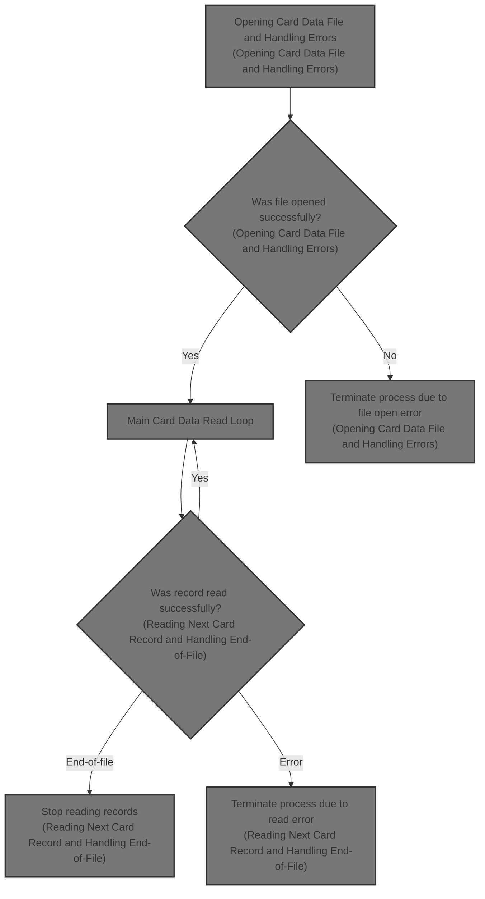
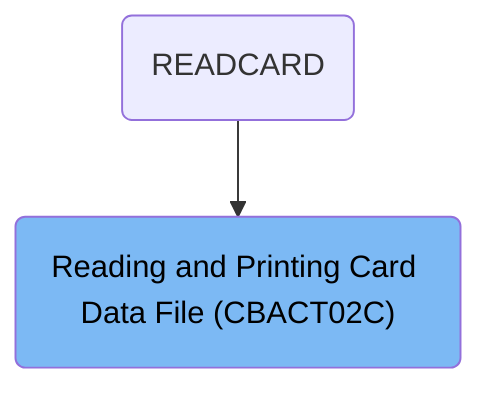

# Overview

This document describes the flow for reading and printing credit card records from a mainframe file. The process accesses the card data file, iterates through each record to display card information, and handles end-of-file and error conditions.

## Dependencies

### Programs

- CBACT02C (<SwmPath>[app/cbl/CBACT02C.cbl](app/cbl/CBACT02C.cbl)</SwmPath>)
- CEE3ABD

### Copybook

- CVACT02Y (<SwmPath>[app/cpy/CVACT02Y.cpy](app/cpy/CVACT02Y.cpy)</SwmPath>)

# Where is this program used?

This program is used once, as represented in the following diagram:

&nbsp;

*This is an auto-generated document by Swimm 🌊 and has not yet been verified by a human*

<SwmMeta version="3.0.0" repo-id="Z2l0aHViJTNBJTNBU3dpbW1pby1NRi1DcmVkaXRjYXJkLURlbW8xJTNBJTNBR2lyaS1Td2ltbQ==" repo-name="Swimmio-MF-Creditcard-Demo1">Powered by [Swimm](https://app.swimm.io/)</SwmMeta>
