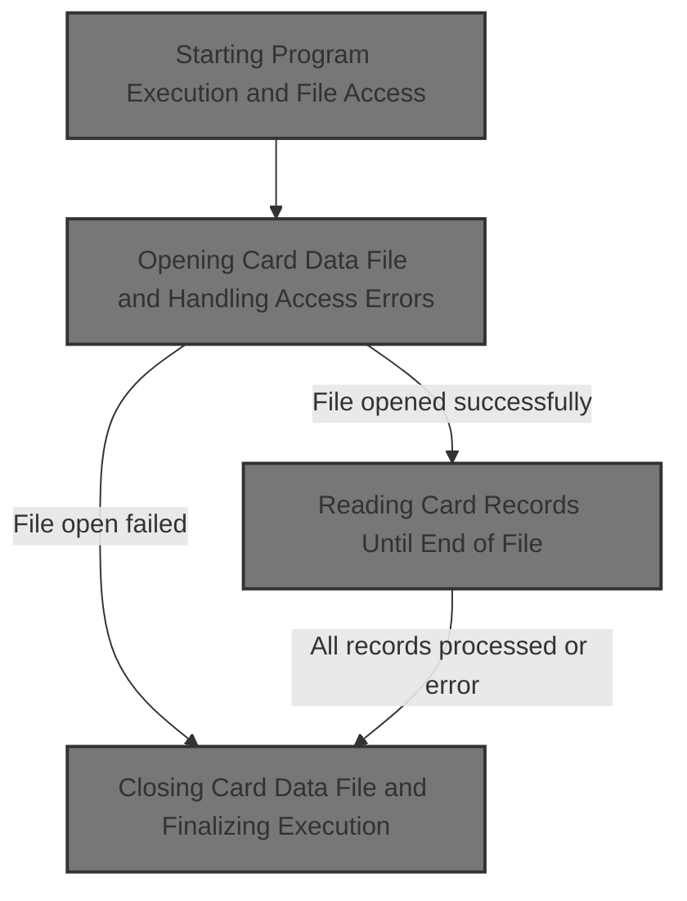
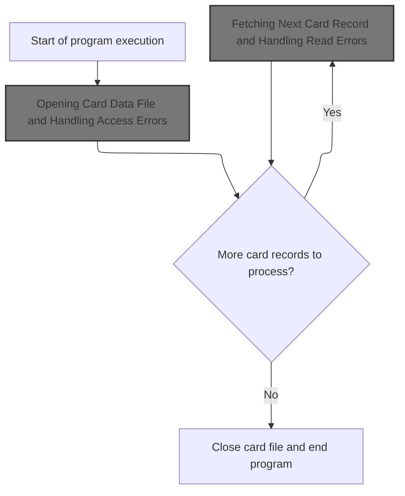
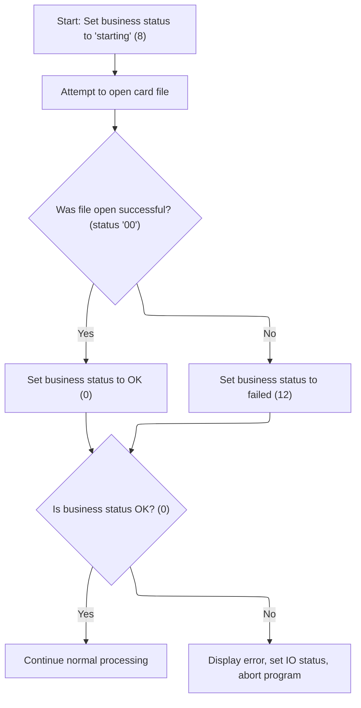
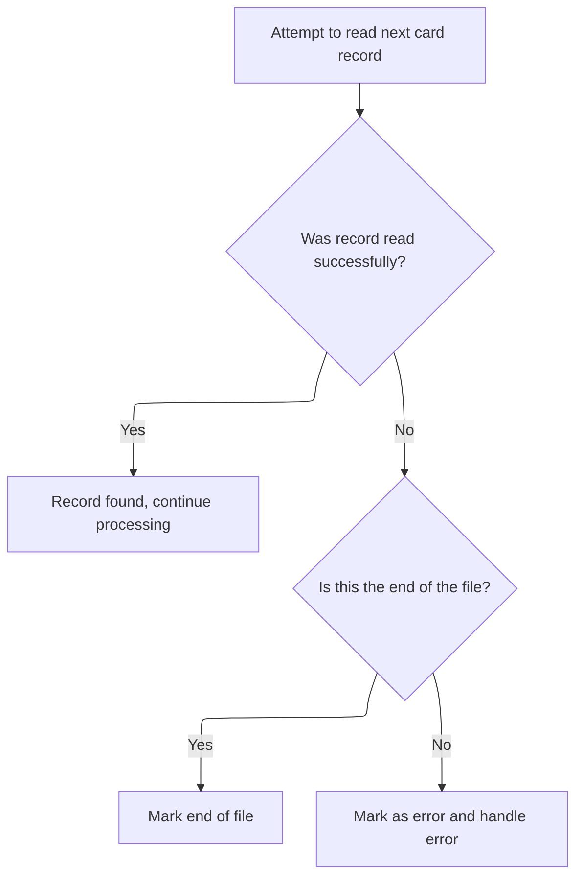

# Overview

This document describes the flow for reading and printing card records from a data file. The process opens the card data file, reads and displays each record in sequence, and handles errors or end-of-file conditions appropriately.



## Dependencies

### Programs

- <SwmToken path="app/cbl/CBACT02C.cbl" pos="71:14:14" line-data="           DISPLAY &#39;START OF EXECUTION OF PROGRAM CBACT02C&#39;.                    ">`CBACT02C`</SwmToken> (<SwmPath>[app/cbl/CBACT02C.cbl](app/cbl/CBACT02C.cbl)</SwmPath>)
- <SwmToken path="app/cbl/CBACT02C.cbl" pos="158:4:4" line-data="           CALL &#39;CEE3ABD&#39; USING ABCODE, TIMING.                                 ">`CEE3ABD`</SwmToken>

### Copybook

- <SwmToken path="app/cbl/CBACT02C.cbl" pos="45:3:3" line-data="       COPY CVACT02Y.                                                           ">`CVACT02Y`</SwmToken> (<SwmPath>[app/cpy/CVACT02Y.cpy](app/cpy/CVACT02Y.cpy)</SwmPath>)

# Where is this program used?

This program is used once, as represented in the following diagram:

```mermaid
graph TD
  puesw("READCARD") --> 8s17f("Reading and Printing Card Data File (CBACT02C)"):::currentEntity
click puesw openCode "app/jcl/READCARD.jcl:1"
  
  
click 8s17f openCode "app/cbl/CBACT02C.cbl:1"
    classDef currentEntity color:#000000,fill:#7CB9F4

%% Swimm:
%% graph TD
%%   puesw("READCARD") --> 8s17f("Reading and Printing Card Data File (<SwmToken path="app/cbl/CBACT02C.cbl" pos="71:14:14" line-data="           DISPLAY &#39;START OF EXECUTION OF PROGRAM CBACT02C&#39;.                    ">`CBACT02C`</SwmToken>)"):::currentEntity
%% click puesw openCode "<SwmPath>[app/jcl/READCARD.jcl](app/jcl/READCARD.jcl)</SwmPath>:1"
%%   
%%   
%% click 8s17f openCode "<SwmPath>[app/cbl/CBACT02C.cbl](app/cbl/CBACT02C.cbl)</SwmPath>:1"
%%     classDef currentEntity color:#000000,fill:#7CB9F4
```



## Input and Output Tables/Files used in the Program

| Table / File Name                                                                                                                                                          | Type | Description                                                        | Usage Mode | Key Fields / Layout Highlights |
| -------------------------------------------------------------------------------------------------------------------------------------------------------------------------- | ---- | ------------------------------------------------------------------ | ---------- | ------------------------------ |
| <SwmToken path="app/cbl/CBACT02C.cbl" pos="93:3:5" line-data="           READ CARDFILE-FILE INTO CARD-RECORD.                                 ">`CARDFILE-FILE`</SwmToken> | File | Credit card details: number, account ID, CVV, name, expiry, status | Input      | File resource                  |

&nbsp;

## Detailed View of the Program's Functionality

# Program Startup and File Access

When the program begins execution, it first displays a message indicating that it has started. Immediately after, it initiates the process to open the card data file. This is crucial because all subsequent operations—such as reading and displaying card records—depend on successful access to this file. The program uses a dedicated routine to handle the file opening, which also manages any errors that might occur during this step.

# Opening Card Data File and Handling Access Errors

To open the card data file, the program sets an internal status to indicate that it is starting the operation. It then attempts to open the file for input. After the open attempt, it checks the result:

- If the file opens successfully, the status is updated to indicate success.
- If the file fails to open, the status is set to an error value.

After this, the program checks the status again:

- If the status indicates success, the program continues with normal processing.
- If the status indicates failure, it displays an error message, copies the file status to a general IO status field, and calls a routine to display detailed IO status information. Finally, it calls a routine to terminate the program abnormally, ensuring that the error is visible and handled consistently.

The IO status display routine formats and shows the file status code. If the status is not numeric or starts with a specific value, it manipulates the status to create a custom error code for display. Otherwise, it shows a default status. This helps with troubleshooting by making error codes clearer.

# Reading Card Records Until End of File

Once the file is open, the program enters a loop to process card records. This loop continues until an end-of-file condition is detected. During each iteration:

- The program checks if the end-of-file flag is not set.
- If not, it calls a routine to fetch the next card record.
- If a record is successfully fetched and the end-of-file flag is still not set, the program displays the card record.
- The loop repeats until the end-of-file flag is set, indicating that all records have been processed.

# Fetching Next Card Record and Handling Read Errors

The routine responsible for fetching the next card record attempts to read from the file and then sets a status code based on the outcome:

- If the read is successful, the status is set to indicate success.
- If the read indicates end-of-file, the status is set to a special value for end-of-file.
- For any other error, the status is set to an error value.

After the read, the program checks the status:

- If the status indicates success, processing continues.
- If the status indicates end-of-file, the end-of-file flag is set so the main loop will exit.
- If the status indicates another error, the program displays an error message, copies the file status to the IO status field, calls the IO status display routine for details, and then terminates the program abnormally.

# Closing Card Data File and Finalizing Execution

After all records have been processed, the program calls a routine to close the card data file. It then displays a message indicating the end of execution and returns control to the operating system. Closing the file is important for proper resource management and to ensure that all data is safely written and the file is not left in an inconsistent state.

# Final File Close and Error Handling

The file close routine sets an intermediate status, attempts to close the file, and then checks the result:

- If the file closes successfully, the status is reset to indicate success.
- If the file fails to close, the status is set to an error value.

After closing, the program checks the status:

- If the status indicates success, the routine exits normally.
- If the status indicates failure, the program displays an error message, copies the file status to the IO status field, calls the IO status display routine for details, and then terminates the program abnormally.

This consistent approach to error handling ensures that any issues with file operations are clearly reported and that the program does not continue running in an invalid state.

# Rule Definition

| Paragraph Name                                                                                                                                                                                                                                                                                                                                                                                        | Rule ID | Category          | Description                                                                                                                                                                                                                               | Conditions                                                      | Remarks                                                                                                                                                                                                                                                                                                                                        |
| ----------------------------------------------------------------------------------------------------------------------------------------------------------------------------------------------------------------------------------------------------------------------------------------------------------------------------------------------------------------------------------------------------- | ------- | ----------------- | ----------------------------------------------------------------------------------------------------------------------------------------------------------------------------------------------------------------------------------------- | --------------------------------------------------------------- | ---------------------------------------------------------------------------------------------------------------------------------------------------------------------------------------------------------------------------------------------------------------------------------------------------------------------------------------------- |
| <SwmToken path="app/cbl/CBACT02C.cbl" pos="72:3:7" line-data="           PERFORM 0000-CARDFILE-OPEN.                                          ">`0000-CARDFILE-OPEN`</SwmToken>                                                                                                                                                                                                                       | RL-001  | Data Assignment   | At program startup, the card data file must be opened and the business status set to indicate the application is starting.                                                                                                                | Program is starting.                                            | Business status value for 'starting' is 8.                                                                                                                                                                                                                                                                                                     |
| <SwmToken path="app/cbl/CBACT02C.cbl" pos="72:3:7" line-data="           PERFORM 0000-CARDFILE-OPEN.                                          ">`0000-CARDFILE-OPEN`</SwmToken>                                                                                                                                                                                                                       | RL-002  | Conditional Logic | After attempting to open the card data file, check the file status code. If successful, set business status to OK. If not, set business status to failed, display error message, and display formatted file status code.                  | After attempting to open the card data file.                    | Business status value for OK is 0; for failed is 12. Error message is 'ERROR OPENING CARDFILE'. Status code formatting rules apply.                                                                                                                                                                                                            |
| Main loop (PERFORM UNTIL <SwmToken path="app/cbl/CBACT02C.cbl" pos="74:5:9" line-data="           PERFORM UNTIL END-OF-FILE = &#39;Y&#39;                                      ">`END-OF-FILE`</SwmToken> = 'Y'), <SwmToken path="app/cbl/CBACT02C.cbl" pos="76:3:9" line-data="                   PERFORM 1000-CARDFILE-GET-NEXT                               ">`1000-CARDFILE-GET-NEXT`</SwmToken> | RL-003  | Conditional Logic | Process card records one by one until the end of the file is reached. For each record, attempt to read and display if successful.                                                                                                         | File is open and not at end-of-file.                            | Card record output is a single line, concatenation of card number and card data, total 150 characters.                                                                                                                                                                                                                                         |
| <SwmToken path="app/cbl/CBACT02C.cbl" pos="76:3:9" line-data="                   PERFORM 1000-CARDFILE-GET-NEXT                               ">`1000-CARDFILE-GET-NEXT`</SwmToken>                                                                                                                                                                                                                   | RL-004  | Conditional Logic | After attempting to read a card record, check the file status code. If successful, continue. If end-of-file, mark EOF. If error, display error message and formatted status code, then terminate.                                         | After attempting to read a card record.                         | Business status value for OK is 0; for EOF is 16; for error is 12. Error message is 'ERROR READING CARDFILE'. Status code formatting rules apply.                                                                                                                                                                                              |
| <SwmToken path="app/cbl/CBACT02C.cbl" pos="83:3:7" line-data="           PERFORM 9000-CARDFILE-CLOSE.                                         ">`9000-CARDFILE-CLOSE`</SwmToken>                                                                                                                                                                                                                      | RL-005  | Conditional Logic | After attempting to close the card data file, check the file status code. If successful, set application status to OK and exit. If not, set application status to error, display error message and formatted status code, then terminate. | After attempting to close the card data file.                   | Business status value for OK is 0; for error is 12. Error message is 'ERROR CLOSING CARDFILE'. Status code formatting rules apply.                                                                                                                                                                                                             |
| <SwmToken path="app/cbl/CBACT02C.cbl" pos="112:3:9" line-data="                   PERFORM 9910-DISPLAY-IO-STATUS                               ">`9910-DISPLAY-IO-STATUS`</SwmToken>                                                                                                                                                                                                                  | RL-006  | Computation       | Format the file status code for error messages according to numeric and non-numeric rules. Display the formatted code as a 4-digit string.                                                                                                | Whenever an error message is displayed due to file status code. | If status code is numeric and does not start with '9', display '00' + status code (e.g., '0010'). If non-numeric or starts with '9', display first character and last three digits as decimal value of ASCII code of second character (e.g., '9A' -> '9065'). Output is a 4-digit string, displayed on a separate line from the error message. |

# User Stories

## User Story 1: Open card data file and handle open errors

---

### Story Description:

As a batch job operator, I want the application to open the card data file at startup and clearly indicate whether the operation was successful or failed, so that I can ensure the application is ready to process card records or take corrective action if the file cannot be opened.

---

### Business Rule Mapping:

| Rule ID | Paragraph Name                                                                                                                                                                       | Rule Description                                                                                                                                                                                                         |
| ------- | ------------------------------------------------------------------------------------------------------------------------------------------------------------------------------------ | ------------------------------------------------------------------------------------------------------------------------------------------------------------------------------------------------------------------------ |
| RL-001  | <SwmToken path="app/cbl/CBACT02C.cbl" pos="72:3:7" line-data="           PERFORM 0000-CARDFILE-OPEN.                                          ">`0000-CARDFILE-OPEN`</SwmToken>      | At program startup, the card data file must be opened and the business status set to indicate the application is starting.                                                                                               |
| RL-002  | <SwmToken path="app/cbl/CBACT02C.cbl" pos="72:3:7" line-data="           PERFORM 0000-CARDFILE-OPEN.                                          ">`0000-CARDFILE-OPEN`</SwmToken>      | After attempting to open the card data file, check the file status code. If successful, set business status to OK. If not, set business status to failed, display error message, and display formatted file status code. |
| RL-006  | <SwmToken path="app/cbl/CBACT02C.cbl" pos="112:3:9" line-data="                   PERFORM 9910-DISPLAY-IO-STATUS                               ">`9910-DISPLAY-IO-STATUS`</SwmToken> | Format the file status code for error messages according to numeric and non-numeric rules. Display the formatted code as a 4-digit string.                                                                               |

---

### Relevant Functionality:

- <SwmToken path="app/cbl/CBACT02C.cbl" pos="72:3:7" line-data="           PERFORM 0000-CARDFILE-OPEN.                                          ">`0000-CARDFILE-OPEN`</SwmToken>
  1. **RL-001:**
     - Set business status to 'starting' (value 8)
     - Attempt to open the card data file
  2. **RL-002:**
     - If file status code is '00':
       - Set business status to OK (value 0)
     - Else:
       - Set business status to failed (value 12)
       - Display 'ERROR OPENING CARDFILE'
       - Display formatted file status code
- <SwmToken path="app/cbl/CBACT02C.cbl" pos="112:3:9" line-data="                   PERFORM 9910-DISPLAY-IO-STATUS                               ">`9910-DISPLAY-IO-STATUS`</SwmToken>
  1. **RL-006:**
     - If status code is numeric and does not start with '9':
       - Display '00' + status code (4 digits)
     - Else:
       - Display first character
       - Display last three digits as decimal value of ASCII code of second character
       - Concatenate for 4-digit output
     - Display formatted status code on a separate line

## User Story 2: Process card records and handle read errors/EOF

---

### Story Description:

As a batch job operator, I want the application to process card records sequentially, display each record, and handle end-of-file or read errors with clear messages and formatted status codes, so that I can monitor progress and respond appropriately to any issues during record processing.

---

### Business Rule Mapping:

| Rule ID | Paragraph Name                                                                                                                                                                                                                                                                                                                                                                                        | Rule Description                                                                                                                                                                                  |
| ------- | ----------------------------------------------------------------------------------------------------------------------------------------------------------------------------------------------------------------------------------------------------------------------------------------------------------------------------------------------------------------------------------------------------- | ------------------------------------------------------------------------------------------------------------------------------------------------------------------------------------------------- |
| RL-006  | <SwmToken path="app/cbl/CBACT02C.cbl" pos="112:3:9" line-data="                   PERFORM 9910-DISPLAY-IO-STATUS                               ">`9910-DISPLAY-IO-STATUS`</SwmToken>                                                                                                                                                                                                                  | Format the file status code for error messages according to numeric and non-numeric rules. Display the formatted code as a 4-digit string.                                                        |
| RL-004  | <SwmToken path="app/cbl/CBACT02C.cbl" pos="76:3:9" line-data="                   PERFORM 1000-CARDFILE-GET-NEXT                               ">`1000-CARDFILE-GET-NEXT`</SwmToken>                                                                                                                                                                                                                   | After attempting to read a card record, check the file status code. If successful, continue. If end-of-file, mark EOF. If error, display error message and formatted status code, then terminate. |
| RL-003  | Main loop (PERFORM UNTIL <SwmToken path="app/cbl/CBACT02C.cbl" pos="74:5:9" line-data="           PERFORM UNTIL END-OF-FILE = &#39;Y&#39;                                      ">`END-OF-FILE`</SwmToken> = 'Y'), <SwmToken path="app/cbl/CBACT02C.cbl" pos="76:3:9" line-data="                   PERFORM 1000-CARDFILE-GET-NEXT                               ">`1000-CARDFILE-GET-NEXT`</SwmToken> | Process card records one by one until the end of the file is reached. For each record, attempt to read and display if successful.                                                                 |

---

### Relevant Functionality:

- <SwmToken path="app/cbl/CBACT02C.cbl" pos="112:3:9" line-data="                   PERFORM 9910-DISPLAY-IO-STATUS                               ">`9910-DISPLAY-IO-STATUS`</SwmToken>
  1. **RL-006:**
     - If status code is numeric and does not start with '9':
       - Display '00' + status code (4 digits)
     - Else:
       - Display first character
       - Display last three digits as decimal value of ASCII code of second character
       - Concatenate for 4-digit output
     - Display formatted status code on a separate line
- <SwmToken path="app/cbl/CBACT02C.cbl" pos="76:3:9" line-data="                   PERFORM 1000-CARDFILE-GET-NEXT                               ">`1000-CARDFILE-GET-NEXT`</SwmToken>
  1. **RL-004:**
     - If file status code is '00':
       - Set business status to OK (value 0)
     - If file status code is '10':
       - Set business status to EOF (value 16)
       - Mark end-of-file
     - Else:
       - Set business status to error (value 12)
       - Display 'ERROR READING CARDFILE'
       - Display formatted file status code
       - Terminate program
- **Main loop (PERFORM UNTIL** <SwmToken path="app/cbl/CBACT02C.cbl" pos="74:5:9" line-data="           PERFORM UNTIL END-OF-FILE = &#39;Y&#39;                                      ">`END-OF-FILE`</SwmToken> **= 'Y')**
  1. **RL-003:**
     - Loop until end-of-file:
       - Attempt to read next card record
       - If read is successful (status code '00'):
         - Display full card record (150 characters)
       - If read returns status code '10':
         - Mark end-of-file and stop processing
       - If read returns any other status code:
         - Display error message and formatted status code
         - Terminate processing

## User Story 3: Close card data file and handle close errors

---

### Story Description:

As a batch job operator, I want the application to close the card data file at the end of processing and indicate whether the operation was successful or failed, displaying formatted error codes if necessary, so that I can confirm the job completed cleanly or investigate any closing issues.

---

### Business Rule Mapping:

| Rule ID | Paragraph Name                                                                                                                                                                       | Rule Description                                                                                                                                                                                                                          |
| ------- | ------------------------------------------------------------------------------------------------------------------------------------------------------------------------------------ | ----------------------------------------------------------------------------------------------------------------------------------------------------------------------------------------------------------------------------------------- |
| RL-006  | <SwmToken path="app/cbl/CBACT02C.cbl" pos="112:3:9" line-data="                   PERFORM 9910-DISPLAY-IO-STATUS                               ">`9910-DISPLAY-IO-STATUS`</SwmToken> | Format the file status code for error messages according to numeric and non-numeric rules. Display the formatted code as a 4-digit string.                                                                                                |
| RL-005  | <SwmToken path="app/cbl/CBACT02C.cbl" pos="83:3:7" line-data="           PERFORM 9000-CARDFILE-CLOSE.                                         ">`9000-CARDFILE-CLOSE`</SwmToken>     | After attempting to close the card data file, check the file status code. If successful, set application status to OK and exit. If not, set application status to error, display error message and formatted status code, then terminate. |

---

### Relevant Functionality:

- <SwmToken path="app/cbl/CBACT02C.cbl" pos="112:3:9" line-data="                   PERFORM 9910-DISPLAY-IO-STATUS                               ">`9910-DISPLAY-IO-STATUS`</SwmToken>
  1. **RL-006:**
     - If status code is numeric and does not start with '9':
       - Display '00' + status code (4 digits)
     - Else:
       - Display first character
       - Display last three digits as decimal value of ASCII code of second character
       - Concatenate for 4-digit output
     - Display formatted status code on a separate line
- <SwmToken path="app/cbl/CBACT02C.cbl" pos="83:3:7" line-data="           PERFORM 9000-CARDFILE-CLOSE.                                         ">`9000-CARDFILE-CLOSE`</SwmToken>
  1. **RL-005:**
     - Attempt to close card data file
     - If file status code is '00':
       - Set application status to OK (value 0)
     - Else:
       - Set application status to error (value 12)
       - Display 'ERROR CLOSING CARDFILE'
       - Display formatted file status code
       - Terminate program

# Workflow

# Starting Program Execution and File Access



This section governs the rules for starting the credit card management program, accessing the card data file, and handling the flow of reading card records or terminating the program in case of errors or end-of-file.

| Category        | Rule Name                          | Description                                                                                                                                                                     |
| --------------- | ---------------------------------- | ------------------------------------------------------------------------------------------------------------------------------------------------------------------------------- |
| Data validation | File Access Prerequisite           | The card data file must be successfully opened before any card records can be processed. If the file cannot be opened, the program must display an error message and terminate. |
| Business logic  | Execution Start Notification       | The program must display a start message to indicate the beginning of execution.                                                                                                |
| Business logic  | Iterative Record Processing        | The program must continue to fetch and process card records as long as there are more records available in the card data file.                                                  |
| Business logic  | Graceful Completion on End-of-File | When there are no more card records to process (end-of-file is reached), the program must close the card data file and end execution normally.                                  |

<SwmSnippet path="/app/cbl/CBACT02C.cbl" line="70">

---

In PROCEDURE-DIVISION, we kick off execution by displaying a start message, then immediately call <SwmToken path="app/cbl/CBACT02C.cbl" pos="72:3:7" line-data="           PERFORM 0000-CARDFILE-OPEN.                                          ">`0000-CARDFILE-OPEN`</SwmToken> to get access to the card data file. Without opening the file, none of the subsequent logic for reading or displaying card records can run.

```cobol
       PROCEDURE DIVISION.                                                      
           DISPLAY 'START OF EXECUTION OF PROGRAM CBACT02C'.                    
           PERFORM 0000-CARDFILE-OPEN.                                          
```

---

</SwmSnippet>

## Opening Card Data File and Handling Access Errors



This section governs the business logic for opening the card data file and handling any access errors. It ensures that the application only proceeds with normal processing if the file is accessible, and provides clear error reporting and termination if not.

| Category       | Rule Name                           | Description                                                                                                                                                |
| -------------- | ----------------------------------- | ---------------------------------------------------------------------------------------------------------------------------------------------------------- |
| Business logic | Set starting status on open attempt | When starting the process to open the card data file, the business status must be set to 'starting' (value 8) to indicate the initiation of the operation. |
| Business logic | Set OK status on successful open    | If the card data file is opened successfully, the business status must be set to OK (value 0), indicating that normal processing can continue.             |
| Business logic | Set failed status on open error     | If the card data file cannot be opened, the business status must be set to failed (value 12), and normal processing must not continue.                     |

<SwmSnippet path="/app/cbl/CBACT02C.cbl" line="118">

---

In <SwmToken path="app/cbl/CBACT02C.cbl" pos="118:1:5" line-data="       0000-CARDFILE-OPEN.                                                      ">`0000-CARDFILE-OPEN`</SwmToken>, we try to open the card data file and immediately check the status. If the open is successful, we set <SwmToken path="app/cbl/CBACT02C.cbl" pos="119:7:9" line-data="           MOVE 8 TO APPL-RESULT.                                               ">`APPL-RESULT`</SwmToken> to zero; otherwise, we set it to an error code so downstream logic knows if the file is usable.

```cobol
       0000-CARDFILE-OPEN.                                                      
           MOVE 8 TO APPL-RESULT.                                               
           OPEN INPUT CARDFILE-FILE                                             
           IF  CARDFILE-STATUS = '00'                                           
               MOVE 0 TO APPL-RESULT                                            
           ELSE                                                                 
               MOVE 12 TO APPL-RESULT                                           
           END-IF                                                               
```

---

</SwmSnippet>

<SwmSnippet path="/app/cbl/CBACT02C.cbl" line="126">

---

After trying to open the file in <SwmToken path="app/cbl/CBACT02C.cbl" pos="72:3:7" line-data="           PERFORM 0000-CARDFILE-OPEN.                                          ">`0000-CARDFILE-OPEN`</SwmToken>, if it fails, we display an error message, move the file status to <SwmToken path="app/cbl/CBACT02C.cbl" pos="130:9:11" line-data="               MOVE CARDFILE-STATUS TO IO-STATUS                                ">`IO-STATUS`</SwmToken>, and call <SwmToken path="app/cbl/CBACT02C.cbl" pos="131:3:9" line-data="               PERFORM 9910-DISPLAY-IO-STATUS                                   ">`9910-DISPLAY-IO-STATUS`</SwmToken> to show detailed status info before abending the program. This gives us visibility into what went wrong.

```cobol
           IF  APPL-AOK                                                         
               CONTINUE                                                         
           ELSE                                                                 
               DISPLAY 'ERROR OPENING CARDFILE'                                 
               MOVE CARDFILE-STATUS TO IO-STATUS                                
               PERFORM 9910-DISPLAY-IO-STATUS                                   
               PERFORM 9999-ABEND-PROGRAM                                       
           END-IF                                                               
           EXIT.                                                                
```

---

</SwmSnippet>

<SwmSnippet path="/app/cbl/CBACT02C.cbl" line="161">

---

<SwmToken path="app/cbl/CBACT02C.cbl" pos="161:1:7" line-data="       9910-DISPLAY-IO-STATUS.                                                  ">`9910-DISPLAY-IO-STATUS`</SwmToken> formats and displays the file status after an IO operation. It checks if <SwmToken path="app/cbl/CBACT02C.cbl" pos="161:5:7" line-data="       9910-DISPLAY-IO-STATUS.                                                  ">`IO-STATUS`</SwmToken> is not numeric or <SwmToken path="app/cbl/CBACT02C.cbl" pos="163:3:5" line-data="           OR  IO-STAT1 = &#39;9&#39;                                                   ">`IO-STAT1`</SwmToken> is '9', then manipulates <SwmToken path="app/cbl/CBACT02C.cbl" pos="164:9:13" line-data="               MOVE IO-STAT1 TO IO-STATUS-04(1:1)                               ">`IO-STATUS-04`</SwmToken> using repo-specific struct logic to show a custom error code. Otherwise, it displays a default status. This helps make error codes clearer for troubleshooting.

```cobol
       9910-DISPLAY-IO-STATUS.                                                  
           IF  IO-STATUS NOT NUMERIC                                            
           OR  IO-STAT1 = '9'                                                   
               MOVE IO-STAT1 TO IO-STATUS-04(1:1)                               
               MOVE 0        TO TWO-BYTES-BINARY                                
               MOVE IO-STAT2 TO TWO-BYTES-RIGHT                                 
               MOVE TWO-BYTES-BINARY TO IO-STATUS-0403                          
               DISPLAY 'FILE STATUS IS: NNNN' IO-STATUS-04                      
           ELSE                                                                 
               MOVE '0000' TO IO-STATUS-04                                      
               MOVE IO-STATUS TO IO-STATUS-04(3:2)                              
               DISPLAY 'FILE STATUS IS: NNNN' IO-STATUS-04                      
           END-IF                                                               
           EXIT.                                                                
```

---

</SwmSnippet>

## Reading Card Records Until End of File

```mermaid
%%{init: {"flowchart": {"defaultRenderer": "elk"}} }%%
flowchart TD
    node1["Start processing card records"]
    click node1 openCode "app/cbl/CBACT02C.cbl:74:74"
    subgraph loop1["Repeat until END-OF-FILE = 'Y'"]
        node1 --> node2{"Is END-OF-FILE = 'N'?"}
        click node2 openCode "app/cbl/CBACT02C.cbl:75:75"
        node2 -->|"Yes"| node3["Retrieve next card record"]
        click node3 openCode "app/cbl/CBACT02C.cbl:76:76"
        node3 --> node4["Display card record"]
        click node4 openCode "app/cbl/CBACT02C.cbl:78:78"
        node4 --> node2
        node2 -->|"No"| node5["End processing"]
        click node5 openCode "app/cbl/CBACT02C.cbl:81:81"
    end

classDef HeadingStyle fill:#777777,stroke:#333,stroke-width:2px;

%% Swimm:
%% %%{init: {"flowchart": {"defaultRenderer": "elk"}} }%%
%% flowchart TD
%%     node1["Start processing card records"]
%%     click node1 openCode "<SwmPath>[app/cbl/CBACT02C.cbl](app/cbl/CBACT02C.cbl)</SwmPath>:74:74"
%%     subgraph loop1["Repeat until <SwmToken path="app/cbl/CBACT02C.cbl" pos="74:5:9" line-data="           PERFORM UNTIL END-OF-FILE = &#39;Y&#39;                                      ">`END-OF-FILE`</SwmToken> = 'Y'"]
%%         node1 --> node2{"Is <SwmToken path="app/cbl/CBACT02C.cbl" pos="74:5:9" line-data="           PERFORM UNTIL END-OF-FILE = &#39;Y&#39;                                      ">`END-OF-FILE`</SwmToken> = 'N'?"}
%%         click node2 openCode "<SwmPath>[app/cbl/CBACT02C.cbl](app/cbl/CBACT02C.cbl)</SwmPath>:75:75"
%%         node2 -->|"Yes"| node3["Retrieve next card record"]
%%         click node3 openCode "<SwmPath>[app/cbl/CBACT02C.cbl](app/cbl/CBACT02C.cbl)</SwmPath>:76:76"
%%         node3 --> node4["Display card record"]
%%         click node4 openCode "<SwmPath>[app/cbl/CBACT02C.cbl](app/cbl/CBACT02C.cbl)</SwmPath>:78:78"
%%         node4 --> node2
%%         node2 -->|"No"| node5["End processing"]
%%         click node5 openCode "<SwmPath>[app/cbl/CBACT02C.cbl](app/cbl/CBACT02C.cbl)</SwmPath>:81:81"
%%     end
%% 
%% classDef HeadingStyle fill:#777777,stroke:#333,stroke-width:2px;
```



<SwmSnippet path="/app/cbl/CBACT02C.cbl" line="74">

---

Back in PROCEDURE-DIVISION, after opening the file, we enter a loop that keeps calling <SwmToken path="app/cbl/CBACT02C.cbl" pos="76:3:9" line-data="                   PERFORM 1000-CARDFILE-GET-NEXT                               ">`1000-CARDFILE-GET-NEXT`</SwmToken> to fetch each card record until <SwmToken path="app/cbl/CBACT02C.cbl" pos="74:5:9" line-data="           PERFORM UNTIL END-OF-FILE = &#39;Y&#39;                                      ">`END-OF-FILE`</SwmToken> is set. This lets us process all records sequentially.

```cobol
           PERFORM UNTIL END-OF-FILE = 'Y'                                      
               IF  END-OF-FILE = 'N'                                            
                   PERFORM 1000-CARDFILE-GET-NEXT                               
                   IF  END-OF-FILE = 'N'                                        
                       DISPLAY CARD-RECORD                                      
                   END-IF                                                       
               END-IF                                                           
           END-PERFORM.                                                         
```

---

</SwmSnippet>

## Fetching Next Card Record and Handling Read Errors



This section governs the business rules for reading the next card record from the card file, including how to handle successful reads, end-of-file conditions, and read errors. It ensures that the application responds appropriately to each possible outcome when accessing card data.

| Category       | Rule Name                   | Description                                                                                                                                                  |
| -------------- | --------------------------- | ------------------------------------------------------------------------------------------------------------------------------------------------------------ |
| Business logic | Successful card record read | If a card record is read successfully from the card file, the system must continue processing the record without interruption.                               |
| Business logic | End of file handling        | If the end of the card file is reached (no more records to read), the system must mark the end-of-file condition and cease further attempts to read records. |

<SwmSnippet path="/app/cbl/CBACT02C.cbl" line="92">

---

In <SwmToken path="app/cbl/CBACT02C.cbl" pos="92:1:7" line-data="       1000-CARDFILE-GET-NEXT.                                                  ">`1000-CARDFILE-GET-NEXT`</SwmToken>, we read the next card record from the file and set <SwmToken path="app/cbl/CBACT02C.cbl" pos="95:7:9" line-data="               MOVE 0 TO APPL-RESULT                                            ">`APPL-RESULT`</SwmToken> based on the outcome: zero for success, 16 for EOF, or 12 for other errors. This status drives the next steps in the flow.

```cobol
       1000-CARDFILE-GET-NEXT.                                                  
           READ CARDFILE-FILE INTO CARD-RECORD.                                 
           IF  CARDFILE-STATUS = '00'                                           
               MOVE 0 TO APPL-RESULT                                            
      *        DISPLAY CARD-RECORD                                              
           ELSE                                                                 
               IF  CARDFILE-STATUS = '10'                                       
                   MOVE 16 TO APPL-RESULT                                       
               ELSE                                                             
                   MOVE 12 TO APPL-RESULT                                       
               END-IF                                                           
```

---

</SwmSnippet>

<SwmSnippet path="/app/cbl/CBACT02C.cbl" line="103">

---

After reading a record in <SwmToken path="app/cbl/CBACT02C.cbl" pos="76:3:9" line-data="                   PERFORM 1000-CARDFILE-GET-NEXT                               ">`1000-CARDFILE-GET-NEXT`</SwmToken>, if there's an error (not EOF), we display an error message, move the file status to <SwmToken path="app/cbl/CBACT02C.cbl" pos="111:9:11" line-data="                   MOVE CARDFILE-STATUS TO IO-STATUS                            ">`IO-STATUS`</SwmToken>, and call <SwmToken path="app/cbl/CBACT02C.cbl" pos="112:3:9" line-data="                   PERFORM 9910-DISPLAY-IO-STATUS                               ">`9910-DISPLAY-IO-STATUS`</SwmToken> to show what went wrong before abending.

```cobol
           END-IF                                                               
           IF  APPL-AOK                                                         
               CONTINUE                                                         
           ELSE                                                                 
               IF  APPL-EOF                                                     
                   MOVE 'Y' TO END-OF-FILE                                      
               ELSE                                                             
                   DISPLAY 'ERROR READING CARDFILE'                             
                   MOVE CARDFILE-STATUS TO IO-STATUS                            
                   PERFORM 9910-DISPLAY-IO-STATUS                               
                   PERFORM 9999-ABEND-PROGRAM                                   
               END-IF                                                           
           END-IF                                                               
           EXIT.                                                                
```

---

</SwmSnippet>

## Closing Card Data File and Finalizing Execution

<SwmSnippet path="/app/cbl/CBACT02C.cbl" line="83">

---

After finishing the record loop in PROCEDURE-DIVISION, we call <SwmToken path="app/cbl/CBACT02C.cbl" pos="83:3:7" line-data="           PERFORM 9000-CARDFILE-CLOSE.                                         ">`9000-CARDFILE-CLOSE`</SwmToken> to close the card data file, display an end message, and return control. Closing the file is necessary for clean resource management.

```cobol
           PERFORM 9000-CARDFILE-CLOSE.                                         
                                                                                
           DISPLAY 'END OF EXECUTION OF PROGRAM CBACT02C'.                      
                                                                                
           GOBACK.                                                              
```

---

</SwmSnippet>

# Final File Close and Error Handling



```mermaid
%%{init: {"flowchart": {"defaultRenderer": "elk"}} }%%
flowchart TD
  node1["Attempt to close the card file"] --> node2{"Was card file closed successfully?
(CARDFILE-STATUS = #quot;00#quot;)"}
  click node1 openCode "app/cbl/CBACT02C.cbl:137:138"
  click node2 openCode "app/cbl/CBACT02C.cbl:139:143"
  node2 -->|"Yes"| node3["Set application status to OK"]
  click node3 openCode "app/cbl/CBACT02C.cbl:140:140"
  node2 -->|"No"| node4["Set application status to error"]
  click node4 openCode "app/cbl/CBACT02C.cbl:142:142"
  node3 --> node5{"Is application status OK?
(APPL-AOK)"}
  node4 --> node5
  click node5 openCode "app/cbl/CBACT02C.cbl:144:151"
  node5 -->|"Yes"| node6["Exit function"]
  click node6 openCode "app/cbl/CBACT02C.cbl:152:152"
  node5 -->|"No"| node7["Display error and handle failure"]
  click node7 openCode "app/cbl/CBACT02C.cbl:147:150"
  node7 --> node6
classDef HeadingStyle fill:#777777,stroke:#333,stroke-width:2px;

%% Swimm:
%% %%{init: {"flowchart": {"defaultRenderer": "elk"}} }%%
%% flowchart TD
%%   node1["Attempt to close the card file"] --> node2{"Was card file closed successfully?
%% (<SwmToken path="app/cbl/CBACT02C.cbl" pos="94:3:5" line-data="           IF  CARDFILE-STATUS = &#39;00&#39;                                           ">`CARDFILE-STATUS`</SwmToken> = #quot;00#quot;)"}
%%   click node1 openCode "<SwmPath>[app/cbl/CBACT02C.cbl](app/cbl/CBACT02C.cbl)</SwmPath>:137:138"
%%   click node2 openCode "<SwmPath>[app/cbl/CBACT02C.cbl](app/cbl/CBACT02C.cbl)</SwmPath>:139:143"
%%   node2 -->|"Yes"| node3["Set application status to OK"]
%%   click node3 openCode "<SwmPath>[app/cbl/CBACT02C.cbl](app/cbl/CBACT02C.cbl)</SwmPath>:140:140"
%%   node2 -->|"No"| node4["Set application status to error"]
%%   click node4 openCode "<SwmPath>[app/cbl/CBACT02C.cbl](app/cbl/CBACT02C.cbl)</SwmPath>:142:142"
%%   node3 --> node5{"Is application status OK?
%% (<SwmToken path="app/cbl/CBACT02C.cbl" pos="104:3:5" line-data="           IF  APPL-AOK                                                         ">`APPL-AOK`</SwmToken>)"}
%%   node4 --> node5
%%   click node5 openCode "<SwmPath>[app/cbl/CBACT02C.cbl](app/cbl/CBACT02C.cbl)</SwmPath>:144:151"
%%   node5 -->|"Yes"| node6["Exit function"]
%%   click node6 openCode "<SwmPath>[app/cbl/CBACT02C.cbl](app/cbl/CBACT02C.cbl)</SwmPath>:152:152"
%%   node5 -->|"No"| node7["Display error and handle failure"]
%%   click node7 openCode "<SwmPath>[app/cbl/CBACT02C.cbl](app/cbl/CBACT02C.cbl)</SwmPath>:147:150"
%%   node7 --> node6
%% classDef HeadingStyle fill:#777777,stroke:#333,stroke-width:2px;
```

This section ensures that the card file is properly closed at the end of processing, and that any errors encountered during the close operation are handled in a consistent and user-visible manner. It also sets the appropriate application status codes for downstream processing or reporting.

| Category       | Rule Name              | Description                                                                                                                                                                                                                                                                                                                                                                                                                                                                                          |
| -------------- | ---------------------- | ---------------------------------------------------------------------------------------------------------------------------------------------------------------------------------------------------------------------------------------------------------------------------------------------------------------------------------------------------------------------------------------------------------------------------------------------------------------------------------------------------- |
| Business logic | Successful File Close  | If the card file is closed successfully (<SwmToken path="app/cbl/CBACT02C.cbl" pos="94:3:5" line-data="           IF  CARDFILE-STATUS = &#39;00&#39;                                           ">`CARDFILE-STATUS`</SwmToken> = '00'), the application status code (<SwmToken path="app/cbl/CBACT02C.cbl" pos="95:7:9" line-data="               MOVE 0 TO APPL-RESULT                                            ">`APPL-RESULT`</SwmToken>) must be reset to 0, indicating a successful operation. |
| Business logic | Normal Exit on Success | If the final application status is OK (<SwmToken path="app/cbl/CBACT02C.cbl" pos="95:7:9" line-data="               MOVE 0 TO APPL-RESULT                                            ">`APPL-RESULT`</SwmToken> = 0), the program must exit the function normally without displaying errors or taking further action.                                                                                                                                                                                |

<SwmSnippet path="/app/cbl/CBACT02C.cbl" line="136">

---

In <SwmToken path="app/cbl/CBACT02C.cbl" pos="136:1:5" line-data="       9000-CARDFILE-CLOSE.                                                     ">`9000-CARDFILE-CLOSE`</SwmToken>, we set <SwmToken path="app/cbl/CBACT02C.cbl" pos="137:11:13" line-data="           ADD 8 TO ZERO GIVING APPL-RESULT.                                    ">`APPL-RESULT`</SwmToken> to 8, close the file, then zero it out if the close succeeded or set it to 12 if there was an error. This repo uses 8 and 12 as status codes for intermediate and error states.

```cobol
       9000-CARDFILE-CLOSE.                                                     
           ADD 8 TO ZERO GIVING APPL-RESULT.                                    
           CLOSE CARDFILE-FILE                                                  
           IF  CARDFILE-STATUS = '00'                                           
               SUBTRACT APPL-RESULT FROM APPL-RESULT                            
           ELSE                                                                 
               ADD 12 TO ZERO GIVING APPL-RESULT                                
           END-IF                                                               
```

---

</SwmSnippet>

<SwmSnippet path="/app/cbl/CBACT02C.cbl" line="144">

---

After closing the file in <SwmToken path="app/cbl/CBACT02C.cbl" pos="83:3:7" line-data="           PERFORM 9000-CARDFILE-CLOSE.                                         ">`9000-CARDFILE-CLOSE`</SwmToken>, we check <SwmToken path="app/cbl/CBACT02C.cbl" pos="144:3:5" line-data="           IF  APPL-AOK                                                         ">`APPL-AOK`</SwmToken>. If the close failed, we display an error, call <SwmToken path="app/cbl/CBACT02C.cbl" pos="149:3:9" line-data="               PERFORM 9910-DISPLAY-IO-STATUS                                   ">`9910-DISPLAY-IO-STATUS`</SwmToken> for details, and terminate. This keeps error handling consistent across file operations.

```cobol
           IF  APPL-AOK                                                         
               CONTINUE                                                         
           ELSE                                                                 
               DISPLAY 'ERROR CLOSING CARDFILE'                                 
               MOVE CARDFILE-STATUS TO IO-STATUS                                
               PERFORM 9910-DISPLAY-IO-STATUS                                   
               PERFORM 9999-ABEND-PROGRAM                                       
           END-IF                                                               
           EXIT.                                                                
```

---

</SwmSnippet>

&nbsp;

*This is an auto-generated document by Swimm 🌊 and has not yet been verified by a human*

<SwmMeta version="3.0.0" repo-id="Z2l0aHViJTNBJTNBU3dpbW1pby1NRi1DcmVkaXRjYXJkLURlbW8xJTNBJTNBR2lyaS1Td2ltbQ==" repo-name="Swimmio-MF-Creditcard-Demo1"><sup>Powered by [Swimm](https://app.swimm.io/)</sup></SwmMeta>
