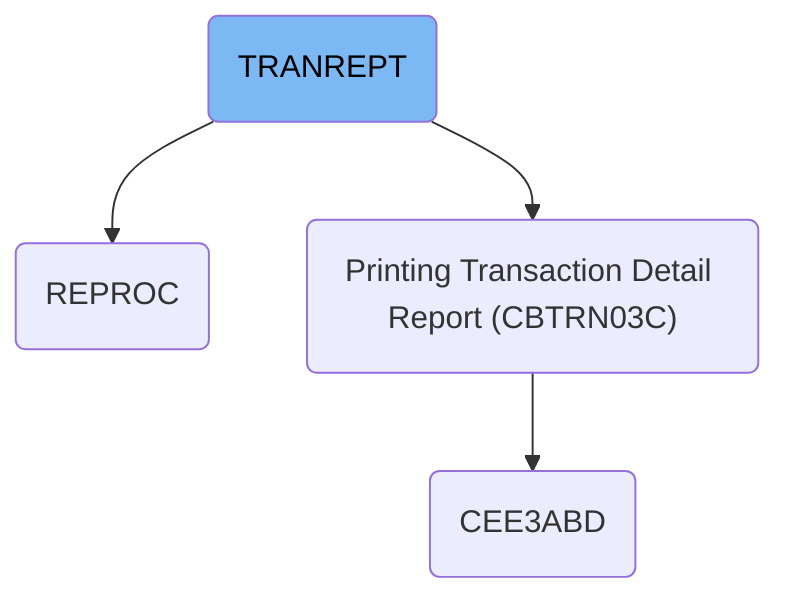

# Dependencies

## Paths

<SwmPath>[app/proc/REPROC.prc](app/proc/REPROC.prc)</SwmPath>

<SwmPath>[app/cbl/CBTRN03C.cbl](app/cbl/CBTRN03C.cbl)</SwmPath>

<SwmPath>[app/cpy/CVTRA05Y.cpy](app/cpy/CVTRA05Y.cpy)</SwmPath>

<SwmPath>[app/cpy/CVACT03Y.cpy](app/cpy/CVACT03Y.cpy)</SwmPath>

<SwmPath>[app/cpy/CVTRA03Y.cpy](app/cpy/CVTRA03Y.cpy)</SwmPath>

<SwmPath>[app/cpy/CVTRA04Y.cpy](app/cpy/CVTRA04Y.cpy)</SwmPath>

<SwmPath>[app/cpy/CVTRA07Y.cpy](app/cpy/CVTRA07Y.cpy)</SwmPath>

&nbsp;

*This is an auto-generated document by Swimm 🌊 and has not yet been verified by a human*

<SwmMeta version="3.0.0" repo-id="Z2l0aHViJTNBJTNBU3dpbW1pby1NRi1DcmVkaXRjYXJkLURlbW8xJTNBJTNBR2lyaS1Td2ltbQ==" repo-name="Swimmio-MF-Creditcard-Demo1">Powered by [Swimm](https://app.swimm.io/)</SwmMeta>
