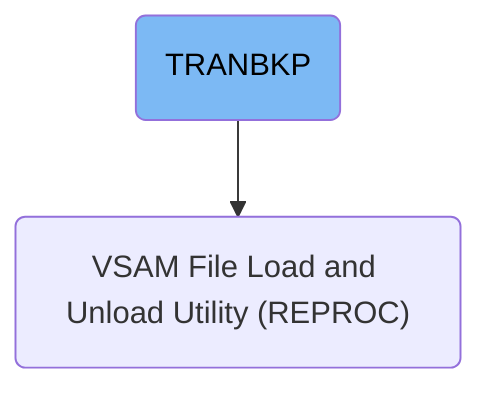
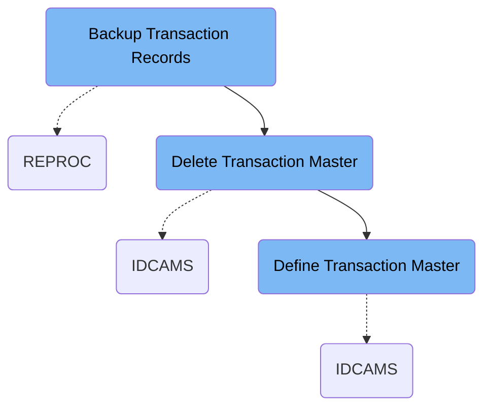

This document explains the TRANBKP job that backs up processed transaction records, deletes existing transaction master files, and defines new VSAM datasets for transaction storage. It takes the current transaction master file as input, creates a backup copy, deletes old files, and initializes a new empty transaction master dataset for new transactions.

# Dependencies

Here is a high level diagram of the file:

## Backup Transaction Records

Step in this section: `STEP05R`.

This section creates a backup copy of the processed transaction records by copying them from the main transaction data source to a backup dataset, ensuring that transaction history is securely archived.

1. The logic takes all records from the primary transaction master file, preserving their original structure and data.
2. Each record is copied sequentially into a newly allocated backup dataset specifically created for this batch run.
3. The resulting output is a one-for-one copy that maintains data integrity and supports future data recovery and audit needs.

### Input

**AWS.M2.CARDDEMO.TRANSACT.VSAM.KSDS (VSAM Transaction Master File)**

Contains the complete set of processed credit card transaction records.

### Output

**AWS.M2.CARDDEMO.TRANSACT.BKUP(+1) (Backup Transaction Dataset)**

A new backup dataset containing a copy of all transaction records from the master file.

## Delete Transaction Master

Step in this section: `STEP05`.

This section deletes the current transaction master data and associated index files, ensuring the system is ready for a fresh initialization of transaction records.

## Define Transaction Master

Step in this section: `STEP10`.

It defines a fresh master transaction dataset with both data and index components, ensuring the system can efficiently store and retrieve new credit card transaction records.

The section allocates and defines a new VSAM cluster for transactions, including both its data and index components. No input data is required; instead, the system creates an empty structure—AWS.M2.CARDDEMO.TRANSACT.VSAM.KSDS—designed for the subsequent storage and indexing of new credit card transactions. After execution, the system is prepared to securely store and quickly access transaction records.

### Output

**AWS.M2.CARDDEMO.TRANSACT.VSAM.KSDS**

Primary VSAM Key-Sequenced Data Set used to store and manage credit card transaction records.

**AWS.M2.CARDDEMO.TRANSACT.VSAM.KSDS.DATA**

Data component of the transaction master VSAM cluster for storing transaction details.

**AWS.M2.CARDDEMO.TRANSACT.VSAM.KSDS.INDEX**

Index component of the transaction master VSAM cluster for efficient transaction lookup.

&nbsp;

*This is an auto-generated document by Swimm 🌊 and has not yet been verified by a human*

<SwmMeta version="3.0.0" repo-id="Z2l0aHViJTNBJTNBU3dpbW1pby1NRi1DcmVkaXRjYXJkLURlbW8xJTNBJTNBR2lyaS1Td2ltbQ==" repo-name="Swimmio-MF-Creditcard-Demo1">Powered by [Swimm](https://app.swimm.io/)</SwmMeta>
