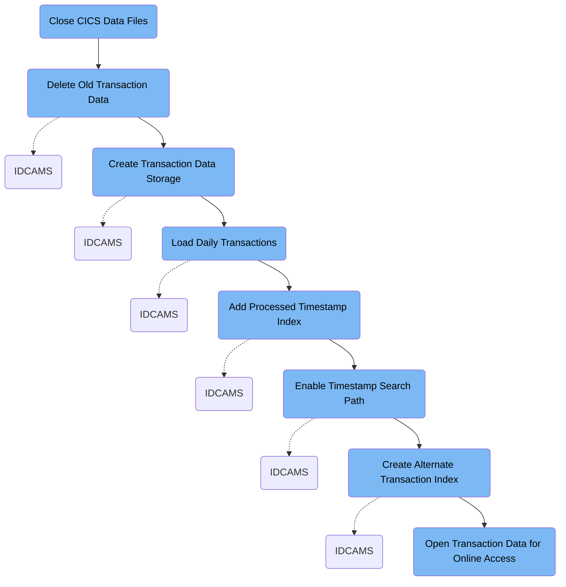

This document explains the TRANFILE job, which refreshes transaction data storage and indexing for the credit card management system. It loads new daily transactions and creates indexes for efficient access by account number and processed timestamp.

Here is a high level diagram of the file:

## Close CICS Data Files

Step in this section: `CLCIFIL`.

This section ensures that critical transaction and account cross-reference files are properly closed in the mainframe credit card management application, preventing data conflicts before performing maintenance such as deletion or recreation of these files.

## Delete Old Transaction Data

Step in this section: `STEP05`.

This section deletes outdated transaction data files and related indexes to ensure the mainframe credit card management system can be re-initialized with new transaction records.

## Create Transaction Data Storage

Step in this section: `STEP10`.

This section creates a dedicated data storage area for transaction records, ensuring that new transaction data can be captured and managed reliably.

The section allocates a new VSAM data cluster designed to hold transaction records. This involves defining the characteristics of the storage such as key structure, size, and index support to ensure that subsequent transaction data can be organized and accessed efficiently. No input is consumed; the process results in an initialized data store for future transaction entries.

### Output

**AWS.M2.CARDDEMO.TRANSACT.VSAM.KSDS**

A new key-sequenced VSAM dataset for storing transaction records, ready for use by the system.

## Load Daily Transactions

Step in this section: `STEP15`.

The section enables the credit card management application to populate its transaction database with daily activities, ensuring the most recent transaction data is available for account management and reporting.

- The flat file input containing daily transaction records is read sequentially.
- Each transaction record is transferred and written into the VSAM KSDS data store.
- The VSAM data store is updated to include all new records, making them available for the system’s online and batch credit card transaction processing.

### Input

<SwmPath>[app/…/EBCDIC/AWS.M2.CARDDEMO.DALYTRAN.PS.INIT](app/data/EBCDIC/AWS.M2.CARDDEMO.DALYTRAN.PS.INIT)</SwmPath> **(Daily Transaction Initialization File)**

Flat file containing a batch of new daily credit card transactions to be loaded into the transaction data store.

### Output

**AWS.M2.CARDDEMO.TRANSACT.VSAM.KSDS (Transaction VSAM Data Store)**

VSAM data cluster holding the full set of credit card transaction records, updated to include the newly loaded daily transactions.

## Add Processed Timestamp Index

Step in this section: `STEP20`.

This section adds an alternate index to the transaction data store, allowing users and business processes to efficiently retrieve transactions based on their processed timestamp rather than just the main account key.

• The current set of transaction records stored in the main VSAM cluster is referenced. • An alternate index definition is created, specifying the use of processed timestamp as the key for this new index. • The VSAM system allocates a new data and index set (AWS.M2.CARDDEMO.TRANSACT.VSAM.AIX and related datasets) to support this index. • No input records are altered, but references to transactions can now be made using the processed timestamp key, allowing searches and queries to be handled in new ways from this point on.

### Output

**AWS.M2.CARDDEMO.TRANSACT.VSAM.AIX**

VSAM alternate index dataset for accessing transactions by processed timestamp, enhancing the ability to search and report on transactions based on time.

## Enable Timestamp Search Path

Step in this section: `STEP25`.

This section establishes a connection between the newly created alternate index for transaction processed timestamps and the main transaction data set, making timestamp-based transaction lookup available for all relevant application workflows.

A path object is created in the VSAM system to connect the alternate processed timestamp index with the base transaction records. This path acts as a logical link, formally enabling the new index for use in searching and retrieving transactions based on their processed timestamp. No record-level data is changed or produced; rather, a new access method (the path) is formally established for application use.

### Output

**AWS.M2.CARDDEMO.TRANSACT.VSAM.AIX.PATH**

VSAM path providing access to transaction records via the processed timestamp alternate index, enabling efficient timestamp-based searches.

## Create Alternate Transaction Index

Step in this section: `STEP30`.

This section builds the actual alternate index structure for transaction records, finalizing the setup so the system can efficiently find transactions using the new reference method.

- All transaction records in the main dataset are read sequentially.
- For each record, the key field(s) specified for the alternate index (such as PROCESSED_TIMESTAMP) are extracted.
- The alternate index structure is built by associating each key value with a pointer/reference to the original transaction record.
- The resulting alternate index dataset contains entries organized by the alternate key, ensuring that lookups by this key can quickly retrieve the corresponding transaction information from the main data store.

### Input

**AWS.M2.CARDDEMO.TRANSACT.VSAM.KSDS**

The main VSAM data set containing all transaction records to be re-indexed, providing the source data to build the alternate transaction reference.

Sample:

| Column Name         | Sample           |
| ------------------- | ---------------- |
| ACCOUNT_NUMBER      | 1234567890123456 |
| TRANSACTION_DATE    | 20240617         |
| PROCESSED_TIMESTAMP | 20240617151500   |
| AMOUNT              | 100.00           |
| TRANSACTION_TYPE    | PURCHASE         |
| DESCRIPTION         | ONLINE ORDER     |

### Output

**AWS.M2.CARDDEMO.TRANSACT.VSAM.AIX**

The generated alternate index dataset enabling searches and queries on transaction records by the alternate key.

Sample:

| Column Name         | Sample           |
| ------------------- | ---------------- |
| PROCESSED_TIMESTAMP | 20240617151500   |
| ACCOUNT_NUMBER      | 1234567890123456 |
| TRANSACTION_DATE    | 20240617         |
| AMOUNT              | 100.00           |
| TRANSACTION_TYPE    | PURCHASE         |
| DESCRIPTION         | ONLINE ORDER     |

## Open Transaction Data for Online Access

Step in this section: `OPCIFIL`.

This section makes the updated transaction and cross-reference data available to the application for interactive credit card processing and lookups.

&nbsp;

*This is an auto-generated document by Swimm 🌊 and has not yet been verified by a human*

<SwmMeta version="3.0.0" repo-id="Z2l0aHViJTNBJTNBU3dpbW1pby1NRi1DcmVkaXRjYXJkLURlbW8xJTNBJTNBR2lyaS1Td2ltbQ==" repo-name="Swimmio-MF-Creditcard-Demo1">Powered by [Swimm](https://app.swimm.io/)</SwmMeta>
