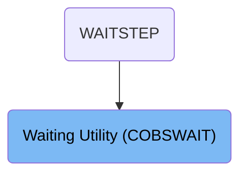

# Overview

This document describes a utility program that introduces a configurable execution delay. The program accepts a wait time value as input, pauses for the specified duration, and then terminates, supporting batch job coordination and testing scenarios.

## Dependencies

### Programs

- COBSWAIT (<SwmPath>[app/cbl/COBSWAIT.cbl](app/cbl/COBSWAIT.cbl)</SwmPath>)
- MVSWAIT

# Where is this program used?

This program is used once, as represented in the following diagram:



## Detailed View of the Program's Functionality

a. Program Initialization and Purpose

This program is a batch utility within the <SwmToken path="app/cbl/COBSWAIT.cbl" pos="3:7:7" line-data="      * Application : CardDemo">`CardDemo`</SwmToken> application, designed specifically to introduce a controlled wait or delay in execution. The delay duration is provided externally, making the program flexible for use in various batch processing scenarios where timing coordination is required. The wait time is specified in centiseconds (hundredths of a second).

b. Data Preparation

At the start, the program defines two main storage areas:

- One area is reserved for holding the wait time in a numeric format suitable for the system call.
- Another area is used to temporarily store the input parameter as it is read from the system input.

c. Reading Input

The program reads the wait time value from the standard input stream (SYSIN). This allows the user or calling process to specify the desired delay duration at runtime, rather than hard-coding it into the program.

d. Data Conversion

After reading the input, the program transfers the value from the input storage area to the numeric wait time storage area. This step ensures the value is in the correct format required by the system-level wait routine.

e. Executing the Wait

The program then invokes an external system routine responsible for pausing execution. It passes the prepared wait time value to this routine, which causes the program to sleep or wait for the specified duration.

f. Program Termination

Once the wait is complete, the program immediately ends its execution. There are no further actions or processing steps after the delay.

This flow allows the program to act as a simple, configurable wait utility, useful for testing, batch job sequencing, or simulating processing delays in mainframe modernization scenarios.

# Rule Definition

| Paragraph Name                                                                                                                                                                                                                                                                             | Rule ID | Category          | Description                                                                                                               | Conditions                                         | Remarks                                                                                                                                 |
| ------------------------------------------------------------------------------------------------------------------------------------------------------------------------------------------------------------------------------------------------------------------------------------------ | ------- | ----------------- | ------------------------------------------------------------------------------------------------------------------------- | -------------------------------------------------- | --------------------------------------------------------------------------------------------------------------------------------------- |
| ACCEPT <SwmToken path="app/cbl/COBSWAIT.cbl" pos="36:3:5" line-data="           ACCEPT PARM-VALUE      FROM SYSIN.">`PARM-VALUE`</SwmToken> FROM SYSIN.                                                                                                                                    | RL-001  | Data Assignment   | The program must read a wait time value from the SYSIN input file at the start of execution.                              | Program is started and SYSIN input is available.   | The wait time value must be provided as a string of up to 8 digits. No other input format is accepted.                                  |
| MOVE <SwmToken path="app/cbl/COBSWAIT.cbl" pos="36:3:5" line-data="           ACCEPT PARM-VALUE      FROM SYSIN.">`PARM-VALUE`</SwmToken> TO <SwmToken path="app/cbl/COBSWAIT.cbl" pos="37:9:11" line-data="           MOVE  PARM-VALUE       TO MVSWAIT-TIME.">`MVSWAIT-TIME`</SwmToken>. | RL-002  | Computation       | The wait time value read from input must be interpreted as an integer representing centiseconds (hundredths of a second). | Wait time value has been read from input.          | The value must be an integer, up to 8 digits, representing the number of centiseconds to wait. Example: '00001234' means 12.34 seconds. |
| CALL 'MVSWAIT' USING <SwmToken path="app/cbl/COBSWAIT.cbl" pos="37:9:11" line-data="           MOVE  PARM-VALUE       TO MVSWAIT-TIME.">`MVSWAIT-TIME`</SwmToken>.                                                                                                                         | RL-003  | Computation       | After interpreting the wait time, the program must pause execution for the specified duration.                            | Wait time value has been successfully interpreted. | The duration of the pause is exactly the number of centiseconds specified by the input value.                                           |
| Entire program (no DISPLAY or output statements)                                                                                                                                                                                                                                           | RL-004  | Conditional Logic | The program must not produce any output before, during, or after the wait period.                                         | Program is running at any stage.                   | No output is generated at any point. The program is silent.                                                                             |
| STOP RUN.                                                                                                                                                                                                                                                                                  | RL-005  | Conditional Logic | After the wait period has elapsed, the program must terminate.                                                            | Wait period has completed.                         | Program ends immediately after the wait, with no further processing.                                                                    |

# User Stories

## User Story 1: Silent wait based on SYSIN input

---

### Story Description:

As a batch job user, I want the program to read a wait time value from the SYSIN input, interpret it as centiseconds, pause execution for the specified duration, produce no output, and terminate after the wait so that I can control job timing without any extraneous output or interaction.

---

### Business Rule Mapping:

| Rule ID | Paragraph Name                                                                                                                                                                                                                                                                             | Rule Description                                                                                                          |
| ------- | ------------------------------------------------------------------------------------------------------------------------------------------------------------------------------------------------------------------------------------------------------------------------------------------ | ------------------------------------------------------------------------------------------------------------------------- |
| RL-001  | ACCEPT <SwmToken path="app/cbl/COBSWAIT.cbl" pos="36:3:5" line-data="           ACCEPT PARM-VALUE      FROM SYSIN.">`PARM-VALUE`</SwmToken> FROM SYSIN.                                                                                                                                    | The program must read a wait time value from the SYSIN input file at the start of execution.                              |
| RL-002  | MOVE <SwmToken path="app/cbl/COBSWAIT.cbl" pos="36:3:5" line-data="           ACCEPT PARM-VALUE      FROM SYSIN.">`PARM-VALUE`</SwmToken> TO <SwmToken path="app/cbl/COBSWAIT.cbl" pos="37:9:11" line-data="           MOVE  PARM-VALUE       TO MVSWAIT-TIME.">`MVSWAIT-TIME`</SwmToken>. | The wait time value read from input must be interpreted as an integer representing centiseconds (hundredths of a second). |
| RL-003  | CALL 'MVSWAIT' USING <SwmToken path="app/cbl/COBSWAIT.cbl" pos="37:9:11" line-data="           MOVE  PARM-VALUE       TO MVSWAIT-TIME.">`MVSWAIT-TIME`</SwmToken>.                                                                                                                         | After interpreting the wait time, the program must pause execution for the specified duration.                            |
| RL-004  | Entire program (no DISPLAY or output statements)                                                                                                                                                                                                                                           | The program must not produce any output before, during, or after the wait period.                                         |
| RL-005  | STOP RUN.                                                                                                                                                                                                                                                                                  | After the wait period has elapsed, the program must terminate.                                                            |

---

### Relevant Functionality:

- **ACCEPT** <SwmToken path="app/cbl/COBSWAIT.cbl" pos="36:3:5" line-data="           ACCEPT PARM-VALUE      FROM SYSIN.">`PARM-VALUE`</SwmToken> **FROM SYSIN.**
  1. **RL-001:**
     - Read input from SYSIN
     - Store the input value for further processing
- **MOVE** <SwmToken path="app/cbl/COBSWAIT.cbl" pos="36:3:5" line-data="           ACCEPT PARM-VALUE      FROM SYSIN.">`PARM-VALUE`</SwmToken> **TO** <SwmToken path="app/cbl/COBSWAIT.cbl" pos="37:9:11" line-data="           MOVE  PARM-VALUE       TO MVSWAIT-TIME.">`MVSWAIT-TIME`</SwmToken>**.**
  1. **RL-002:**
     - Convert the input string to an integer
     - Treat the integer as centiseconds (hundredths of a second)
- **CALL 'MVSWAIT' USING** <SwmToken path="app/cbl/COBSWAIT.cbl" pos="37:9:11" line-data="           MOVE  PARM-VALUE       TO MVSWAIT-TIME.">`MVSWAIT-TIME`</SwmToken>**.**
  1. **RL-003:**
     - Invoke a system or utility function to pause execution
     - Pass the interpreted wait time as the duration
- **Entire program (no DISPLAY or output statements)**
  1. **RL-004:**
     - Do not write any output to console, files, or logs
- **STOP RUN.**
  1. **RL-005:**
     - End program execution after the wait completes

# Workflow

# Handling Wait Time Input and Execution

This section enables external control over the program's execution delay by accepting a wait time input and pausing for that duration. This is useful for testing scenarios or coordinating batch job timing.

| Category        | Rule Name                    | Description                                                                                                      |
| --------------- | ---------------------------- | ---------------------------------------------------------------------------------------------------------------- |
| Data validation | Wait time input required     | The program must accept a wait time value from the SYSIN input stream before execution begins.                   |
| Business logic  | Precise execution delay      | The program must pause execution for exactly the duration specified by the wait time input.                      |
| Business logic  | Clean termination after wait | The program must terminate cleanly after the wait period has elapsed, without performing any further processing. |

<SwmSnippet path="/app/cbl/COBSWAIT.cbl" line="34">

---

PROCEDURE DIVISION kicks off the flow by reading a wait time from SYSIN into <SwmToken path="app/cbl/COBSWAIT.cbl" pos="36:3:5" line-data="           ACCEPT PARM-VALUE      FROM SYSIN.">`PARM-VALUE`</SwmToken>, moves it to <SwmToken path="app/cbl/COBSWAIT.cbl" pos="37:9:11" line-data="           MOVE  PARM-VALUE       TO MVSWAIT-TIME.">`MVSWAIT-TIME`</SwmToken>, and then calls the external 'MVSWAIT' program to pause execution for that duration. After the wait, it just stops the run. This setup lets you control the program's delay externally, which is handy for testing or batch coordination.

```cobol
       PROCEDURE DIVISION.                                              00040000

           ACCEPT PARM-VALUE      FROM SYSIN.
           MOVE  PARM-VALUE       TO MVSWAIT-TIME.
           CALL 'MVSWAIT'       USING MVSWAIT-TIME.

           STOP RUN.                                                    00060000
```

---

</SwmSnippet>

&nbsp;

*This is an auto-generated document by Swimm 🌊 and has not yet been verified by a human*

<SwmMeta version="3.0.0" repo-id="Z2l0aHViJTNBJTNBU3dpbW1pby1NRi1DcmVkaXRjYXJkLURlbW8xJTNBJTNBR2lyaS1Td2ltbQ==" repo-name="Swimmio-MF-Creditcard-Demo1"><sup>Powered by [Swimm](https://app.swimm.io/)</sup></SwmMeta>
